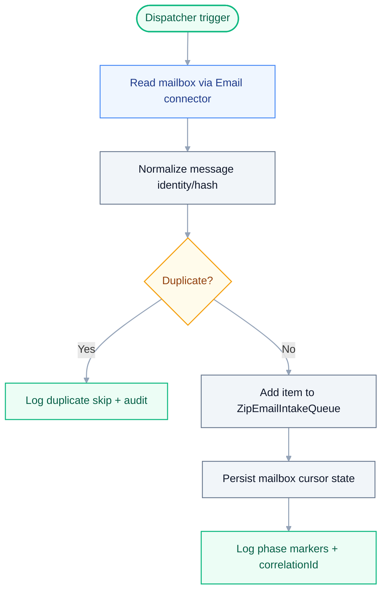
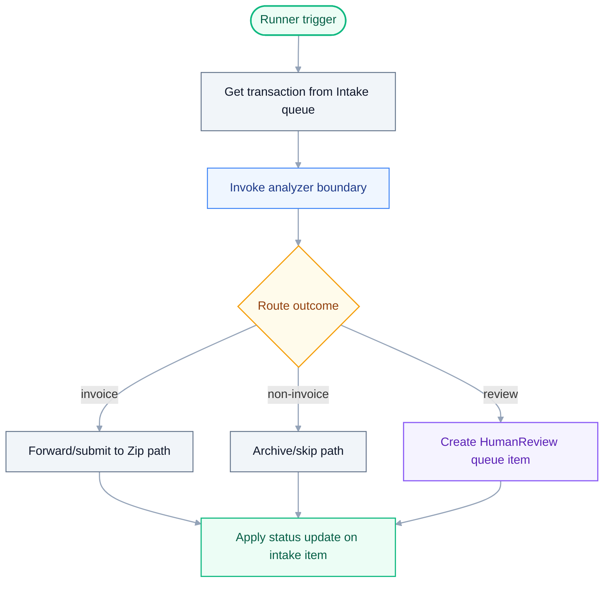
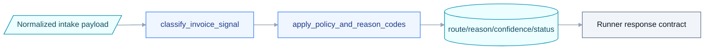
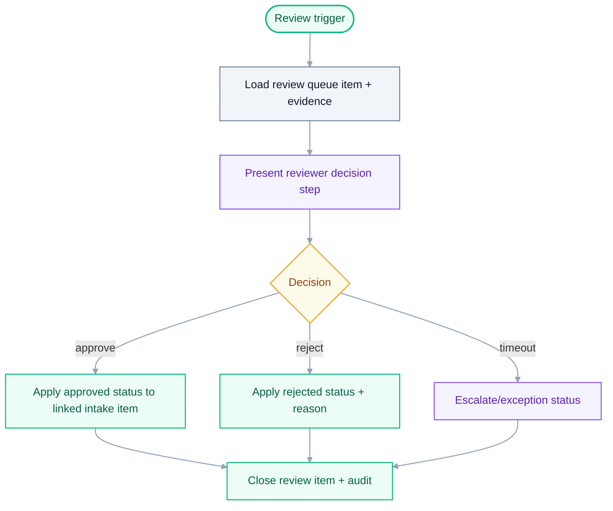
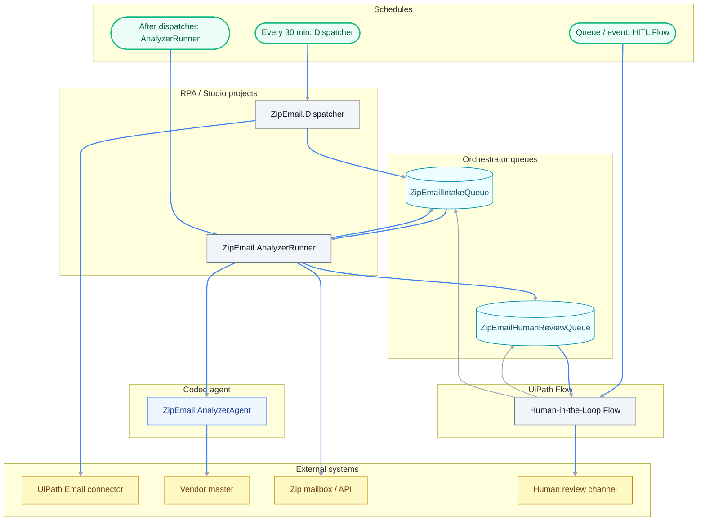

# Feature Specification: Zip Email Automation Smart Invoice Routing

> **Grounding:** [skill:uipath-planner] [agent:uipath-project-discovery-agent] [skill:uipath-solution-design] [skill:uipath-rpa] [skill:uipath-maestro-flow] [skill:uipath-agents] [skill:uipath-platform] [skill:mermaid-diagram-builder] [skill:uiplan]

**Created**: 2026-04-27
**Status**: Draft
**Input**: User description: "Create the build-ready UiPlan specification for the Zip Email Automation Smart Invoice Routing UiPath Solution from the actual PDD, SDD, ADD, and latest user corrections. The solution uses the Email connector (not Microsoft Graph), a Dispatcher template for intake, a Long Running Workflow for the analyzer host, a LangGraph coded agent for analysis, and a UiPath Flow for the final Human-in-the-Loop stage. Start with spec only; plan, tasks, review, acceptance, and implementation remain gated by explicit approval."

**Continuation update 2026-04-28**: The next implementation pass must remediate
the already-built Zip project rather than start from a new scaffold. It must
ground `ZipEmail.Dispatcher` in the template catalog at
`C:/Users/DanielaRosenstein/projects/uipath-builder-agent/scaffold/template`
and record `dispatcher` as the selected template type from that catalog,
replace stub mailbox intake with real Outlook connector intake using connector
`7d5f5eb9-dd7d-4807-a08d-ebb7e13cc5aa`, redeploy to tenant `Test` folder
`Shared/ZipEmailAutomationDemo`, and run a read-only limited live inbox smoke.
Committed evidence must not include full email bodies, attachment contents,
credentials, or access tokens.

_If a PDD/SDD path was supplied, a short excerpt may appear in **Source traceability** at the end of the file. The **User Scenarios** and **Requirements** sections below are the build-ready specification (not a paste of the PDD)._

## Design source priority

1. **SDD** (`sdd.md` or equivalent) is the primary source when it exists — align scope, integrations, and NFRs to it.
2. **PDD** or product brief when no SDD exists.
3. **User description** in this file when neither document exists.

Record production gaps as explicit clarification items until an SME confirms;
never invent tenant mailboxes, credentials, Zip handling mode, or other
tenant-specific values.

## User Scenarios & Testing

### User Story 1 - Intake and analysis pipeline (Priority: P1)

As a Finance operator, I want supplier emails from regional payable mailboxes
deduplicated, classified, and routed to Zip, archive, or review so junk does not
reach Zip and valid invoices follow the correct business path.

**Why this priority**: This is the core business value from the PDD: reduce junk
email reaching Zip by 90%+, prevent duplicate forwards across regional mailboxes,
and preserve an audit trail.

**Independent Test**: Run dispatcher and analyzer-host tests against fixture
mailbox/queue data. Verify `ZipEmailIntakeQueue` receives one item per new
logical message, duplicate messages are not forwarded twice, analyzer results
update the intake item, and correlation IDs appear in logs.

**Continuation Test**: Run `ZipEmail.Dispatcher` against a small read-only sample
from the user's connected Outlook inbox using connector
`7d5f5eb9-dd7d-4807-a08d-ebb7e13cc5aa`. Verify at least one actual message is
normalized and enqueued with non-PII metadata/hashes only, and verify the inbox
message is not marked, moved, deleted, or replied to during the first smoke.

**Acceptance Scenarios**:

1. **Given** a new email from a monitored payable mailbox through the UiPath
   Email connector, **When** `ZipEmail.Dispatcher` runs from the Dispatcher
   template, **Then** it creates exactly one
   `ZipEmailIntakeQueue` item with source mailbox, message identity, sender,
   received time, normalized subject/body evidence reference, and correlation ID.
2. **Given** the same logical email appears in more than one regional mailbox,
   **When** `ZipEmail.Dispatcher` evaluates message identity, **Then** only one
   intake item is queued and the duplicate is audited as skipped.
3. **Given** a pending intake item, **When** `ZipEmail.AnalyzerRunner` invokes
   `ZipEmail.AnalyzerAgent`, **Then** the intake item reaches a terminal or
   waiting status: `InvoiceForwarded`, `NonInvoiceArchived`,
   `DuplicateSkipped`, `NeedsHumanReview`, `HumanReviewPending`, or `Exception`.

### User Story 2 - Human review and closure (Priority: P2)

As a Finance reviewer, I want ambiguous emails routed with enough evidence for a
fast review decision so the linked intake item and review queue stay consistent.

**Why this priority**: Ambiguous or protected documents are lower volume than
the happy path but are mandatory for compliance and operational closure.

**Independent Test**: Inject a `ZipEmailHumanReviewQueue` fixture item and verify
the UiPath Flow creates the Human-in-the-Loop review step, waits for an outcome,
updates the review item, and updates the linked intake item.

**Acceptance Scenarios**:

1. **Given** analyzer output requires human review, **When**
   `ZipEmail.AnalyzerRunner` creates a review item, **Then** the UiPath Flow
   Human-in-the-Loop stage receives a linked review item with reason code,
   evidence summary, recommended action, and correlation ID.
2. **Given** a reviewer approves a route, **When**
   the UiPath Flow completes the HITL outcome, **Then** both queue items reflect
   the final business outcome and an audit entry records the decision.
3. **Given** review times out or cannot be completed, **When** the UiPath Flow
   reaches the configured SLA, **Then** the item is escalated or marked
   exception according to the plan/task policy.

### Edge Cases

- Password-protected, image-only, broken-link, or auth-gated invoice evidence
  must route to human review rather than being guessed.
- Mixed English/Hebrew or conflicting invoice signals may require semantic
  classification by `ZipEmail.AnalyzerAgent`.
- Missing vendor or IL country-routing data must not silently forward; it must
  use deterministic fallback or human review according to the final task policy.
- Zip API credentials are not fully confirmed in the PDD; plan/tasks must keep
  secrets and deploy/publish actions as handoff/approval-required.
- The current PDD names 8 explicit regional mailboxes and says 11 total; plan
  must resolve the complete mailbox allow-list before production use.
- The current implementation contains scaffold/stub boundaries that must be
  reopened before acceptance for the next build pass: `PullMailbox.xaml` does
  not pull Outlook messages, `NormalizeMessage.xaml` fabricates a message id,
  `AddIntakeItem.xaml` uses stub queue payload values, and
  `AnalyzerRunner/InvokeAnalyzer.xaml` has not been proven as a real deployed
  LangGraph invocation from the RPA host.
- Live inbox testing is allowed only as a limited read-only sample in tenant
  `Test`; production mailboxes and Production deployment remain out of scope.

## Requirements

### Functional Requirements

- **FR-001**: System MUST monitor configured regional payable mailboxes through
  the UiPath Email connector using persisted per-mailbox cursor/state.
- **FR-002**: System MUST deduplicate logical messages across mailboxes using a
  stable email identity from the Email connector such as `InternetMessageId`,
  sender, received time, and normalized subject/body hash.
- **FR-003**: System MUST create and update `ZipEmailIntakeQueue` items for the
  dispatcher/analyzer contract and `ZipEmailHumanReviewQueue` items for
  ambiguous cases.
- **FR-004**: System MUST implement these coordinated build surfaces:
  `ZipEmail.Dispatcher` from the Dispatcher template, `ZipEmail.AnalyzerRunner`
  as a Long Running Workflow, `ZipEmail.AnalyzerAgent` as a Python LangGraph
  coded agent, and a UiPath Flow for the final Human-in-the-Loop stage.
- **FR-005**: System MUST keep the Python/LangGraph agent as the analyzer
  engine only; it must not replace the RPA analyzer host or become a second
  queue consumer.
- **FR-006**: System MUST run deterministic checks before LLM/agent semantic
  classification and reserve agent reasoning for ambiguous cases.
- **FR-007**: System MUST preserve PII minimization: queue payloads and logs
  store metadata, evidence summaries, hashes, and references rather than full raw
  bodies or attachments unless policy changes.
- **FR-008**: System MUST require plan/tasks/review/acceptance before
  implementation and `/uiplan-implement` must execute tasks through the
  develop -> analyze/test -> parse output -> safe fix -> rerun evidence loop.
- **FR-009**: System MUST use the dispatcher scaffold as the implementation
  baseline for mailbox intake. If any scaffold behavior is intentionally not
  used, the task evidence must document the reason and equivalent replacement.
- **FR-010**: System MUST replace all stub mailbox values before live smoke.
  Hardcoded values such as `stub-msg-...@local`, `payables@contoso.com`,
  `vendor@supplier.com`, and `stub.pdf` are not acceptable completion evidence.
- **FR-011**: System MUST support a read-only limited Outlook inbox smoke using
  connector `7d5f5eb9-dd7d-4807-a08d-ebb7e13cc5aa` in tenant `Test`.
- **FR-012**: System MUST make Studio and runtime logs reviewable through
  meaningful activity display names, comments/annotations for major phases, and
  `LogMessage` phase markers carrying correlation id and non-PII identifiers.
- **FR-013**: System MUST prove the RPA-to-agent invocation boundary before
  closing analyzer work. Acceptable evidence is one of: a supported `Call Agent`
  activity in the installed package set, an `Invoke Process` / `Run Job` path
  where the agent is visible as a callable Orchestrator process in the target
  folder, or a documented platform API wrapper that returns the analyzer JSON.
  A local-only `uipath invoke` smoke proves the agent package, but does not prove
  the RPA host can invoke it from Orchestrator.

### Key Entities

- **Email intake item**: Queue item in `ZipEmailIntakeQueue` containing message
  identity, source mailbox, sender, subject/body evidence reference, status,
  analysis result, correlation ID, and optional linked review item.
- **Human review item**: Queue item in `ZipEmailHumanReviewQueue` containing
  reason code, evidence summary, recommended action, review status, reviewer
  outcome, and linked intake item ID.
- **Analyzer result**: Structured output from `ZipEmail.AnalyzerAgent` consumed
  by `ZipEmail.AnalyzerRunner` to forward, archive, skip duplicate, request
  review, or mark exception.
- **Mailbox cursor**: Per-mailbox state used by the dispatcher to avoid re-reading
  already processed messages.
- **Outlook connector**: User-provided Outlook connection
  `7d5f5eb9-dd7d-4807-a08d-ebb7e13cc5aa`, used for the limited read-only inbox
  validation pass.
- **Capability inventory**: Skills, agents, MCP/library lookups, activity docs,
  CLIs, and subagents that plan/tasks must route through before implementation.

## LLM / Executor Readiness Contract

### Role and scope

- **Project type**: solution.
- **Allowed build surfaces**: Modern XAML workflows, Flow HITL canvas, Python
  LangGraph agent, solution bindings, and verification artifacts.
- **Language/runtime**: C# expressions for XAML, Python 3.11+ for agent.
- **Explicit exclusions**: no Production deployment, no secrets in repo, no
  mailbox mutation during first live inbox smoke.

### Environment and conventions

- **Required CLIs**: `uipcli`, `uipath`, `uip`, `uv`.
- **Target environment**: tenant `Test`, folder `Shared/ZipEmailAutomationDemo`
  for continuation smoke/deploy.
- **Evidence convention**: analyzer JSON, JUnit, runbooks, and smoke logs under
  `out/` and `docs/runbooks/`.
- **Naming/layout**: keep `projects/ZipEmail.*` surfaces and `bindings/*.json`
  aligned with `solution.uipx`.

### Skill routing matrix

| Surface | Skill/tool | Use when | Evidence |
| --- | --- | --- | --- |
| Dispatcher and Runner XAML | `[skill:uipath-rpa]` | activity wiring, queue updates, long-running host | analyze JSON + workflow smoke logs |
| Coded analyzer graph | `[skill:uipath-agents]` | `graph.py`, schema, agent runtime | pytest + `uipath run` |
| Flow HITL stage | `[skill:uipath-maestro-flow]` | `human-review.flow` and review routing | flow validate log |
| Platform and solution lifecycle | `[skill:uipath-platform]` | bindings, resources, solution restore/analyze/pack/deploy | CLI logs + resource evidence |
| Test + diagnostics loop | `[skill:uipath-test]`, `[skill:uipath-diagnostics]` | failure parsing, safe fix, rerun | diagnose-rerun evidence |

### Decision logic inventory

| Decision | Owner surface | Inputs | Outputs | Human review trigger |
| --- | --- | --- | --- | --- |
| Dedup identity | `NormalizeMessage.xaml` | connector ids + normalized content | duplicate/new flag | identity mismatch |
| Semantic route | `ZipEmail.AnalyzerAgent` | message features | route/reason/confidence | low confidence |
| Deterministic status update | `ApplyResult.xaml` | route + policy | queue status update | review route |
| Final review outcome | `human-review.flow` | review item + evidence | approved/rejected route | timeout/override |

### Build readiness checklist

- [ ] CLI versions and auth path confirmed.
- [ ] Dispatcher scaffold provenance documented.
- [ ] Stub values removed from mailbox intake/queue payload.
- [ ] Flow HITL packaging path validated or explicitly handed off.
- [ ] Live smoke keeps read-only mailbox safety guardrails.
- [ ] Every workflow artifact in `tasks.md` has an internal-step diagram.

## 360 Build Visibility Contract

### Workflow and artifact visibility inventory

| Artifact path | Type/surface | Owns user story | Invocation entrypoint | Cannot be stubbed by | Evidence required |
| --- | --- | --- | --- | --- | --- |
| `projects/ZipEmail.Dispatcher/Main.xaml` | RPA Sequence/Flowchart | US1 | Dispatcher schedule trigger | `LogMessage`-only mailbox read | `out/analyze-dispatcher.json`, intake smoke log |
| `projects/ZipEmail.AnalyzerRunner/Main.xaml` | RPA host workflow | US1 | AnalyzerRunner schedule trigger | contract-only invoke-agent placeholder | `out/analyze-runner.json`, route smoke log |
| `projects/ZipEmail.AnalyzerAgent/src/graph.py` | LangGraph coded agent | US1 | graph entrypoint from `langgraph.json` | no-op/pass node chain | `out/junit-agent.xml`, `out/agent-smoke.log` |
| `projects/ZipEmail.HumanReview/human-review.flow` | Flow HITL | US2 | review queue/event trigger | placeholder review node | `out/flow-validate.log`, review path evidence |
| `solution.uipx` + `bindings/*.json` | Solution/package wiring | US1, US2 | solution pack/deploy pipeline | manual placeholder descriptor | `out/solution-analyze.json`, binding diff evidence |

### Activity, connector, dependency, and package visibility

| Package/tool | Activity or connector | Used in artifact | Why required | Version/source | Verification evidence |
| --- | --- | --- | --- | --- | --- |
| UiPath.Mail.Activities / Integration Service Email | Outlook mailbox read | `ZipEmail.Dispatcher/Main.xaml` | real intake from monitored mailbox | connector id `7d5f5eb9-dd7d-4807-a08d-ebb7e13cc5aa` + project deps | intake sample log with non-stub identifiers |
| UiPath.System.Activities | `AddQueueItem`, `GetTransactionItem`, status/update activities | dispatcher + analyzer host | queue-based orchestration + audit status | `project.json`/NuGet restore | analyzer JSON + queue evidence |
| `uipath` + `uv` | graph runtime/test commands | `ZipEmail.AnalyzerAgent` | coded-agent execution path | `pyproject.toml` + lockfile | pytest JUnit + `uipath run` evidence |
| `uipcli` / `uip` | analyze/pack/flow validate | solution + flow surfaces | build gates and packaging integrity | CLI help + pinned toolchain | command logs in `out/` |

### Agent, DMN, Flow, HITL, and platform-resource visibility

| Surface/resource | Descriptor/file | Invocation boundary | Inputs/outputs | Owner | Evidence |
| --- | --- | --- | --- | --- | --- |
| Analyzer agent | `projects/ZipEmail.AnalyzerAgent/langgraph.json` | `AnalyzerRunner/Main.xaml` invokes graph | queue payload -> route/reason/confidence/status | `[skill:uipath-agents]` | schema tests + smoke output |
| Flow HITL | `projects/ZipEmail.HumanReview/human-review.flow` | review queue -> human decision -> status write-back | review item -> approve/reject outcome | `[skill:uipath-maestro-flow]` | Flow validate + outcome evidence |
| Queue resources | `ZipEmailIntakeQueue`, `ZipEmailHumanReviewQueue` | dispatcher/runner/review flow queue boundaries | normalized intake + review payloads | `[skill:uipath-platform]` | queue operation logs |
| Bindings/environment | `bindings/dev.json`, `bindings/test.json`, `bindings/prod.json` | solution deploy activation boundary | environment-specific keys/config | `[skill:uipath-platform]` | binding diff + deploy-preflight evidence |

### Logging and observability visibility

| Workflow/surface | Required log phases | Correlation id propagation | Expected assertions | Evidence path |
| --- | --- | --- | --- | --- |
| Dispatcher + AnalyzerRunner XAML | `PullMailbox`, `NormalizeMessage`, `AddIntakeItem`, `InvokeAnalyzer`, `ApplyResult` | queue item id + message hash propagated between workflows | phase markers and terminal status in logs | `out/flow-debug-*.log`, `out/verification-summary.md` |
| Analyzer agent | classify/apply-policy node logs | request id passed from host | route + confidence + policy fields present | `out/agent-smoke.log` |
| Flow HITL | review create/resume/close markers | review item id linked to intake id | reviewer outcome + closure status written back | `out/flow-hitl-validate.log` |

### Template/scaffold provenance and anti-stub rules

| Artifact | Scaffold/template source | Preserved from scaffold | Must be implemented (not stubbed) | Stub rejection signal |
| --- | --- | --- | --- | --- |
| Dispatcher/Runner projects | existing `project.json` + `project.uiproj` scaffolds | descriptor metadata + generated structure | real connector read, queue payload, invoke-agent boundary | fabricated `stub-*` message IDs or log-only paths |
| Analyzer agent | existing LangGraph scaffold | descriptor + graph entrypoint contract | concrete classify/route logic and schema outputs | placeholder graph nodes with no runtime output |
| Flow HITL | existing `.flow` project scaffold | trigger, review state wiring | callable human review branch with outcome handling | placeholder review node without closure transition |

### Verification and evidence visibility

| Surface | Command family | Concrete command to run | Done-when condition | Evidence output path |
| --- | --- | --- | --- | --- |
| Dispatcher + Runner | `uipcli` | `uipcli package analyze projects/ZipEmail.Dispatcher --resultPath out/analyze-dispatcher.json` and runner equivalent | analyzer errors = 0 or diagnosed/rerun evidence recorded | `out/analyze-dispatcher.json`, `out/analyze-runner.json` |
| Analyzer agent | `uv` + `uipath` | `cd projects/ZipEmail.AnalyzerAgent && uv run pytest -q --junitxml=out/junit-agent.xml` + `uipath run --input-file ...` | tests pass and smoke output matches schema | `projects/ZipEmail.AnalyzerAgent/out/junit-agent.xml`, `out/agent-smoke.log` |
| Flow HITL | `uip` | `uip flow validate projects/ZipEmail.HumanReview/human-review.flow` | validate succeeds and approve/reject branches evidenced | `out/flow-validate.log` |
| Solution wiring | `uipcli solution` | `uipcli solution restore/analyze/pack ...` | package created with no unresolved analyze blockers | `out/solution-analyze.json`, `.nupkg/.uipx` output path |

### Workflow surface visual catalog (required)

Each in-scope workflow surface has a dedicated internal-step diagram and
activity/node conformance row.

| Workflow artifact | Diagram below | Mandatory activities/nodes | Skill/tool route | Evidence |
| --- | --- | --- | --- | --- |
| `projects/ZipEmail.Dispatcher/Main.xaml` | `Dispatcher: mailbox intake + enqueue` | mailbox read, dedup key normalization, queue add, cursor update, phase logs | `[skill:uipath-rpa]` + `uipath_doc_get_activity` + `uipcli` | `out/analyze-dispatcher.json`, intake smoke log |
| `projects/ZipEmail.AnalyzerRunner/Main.xaml` | `AnalyzerRunner: dequeue + invoke + apply` | get transaction, invoke analyzer boundary, apply result, queue status update, phase logs | `[skill:uipath-rpa]` + `uipcli` | `out/analyze-runner.json`, runner smoke log |
| `projects/ZipEmail.AnalyzerAgent/src/graph.py` | `AnalyzerAgent: classify + policy + output` | classify node, deterministic checks, policy application, output schema map | `[skill:uipath-agents]` + `uv`/`uipath` | `out/junit-agent.xml`, `out/agent-smoke.log` |
| `projects/ZipEmail.HumanReview/human-review.flow` | `Flow HITL: review + closure` | review intake, reviewer decision, linked intake update, terminal status write-back | `[skill:uipath-maestro-flow]` + `uip` | `out/flow-validate.log`, `out/flow-hitl-validate.log` |

#### Dispatcher: mailbox intake + enqueue (`projects/ZipEmail.Dispatcher/Main.xaml`)



#### AnalyzerRunner: dequeue + invoke + apply (`projects/ZipEmail.AnalyzerRunner/Main.xaml`)



#### AnalyzerAgent: classify + policy + output (`projects/ZipEmail.AnalyzerAgent/src/graph.py`)



#### Flow HITL: review + closure (`projects/ZipEmail.HumanReview/human-review.flow`)



## Architecture diagram

High-level boundaries from the SDD plus the latest user corrections.



## Primary interaction (sequence)

Main happy-path and human-review interaction.

```mermaid
sequenceDiagram
  autonumber
  actor Scheduler as Scheduler
  participant Dispatcher as ZipEmail.Dispatcher
  participant Intake as ZipEmailIntakeQueue
  participant Runner as ZipEmail.AnalyzerRunner
  participant Agent as ZipEmail.AnalyzerAgent
  participant ReviewQ as ZipEmailHumanReviewQueue
  participant Handler as HITL UiPath Flow
  participant Zip as Zip mailbox or API
  Scheduler->>Dispatcher: start mailbox intake
  Dispatcher->>Intake: add normalized queue item
  Scheduler->>Runner: start analyzer host
  Runner->>Intake: get pending item
  Runner->>Agent: invoke graph with request schema
  Agent-->>Runner: structured classification result
  alt valid invoice
    Runner->>Zip: forward or submit invoice
    Runner->>Intake: mark InvoiceForwarded
  else needs human review
    Runner->>ReviewQ: create linked review item
    Handler->>ReviewQ: wait for reviewer outcome
    Handler->>Intake: apply final status
  end

  classDef persona fill:#F1F5F9,stroke:#64748B,color:#0F172A,stroke-width:1.25px
  class Scheduler,Dispatcher,Intake,Runner,Agent,ReviewQ,Handler,Zip persona
```

## Success Criteria

### Measurable Outcomes

- **SC-001**: Junk/non-invoice email forwarded to Zip is reduced by at least 90%
  against the manual baseline, measured on agreed test or pilot data.
- **SC-002**: Duplicate logical messages across monitored mailboxes produce at
  most one Zip forward or intake-processing outcome.
- **SC-003**: Every processed item has a correlation ID and auditable status
  transition across dispatcher, analyzer host, analyzer engine, and human review
  when applicable.
- **SC-004**: The generated UiPlan bundle passes `uipath_plan_review` before
  acceptance, and implementation tasks require concrete workflow/activity/tool
  evidence before `/uiplan-implement` executes.
- **SC-005**: `ZipEmail.Dispatcher` proves real Outlook intake by reading a
  limited inbox sample through connector `7d5f5eb9-dd7d-4807-a08d-ebb7e13cc5aa`
  and creating a queue item with real message metadata or hashes, without
  mutating the mailbox in the first smoke.
- **SC-006**: Studio-readable XAML and runtime logs expose the key phases:
  `[phase=PullMailbox]`, `[phase=NormalizeMessage]`, `[phase=AddIntakeItem]`,
  `[phase=InvokeAnalyzer]`, and `[phase=ApplyResult]`.

## Assumptions

- Source of truth is the target project design set:
  `C:/Users/DanielaRosenstein/cursor_projects/AgenticAI_FIN02_ZipMailboxAutomation/docs/design/sdd.md`,
  `pdd.md`, and `add.md`.
- The complete 11-mailbox allow-list, Zip API mode, credential scopes, review
  channel, and production folder remain human-confirmed values before deploy.
- Default implementation is Automation Cloud Solution packaging with personal or
  development workspace deployment only after explicit approval.
- This stage creates `spec.md` only. `/uiplan-plan`, `/uiplan-tasks`,
  `/uiplan-review`, acceptance, and `/uiplan-implement` require explicit
  approval in sequence.

## Source traceability

- **SDD**:
  `C:/Users/DanielaRosenstein/cursor_projects/AgenticAI_FIN02_ZipMailboxAutomation/docs/design/sdd.md`
  v1.2. Defines the base solution, two queues, schedules, and RPA host vs agent
  engine split. Latest user correction supersedes its Graph/HumanReviewHandler
  details: use Email connector and UiPath Flow for the HITL stage.
- **PDD**:
  `C:/Users/DanielaRosenstein/cursor_projects/AgenticAI_FIN02_ZipMailboxAutomation/docs/design/pdd.md`.
  Defines business problem, 90% junk-reduction objective, regional payable
  mailbox monitoring, duplicate prevention, IL routing, and audit needs.
- **ADD**:
  `C:/Users/DanielaRosenstein/cursor_projects/AgenticAI_FIN02_ZipMailboxAutomation/docs/design/add.md`.
  Defines the analyzer graph, deterministic-first agent gating, structured
  state, outputs, and human-review item creation.
- **User correction 2026-04-27**: Use the UiPath Email connector instead of
  Microsoft Graph; use the Dispatcher template for intake; use a Long Running
  Workflow for the analyzer host; use LangGraph for the agent; use UiPath Flow
  for the final Human-in-the-Loop stage.
- **Continuation correction 2026-04-28**:
  `C:/Users/DanielaRosenstein/.cursor/projects/c-Users-DanielaRosenstein-projects-uipath-builder-agent/agent-transcripts/54491e8a-4f9e-4cf9-872d-59372f68e1bc/54491e8a-4f9e-4cf9-872d-59372f68e1bc.jsonl`.
  Treat the existing Zip project as the build target. Fix the project, deploy
  to `Shared/ZipEmailAutomationDemo`, run tests, and run a live read-only
  Outlook inbox sample with connector `7d5f5eb9-dd7d-4807-a08d-ebb7e13cc5aa`.
  The transcript also records prior issues to account for: dispatcher scaffold
  gaps, missing `ZipEmail.MailboxCursors`, `uipcli asset deploy` failure,
  corporate TLS workaround for `uip`, Flow packaging `No tool results`, and
  earlier agent `AGENT_NOT_CONFIGURED`/trace visibility problems.

## SME inputs (do not invent)

Until the human confirms facts, record gaps as explicit SME review or
clarification prose. Examples: mailbox allow-lists, credential scope, Zip
handling mode, audit log sink, trigger cadence, and human review channel. Do not
silently invent production values.

## Source routing & MCP contracts

- **Project discovery (blocking precondition)**: run
  `[agent:uipath-project-discovery-agent]` for the target solution repo before
  locking implementation tasks.
- **Library MCP**: `uipath_library_search` (ranked search) and `uipath_library_lookup` (book/section precision).
- **AskAI-style fallback**: `query_uipath_docs` (and `[askai:topic]` notes in tasks) when library evidence is insufficient.
- **Activity docs MCP**: `uipath_doc_get_activity` / `uipath_doc_list_packages` before naming activities or pinning package versions.
- **Specialists / subagents**: cite `[skill:...]` for build personas; split heavy work via subagents or `Task` for isolated discovery or implementation.

## Development Handoff

This section turns the accepted design into build-ready work.

- **Build entry point**: `tasks.md` after review passes and the bundle is accepted.
- **Implementation scope**:
  `C:/Users/DanielaRosenstein/cursor_projects/AgenticAI_FIN02_ZipMailboxAutomation`
  solution files, project artifacts, tests, bindings, queues/assets/connections,
  and docs named in `plan.md` / `tasks.md`.
- **Continuation scope**: execute the remediation tasks added after the original
  accepted build. The original checked tasks are historical evidence, not proof
  that real Outlook intake, real analyzer invocation, Flow packaging, or Studio
  log readability are complete.
- **Implementation paradigm**: solution
- **Target stack**: Modern UiPath stack: C# expressions, Windows target, .NET 8.
- **CLI family**: uipcli
- **Deploy gate**: Automation Cloud only; deploy to personal workspace or dev workspace first. Never deploy to Production without explicit human approval.
- **Execution command**: `/uiplan-implement zip-email-automation-uiplan-build` after `uipath_plan_review` passes and `uipath_plan_accept` records human approval. Use `scaffold-code` only for optional local runtime/adaptor checks.
- **Quality gates**: restore -> analyze -> test -> pack; add smoke run and
  robot/job log assertions for correlation ID, phase markers, and terminal
  status. For the LangGraph coded agent, deployed acceptance must include
  invoking the `agent` entrypoint, reviewing output for non-placeholder routing,
  and reading Orchestrator traces for the expected graph/node spans. A green job
  with scaffold output is not sufficient. Analyzer/test/tooling failures must enter the documented
  diagnose -> ground -> safe fix -> rerun loop before being called blocked.
- **Live smoke gate**: after local gates pass, redeploy only to tenant `Test`,
  folder `Shared/ZipEmailAutomationDemo`, verify resources with `uip resource`,
  then run the limited read-only inbox smoke through the Outlook connector. Log
  message ids/hashes and queue references only.
- **Feasibility evidence**: Use `uipath_library_search` and/or `uipath_library_lookup` first, then
  `query_uipath_docs` / `[askai:...]` for uncertain UiPath APIs or CLI flags; use
  `uipath_doc_get_activity` / `uipath_doc_list_packages` before naming activities; do
  not invent activity names or SDK methods.
- **Handoff rule**: Do not start source changes until `uipath_plan_review` passes
  and the human accepts the bundle. After acceptance, execute `tasks.md` in
  order and keep implementation aligned to `plan.md`.
