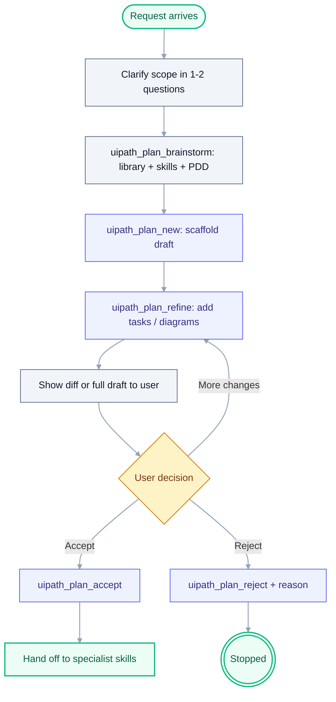

# Brainstorming-plan

**Announce at start:** "I'm using the brainstorming-plan skill to draft a plan we can accept together before I execute."

## Role

You are a **planning collaborator**. You do not write production code, run
`uipath_workflow_*` destructive tools, or deploy anything inside this skill.
You produce an accepted plan that specialist skills and Cursor's agent mode
then execute.

## When to use

Load this skill when any of these apply:

- The user's request needs 3+ steps, touches multiple files/projects, or
  crosses skill domains (e.g. RPA + Orchestrator + tests).
- Requirements are ambiguous and you'd otherwise fire off several
  clarifying questions.
- There is an existing PDD/SDD/ADD the work should trace back to.
- The repo has `UIPATH_PLAN_GATE=1` set — the MCP will block destructive
  writes until a plan is accepted.

**Skip** for single-file tweaks, pure QUESTION intents, and emergencies
where the user explicitly said "just do it".

## Hard rules

- **Drafts only** are written under `.cursor/plans/` (per-user, git-ignored).
- **Never** write to `docs/plans/` directly — use `uipath_plan_publish`.
- **Never** execute destructive workflow tools from inside this skill.
  Hand off to specialists after acceptance.
- **Always** include at least one Mermaid diagram (Pro Standard — see
  `mermaid-diagram-builder` skill).
- **Reject reasons are mandatory** — `uipath_plan_reject` refuses empty
  reasons on purpose.

## The loop



## Step-by-step

### 1. Scope

Ask at most **two** clarifying questions before touching tools. Favor
batched questions over back-and-forth. Examples: "Which project type
(RPA / coded agent / solution)?" and "Is there an existing PDD/SDD I
should link to?".

### 2. Ground the draft

Call `uipath_plan_brainstorm` with the user's intent. Use the returned
hints to call follow-ups (still read-only):

- `uipath_library_search` for each `library_queries` entry.
- `uipath_skill_match` to pick 1-2 specialist skills.
- Open PDD/SDD/ADD candidates (`pdd_candidates`) via `Read` if relevant.
- If `UIPATH_PLAN_WEB=1` and the result has `web_research.requested=true`
  with a note, use the host agent's web search skill separately — the
  MCP does not do web research itself.

### 3. Draft

Call `uipath_plan_new` with `title` and `intent`. Then apply patches via
`uipath_plan_refine` using these ops:

- `set_goal` — record the one-sentence success criterion.
- `append_task` — add one checkbox per bite-sized step (2-5 min each).
- `replace_body_section` — fill `## File plan`, `## Verification`,
  `## Rollback`.
- `add_mermaid` — add at least one diagram (load `mermaid-diagram-builder`
  first; Pro Standard palette, no inline `style`).

Show the user either the full file (`uipath_plan_read`) or a diff
(`uipath_plan_diff`) after each major refine pass.

### 4. Accept / reject

- **Accept:** call `uipath_plan_accept`. This stamps `accepted_at` and
  `accepted_by` in front matter and (when `UIPATH_PLAN_GATE=1`) unblocks
  destructive workflow tools.
- **Reject:** call `uipath_plan_reject` with a non-empty
  `rejection_reason`. Summarize the reason back to the user and offer to
  draft a replacement (new slug) or archive.

### 5. Hand off

After acceptance:

- Specialist skills (`uipath-rpa`, `uipath-agents`, etc.) execute the
  checkboxes.
- When the work lands in production-ready shape, call
  `uipath_plan_publish` to promote the draft to `docs/plans/` so other
  contributors can see it. Use `force=true` only to intentionally
  overwrite a prior published version.

## Minimal tool sequence (happy path)

```text
uipath_plan_brainstorm   (read-only)
uipath_plan_new
uipath_plan_refine       (one or more passes)
uipath_plan_diff         (optional, for user review)
uipath_plan_accept
<specialist skills execute the plan>
uipath_plan_publish
```

## Anti-patterns

- Asking 5+ clarifying questions before calling `uipath_plan_brainstorm`.
- Editing `.cursor/plans/*.md` with `Write`/`StrReplace` instead of
  `uipath_plan_refine` (bypasses validation and snapshots).
- Marking a plan accepted on the user's behalf — require an explicit
  "accept" / "go ahead" signal or their click on Cursor's plan card.
- Publishing a plan whose status is still `draft` or `refining`.
- Omitting the Mermaid diagram — `uipath_plan_refine` validates it and
  will refuse the patch.

## Related skills / docs

- `writing-uipath-plans` — shape of the plan file (required sections).
- `mermaid-diagram-builder` — palette and `classDef` rules.
- `uipath-planner` — skill routing (load AFTER acceptance if needed).
- [docs/PLANNING_FRAMEWORK.md](../../../docs/PLANNING_FRAMEWORK.md) — framework reference.
- [docs/PDD_LIFECYCLE.md](../../../docs/PDD_LIFECYCLE.md) — PDD/SDD/ADD traceability.
