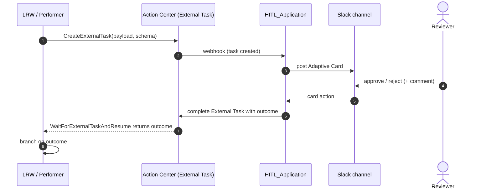

# Custom HITL (Action Center External Tasks + HITL_Application)

This skill describes the organization-standard HITL pattern for UiPath
automations: combine **Action Center External Tasks** (the platform handle for
asynchronous human work) with the
[`cato-networks-IT/HITL_Application`](https://github.com/cato-networks-IT/HITL_Application)
which delivers Slack-based **Adaptive Cards** for review.

It supersedes UiPath Flow / `uipath-human-in-the-loop` for this org's default
HITL surface.

## When to use

- Any approval gate triggered by an LRW, Maestro flow, coded agent host
  workflow, or coded app where the reviewer should respond in Slack.
- Data enrichment / write-back validation that needs an audit trail.

## When NOT to use

- Pure Action Center forms with no Slack delivery -> use a plain LRW with
  `WaitForForm`.
- BPMN human task in Maestro that does not need Slack -> Maestro user task.
- "UiPath Flow" as a HITL canvas -> UiPath Flow is the visual orchestration
  canvas, not the HITL surface.

## Architecture

## Constructs

- **External Task**: created by `UiPath.Persistence.Activities.CreateExternalTask`
  inside an LRW; the workflow then calls
  `UiPath.Persistence.Activities.WaitForExternalTaskAndResume` to suspend until
  HITL_Application closes the task.
- **HITL_Application**: separate deployable; subscribes to External Task
  webhook events, posts Adaptive Cards to Slack, and on user action calls back
  to Action Center to complete the task.
- **Adaptive Card schema**: defined in `HITL_Application/cards/<task-type>.json`.
- **Slack channel routing**: configured per task type in HITL_Application.

## Required activities (resolve via `uipath_doc_get_activity`)

| Package | Activity | Purpose |
| --- | --- | --- |
| UiPath.Persistence.Activities | CreateExternalTask | create the External Task with payload + schema |
| UiPath.Persistence.Activities | WaitForExternalTaskAndResume | suspend LRW until HITL_Application completes |
| UiPath.Core.Activities | LogMessage | record correlationId + outcome |

## Routing (UiPlan tags)

- Skill: `[skill:uipath-custom-hitl]`
- MCP: `uipath_doc_get_activity` (Persistence activities),
  `uipath_library_search` (`Action Center External Tasks`),
  `query_uipath_docs` for fallback.
- Subagent: `[subagent:explore]` for HITL_Application repo discovery.

## Verification

1. Workflow: `uipcli package analyze --resultPath out/analyze-hitl.json`.
2. End-to-end smoke: trigger LRW, confirm Slack card delivered, approve, confirm
   LRW resumed with outcome (capture robot/job log).
3. Audit: verify Action Center shows the closed External Task with payload +
   outcome.

## AskAI / Library ladder

When uncertain about External Task payload schema, persistence activities, or
HITL_Application card schema, run:

1. `uipath_library_search` query "Action Center External Tasks" /
   "WaitForExternalTaskAndResume".
2. `uipath_doc_get_activity` for the named persistence activities.
3. `query_uipath_docs` ("AskAI") for runtime semantics.
4. Read HITL_Application repo (`[subagent:explore]`).
5. Only then ask the user.

## Hard rules

- Never embed reviewer credentials in the workflow; HITL_Application owns Slack
  auth.
- Never send PII into Adaptive Card free-text fields without redaction policy
  approval.
- Always include `correlationId` in the External Task payload so Slack messages,
  Action Center entries, and robot logs can be joined.
