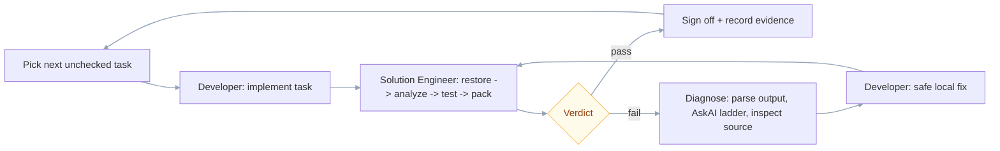

# UiPlan Implement

Use `.cursor/skills/uiplan/SKILL.md` as the canonical planning contract and the
project-specific specialist skills as the implementation contract.
Use `docs/uiplan/TASK_AUTHORING.md` as the concrete task-quality contract for
workflow design, capability routing, handoff tags, and the per-task
develop/analyze/fix/rerun loop.

## Personas: Developer <-> Solution Engineer build loop

`/uiplan-implement` runs a **Developer <-> Solution Engineer pairing** for each
task in `tasks.md`. The Developer implements one task; the Solution Engineer
runs verification CLI tools (analyze, test, pack), reviews output, diagnoses
failures, and either signs off or sends the task back with a structured failure
report.

**Subagent dispatch**:

- `[subagent:shell]` for CLI execution (analyze/test/pack).
- `[subagent:explore]` for read-only source inspection during diagnosis.
- `[subagent:browser-use]` for UI smoke (Orchestrator job log, Slack HITL card).
- `[subagent:generalPurpose]` for isolated independent task implementation.

**AskAI / Library ladder during diagnosis** (run before declaring blocker):
`uipath_library_search` / `uipath_library_lookup` -> `uipath_doc_get_activity`
-> `query_uipath_docs` -> specialist skill (`uipath-diagnostics`,
`uipath-platform`, etc.) -> ask user.

**Story-level checkpoint**: after every task in a user story is signed off, run
the smoke + log validation tasks for that story before moving to the next.

## Flow

1. Treat the user's text after `/uiplan-implement` as the UiPlan slug. If the
   slug is missing, ask for it.
2. Read `.meta.yaml` in the UiPlan folder: if `status` is not `accepted`, **stop**
   before any source edits unless the human explicitly waives acceptance risk.
   For `--run-to-completion` / `--yes`, treat non-accepted status as a hard block
   (the CLI adds `run_to_completion_blocked` when `acceptance_ready` is false).
3. Read `spec.md`, `plan.md`, and `tasks.md`, including **Source routing** and
   `Planner Route & Specialist Handoff` in `plan.md`.
   - Run a 360 preflight crosswalk before edits:
     - every `spec.md` 360 visibility row has a matching plan inventory row;
     - every plan workflow/resource/dependency row has at least one task ID;
     - every implementation task names artifact path, build surface, skill/MCP route,
       verification command, and evidence path;
     - every in-scope workflow artifact has a per-workflow internal diagram.
   - Before source edits, confirm `tasks.md` includes:
     - `### Executor context` sections,
     - task-card tables (`| Field | Content |`) for implementation tasks,
     - per-workflow internal-step diagrams for each in-scope `.xaml`, `.flow`,
       LangGraph entry, and DMN artifact.
   - If these are missing, stop and request task regeneration/fix instead of
     implementing from an under-specified bundle.
4. Run or request `uipath_plan_review` with `stage=all` before any source
   changes. Use `acceptance_ready` / `routing_metadata` from the tool response in
   the handoff ledger.
5. If review has error-severity findings, stop and report blockers. Treat these
   as hard stops before any source edits:
   - `RULE_SPEC_NO_360`
   - `RULE_SPEC_ARTIFACT_MISSING`
   - `RULE_PLAN_NO_CONNECTOR_INV`
   - `RULE_PLAN_NO_SURFACE_BOUNDARY`
   - `RULE_PLAN_NO_LOG_CONTRACT`
   - `RULE_TASKS_STUB_XAML`
   - `RULE_TASKS_NO_DIAGRAM`
   - `RULE_ANY_TEMPLATE_RESIDUE`
6. If review passes, ask the user before starting implementation unless the
   user explicitly supplied `--run-to-completion`, `--yes`, `--no-stop`, or
   clearly asked to run the accepted task plan end to end without stopping.
7. Confirm the `uipath-planner` route, project discovery agent output, matched
   specialist UiPath skills, MCP tools (`uipath_library_search`, `uipath_library_lookup`,
   `query_uipath_docs`, `uipath_doc_get_activity`), library lookup,
   AskAI-style documentation lookup, and useful
   subagents before source edits.
8. Implement from `tasks.md` in order. **Feature build surface match:** for each
   story/feature, use the build surface declared in `tasks.md` / `plan.md`:
   **RPA/Studio**, **Maestro/Flow**, **coded app/action**, **coded agent**,
   **platform/config**, or a named combination. Mixed Solutions must be executed
   by artifact; do not collapse RPA, Flow, app, agent, and bindings work into a
   single generic "solution" task.

   - For **RPA / `.xaml` / Studio-backed processes**, implement workflows in the
     repo using **`uipath_doc_get_activity`**, **`uipath_library_search` /
     `uipath_library_lookup`**, **`[skill:uipath-rpa]`**, Studio/default activity
     evidence (`uip rpa create-project --studio-dir ...`, Studio-generated XAML,
     or `uip rpa get-default-activity-xaml` / package-local equivalent), and
     **`uipcli`** restore/analyze/pack. Do not satisfy production workflow bullets
     with `LogMessage`-only XAML unless the task explicitly says **scaffold-only**
     and names the follow-up activity task.
   - For **agent-backed features**, build the agent artifact (`langgraph.json`,
     `llama_index.json`, graph entry point, graph nodes/tools) and verify it with
     `uv run pytest`, `uipath run`, or the task-specific command. If an RPA/Flow/app
     host invokes the agent, implement and verify the host invocation boundary and
     request/response schema as part of the same feature slice.
   - For **Maestro/Flow** and **coded app/action** surfaces, use the matched
     specialist skill and CLI (`uip` / `uip codedapp`) and verify the declared
     flow/app artifact, not only bindings or docs.
   - If `spec.md` / `plan.md` explicitly states Flow-owned HITL, implement HITL
     via Flow routing (`[skill:uipath-maestro-flow]`) and do not silently switch
     to custom HITL-only handling.

   **Task atomicity:** if a bullet mixes unrelated concerns without a clear split
   or `[HANDOFF:…]` where only secrets/deploy/robot apply, **stop** and get
   `tasks.md` corrected. Use every relevant project capability: specialist skills,
   MCP, subagents, library lookup, AskAI-style docs, CLI, tests, and build gates.
9. Run the build loop for the detected project type: restore -> analyze -> test
   -> pack, then the **smoke run** and **log validation** steps written in `tasks.md` (correlation
   id, expected log substrings). If any verification fails, run the **Failure
   Diagnosis and Fix Loop** below before calling it blocked or moving on.
10. Summarize exact verification evidence, changed files, package path if
   produced, and approval-required next steps.

## Validation evidence ledger (required)

Do not claim implementation is done from **static checks alone** (file exists,
string appears in a skill, routing table, docs wording, or `ReadLints` with no
commands run). The final summary **must** include a **validation evidence
ledger**: for each major verification step, record **exact command(s) run** (or
MCP tool name + key arguments), **working directory**, **exit code** (or tool
`ok` / error), **paths of generated or changed artifacts**, and a **short
observed result** (pass/fail summary, not only "ran").

For this **Python / LangGraph-style repo** (`pyproject.toml`, `langgraph.json`),
include at least one real execution path such as `uv run pytest …` on the
tests touched by the change, or the closest safe equivalent named in `tasks.md`.

## No static-only completion

The following **do not** satisfy "validated" or "working" by themselves:

- Proving slash command **files** or **skill text** reference the right tool names
- Passing only **structural** or **routing** unit tests that never invoke
  `generate-docs`, `scaffold-code`, runtime code, or the build loop
- Lint-only or existence-only checks without a run that exercises behavior

If the only honest proof needs **human UI** (for example Cursor slash picker
after reload), **stop and ask** the human to confirm; record that as explicit
**human validation** in the ledger instead of implying end-to-end proof.

## Per-Task UiPath Loop

For each unchecked task in `tasks.md`, run a complete dev + verification loop
before moving to the next task:

1. **Plan alignment** - restate the task ID, artifact path, UiPath construct,
   grounding citations, and verification command from `tasks.md`; confirm the
   intended edit is inside the accepted plan.
2. **Source reality snapshot** - before and after the task, list changed source
   files and classify each as `scaffold`, `runtime`, `test`, `docs`, or
   `config`. If the source reality contradicts a status note in `tasks.md`
   (for example, "implementation executed" while task checkboxes or artifacts
   remain incomplete), stop and report the mismatch before continuing.
3. **Dependency and tooling check** - verify required project markers,
   dependencies, CLI family, package files, and credentials/environment
   assumptions for that task. Restore/sync dependencies when the task requires
   it. Stop on dependency drift that cannot be resolved locally.
4. **Development** - implement only the current task scope. Prefer official
   UiPath tooling for scaffolds and package metadata; do not hand-author
   generated Solution descriptors.
5. **Artifact completeness gate** - verify that each task artifact path exists
   and contains task-relevant runtime substance. An artifact is not complete if
   it is empty, a no-op, only logging, a placeholder, disconnected from the
   runtime entry point, or only a generated scaffold.
6. **Task verification** - run the task-specific verification from `tasks.md`
   or the closest safe local equivalent if external credentials are unavailable.
   Tests must assert behavior tied to the task; existence/layout tests alone
   cannot satisfy business implementation tasks.
7. **Analyze gate** - for UiPath projects touched by the task, run the
   applicable analyze/lint gate before continuing. Any analyzer/tooling/test
   failure must enter the **Failure Diagnosis and Fix Loop** before it can be
   reported as blocked.
8. **Spec compliance review** - compare the changed files against `spec.md`,
   `plan.md`, and the exact task text. Fix gaps before continuing.
9. **Code quality review** - review maintainability, security, secret handling,
   generated-file boundaries, and tests. Fix issues before continuing.
10. **Completion ledger** - record completed task IDs, changed runtime
   artifacts, verification commands/results, and remaining unchecked or blocked
   task IDs. Mark the task complete only after all applicable checks pass, then
   continue to the next unchecked task.

## Failure Diagnosis and Fix Loop

Never summarize a failed verification as "blocked", "tenant policy", "Studio
issue", "solution descriptor invalid", or equivalent until this loop has been
completed and recorded in the validation ledger.

For every failed `uipcli package analyze`, `uipcli solution restore|analyze`,
Studio validation, `uip rpa ...`, `uipath run`, or test command:

1. **Capture evidence** - record the exact command, working directory, exit code,
   result file path (`--resultPath`, JUnit, pytest output, terminal log), and the
   smallest relevant error excerpt.
2. **Parse structured output** - read analyzer JSON/result files when present.
   Extract rule IDs (for example `ST-USG-034`), severities, affected files or
   activities, messages, and whether the error is project-level or solution
   descriptor/resource-builder-level.
3. **Ground the failure** - consult the correct source before guessing:
   `uipath_library_search` / `uipath_library_lookup`, `query_uipath_docs`,
   `uipath_doc_get_activity`, local package docs, live `--help`, Studio IPC
   (`uip rpa find-activities`, `get-default-activity-xaml`, `get-errors`), or
   repo docs such as `docs/uipath-cli.md`.
4. **Inspect source reality** - read the affected `project.json`, `.xaml`,
   `solution.uipx`, bindings, generated `.local` metadata, or package descriptor
   and compare it to docs/tool-generated examples. For Solutions, explicitly
   distinguish project restore/analyze failures from `solution.uipx` definition
   failures.
5. **Attempt a safe local fix** - when the evidence points to source/config/tooling
   that can be changed locally, make the smallest non-destructive fix. Do not
   publish, deploy, delete tenant resources, alter secrets, or mutate shared
   resources without approval.
6. **Re-run the same verification** - record whether the original error cleared,
   changed, or remains. If a new error appears, repeat the loop for the new error.
7. **Only then report blocked** - the blocker report must include:
   - command + working directory + exit code;
   - parsed rule/error and result file path;
   - docs/tooling consulted;
   - source/config inspected;
   - local fix attempted or why no safe local fix exists;
   - rerun result;
   - precise blocker class: tenant-only, human UI-only, missing credentials,
     generated descriptor required, unsupported local tooling, or unsafe action.

Task checkboxes remain incomplete while the diagnosis loop is still in progress.
If the remaining issue is truly external, mark only the local implementation
subtask complete and leave a separate diagnosis/handoff task open with the
blocker report.

## Artifact Completeness Rules

- **No scaffold completion rule**: scaffolding can complete scaffold/layout
  tasks only. It cannot complete business implementation tasks such as mailbox
  reads, queue creation, duplicate suppression, analyzer graph flow, document
  evidence extraction, or human review handling.
- **XAML runtime rule**: XAML with only `LogMessage`, an empty `Sequence`, or no
  invoked workflow/business activity is incomplete unless the task is explicitly
  a scaffold/logging task.
- **LangGraph runtime rule**: Python graphs containing `noop`, `pass`,
  placeholder comments, or disconnected pipeline functions are incomplete for
  graph-flow tasks.
- **Behavior test rule**: tests that only check files, folders, schemas, or
  project markers cannot satisfy user-story behavior tasks. A behavioral test
  should fail before the implementation or be documented as an external-gated
  smoke test.
- **Mismatch stop rule**: if plan status notes, task checkboxes, and runtime
  artifacts disagree, stop and report the inconsistency instead of summarizing
  the plan as complete.

Use a fresh focused subagent for implementation or review when the task is
large, independent, or benefits from isolated context. Do not dispatch multiple
implementation subagents that edit the same project in parallel.

## Gates

- Never deploy or publish without explicit approval.
- Never deploy to Production from an AI-assistant session.
- Do not invent UiPath APIs, activity names, packages, or CLI verbs. Check
  skills, library/MCP docs, AskAI-style lookup, and repo docs first.

## Run-To-Completion Mode

When the user runs `/uiplan-implement <slug> --run-to-completion` (or `--yes`)
or explicitly asks for the accepted implementation plan to run end to end, treat
that as approval to continue through all local, non-deployment tasks without
asking again between tasks.

Still stop and report before:

- review errors or missing human acceptance,
- `skills/` submodule guard failure,
- analyzer errors, failing tests, or failed restore/pack commands **after** the
  Failure Diagnosis and Fix Loop has been run and recorded,
- dependency drift or failed restore/sync,
- incomplete runtime artifacts, scaffold-only progress, self-certifying tests,
  or missing validation evidence ledger for claimed completion,
- task status mismatches between `tasks.md` and source reality,
- spec compliance or code quality review issues that cannot be fixed locally,
- missing required credentials or tooling,
- destructive actions outside the accepted task list,
- publish, deploy, shared-resource mutation, or any Production target.
