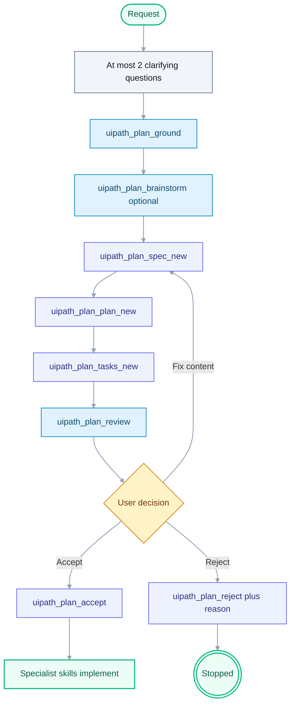

# UiPlan (spec + plan + tasks)

**Announce at start:** "I'm using the UiPlan skill — we'll ground the work, produce a reviewable spec/plan/tasks bundle, and get your acceptance before implementation."

## Role

You are a **planning collaborator**. You do not write production code, run
`uipath_workflow_*` destructive tools, or deploy from this skill. You produce an
accepted plan (UiPlan folder by default) that specialist skills and agent mode
then execute. The bundle must include an explicit build handoff so accepted
designs can be developed from `tasks.md` without guessing.

**Paradigm preference (repo rule):** Default to **UiPath XAML / RPA** for orchestration (queues,
schedules, long-running workflows). Prefer **coded agents** only when XAML is not a practical fit;
see `CLAUDE.md` section 9.

## Canonical layout (no duplicate kits)

| Role | Path |
| --- | --- |
| Template kit | `templates/uiplan/` only |
| Human overview | `docs/uiplan/README.md`, `docs/uiplan/HOW_TO_USE.md` |
| UiPlan pytest | `framework/tests/uiplan/` (collected via `testpaths = ["framework/tests"]`) |
| After clone | `docs/uiplan/CLONED_PROJECT_SETUP.md` |
| Draft bundle | `.cursor/plans/<YYYY-MM-DD-slug>/` |
| Published bundle | `docs/plans/<YYYY-MM-DD-slug>/` after accept + publish |

In **Cursor**, attach **`@docs/uiplan/`** so the full contract (paths, gates, Mermaid rules) is in context.

## When to use

Load this skill when any of these apply:

- You need a **structured** build contract: `spec.md` (what), `plan.md` (how), `tasks.md` (atomic steps).
- The request needs **3+ steps**, touches multiple files/projects, or crosses skill domains (e.g. RPA + Orchestrator + tests).
- Requirements are **ambiguous** and you would otherwise send many clarifying messages.
- There is an existing **PDD/SDD/ADD** the work should trace back to.
- The repo has **`UIPATH_PLAN_GATE=1`** — destructive workflow tools may refuse until a plan is accepted.

**Skip** for single-file tweaks, pure QUESTION intents, and emergencies where the user explicitly said "just do it".

## Hard rules

- **Drafts only** under `.cursor/plans/` (per-user, git-ignored) until publish.
- **Never** write to `docs/plans/` directly — use `uipath_plan_publish` after accept.
- **Never** execute destructive workflow tools from inside this skill; hand off after acceptance.
- **UiPlan folders** (`spec.md`, `plan.md`, `tasks.md`, `.meta.yaml`): do not use `uipath_plan_refine` / `uipath_plan_diff` — edit markdown in the bundle or re-run stages (`uipath_plan_spec_new` / `plan_new` / `tasks_new` as appropriate).
- **Build handoff is required**: `spec.md` needs **Development Handoff**,
  `plan.md` needs **Development execution contract**, and `tasks.md` needs
  **Build, Verify, and Handoff** before implementation starts.
- **Mermaid:** include at least one Pro Standard diagram in the bundle for non-trivial work (see [`mermaid-diagram-builder`](../mermaid-diagram-builder/SKILL.md)).
- **Reject reasons are mandatory** — `uipath_plan_reject` refuses empty reasons on purpose.

## Discovery and grounding (before tools or after 1–2 questions)

Ask at most **two** clarifying questions before heavy tool use. Examples: which **project type** (RPA / coded agent / solution / Maestro), and whether an existing **PDD/SDD** path applies.

Then ground the work:

1. **`uipath_plan_ground`** — read-only pack: project-context, `CLAUDE.md` excerpt, matched skills, library hits, PDD candidates, constitution gates. Prefer this for UiPlan.
2. **Optional `uipath_plan_brainstorm`** — read-only hint pack (library query suggestions, `pdd_candidates`, clarifying questions). Use as extra signal, or when preparing a **legacy single-file** draft only.

Follow-ups (read-only): `uipath_library_search` / `uipath_library_lookup`, `query_uipath_docs`, `uipath_doc_get_activity` / `uipath_doc_list_packages`, `uipath_skill_match`, read PDD paths from disk. If `UIPATH_PLAN_WEB=1` and web is noted as needed, use the host agent web skill — MCP does not browse the web itself.

## Default flow — complete UiPlan (three files)

**One-shot orchestrator:** `uipath_plan_uiplan_new` runs ground through `uipath_plan_review(all)`; then fix findings and accept when clean.

**Local file-first path:** `uv run python -m tools.uiplan generate-docs <slug>` then human approval, then `scaffold-code` — see [docs/uiplan/HOW_TO_USE.md](../../../docs/uiplan/HOW_TO_USE.md).

### Hard gate before implementation

Do **not** start implementation (workflow writes, package installs, deploy) until:

1. `uipath_plan_review` with `stage=all` returns `"ok": true` (no error-severity findings), and
2. The human accepts via `uipath_plan_accept` (or explicitly waives risk). The tool response includes
   `acceptance_ready` / `meta_status` from `.meta.yaml` — treat `acceptance_ready: false` as a blocker
   for run-to-completion or autonomous implement loops.

### Publish

After acceptance and when ready to promote: **`uipath_plan_publish`** copies the draft folder to `docs/plans/`. Use `force=true` only to intentionally overwrite a prior published version.

## Cursor slash / CLI (MCP-backed)

**Cursor native:** each visible UiPlan slash command is a thin Cursor skill
wrapper. This file remains the canonical contract.

| Command | MCP tool |
| --- | --- |
| `/uiplan` | Overview/help/router for the UiPlan flow |
| `/uiplan-ground <topic>` | `uipath_plan_ground` |
| `/uiplan-spec <title> [--intent ...] [--paradigm ...]` | `uipath_plan_spec_new` |
| `/uiplan-plan <slug> [--paradigm ...]` | `uipath_plan_plan_new` |
| `/uiplan-tasks <slug> [--paradigm ...]` | `uipath_plan_tasks_new` |
| `/uiplan-review <slug> [all\|spec\|plan\|tasks]` | `uipath_plan_review` |
| `/uiplan-full <title> [--paradigm ...]` | `uipath_plan_uiplan_new` |
| `/uiplan-implement <slug>` | Review-first implementation from `tasks.md` |

Keep implementation behind `uipath_plan_review` plus human acceptance.

### `/uiplan-implement`

This is the build handoff command. It must:

1. Resolve the UiPlan slug and read `spec.md`, `plan.md`, and `tasks.md`.
2. Use the `Planner Route & Specialist Handoff` section and **Source routing** blocks in `plan.md` /
   `spec.md` to confirm the `uipath-planner` route, `[agent:uipath-project-discovery-agent]`,
   matched specialist `[skill:...]` tokens, `uipath_library_search` / `uipath_library_lookup`,
   `query_uipath_docs`, `uipath_doc_get_activity`, other MCP tools, and useful subagents.
3. Run `uipath_plan_review(stage=all)` before any source changes.
4. Stop on error-severity findings and report blockers.
5. If review passes, ask the user before implementation unless the user
   explicitly invoked run-to-completion mode.
6. Execute from `tasks.md` in order, using the full project capability surface as
   needed: specialist skills, MCP tools, subagents, library lookup, AskAI-style
   docs lookup, local CLI commands, tests, and build gates.
7. Run restore -> analyze -> test -> pack for the detected project type.
8. Summarize verification evidence and any approval-required follow-up.

In run-to-completion mode, execute `tasks.md` as a constant UiPath loop. For
each task, check plan alignment, source reality, dependencies/tooling,
implementation, artifact completeness, behavior tests, analyze/lint gate, spec
compliance review, code quality review, and completion ledger before moving to
the next task. Continue until all tasks are complete or a hard gate blocks
progress.

Run-to-completion must validate runtime substance, not just scaffolds. A task is
not complete when its artifacts are empty, no-op, placeholder-only, log-only, or
disconnected from the runtime entry point. Scaffolding can complete scaffold
tasks only; behavioral user-story tasks require task-relevant runtime artifacts
and behavioral tests or a documented external-gated smoke test.

Run-to-completion option:

- `/uiplan-implement <slug> --run-to-completion` or `--yes` means the user has
  approved continuing through accepted local tasks without pausing between each
  task. The host injects `acceptance_ready` from `.meta.yaml`; if false, run-to-completion is blocked until `uipath_plan_accept`.
- It must still stop on hard gates: review errors, missing acceptance,
  submodule guard failure, dependency drift, restore/analyze errors, failing
  tests, incomplete runtime artifacts, scaffold-only progress, status mismatch
  between `tasks.md` and source reality, missing required credentials/tooling,
  unfixable spec/quality review issues, destructive actions, publish, deploy,
  or Production.

**UiPath chat / CLI:** staged slash aliases remain available outside Cursor.

Each slash command is a thin wrapper around the corresponding `uipath_plan_*`
MCP tool:

| Command | MCP tool |
| --- | --- |
| `/uiplan-ground <topic>` | `uipath_plan_ground` |
| `/uiplan-spec <title> [--intent ...] [--paradigm ...]` | `uipath_plan_spec_new` |
| `/uiplan-plan <slug> [--paradigm ...]` | `uipath_plan_plan_new` |
| `/uiplan-tasks <slug> [--paradigm ...]` | `uipath_plan_tasks_new` |
| `/uiplan-review <slug> [all\|spec\|plan\|tasks]` | `uipath_plan_review` |
| `/uiplan-full <title> [--paradigm ...]` | `uipath_plan_uiplan_new` |

`/uiplan` remains as a backwards-compatible dispatcher/help alias.

**Terminal:** `uipath-claude plan uiplan full "<title>" [--paradigm ...]` or
`plan uiplan ground|spec|plan|tasks|review ...` (use `--paradigm` on spec/plan/tasks/full for mixed repos).

## Lightweight fallback — legacy single-file plan

Only when the user explicitly wants a **single markdown plan** (not the three-file bundle):

`uipath_plan_brainstorm` (optional) → `uipath_plan_new` → `uipath_plan_refine` → show `uipath_plan_read` / `uipath_plan_diff` → `uipath_plan_accept` → later `uipath_plan_publish`.

Do not use `uipath_plan_refine` for UiPlan **folders**.

## Anti-patterns

- Asking many clarifying questions before calling `uipath_plan_ground`.
- Editing `.cursor/plans/` UiPlan markdown with raw `Write`/`StrReplace` in ways that bypass review discipline (prefer MCP stages or controlled edits the user asked for).
- Marking accepted on the user's behalf — require explicit "accept" / "go ahead" or plan UI acceptance.
- Publishing before `uipath_plan_accept`.
- Omitting Mermaid for non-trivial bundles.

## Related

- [docs/uiplan/README.md](../../../docs/uiplan/README.md), [HOW_TO_USE.md](../../../docs/uiplan/HOW_TO_USE.md)
- [docs/PLANNING_FRAMEWORK.md](../../../docs/PLANNING_FRAMEWORK.md)
- [docs/PDD_LIFECYCLE.md](../../../docs/PDD_LIFECYCLE.md)
- `writing-uipath-plans` — shape of git-tracked `docs/plans/*.md` when not using UiPlan folders
- `mermaid-diagram-builder` — Pro Standard diagrams
- `uipath-planner` — routing only; load after planning if needed
