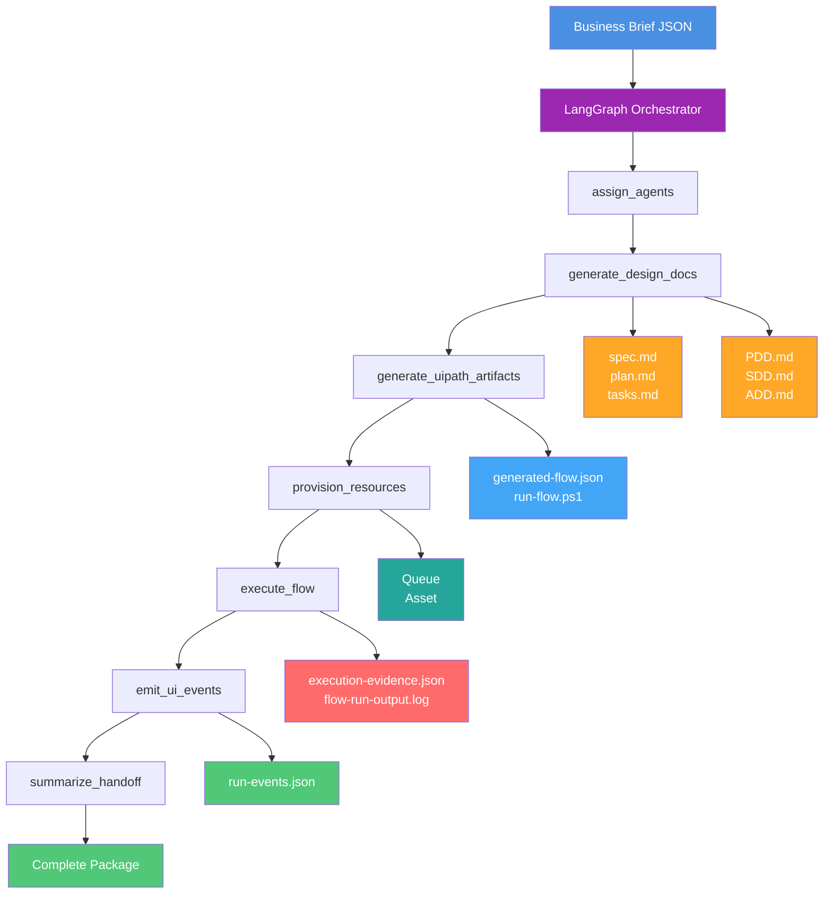
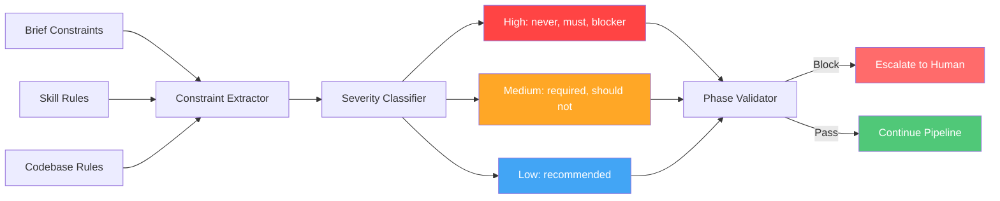

# UiPlan: Agent-of-Agents Builder Orchestrator

> **Elevator Pitch:** Turn a business brief into a complete UiPath automation package in one run - from requirements and design docs to provisioned resources and execution evidence, all orchestrated by specialized AI agents.

A LangGraph-based orchestrator that transforms a business brief into a complete UiPath automation delivery package.

## Overview

UiPlan compresses the automation delivery lifecycle into one supervised run. Submit a JSON brief and receive:

- **Planning docs**: `spec.md`, `plan.md`, `tasks.md`
- **Design docs**: `PDD.md`, `SDD.md`, `ADD.md`
- **Build artifacts**: `generated-flow.json`, `run-flow.ps1`
- **Platform evidence**: Queue/asset verification, execution logs
- **Interactive viewer**: Real-time monitoring dashboard

## Architecture



## 7-Phase Pipeline

Each phase is a discrete LangGraph node that produces structured outputs:

| Phase | Input | Output | Purpose |
|-------|-------|--------|---------|
| `assign_agents` | Business brief | Agent role assignments | Map requirements to specialist roles |
| `generate_design_docs` | Brief + assignments | UiPlan contract (spec/plan/tasks) + Design docs (PDD/SDD/ADD) | Create planning and design artifacts |
| `generate_uipath_artifacts` | Design docs | Flow JSON + run scripts | Generate executable UiPath artifacts |
| `provision_resources` | Artifacts + brief | Queue/asset verification | Provision Orchestrator resources |
| `execute_flow` | Artifacts + resources | Execution logs + evidence | Run the generated workflow |
| `emit_ui_events` | All phase outputs | `run-events.json` | Stream events to monitoring viewer |
| `summarize_handoff` | Complete state | Handoff summary | Package final deliverables |

## Getting Started

### Prerequisites

Before you begin, ensure you have:

- **Python 3.12+** - [Download here](https://www.python.org/downloads/)
- **Node.js 18+** - [Download here](https://nodejs.org/)
- **Git** - For cloning the repository
- **UiPath Automation Cloud account** - [Sign up free](https://cloud.uipath.com/)

### Installation

#### 1. Clone the Repository

```bash
git clone https://github.com/DanielaRosenn/uiplan-agent-of-agents.git
cd uiplan-agent-of-agents
```

#### 2. Set Up Python Environment

```bash
# Create virtual environment
python -m venv venv

# Activate virtual environment
# Windows:
venv\Scripts\activate
# Mac/Linux:
source venv/bin/activate

# Install Python dependencies
pip install uipath uipath-langchain langgraph pytest
```

#### 3. Install UiPath CLI

```bash
# Install the unified UiPath CLI (Node.js)
npm install -g @uipath/cli

# Verify installation
uip --version
```

#### 4. Configure UiPath Authentication

You have two options for authentication:

**Option A: Interactive Login (Recommended)**

```bash
uipath auth
# Follow browser prompts to authenticate
```

**Option B: Service Account (For CI/CD)**

Create `.env` in `agents/builder-orchestrator/`:

```bash
UIPATH_BASE_URL=https://cloud.uipath.com/<your-org>/<your-tenant>
UIPATH_CLIENT_ID=<your-client-id>
UIPATH_CLIENT_SECRET=<your-client-secret>
```

To get credentials:
1. Go to your UiPath Cloud portal
2. Navigate to Admin → External Applications
3. Create a new External App (Confidential)
4. Copy the Client ID and Secret

#### 5. Initialize Submodules (Optional)

If the repository has submodules:

```bash
git submodule update --init --recursive
```

### First Run

#### 1. Navigate to Orchestrator

```bash
cd agents/builder-orchestrator
```

#### 2. Run with Sample Brief

```bash
python -c "
import json
from pathlib import Path
from main import run_orchestrator

# Load the sample enterprise incident brief
brief = json.loads(
    Path('../../samples/agent-of-agents/brief.enterprise-incident.real.json').read_text()
)

# Run the orchestration
print('Starting orchestration...')
state = run_orchestrator(brief)

# Display results
print(f'\n✓ Run completed successfully!')
print(f'  Run ID: {state[\"runId\"]}')
print(f'  Status: {state[\"handoff\"][\"status\"]}')
print(f'  Output folder: {state[\"outputDir\"]}')
print(f'\nGenerated files:')
print(f'  - Planning: spec.md, plan.md, tasks.md')
print(f'  - Design: PDD.md, SDD.md, ADD.md')
print(f'  - Artifacts: generated-flow.json, run-flow.ps1')
print(f'  - Evidence: execution-evidence.json, logs')
print(f'\nTo view results, open the viewer (see below)')
"
```

Expected output:
```
Starting orchestration...
✓ Run completed successfully!
  Run ID: enterpriseincidentagentbuilder-20260525001234
  Status: completed
  Output folder: out/enterpriseincidentagentbuilder-20260525001234
```

#### 3. View Results in Interactive Dashboard

Start the viewer server:

```bash
# Navigate to UI folder
cd ../../ui

# Start HTTP server
python -m http.server 8765

# Server will start on http://localhost:8765
```

Open in your browser:

```
http://localhost:8765/copilotkit/viewer.html#tab=uiplan
```

The viewer shows 7 tabs:
- **UiPlan** - spec/plan/tasks contract
- **Diagrams** - Visual architecture
- **Tasks** - Agent assignments (Kanban board)
- **Constraints** - Severity-classified rules
- **Execution** - Phase timeline
- **Resources** - Platform verification (queues/assets)
- **Docs** - Generated documentation

#### 4. Explore Generated Files

```bash
# Go back to orchestrator folder
cd ../agents/builder-orchestrator

# List runs
ls out/

# View latest run outputs
cd out/<your-run-id>/

# Check planning documents
cat docs/spec.md
cat docs/plan.md
cat docs/tasks.md

# Check design documents
cat docs/PDD.md
cat docs/SDD.md
cat docs/ADD.md

# Check build artifacts
cat artifacts/generated-flow.json
cat artifacts/run-flow.ps1

# Check execution evidence
cat evidence/execution-evidence.json
cat evidence/flow-run-output.log
```

## Using Your Own Brief

### 1. Create a Custom Brief

Create a new JSON file in `samples/`:

```bash
cd samples/agent-of-agents
cp brief.enterprise-incident.real.json my-brief.json
```

Edit `my-brief.json`:

```json
{
  "projectName": "MyAutomationProject",
  "domain": "your-domain",
  "objective": "Describe what you want to automate",
  "systems": ["System1", "System2"],
  "constraints": [
    "No production deployment",
    "Require approval for sensitive operations"
  ],
  "stakeholders": ["Team Lead", "Business Owner"],
  "successCriteria": [
    "Documents generated",
    "Resources provisioned",
    "Evidence captured"
  ],
  "queueName": "Q_MY_QUEUE",
  "assetName": "ASSET_MY_CONFIG",
  "maxBuildIterations": 3,
  "maxDeployIterations": 2
}
```

### 2. Run with Custom Brief

```bash
cd agents/builder-orchestrator

python -c "
import json
from pathlib import Path
from main import run_orchestrator

brief = json.loads(Path('../../samples/agent-of-agents/my-brief.json').read_text())
state = run_orchestrator(brief)

print(f'Run ID: {state[\"runId\"]}')
print(f'Status: {state[\"handoff\"][\"status\"]}')
"
```

### 3. Monitor Progress

While running, you can monitor logs:

```bash
# In another terminal
tail -f agents/builder-orchestrator/out/<run-id>/evidence/flow-run-output.log
```

## Quick Start

### Run the Orchestrator

```bash
cd agents/builder-orchestrator

# Run with sample brief
python -c "
import json
from pathlib import Path
from main import run_orchestrator

# Load sample brief
brief = json.loads(
    Path('../../samples/agent-of-agents/brief.enterprise-incident.real.json').read_text()
)

# Run orchestration
state = run_orchestrator(brief)

print(f'✓ Run ID: {state[\"runId\"]}')
print(f'✓ Status: {state[\"handoff\"][\"status\"]}')
print(f'✓ Output: {state[\"outputDir\"]}')
"
```

### View Results

#### 1. Check Output Folder

```bash
cd agents/builder-orchestrator/out/<runId>/

# Planning contract
cat docs/spec.md
cat docs/plan.md
cat docs/tasks.md

# Design documents
cat docs/PDD.md
cat docs/SDD.md
cat docs/ADD.md

# Build artifacts
cat artifacts/generated-flow.json
cat artifacts/run-flow.ps1

# Execution evidence
cat evidence/execution-evidence.json
cat evidence/flow-run-output.log
```

#### 2. Open Interactive Viewer

The viewer provides 7 tabs for monitoring the run:

```bash
# Start local server
cd ui
python -m http.server 8765

# Open in browser
http://localhost:8765/copilotkit/viewer.html#tab=uiplan
```

**Viewer tabs:**
- **UiPlan** - Planning contract (spec/plan/tasks)
- **Diagrams** - Architecture visualization
- **Tasks** - Kanban board with agent assignments
- **Constraints** - Severity-classified rules with dependency graph
- **Execution** - Timeline and phase history
- **Resources** - Orchestrator queue/asset verification
- **Docs** - Generated design documents


## Input Format

The orchestrator expects a JSON brief with this structure:

```json
{
  "projectName": "EnterpriseIncidentAgentBuilder",
  "domain": "incident-response",
  "objective": "Generate design docs and build assets...",
  "systems": ["ServiceNow", "PagerDuty", "Orchestrator"],
  "constraints": [
    "No production deployment",
    "Human approval before remediation"
  ],
  "stakeholders": ["Incident Commander", "Automation Lead"],
  "successCriteria": [
    "PDD/SDD/ADD generated",
    "Queue and asset provisioned",
    "Execution evidence captured"
  ],
  "queueName": "Q_AGENT_OF_AGENTS_WORK",
  "assetName": "ASSET_AGENT_OF_AGENTS_POLICY",
  "maxBuildIterations": 5,
  "maxDeployIterations": 3,
  "queueProvisionCommand": "uip resource queues list ...",
  "assetProvisionCommand": "uip resource assets list ...",
  "flowRunCommand": "uip or jobs list ...",
  "constraintSkills": [
    "uipath-troubleshoot",
    "uipath-platform",
    "uipath-rpa"
  ]
}
```

See `samples/agent-of-agents/brief.enterprise-incident.real.json` for a complete example.

## Output Structure

Each run produces a timestamped folder:

```
out/<projectName>-<timestamp>/
├── docs/
│   ├── spec.md           # Requirements specification
│   ├── plan.md           # Implementation plan
│   ├── tasks.md          # Agent task assignments
│   ├── PDD.md            # Process Design Document
│   ├── SDD.md            # Solution Design Document
│   └── ADD.md            # Agent Design Document
├── artifacts/
│   ├── generated-flow.json  # UiPath Flow definition
│   └── run-flow.ps1         # Execution script
├── evidence/
│   ├── execution-evidence.json  # Structured evidence
│   └── flow-run-output.log      # Command logs
└── ui/
    └── run-events.json   # Viewer event stream
```

## Key Features

### Constraint Intelligence

The orchestrator extracts constraints from three sources:

1. **Brief constraints** - Explicit rules from business brief
2. **Skill critical rules** - Must/never statements from `skills/` submodule
3. **Codebase rules** - Project-level constraints from CLAUDE.md

Constraints are:
- Classified by severity (high/medium/low)
- Validated at phase boundaries
- Rendered as dependency graph in viewer
- Block progression on critical violations



### Evidence-First Handoff

Every run produces machine-readable artifacts:

- **Command logs** - Timestamped CLI invocations
- **Platform verification** - Queue/asset existence checks
- **Orchestrator telemetry** - Job execution data (when available)
- **Run events** - Complete state for viewer replay

### Real Platform Integration

No mocks - uses live UiPath platform:

```bash
# Queue provisioning (via uip CLI)
uip resource queues list --folder-path "Shared" --output json

# Asset verification
uip resource assets list --folder-path "Shared" --name "ASSET_NAME" --output json

# Job telemetry (when flow executes)
uip or jobs list --folder-path "Shared" --output json
```

## Common Workflows

### Daily Development Workflow

```bash
# 1. Start your day - pull latest changes
git pull origin main

# 2. Activate Python environment
source venv/bin/activate  # Mac/Linux
venv\Scripts\activate     # Windows

# 3. Run orchestrator with test brief
cd agents/builder-orchestrator
python -c "from main import run_orchestrator; import json; from pathlib import Path; state = run_orchestrator(json.loads(Path('../../samples/agent-of-agents/brief.enterprise-incident.real.json').read_text())); print(state['runId'])"

# 4. View results
cd ../../ui
python -m http.server 8765
# Open: http://localhost:8765/copilotkit/viewer.html#tab=uiplan
```

### Iterate on a Brief

```bash
# 1. Edit your brief
vim samples/agent-of-agents/my-brief.json

# 2. Run orchestrator
cd agents/builder-orchestrator
python -c "..."  # Your run command

# 3. Check outputs
cd out/<run-id>/
ls -la docs/ artifacts/ evidence/

# 4. Review in viewer
# Viewer automatically picks up latest run
```

### Compare Multiple Runs

```bash
# List all runs
ls -lt agents/builder-orchestrator/out/

# Compare spec files from two runs
diff agents/builder-orchestrator/out/<run1>/docs/spec.md \
     agents/builder-orchestrator/out/<run2>/docs/spec.md

# Compare constraints
diff agents/builder-orchestrator/out/<run1>/ui/run-events.json \
     agents/builder-orchestrator/out/<run2>/ui/run-events.json
```

### Debug a Failed Run

```bash
# 1. Check the error in handoff
cd agents/builder-orchestrator/out/<run-id>/

# 2. View execution evidence
cat evidence/execution-evidence.json | jq '.status'

# 3. Check command logs
cat evidence/flow-run-output.log

# 4. View phase history in viewer
# Open viewer and check Execution tab
```

### Clean Up Old Runs

```bash
# Keep only last 5 runs
cd agents/builder-orchestrator/out/
ls -t | tail -n +6 | xargs rm -rf

# Or keep runs from last week
find . -type d -mtime +7 -exec rm -rf {} +
```

## Configuration

### Environment Variables

Create `.env` in `agents/builder-orchestrator/`:

```bash
UIPATH_BASE_URL=https://cloud.uipath.com/<org>/<tenant>
UIPATH_CLIENT_ID=<client-id>
UIPATH_CLIENT_SECRET=<client-secret>
```

Or authenticate interactively:

```bash
uipath auth
```

### Project Settings

`agents/builder-orchestrator/uipath.json`:

```json
{
  "name": "builder-orchestrator",
  "description": "UiPlan Agent-of-Agents Builder",
  "functions": {
    "run_orchestrator": "main.py:run_orchestrator"
  }
}
```

### Viewer Configuration

The viewer automatically loads the latest run. To view a specific run:

```bash
# Copy specific run to current folder
cp -r agents/builder-orchestrator/out/<run-id>/ui/run-events.json \
      ui/copilotkit/current/run-events.json

# Refresh browser to see it
```

## Testing

```bash
# Run all tests
pytest framework/tests/

# Test constraints extraction
pytest framework/tests/unit/constraints/ -v

# Test UiPlan contract
pytest framework/tests/unit/docs/ -v

# Integration test (requires auth)
pytest framework/tests/integration/ -v
```

## Repository Structure

```
uipath-builder-agent/
├── agents/
│   └── builder-orchestrator/      # Main orchestrator
│       ├── main.py                # LangGraph pipeline (7 phases)
│       ├── langgraph.json         # Entry point config
│       └── out/                   # Run outputs (timestamped folders)
├── framework/
│   ├── models/                    # Pydantic models (spec/plan/tasks)
│   ├── constraints/               # Extraction and classification
│   └── tests/                     # Test suite
├── samples/
│   └── agent-of-agents/           # Sample business briefs
│       └── brief.enterprise-incident.real.json
├── ui/
│   └── copilotkit/
│       ├── viewer.html            # Interactive dashboard
│       └── current/               # Symlink to latest run
│           └── run-events.json
├── skills/                        # UiPath skills submodule
├── extensions/                    # Project-specific extensions
├── docs/
│   ├── uipath-cli.md             # CLI reference
│   └── uipath-workflows.md       # Workflow guide
└── LICENSE                        # MIT
```

## Safety and Governance

Built-in safety constraints:

- **No Production deploys** - Blocks deployment to production folders
- **Human approval gates** - Escalates before risky operations
- **Max iteration budgets** - Prevents infinite build/deploy loops
- **Secrets management** - No hardcoded credentials (uses Orchestrator Assets)
- **Audit trail** - Every run produces evidence bundle

## Extending

### Add a New Phase

1. Define phase function in `main.py`:

```python
def new_phase(state: OrchestratorState) -> OrchestratorState:
    _add_phase_event(state, "new_phase", "running")
    
    # Phase logic here
    
    _add_phase_event(state, "new_phase", "completed")
    return state
```

2. Add to graph:

```python
workflow.add_node("new_phase", new_phase)
workflow.add_edge("previous_phase", "new_phase")
workflow.add_edge("new_phase", "next_phase")
```

### Add Custom Constraints

Extend `framework/constraints/extractor.py`:

```python
def extract_custom_constraints(source: str) -> list[Constraint]:
    # Custom extraction logic
    return constraints
```

## Starting and Stopping

### Start the System

**Terminal 1 - Run Orchestrator:**

```bash
# Activate environment
cd /path/to/uiplan-agent-of-agents
source venv/bin/activate  # Mac/Linux
venv\Scripts\activate     # Windows

# Navigate to orchestrator
cd agents/builder-orchestrator

# Run orchestration
python -c "
import json
from pathlib import Path
from main import run_orchestrator

brief = json.loads(Path('../../samples/agent-of-agents/brief.enterprise-incident.real.json').read_text())
state = run_orchestrator(brief)
print(f'Run completed: {state[\"runId\"]}')
"
```

**Terminal 2 - Start Viewer Server:**

```bash
# Navigate to UI folder
cd /path/to/uiplan-agent-of-agents/ui

# Start HTTP server
python -m http.server 8765

# Output: Serving HTTP on :: port 8765 (http://[::]:8765/) ...
```

**Browser:**

Open: http://localhost:8765/copilotkit/viewer.html#tab=uiplan

### Stop the System

1. **Stop the viewer server:**
   - Press `Ctrl+C` in Terminal 2

2. **Deactivate Python environment:**
   ```bash
   deactivate
   ```

### Run as Background Service (Optional)

**Using systemd (Linux):**

Create `/etc/systemd/system/uiplan-viewer.service`:

```ini
[Unit]
Description=UiPlan Viewer Server
After=network.target

[Service]
Type=simple
User=youruser
WorkingDirectory=/path/to/uiplan-agent-of-agents/ui
ExecStart=/usr/bin/python3 -m http.server 8765
Restart=always

[Install]
WantedBy=multi-user.target
```

Enable and start:

```bash
sudo systemctl enable uiplan-viewer
sudo systemctl start uiplan-viewer
sudo systemctl status uiplan-viewer
```

**Using PM2 (Node.js process manager):**

```bash
# Install PM2
npm install -g pm2

# Start viewer
pm2 start --name uiplan-viewer "python -m http.server 8765" --cwd /path/to/ui

# Save PM2 config
pm2 save

# Set to start on boot
pm2 startup

# Check status
pm2 status

# Stop
pm2 stop uiplan-viewer
```

## Troubleshooting

### "Command not found: uip"

Install the UiPath unified CLI:

```bash
npm install -g @uipath/cli

# Verify
uip --version
```

If still not found, add npm global bin to PATH:

```bash
# Find npm global bin
npm config get prefix

# Add to PATH (add to ~/.bashrc or ~/.zshrc)
export PATH="$PATH:$(npm config get prefix)/bin"
```

### "Command not found: uipath"

Install the Python SDK:

```bash
pip install uipath uipath-langchain

# Verify
python -c "import uipath; print(uipath.__version__)"
```

### "Authentication failed"

Set up credentials:

```bash
# Interactive auth (recommended)
uipath auth
# Follow browser prompts

# Or set environment variables
export UIPATH_BASE_URL=https://cloud.uipath.com/<org>/<tenant>
export UIPATH_CLIENT_ID=<client-id>
export UIPATH_CLIENT_SECRET=<client-secret>

# Verify auth
uip or folders list
```

### "Viewer shows no data"

Ensure run completed and events were generated:

```bash
# Check latest run
ls -lt agents/builder-orchestrator/out/ | head -5

# Verify events file exists
ls -la agents/builder-orchestrator/out/<runId>/ui/run-events.json

# Check file is valid JSON
cat agents/builder-orchestrator/out/<runId>/ui/run-events.json | jq .

# Copy to viewer current folder (should be automatic)
cp agents/builder-orchestrator/out/<runId>/ui/run-events.json ui/copilotkit/current/
```

### "Queue/asset provisioning failed"

Check CLI authentication and folder permissions:

```bash
# Test CLI access
uip resource queues list --folder-path "Shared"

# Verify folder exists
uip or folders list --output json | jq '.[] | select(.displayName == "Shared")'

# Check permissions
uip or folders get --path "Shared" --output json
```

### "Module not found" errors

Reinstall dependencies:

```bash
# Activate virtual environment
source venv/bin/activate  # Mac/Linux
venv\Scripts\activate     # Windows

# Reinstall all dependencies
pip install --upgrade uipath uipath-langchain langgraph pytest

# Verify
python -c "import langgraph; import uipath; print('OK')"
```

### "Port 8765 already in use"

Find and kill the process:

```bash
# Linux/Mac
lsof -ti:8765 | xargs kill -9

# Windows
netstat -ano | findstr :8765
taskkill /PID <PID> /F

# Or use different port
python -m http.server 8766
```

### Viewer performance issues

Clear browser cache and reload:

```bash
# Chrome/Edge
Ctrl+Shift+Delete (Windows)
Cmd+Shift+Delete (Mac)

# Or force reload
Ctrl+F5 (Windows)
Cmd+Shift+R (Mac)
```

## License

MIT License - see [LICENSE](LICENSE)

## Documentation

- **CLI Reference**: `docs/uipath-cli.md`
- **Workflows Guide**: `docs/uipath-workflows.md`
- **Skills Submodule**: `skills/` (upstream UiPath skills catalog)
- **Agent Design**: `agents/builder-orchestrator/AGENTS.md`
