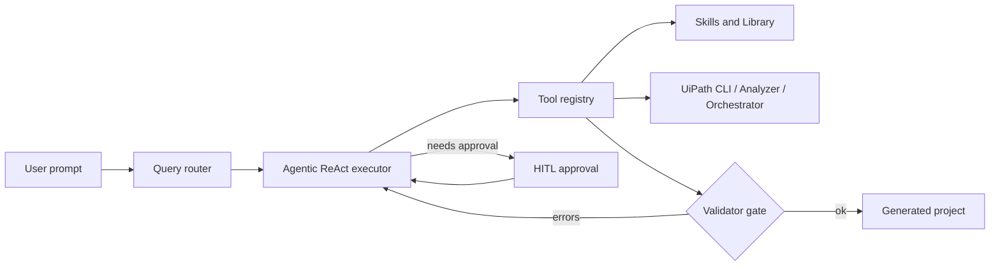
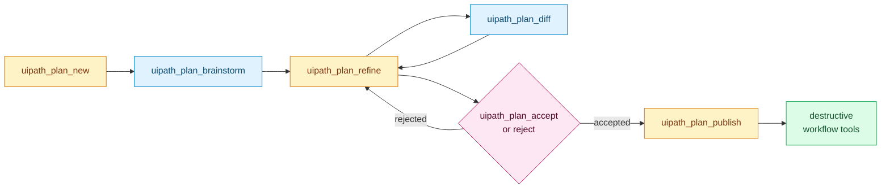
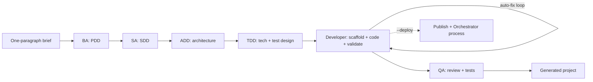

# UiPath Claude Code

**Claude Code for UiPath — an agentic CLI and Cursor integration that builds, validates, and runs RPA workflows.**


RPA developers spend hours scaffolding projects, hand-writing XAML, and chasing validator errors that all look alike. UiPath Claude Code runs that loop for you: it scaffolds the project, writes the XAML, runs the UiPath validator, fixes what it breaks, and only stops to ask when a human decision actually matters. It works from the CLI, inside Cursor, and as a full BA → SA → ADD → TDD → Dev → QA pipeline that turns a one-paragraph brief into a validated, packaged, optionally deployed UiPath project.




---

## Quickstart

### 1. Clone the repo (fresh setup)

```bash
git clone <your-repo-url>
cd uipath-builder-agent
git submodule update --init --recursive
```

The submodule step is required: the official UiPath skills ship under `skills/skills/` as a git submodule.

### 2. Create a virtual environment

```powershell
# Windows PowerShell
python -m venv .venv
.\.venv\Scripts\Activate.ps1
```

```bash
# macOS / Linux
python -m venv .venv
source .venv/bin/activate
```

### 3. Install Python dependencies

Pick the extra that matches how you plan to use the project:

| Usage mode             | Install command            |
| ---------------------- | -------------------------- |
| CLI / development      | `pip install -e ".[dev]"`  |
| Cursor + MCP server    | `pip install -e ".[mcp]"`  |
| Both (contributors)    | `pip install -e ".[dev,mcp]"` |

### 4. Verify Bedrock access and run

```bash
aws sts get-caller-identity   # confirm Bedrock creds
uipath-claude chat
```

Full setup (UiPath CLI, Studio 26.2+, Orchestrator auth, AWS region overrides) lives in [docs/INSTALL.md](docs/INSTALL.md).

---

## Choose your setup path

Three supported ways to use the project. Pick one (or combine).

### A. CLI (`uipath-claude chat`) — Claude Code-style agent

The full agentic CLI with auto-fix loop, planner, and BA -> SA -> ADD -> TDD -> Dev -> QA pipeline driven by `/pdd`.

- Requires `pip install -e ".[dev]"` and AWS Bedrock access.
- Run: `uipath-claude chat`
- Day-to-day usage: [docs/USER_GUIDE.md](docs/USER_GUIDE.md)

### B. Cursor (skills-only)

Use the UiPath skills directly inside Cursor without the CLI runtime. Good for quick scaffolding and design questions.

```powershell
# Windows
.\scripts\setup-cursor.ps1
```

```bash
# macOS / Linux
./scripts/setup-cursor.sh
```

Open the repo in Cursor; skills auto-load. Guide: [docs/CURSOR_USER_GUIDE.md](docs/CURSOR_USER_GUIDE.md).

### C. Cursor + MCP (skills + UiPath tool calls)

Adds validation, package install, and run-workflow tools to Cursor via the bundled MCP server.

- Install MCP extras: `pip install -e ".[mcp]"`.
- Run `scripts/setup-cursor.ps1` / `.sh` (writes `.cursor/mcp.json`).
- Open the repo in Cursor — the `uipath-builder-agent` MCP server auto-connects.
- Verify in Cursor: Settings -> MCP -> `uipath-builder-agent` shows connected.
- MCP tool reference and patterns: [docs/CURSOR_USER_GUIDE.md](docs/CURSOR_USER_GUIDE.md#mcp-tools-advanced).

---

## What it does

- **Generate validated UiPath projects from a description.** Describe the automation in plain English; the agent scaffolds the project, writes XAML, runs the UiPath Workflow Analyzer and `uip rpa` validator, and auto-fixes validator errors until the workflow passes both static and runtime checks.
- **Bootstrap end-to-end with the BA → SA → ADD → TDD → Dev → QA pipeline.** `/pdd "InvoiceBot"` turns a one-paragraph brief into a PDD, SDD, ADD, TDD, scaffolded project, validated workflow, and (optionally) a published + deployed Orchestrator process. The legacy four-stage `/bootstrap` flow is still available for quick BA → SA → Dev → QA runs. Full reference: [docs/PDD_LIFECYCLE.md](docs/PDD_LIFECYCLE.md).
- **Works where you work.** Use the CLI (`uipath-claude chat`), drive it from Cursor (the skills register automatically after running `scripts/setup-cursor.ps1`), or call slash commands like `/pdd`, `/bootstrap`, `/skills`, `/analyze`, `/recall`.
- **Learns as you use it.** A layered skills system (user → project → team extensions → official UiPath submodule) plus a library learning loop capture gotchas and edge cases as you hit them, so the agent gets better at your codebase over time.
- **Safe by default.** Tool profiles (`safe`, `uipath-dev`, `all`), per-operation approval gates, and session hooks keep destructive actions behind human review. Nothing touches Orchestrator unless you say so.

---

## SDLC planning (brainstorm -> plan -> build)

The repo ships a superpowers-style planning loop for any non-trivial change: you draft a plan, ground it in project context, iterate, accept it, then let destructive tools run against an approved artifact. The full spec is in [docs/PLANNING_FRAMEWORK.md](docs/PLANNING_FRAMEWORK.md); the short version is below.

### Storage model

- Drafts live in `.cursor/plans/` (per-user, **git-ignored**) so you can iterate without polluting history.
- Published plans live in `docs/plans/` (git-tracked). `docs/plans/README.md` is a regenerated index.
- Snapshots of each refine step go under `.cursor/plans/.snapshots/` for `uipath_plan_diff --mode self`.

### The loop



### Starting a new project

Same seven steps either way. Cursor drives them through chat + the MCP tools; the CLI gives you one command per step. Pick whichever your session is in.

#### In Cursor (recommended for interactive work)

Prereq: ran `scripts/setup-cursor.ps1` / `.sh` so `.cursor/mcp.json` is wired and the `uipath-builder-agent` MCP server shows **connected** under Cursor Settings -> MCP. The `brainstorming-plan` skill (`.cursor/skills/brainstorming-plan/SKILL.md`) auto-loads and orchestrates the loop.

1. **Kick it off in chat.** Say *"Let's plan a new automation for &lt;X&gt;"* or *"Use the brainstorming-plan skill to plan &lt;X&gt;"*. The skill calls `uipath_plan_new` to scaffold a draft under `.cursor/plans/<date>-<slug>.md` (git-ignored, per-user).
2. **Ground it.** The skill calls `uipath_plan_brainstorm`, which returns suggested library searches, candidate specialist skills (`uipath-rpa`, `uipath-agents`, ...), PDD/SDD/ADD candidates under `docs/`, and up to three clarifying questions. Answer them in chat.
3. **Refine iteratively.** Ask for task breakdowns, mermaid diagrams, or section rewrites. The skill calls `uipath_plan_refine` with structured ops (`append_task`, `set_goal`, `add_mermaid`, `replace_body_section`). Each refine writes a snapshot under `.cursor/plans/.snapshots/` so you can diff.
4. **Review the diff.** *"Show me what changed since the last snapshot"* -> `uipath_plan_diff --mode self`. Against a previously published version: `--mode vs-published`.
5. **Accept (or reject).** *"Accept this plan"* -> `uipath_plan_accept` stamps `accepted_at` / `accepted_by` in the front matter. Cursor's native Allow/Deny card will also surface on any destructive tool. To reject: `uipath_plan_reject` with a non-empty reason.
6. **Publish.** *"Publish the plan"* -> `uipath_plan_publish` promotes the draft from `.cursor/plans/` to `docs/plans/` and regenerates `docs/plans/README.md` on commit.
7. **Hand off to build.** *"/pdd &lt;slug&gt;"* (full BA -> SA -> ADD -> TDD -> Dev -> QA pipeline) or just *"implement this plan"* to run the validator-gated build loop.

The skill enforces read-only grounding before any writes, batches your clarifying questions, and stops at the accept gate before promoting anything.

#### From the CLI

All seven tools are exposed via `uipath-claude plan <subcommand>` (and map 1:1 to the MCP tools above):

```bash
# 1. Scaffold a draft under .cursor/plans/
uipath-claude plan new --title "Invoice routing" --intent "Route invoices to approvers"

# 2. Get grounding hints (library searches, candidate skills, PDD/SDD candidates)
uipath-claude plan brainstorm --slug invoice-routing

# 3. Apply structured patches (tasks, goal, mermaid, section bodies)
uipath-claude plan refine --slug invoice-routing \
  --op append_task --value "Add retry scope to SAP post"

# 4. Diff against published twin or against last snapshot
uipath-claude plan diff --slug invoice-routing --mode vs-published

# 5. Accept (stamps accepted_at/accepted_by) or reject (requires --reason)
uipath-claude plan accept --slug invoice-routing --actor you

# 6. Promote draft -> docs/plans/ and regenerate the index
uipath-claude plan publish --slug invoice-routing

# At any point: list drafts, published, or both
uipath-claude plan list --scope both
```

Same files, same MCP tools - no drift between the two paths.

### Optional hard gate (`UIPATH_PLAN_GATE=1`)

Set the environment variable and the destructive workflow tools - `uipath_workflow_write_file`, `uipath_workflow_install_package`, `uipath_workflow_deploy`, `uipath_workflow_publish` - refuse to run unless an **accepted** plan exists for the target `project_dir`. Useful for CI or when you want to enforce the loop:

```powershell
# Windows PowerShell
$env:UIPATH_PLAN_GATE = "1"
```

```bash
# macOS / Linux
export UIPATH_PLAN_GATE=1
```

Unset or set to `0` to restore the default (no gate).

### When to use which

| Scenario | Entry point |
|---|---|
| One-off change with an obvious design | Skip - just edit and validate |
| Planning interactively in Cursor | Chat: *"Use the brainstorming-plan skill to plan &lt;X&gt;"* |
| Planning from a terminal / CI | `uipath-claude plan new ...` -> `brainstorm` -> `refine` -> `accept` -> `publish` |
| Formal PDD/SDD/ADD lifecycle (BA -> SA -> ADD -> TDD -> Dev -> QA) | `/pdd` - see [docs/PDD_LIFECYCLE.md](docs/PDD_LIFECYCLE.md) |
| Quick routing question ("which skill handles X?") | `uipath-planner` skill directly |

The planning framework and `/pdd` are complementary: the planning loop is for authoring the change; `/pdd` is the formal document lifecycle.

---

## A real example

A session driving the auto-fix loop against a real validator error. The full transcript lives in [examples/03-auto-fix-validator/](examples/03-auto-fix-validator/).

```text
> Build me an InvoiceProcessor workflow that reads Sample.xlsx and logs each invoice id.

[Step 1/25] ensure_project_structure(name="InvoiceProcessor")
   -> created InvoiceProcessor/project.json, Main.xaml
[Step 2/25] install_package("UiPath.Excel.Activities")
   -> ok
[Step 3/25] write_file("InvoiceProcessor/Main.xaml", ...)
[Step 4/25] validate_file("InvoiceProcessor/Main.xaml")
   -> ERRORS (2):
      - UiPath.Excel.Activities.ExcelReadRange: 'Range' is required
      - Variable 'dt_Invoices' used before assignment
[Step 5/25] validate_and_fix_loop -> patching...
[Step 6/25] write_file("InvoiceProcessor/Main.xaml", ...)   # revised
[Step 7/25] validate_file("InvoiceProcessor/Main.xaml")
   -> OK (0 errors, 0 warnings)
[Step 8/25] run_workflow("InvoiceProcessor")
   -> OK: processed 14 invoices in 1.2s

Done. Generated at generated/chat/2026-04-18-0a1b/InvoiceProcessor/.
```

What just happened: the model wrote XAML, the UiPath validator rejected it, `validate_and_fix_loop` interpreted the errors, rewrote the file, and only stopped when both the static validator and the runtime `uip rpa run-file` agreed.

---

## Architecture

The chat runtime loads a **skill registry** from several filesystem layers (user, project, team extensions, official UiPath submodule) and exposes them to a ReAct-style executor alongside UiPath tools (CLI, Analyzer, Orchestrator, Ask AI). A validator gate sits inline in the loop: every `write_file` is followed by `validate_file`, and failures feed back into the executor until the workflow passes. Plan mode wraps the executor with a read-only proposal step so you approve the plan before any file is touched.



The new six-agent flow is driven by the `/pdd` slash command and is documented in [docs/PDD_LIFECYCLE.md](docs/PDD_LIFECYCLE.md). The legacy `/bootstrap` BA → SA → Dev → QA flow is still wired in for short runs (see [docs/ARCHITECTURE.md](docs/ARCHITECTURE.md)).

Deeper technical detail: [docs/ARCHITECTURE.md](docs/ARCHITECTURE.md).

---

## Docs

- [docs/README.md](docs/README.md) — index of every document in this repo
- [docs/INSTALL.md](docs/INSTALL.md) — full installation (UiPath CLI, Studio, submodules, AWS)
- [docs/ARCHITECTURE.md](docs/ARCHITECTURE.md) — runtime, executor, validator gate, pipeline
- [docs/USER_GUIDE.md](docs/USER_GUIDE.md) — day-to-day CLI usage
- [docs/PDD_LIFECYCLE.md](docs/PDD_LIFECYCLE.md) — full `/pdd` lifecycle: BA → SA → ADD → TDD → Dev → QA → publish → deploy
- [docs/PLANNING_FRAMEWORK.md](docs/PLANNING_FRAMEWORK.md) — brainstorm-to-plan loop (`uipath_plan_*`, `UIPATH_PLAN_GATE`, draft vs published)
- [docs/CURSOR_USER_GUIDE.md](docs/CURSOR_USER_GUIDE.md) — using the skills inside Cursor
- [docs/TOOLS.md](docs/TOOLS.md) — tool registry reference
- [docs/SKILL_LAYOUT.md](docs/SKILL_LAYOUT.md) — skill layering and provenance
- [docs/LIBRARY_LEARNING.md](docs/LIBRARY_LEARNING.md) — library learning loop
- [docs/SMOKE_TESTS.md](docs/SMOKE_TESTS.md) — end-to-end smoke scenarios
- [CONTRIBUTING.md](CONTRIBUTING.md) — how to add skills, tools, and slash commands
- [CHANGELOG.md](CHANGELOG.md) — release history

---

## Keeping skills up to date

The `skills/` git submodule tracks [UiPath/skills](https://github.com/UiPath/skills). The workspace's `.cursor/skills` is a junction into `skills/skills/`, so any submodule bump is picked up by Cursor immediately. Four paths to stay current:

- **Automatic (server-side, daily):** [.github/workflows/update-skills-submodule.yml](.github/workflows/update-skills-submodule.yml) runs at 06:00 UTC and opens a PR `chore/update-skills-submodule` when upstream moves. Also triggerable from the Actions tab.
- **Automatic (per Cursor session, every 2 days):** [.cursor/hooks.json](.cursor/hooks.json) registers a `sessionStart` hook that runs [.cursor/hooks/check-skills-update.ps1](.cursor/hooks/check-skills-update.ps1) on Windows (or `.sh` on mac/linux). It surfaces a banner in the new chat when updates are available; throttled via `.cursor/hooks/state/last-update-check` (gitignored, per-user). Change `$ThrottleDays` at the top of the script to tune the cadence.
- **Manual in chat:** `/update-skills [--check|--info|--force]` and `/scan-upstream-skills` inside the CLI.
- **Manual in a shell:** `scripts/update-skills.ps1 [-Check] [-Commit]` (or `scripts/update-skills.sh [--check|--commit]`) for one-off pulls outside Cursor.

> Mac/linux teammates: if `pwsh` is not installed, replace the `command` in `.cursor/hooks.json` with `bash .cursor/hooks/check-skills-update.sh`, or place an override at `~/.cursor/hooks.json` (user-scope hooks take precedence over project-scope).

---

## Contributing

Issues and PRs are welcome. The project is extensible along three axes: **skills**, **tools**, and **slash commands**.

### Quick contributor path

```bash
# 1. Fork and clone, then install dev + MCP extras
pip install -e ".[dev,mcp]"
git submodule update --init --recursive

# 2. Make your change on a feature branch
git checkout -b my-change

# 3. Run the core checks
ruff check .
black --check .
mypy uipath_claude
pytest -m "not integration"

# 4. Open a PR against main
```

### Where to contribute

- **Skills** — markdown playbooks under `extensions/skills/` (team-shared) or `.uipath-claude/skills/` (local). Do not edit the `skills/skills/` submodule in place.
- **Tools** — Python functions under [uipath_claude/tools/](uipath_claude/tools/), registered via tool profiles.
- **Slash commands** — small modules under `uipath_claude/commands/` registered on the command registry.
- **Docs** — keep [docs/](docs/) and [CHANGELOG.md](CHANGELOG.md) in sync with user-visible changes.

Full contribution workflow, layering rules, MCP session gate, and review expectations live in [CONTRIBUTING.md](CONTRIBUTING.md).

---

## License

Internal use. See `pyproject.toml`.
