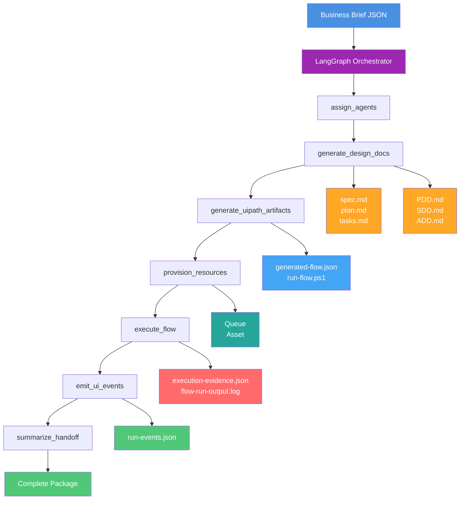
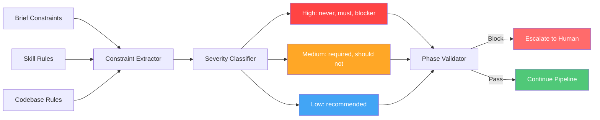

# UiPlan: Agent-of-Agents Builder Orchestrator

A LangGraph-based orchestrator that transforms a business brief into a complete UiPath automation delivery package.

## Overview

UiPlan compresses the automation delivery lifecycle into one supervised run. Submit a JSON brief and receive:

- **Planning docs**: `spec.md`, `plan.md`, `tasks.md`
- **Design docs**: `PDD.md`, `SDD.md`, `ADD.md`
- **Build artifacts**: `generated-flow.json`, `run-flow.ps1`
- **Platform evidence**: Queue/asset verification, execution logs
- **Interactive viewer**: Real-time monitoring dashboard

## Architecture



## 7-Phase Pipeline

Each phase is a discrete LangGraph node that produces structured outputs:

| Phase | Input | Output | Purpose |
|-------|-------|--------|---------|
| `assign_agents` | Business brief | Agent role assignments | Map requirements to specialist roles |
| `generate_design_docs` | Brief + assignments | UiPlan contract (spec/plan/tasks) + Design docs (PDD/SDD/ADD) | Create planning and design artifacts |
| `generate_uipath_artifacts` | Design docs | Flow JSON + run scripts | Generate executable UiPath artifacts |
| `provision_resources` | Artifacts + brief | Queue/asset verification | Provision Orchestrator resources |
| `execute_flow` | Artifacts + resources | Execution logs + evidence | Run the generated workflow |
| `emit_ui_events` | All phase outputs | `run-events.json` | Stream events to monitoring viewer |
| `summarize_handoff` | Complete state | Handoff summary | Package final deliverables |

## Quick Start

### Prerequisites

```bash
# Python 3.12+
python --version

# UiPath Python SDK
pip install uipath uipath-langchain

# UiPath CLI (for platform operations)
npm install -g @uipath/cli

# UiPath Automation Cloud credentials
# Set in .env or run: uipath auth
```

### Run the Orchestrator

```bash
cd agents/builder-orchestrator

# Run with sample brief
python -c "
import json
from pathlib import Path
from main import run_orchestrator

# Load sample brief
brief = json.loads(
    Path('../../samples/agent-of-agents/brief.enterprise-incident.real.json').read_text()
)

# Run orchestration
state = run_orchestrator(brief)

print(f'✓ Run ID: {state[\"runId\"]}')
print(f'✓ Status: {state[\"handoff\"][\"status\"]}')
print(f'✓ Output: {state[\"outputDir\"]}')
"
```

### View Results

#### 1. Check Output Folder

```bash
cd agents/builder-orchestrator/out/<runId>/

# Planning contract
cat docs/spec.md
cat docs/plan.md
cat docs/tasks.md

# Design documents
cat docs/PDD.md
cat docs/SDD.md
cat docs/ADD.md

# Build artifacts
cat artifacts/generated-flow.json
cat artifacts/run-flow.ps1

# Execution evidence
cat evidence/execution-evidence.json
cat evidence/flow-run-output.log
```

#### 2. Open Interactive Viewer

The viewer provides 7 tabs for monitoring the run:

```bash
# Start local server
cd ui
python -m http.server 8765

# Open in browser
http://localhost:8765/copilotkit/viewer.html#tab=uiplan
```

**Viewer tabs:**
- **UiPlan** - Planning contract (spec/plan/tasks)
- **Diagrams** - Architecture visualization
- **Tasks** - Kanban board with agent assignments
- **Constraints** - Severity-classified rules with dependency graph
- **Execution** - Timeline and phase history
- **Resources** - Orchestrator queue/asset verification
- **Docs** - Generated design documents


## Input Format

The orchestrator expects a JSON brief with this structure:

```json
{
  "projectName": "EnterpriseIncidentAgentBuilder",
  "domain": "incident-response",
  "objective": "Generate design docs and build assets...",
  "systems": ["ServiceNow", "PagerDuty", "Orchestrator"],
  "constraints": [
    "No production deployment",
    "Human approval before remediation"
  ],
  "stakeholders": ["Incident Commander", "Automation Lead"],
  "successCriteria": [
    "PDD/SDD/ADD generated",
    "Queue and asset provisioned",
    "Execution evidence captured"
  ],
  "queueName": "Q_AGENT_OF_AGENTS_WORK",
  "assetName": "ASSET_AGENT_OF_AGENTS_POLICY",
  "maxBuildIterations": 5,
  "maxDeployIterations": 3,
  "queueProvisionCommand": "uip resource queues list ...",
  "assetProvisionCommand": "uip resource assets list ...",
  "flowRunCommand": "uip or jobs list ...",
  "constraintSkills": [
    "uipath-troubleshoot",
    "uipath-platform",
    "uipath-rpa"
  ]
}
```

See `samples/agent-of-agents/brief.enterprise-incident.real.json` for a complete example.

## Output Structure

Each run produces a timestamped folder:

```
out/<projectName>-<timestamp>/
├── docs/
│   ├── spec.md           # Requirements specification
│   ├── plan.md           # Implementation plan
│   ├── tasks.md          # Agent task assignments
│   ├── PDD.md            # Process Design Document
│   ├── SDD.md            # Solution Design Document
│   └── ADD.md            # Agent Design Document
├── artifacts/
│   ├── generated-flow.json  # UiPath Flow definition
│   └── run-flow.ps1         # Execution script
├── evidence/
│   ├── execution-evidence.json  # Structured evidence
│   └── flow-run-output.log      # Command logs
└── ui/
    └── run-events.json   # Viewer event stream
```

## Key Features

### Constraint Intelligence

The orchestrator extracts constraints from three sources:

1. **Brief constraints** - Explicit rules from business brief
2. **Skill critical rules** - Must/never statements from `skills/` submodule
3. **Codebase rules** - Project-level constraints from CLAUDE.md

Constraints are:
- Classified by severity (high/medium/low)
- Validated at phase boundaries
- Rendered as dependency graph in viewer
- Block progression on critical violations



### Evidence-First Handoff

Every run produces machine-readable artifacts:

- **Command logs** - Timestamped CLI invocations
- **Platform verification** - Queue/asset existence checks
- **Orchestrator telemetry** - Job execution data (when available)
- **Run events** - Complete state for viewer replay

### Real Platform Integration

No mocks - uses live UiPath platform:

```bash
# Queue provisioning (via uip CLI)
uip resource queues list --folder-path "Shared" --output json

# Asset verification
uip resource assets list --folder-path "Shared" --name "ASSET_NAME" --output json

# Job telemetry (when flow executes)
uip or jobs list --folder-path "Shared" --output json
```

## Configuration

### Environment Variables

Create `.env` in `agents/builder-orchestrator/`:

```bash
UIPATH_BASE_URL=https://cloud.uipath.com/<org>/<tenant>
UIPATH_CLIENT_ID=<client-id>
UIPATH_CLIENT_SECRET=<client-secret>
```

Or authenticate interactively:

```bash
uipath auth
```

### Project Settings

`agents/builder-orchestrator/uipath.json`:

```json
{
  "name": "builder-orchestrator",
  "description": "UiPlan Agent-of-Agents Builder",
  "functions": {
    "run_orchestrator": "main.py:run_orchestrator"
  }
}
```

## Testing

```bash
# Run all tests
pytest framework/tests/

# Test constraints extraction
pytest framework/tests/unit/constraints/ -v

# Test UiPlan contract
pytest framework/tests/unit/docs/ -v

# Integration test (requires auth)
pytest framework/tests/integration/ -v
```

## Repository Structure

```
uipath-builder-agent/
├── agents/
│   └── builder-orchestrator/      # Main orchestrator
│       ├── main.py                # LangGraph pipeline (7 phases)
│       ├── langgraph.json         # Entry point config
│       └── out/                   # Run outputs (timestamped folders)
├── framework/
│   ├── models/                    # Pydantic models (spec/plan/tasks)
│   ├── constraints/               # Extraction and classification
│   └── tests/                     # Test suite
├── samples/
│   └── agent-of-agents/           # Sample business briefs
│       └── brief.enterprise-incident.real.json
├── ui/
│   └── copilotkit/
│       ├── viewer.html            # Interactive dashboard
│       └── current/               # Symlink to latest run
│           └── run-events.json
├── skills/                        # UiPath skills submodule
├── extensions/                    # Project-specific extensions
├── docs/
│   ├── uipath-cli.md             # CLI reference
│   └── uipath-workflows.md       # Workflow guide
└── LICENSE                        # MIT
```

## Safety and Governance

Built-in safety constraints:

- **No Production deploys** - Blocks deployment to production folders
- **Human approval gates** - Escalates before risky operations
- **Max iteration budgets** - Prevents infinite build/deploy loops
- **Secrets management** - No hardcoded credentials (uses Orchestrator Assets)
- **Audit trail** - Every run produces evidence bundle

## Extending

### Add a New Phase

1. Define phase function in `main.py`:

```python
def new_phase(state: OrchestratorState) -> OrchestratorState:
    _add_phase_event(state, "new_phase", "running")
    
    # Phase logic here
    
    _add_phase_event(state, "new_phase", "completed")
    return state
```

2. Add to graph:

```python
workflow.add_node("new_phase", new_phase)
workflow.add_edge("previous_phase", "new_phase")
workflow.add_edge("new_phase", "next_phase")
```

### Add Custom Constraints

Extend `framework/constraints/extractor.py`:

```python
def extract_custom_constraints(source: str) -> list[Constraint]:
    # Custom extraction logic
    return constraints
```

## Troubleshooting

### "Command not found: uip"

Install the UiPath unified CLI:

```bash
npm install -g @uipath/cli
```

### "Authentication failed"

Set up credentials:

```bash
# Interactive auth
uipath auth

# Or set environment variables
export UIPATH_BASE_URL=https://cloud.uipath.com/<org>/<tenant>
export UIPATH_CLIENT_ID=<client-id>
export UIPATH_CLIENT_SECRET=<client-secret>
```

### "Viewer shows no data"

Ensure run completed and events were generated:

```bash
# Check latest run
ls -la agents/builder-orchestrator/out/ | tail -1

# Verify events file
cat agents/builder-orchestrator/out/<runId>/ui/run-events.json

# Copy to viewer current folder (should be automatic)
cp agents/builder-orchestrator/out/<runId>/ui/run-events.json ui/copilotkit/current/
```

### "Queue/asset provisioning failed"

Check CLI authentication and folder permissions:

```bash
# Test CLI access
uip resource queues list --folder-path "Shared"

# Verify folder exists
uip or folders list --output json | grep "Shared"
```

## License

MIT License - see [LICENSE](LICENSE)

## Documentation

- **CLI Reference**: `docs/uipath-cli.md`
- **Workflows Guide**: `docs/uipath-workflows.md`
- **Skills Submodule**: `skills/` (upstream UiPath skills catalog)
- **Agent Design**: `agents/builder-orchestrator/AGENTS.md`
