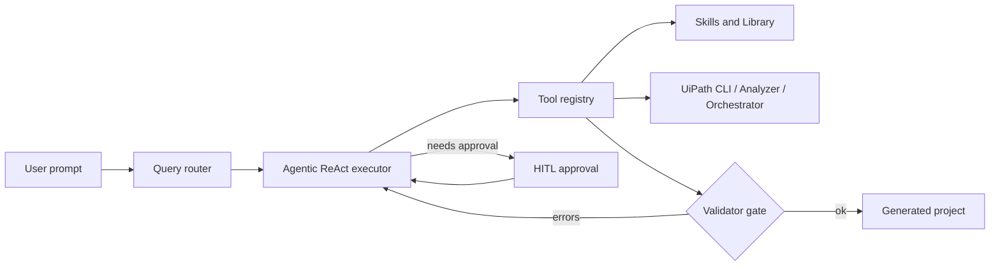
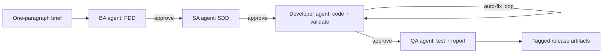

# UiPath Claude Code

**Claude Code for UiPath — an agentic CLI and Cursor integration that builds, validates, and runs RPA workflows.**


RPA developers spend hours scaffolding projects, hand-writing XAML, and chasing validator errors that all look alike. UiPath Claude Code runs that loop for you: it scaffolds the project, writes the XAML, runs the UiPath validator, fixes what it breaks, and only stops to ask when a human decision actually matters. It works from the CLI, inside Cursor, and as a full BA → SA → Dev → QA pipeline that turns a one-paragraph brief into a validated UiPath project.




---

## Quickstart

```bash
pip install -e ".[dev]"
aws sts get-caller-identity   # confirm Bedrock creds
uipath-claude chat
```

Longer setup (UiPath CLI, Studio 26.2+, submodules, Orchestrator auth) lives in [docs/INSTALL.md](docs/INSTALL.md).

---

## What it does

- **Generate validated UiPath projects from a description.** Describe the automation in plain English; the agent scaffolds the project, writes XAML, runs the UiPath Workflow Analyzer and `uip rpa` validator, and auto-fixes validator errors until the workflow passes both static and runtime checks.
- **Bootstrap end-to-end with the BA → SA → Dev → QA pipeline.** `uipath-claude start-project "InvoiceBot"` turns a one-paragraph brief into a PDD, SDD, working code, and a QA report. Plan mode gives you a read-only proposal to approve before any files are written.
- **Works where you work.** Use the CLI (`uipath-claude chat`), drive it from Cursor (the skills register automatically after running `scripts/setup-cursor.ps1`), or call slash commands like `/skills`, `/bootstrap`, `/analyze`, `/recall`.
- **Learns as you use it.** A layered skills system (user → project → team extensions → official UiPath submodule) plus a library learning loop capture gotchas and edge cases as you hit them, so the agent gets better at your codebase over time.
- **Safe by default.** Tool profiles (`safe`, `uipath-dev`, `all`), per-operation approval gates, and session hooks keep destructive actions behind human review. Nothing touches Orchestrator unless you say so.

---

## A real example

A session driving the auto-fix loop against a real validator error. The full transcript lives in [examples/03-auto-fix-validator/](examples/03-auto-fix-validator/).

```text
> Build me an InvoiceProcessor workflow that reads Sample.xlsx and logs each invoice id.

[Step 1/25] ensure_project_structure(name="InvoiceProcessor")
   -> created InvoiceProcessor/project.json, Main.xaml
[Step 2/25] install_package("UiPath.Excel.Activities")
   -> ok
[Step 3/25] write_file("InvoiceProcessor/Main.xaml", ...)
[Step 4/25] validate_file("InvoiceProcessor/Main.xaml")
   -> ERRORS (2):
      - UiPath.Excel.Activities.ExcelReadRange: 'Range' is required
      - Variable 'dt_Invoices' used before assignment
[Step 5/25] validate_and_fix_loop -> patching...
[Step 6/25] write_file("InvoiceProcessor/Main.xaml", ...)   # revised
[Step 7/25] validate_file("InvoiceProcessor/Main.xaml")
   -> OK (0 errors, 0 warnings)
[Step 8/25] run_workflow("InvoiceProcessor")
   -> OK: processed 14 invoices in 1.2s

Done. Generated at generated/chat/2026-04-18-0a1b/InvoiceProcessor/.
```

What just happened: the model wrote XAML, the UiPath validator rejected it, `validate_and_fix_loop` interpreted the errors, rewrote the file, and only stopped when both the static validator and the runtime `uip rpa run-file` agreed.

---

## Architecture

The chat runtime loads a **skill registry** from several filesystem layers (user, project, team extensions, official UiPath submodule) and exposes them to a ReAct-style executor alongside UiPath tools (CLI, Analyzer, Orchestrator, Ask AI). A validator gate sits inline in the loop: every `write_file` is followed by `validate_file`, and failures feed back into the executor until the workflow passes. Plan mode wraps the executor with a read-only proposal step so you approve the plan before any file is touched.



Deeper technical detail: [docs/ARCHITECTURE.md](docs/ARCHITECTURE.md).

---

## Docs

- [docs/README.md](docs/README.md) — index of every document in this repo
- [docs/INSTALL.md](docs/INSTALL.md) — full installation (UiPath CLI, Studio, submodules, AWS)
- [docs/ARCHITECTURE.md](docs/ARCHITECTURE.md) — runtime, executor, validator gate, pipeline
- [docs/USER_GUIDE.md](docs/USER_GUIDE.md) — day-to-day CLI usage
- [docs/CURSOR_USER_GUIDE.md](docs/CURSOR_USER_GUIDE.md) — using the skills inside Cursor
- [docs/TOOLS.md](docs/TOOLS.md) — tool registry reference
- [docs/SKILL_LAYOUT.md](docs/SKILL_LAYOUT.md) — skill layering and provenance
- [docs/LIBRARY_LEARNING.md](docs/LIBRARY_LEARNING.md) — library learning loop
- [docs/EVALUATION_RESULTS.md](docs/EVALUATION_RESULTS.md) — evaluation framework results
- [CONTRIBUTING.md](CONTRIBUTING.md) — how to add skills, tools, and slash commands
- [CHANGELOG.md](CHANGELOG.md) — release history

---

## License

Internal use. See `pyproject.toml`.
