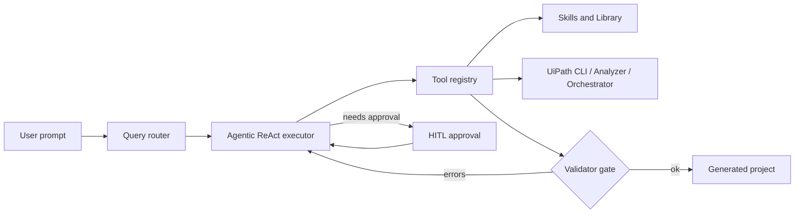
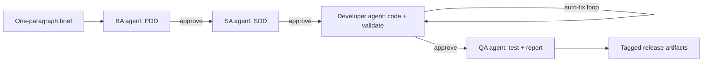
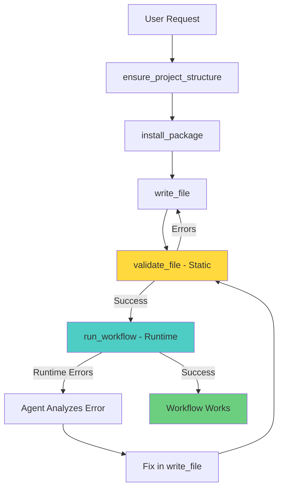

# Architecture

UiPath Claude Code follows the Claude Code architecture pattern, adapted for UiPath automation.

## Runtime loop (ReAct + validator gate)



The executor lives in [`uipath_claude/query/agentic_executor.py`](../uipath_claude/query/agentic_executor.py). The validator gate is implemented as `validate_file` + `validate_and_fix_loop` in [`uipath_claude/tools/skill_execution_tools.py`](../uipath_claude/tools/skill_execution_tools.py): every `write_file` is expected to be followed by a `validate_file`, and failures feed back into the executor until the workflow passes both static and runtime checks.

## Bootstrap pipeline (BA -> SA -> Dev -> QA with HITL)



Each arrow labelled `approve` is a human-in-the-loop gate. Plan mode (`UIPATH_PLAN_MODE=1`, default) additionally wraps any build or ambiguous intent with a read-only planning step whose plan must be approved before any file is written. Approved plans are persisted as `.plan.md` files under `generated/chat/<session-id>/`.

## Directory Structure

```
uipath_claude/
├── query/          # Conversation engine (Claude Code: src/query/)
├── agents/         # Specialized agent modes
├── artifacts/      # Generated artifacts and writers
├── tools/          # Tool implementations
├── skills/         # Skill discovery and management
├── commands/       # Slash command system
├── context/        # Project and environment detection
├── memory/         # Memory persistence
├── hooks/          # Event hooks
├── rendering/      # Output formatting
└── cli/            # CLI interface
```

## Agent Modes

All agents share the same conversation engine, specialized via:

1. **System Prompts** - Role-specific instructions
2. **Tool Availability** - Filtered tool sets
3. **Skill Loading** - Role-specific skills

### Available Agents

- **Conversational** (default): All skills, general assistance
- **BA**: PDD creation, business process design
- **SA**: SDD creation, solution architecture
- **Developer**: Workflow implementation, coding
- **QA**: Code review, testing, validation

## Skill Loading

Skills are loaded from multiple roots; **first source wins** on duplicate skill names. Resolution is implemented in `uipath_claude.skills.sources.build_skill_sources` (see [SKILL_LAYOUT.md](SKILL_LAYOUT.md) for how folders relate on disk).

1. Optional paths from `.uipath-claude/config.yaml` (`skills.sources`)
2. User (`~/.cursor/skills/`)
3. Project (`.uipath-claude/skills/`)
4. Team extensions (`extensions/skills/`)
5. Official UiPath submodule (`skills/skills/`)
6. Template-bundled skills (only when `UIPATH_INCLUDE_TEMPLATE_SKILLS=1`)

## Runtime Controls

Runtime behavior is configured by environment variables:

- `UIPATH_CLAUDE_TOOL_PROFILE=safe|uipath-dev|all`
  - Resolved in `uipath_claude.tools.profiles`.
  - Controls which slash commands are available to the session.
- `UIPATH_CLAUDE_REQUIRE_APPROVAL=true`
  - Enforces the approval gate in `uipath_claude.tools.uipath.approval`
    for guarded UiPath CLI operations.
  - Approval can be granted per run with
    `UIPATH_CLAUDE_CLI_APPROVED=true` or `UIPATH_CLAUDE_APPROVED=true`.

## Session Recall

Session recall is exposed through `/recall <term>` and implemented in
`uipath_claude.commands.recall`, backed by
`uipath_claude.query.session_search`.

## Agentic Execution Flow

When `UIPATH_AGENTIC_MODE=1`, the agent uses a ReAct-style tool-use loop:

```
User Request
    ↓
Route to Skill
    ↓
┌─────────────────────────────────┐
│  AgenticExecutor (max 15 iter)  │
│  ┌───────────────────────────┐  │
│  │ 1. LLM generates response │  │
│  │ 2. Extract tool_calls     │  │
│  │ 3. Execute tools          │  │
│  │ 4. Append ToolMessage     │  │
│  │ 5. Loop until complete    │  │
│  └───────────────────────────┘  │
└─────────────────────────────────┘
    ↓
Generated Project
```

### Skill Execution Tools

Located in `uipath_claude/tools/skill_execution_tools.py`:

| Tool | Purpose |
|------|---------|
| `ensure_project_structure` | Create project.json scaffold |
| `install_package` | Install NuGet packages via `uip` |
| `write_file` | Write files with XAML auto-fix |
| `read_file` | Read project files |
| `validate_file` | **Static validation** - XAML syntax, properties, namespaces |
| `run_workflow` | **Runtime testing** - Execute workflow to catch runtime errors |
| `validate_and_fix_loop` | Iterative validation guidance |
| `find_activity_info` | Look up activity documentation |
| `query_uipath_docs` | Query UiPath Ask AI |
| `run_uip_command` | Execute arbitrary `uip` commands |
| `debug_workflow` | Debug workflow execution |

### XAML Auto-Fix

The `write_file` tool automatically corrects common LLM XAML issues:

- Unescapes `&lt;` / `&gt;` to `<` / `>`
- Removes `<![CDATA[` wrappers
- Strips extraneous `<xaml>` tags
- Validates XML structure before writing

### AgenticExecutor Class

Located in `uipath_claude/query/agentic_executor.py`:

```python
class AgenticExecutor:
    MAX_ITERATIONS = int(os.environ.get("UIPATH_MAX_ITERATIONS", "25"))
    
    def run(self, messages, system_prompt) -> AgenticResult:
        progress = AgenticProgressReporter() if debug else None
        
        for i in range(MAX_ITERATIONS):
            if progress:
                progress.iteration_start(i, MAX_ITERATIONS)
            
            response = model.invoke(messages)
            if no tool_calls:
                return final_response
            
            for tool_call in response.tool_calls:
                if progress:
                    progress.tool_call(tool_call.name, tool_call.args)
                
                result = execute_tool(tool_call)
                
                if progress:
                    progress.tool_result(tool_call.name, success, result)
                
                messages.append(ToolMessage(result))
```

**Key Features:**
- Configurable iteration limit via `UIPATH_MAX_ITERATIONS` (default: 25)
- Human-readable debug output with `AgenticProgressReporter`
- Progress bars and status indicators
- Multiple debug modes (formatted, verbose, raw)

## Runtime Testing Architecture

### Two-Stage Validation Flow

The agent performs comprehensive validation to ensure workflows not only pass syntax checks but actually work:



### Static Validation (`validate_file`)

Checks XAML syntax and structure:
- XML well-formedness
- Required activity properties
- Variable declarations and types
- Namespace imports
- Package dependencies

### Runtime Testing (`run_workflow`)

Executes the workflow to catch runtime errors:
- Wrong activity output properties (e.g., `.Result` vs `.Messages`)
- Null reference exceptions
- Type mismatches
- Missing variable assignments
- Logic errors

### Error Pattern Recognition

The `run_workflow` tool detects common patterns and suggests fixes:

| Error Pattern | Detection | Suggested Fix |
|--------------|-----------|---------------|
| Property doesn't exist | "property '...' does not exist" | Call `find_activity_info` to check correct properties |
| Null reference | "Object reference not set" | Check variable assignments in previous activities |
| Type mismatch | "cannot convert" | Verify variable types match activity inputs |
| Validation error | Check `Data.Errors` array | Fix XAML structure or properties |

### Tool Design (Following Anthropic's Principles)

The `run_workflow` tool follows Anthropic's best practices for agent tools:

1. **Clear Purpose**: Distinct from static validation and debugging
2. **Meaningful Context**: Returns actionable errors, not raw logs
3. **Token Efficiency**: Truncates output, shows only errors by default
4. **Clear Description**: Tells agent when/how to use it
5. **Natural Integration**: Fits into existing ReAct loop

### JSON Response Parsing

The CLI returns structured JSON:

```json
{
  "IsSuccessful": false,
  "ErrorMessage": "Execution faulted",
  "Data": {
    "Errors": [],
    "LogEntries": [
      {
        "Severity": "Error",
        "Message": "The property 'Result' does not exist",
        "ActivityName": "GetOutlookMailMessages"
      }
    ],
    "Output": {"State": "Faulted"}
  }
}
```

The tool extracts:
- Success status
- Error messages
- Activity context
- Severity levels
- Execution state

### Token Efficiency Strategy

Default output (verbose=False):
- Truncate to ~2000 chars
- Show only Error/Critical logs
- Group duplicate errors
- Limit to first 5 unique errors

Verbose output (verbose=True):
- Full logs included
- All severity levels
- Complete error details

## Bootstrap Flow

```
User Request
    ↓
BA Agent (PDD)
    ↓
SA Agent (SDD)
    ↓
Developer Agent (Code)
    ↓
QA Agent (Validation)
    ↓
Complete
```

## Evaluation Framework

The agent includes a LangSmith-style evaluation system for measuring quality:

```
uipath_claude/evaluation/
├── __init__.py
├── datasets.py      # Dataset management
├── evaluators.py    # Evaluation functions
└── runner.py        # Evaluation runner
```

### Evaluation Types

1. **Agent benchmark evaluator (canonical)**: Single entry point combining
   - **Outcome** (same checks as final-response): files, packages, validation
   - **Trajectory**: expected tool sequence (subsequence match)
   - Composite score and per-dimension breakdown in the result dict

2. **Final Response / Trajectory evaluators**: Still available for custom pipelines or unit tests.

3. **Single Step Evaluator**: Checks individual tool calls (tool name, args, result).

### Running Evaluations

```python
from uipath_claude.evaluation import (
    EvaluationDataset,
    EvaluationRunner,
    agent_benchmark_evaluator,
)

dataset = EvaluationDataset.from_workflow_benchmarks()
runner = EvaluationRunner(
    target_function,
    evaluators={"agent_benchmark": agent_benchmark_evaluator},
)
run = await runner.run(dataset)
```

See [EVALUATION_RESULTS.md](EVALUATION_RESULTS.md) for latest results.

## Comparison with Claude Code

| Claude Code | UiPath Claude Code |
|-------------|-------------------|
| `src/query/` | `uipath_claude/query/` |
| `src/tools/` | `uipath_claude/tools/` |
| `src/skills/` | `uipath_claude/skills/` |
| `src/commands/` | `uipath_claude/commands/` |
| `src/components/` | `uipath_claude/rendering/` |
| `src/utils/hooks.ts` | `uipath_claude/hooks/` |
| `memory.md` | `uipath_claude/memory/` |
| TypeScript/React | Python/LangGraph |

For detailed comparison, see [docs/internal/CLAUDE_CODE_COMPARISON.md](internal/CLAUDE_CODE_COMPARISON.md) (internal only).
