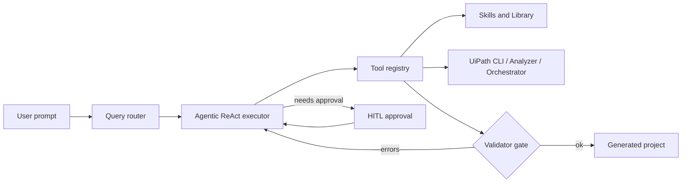
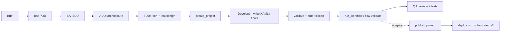
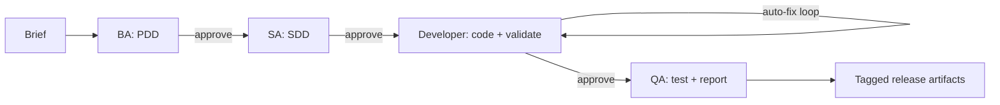
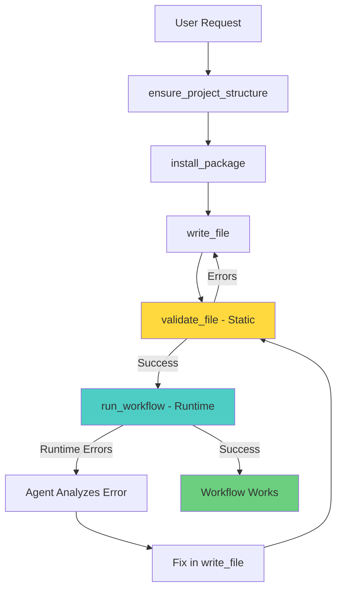

# Architecture

UiPath Claude Code follows the Claude Code architecture pattern, adapted for UiPath automation.

## Runtime loop (ReAct + validator gate)



The executor lives in [`uipath_claude/query/agentic_executor.py`](../uipath_claude/query/agentic_executor.py). The validator gate is implemented as `validate_file` + `validate_and_fix_loop` in [`uipath_claude/tools/skill_execution_tools.py`](../uipath_claude/tools/skill_execution_tools.py): every `write_file` is expected to be followed by a `validate_file`, and failures feed back into the executor until the workflow passes both static and runtime checks.

## Pipelines

There are two end-to-end pipelines, both driven by slash commands.

### `/pdd` — full lifecycle (six agents + scaffold + publish + deploy)

This is the canonical "one-paragraph brief to running process" flow. Implementation lives in [`uipath_claude/query/pdd_lifecycle.py`](../uipath_claude/query/pdd_lifecycle.py) (`run_pdd_lifecycle`). The ten ordered stages are defined as `STAGES = ("pdd","sdd","add","tdd","scaffold","implement","validate","run","publish","deploy")`.



Key semantics:

- **Short-circuit on failure.** Every stage returns `{"status": "ok"|"failed", "failed_at": <stage>, "error": <message>, ...}` (`_ok` / `_fail` in [`pdd_lifecycle.py`](../uipath_claude/query/pdd_lifecycle.py)). The first failed stage stops the pipeline.
- **Sub-agent invocation** is a single Bedrock turn per stage via [`uipath_claude/query/agent_invoke.py`](../uipath_claude/query/agent_invoke.py) `invoke_agent_llm(engine, system_prompt, user_message)` with `tools=[]`. Each agent's `skills` attribute is currently informational metadata — sub-agents in this lifecycle do **not** auto-load tools beyond their system prompt. Tool-using execution happens in the dedicated `scaffold` / `implement` / `validate` stages, which call `create_project`, `write_file`, `build_and_verify_workflow`, `publish_project`, and `deploy_to_orchestrator_v2` directly.
- **Deploy branch.** When `deploy=True`, the QA stage is skipped in favour of `publish` + `deploy` (which run on a real Orchestrator tenant). When `deploy=False`, QA runs on the implementation plan text.
- **Process vs Maestro.** `project_type="process"` runs `uip rpa` scaffold + `uip solution pack/publish` + `uip or processes create`. `project_type="maestro"` runs `uip flow init/validate/pack` + `uip solution publish` + `uip flow process create`.
- **Test seams.** `publish_fn` and `deploy_fn` parameters default to `deploy_tool.publish_project` / `deploy_tool.deploy_to_orchestrator_v2` and are overridden by the integration tests.
- **Output layout.** Artefacts are written under `output_root/docs/<stage>/<stamp>.md` (PDD/SDD/ADD/TDD/QA via `BootstrapArtifactWriter`) and the scaffolded project under `output_root/generated/automation/<stamp>/`.

User-facing reference: [PDD_LIFECYCLE.md](PDD_LIFECYCLE.md). Slash command: [`uipath_claude/commands/pdd.py`](../uipath_claude/commands/pdd.py).

### `/bootstrap` — legacy four-stage flow (BA -> SA -> Dev -> QA with HITL)

Original four-agent flow, useful for quick iteration without the publish/deploy steps.



Each arrow labelled `approve` is a human-in-the-loop gate. Plan mode (`UIPATH_PLAN_MODE=1`, default) additionally wraps any build or ambiguous intent with a read-only planning step whose plan must be approved before any file is written. Approved plans are persisted as `.plan.md` files under `generated/chat/<session-id>/`. Implementation: [`uipath_claude/query/bootstrap.py`](../uipath_claude/query/bootstrap.py); MCP entry: `uipath_agent_bootstrap`.

## Question-asking contract

Ambiguous build requests flow through three layers, each responsible for a
different bucket of decisions. No layer should ask the user a question the
previous layer already resolved.

| Bucket | Resolution source | Owner |
|---|---|---|
| Safe default (expression language, project-name casing, cross-platform target on macOS, `Test coverage: standard` when unstated) | Apply default silently; record choice in plan `## Resolutions` | `uipath-planner` |
| Library / tool answerable ("is REFramework right for a queue processor?", "what retry pattern for flaky HTTP?") | `uipath_library_search` / `lookup_uipath_knowledge`, cite source | `uipath-planner` (during explore-first) or BA (during drafting) |
| Residue (attended/unattended, concrete source/destination systems, Orchestrator folder, deploy-or-not, destructive actions) | **One batched `AskUserQuestion` card per layer** | `uipath-planner` (Step 1 + 1.5), Step 4 for UI targeting; then `uipath_design_propose` surfaces the structured `resolutions` for final human sign-off |

Hard rules:

- Never ask questions one-at-a-time within a layer. Each of planner Step 1,
  Step 1.5, and Step 4 makes at most one `AskUserQuestion` call.
- Total question budget is five across the whole planner run (anti-pattern
  3 in the overlay [`extensions/skills/uipath-planner/SKILL.md`](../extensions/skills/uipath-planner/SKILL.md)).
- BA reads the planner's plan file first; it re-asks nothing the plan
  resolved. Contract lives in [`uipath_claude/query/ba_agent.py`](../uipath_claude/query/ba_agent.py)
  `BA_SYSTEM_PROMPT` under `=== CONTEXT HAND-OFF ===`.
- `uipath_design_propose` carries a structured `resolutions` object that
  the approver sees on the approval card. The schema lives in
  [`uipath_claude/tools/design_store.py`](../uipath_claude/tools/design_store.py)
  `RESOLUTION_KEYS`. Empty `resolutions` produces a deprecation warning but
  is still accepted for backwards compatibility.
- `open_questions_residue` in `resolutions` is the escape hatch: items the
  planner consciously defaulted that the user can still override at design
  approval time.

End-to-end grading: Scenario 13 in [SMOKE_TESTS.md](SMOKE_TESTS.md).

## Directory Structure

```
uipath_claude/
├── query/          # Conversation engine (Claude Code: src/query/)
├── agents/         # Specialized agent modes
├── artifacts/      # Generated artifacts and writers
├── tools/          # Tool implementations
├── skills/         # Skill discovery and management
├── commands/       # Slash command system
├── context/        # Project and environment detection
├── memory/         # Memory persistence
├── hooks/          # Event hooks
├── rendering/      # Output formatting
└── cli/            # CLI interface
```

## Agent Modes

All agents share the same conversation engine, specialized via:

1. **System Prompts** - Role-specific instructions
2. **Tool Availability** - Filtered tool sets
3. **Skill Loading** - Role-specific skills

### Available Agents

- **Conversational** (default): All skills, general assistance
- **BA** ([`agents/ba.py`](../uipath_claude/agents/ba.py)): PDD creation, business process design
- **SA** ([`agents/sa.py`](../uipath_claude/agents/sa.py)): SDD creation, solution architecture
- **ADD** ([`agents/add.py`](../uipath_claude/agents/add.py)): Architecture Design Document — components, integrations, runtime topology, NFRs
- **TDD** ([`agents/tdd.py`](../uipath_claude/agents/tdd.py)): Technical Design + Test Design — internal contracts, schemas, and the test plan QA will execute
- **Developer** ([`agents/developer.py`](../uipath_claude/agents/developer.py)): Workflow implementation, coding
- **QA** ([`agents/qa.py`](../uipath_claude/agents/qa.py)): Code review, testing, validation

ADD and TDD are only invoked by `/pdd` (`run_pdd_lifecycle`); `/bootstrap` skips them.

## Skill Loading

Skills are loaded from multiple roots; **first source wins** on duplicate skill names. Resolution is implemented in `uipath_claude.skills.sources.build_skill_sources` (see [SKILL_LAYOUT.md](SKILL_LAYOUT.md) for how folders relate on disk).

1. Optional paths from `.uipath-claude/config.yaml` (`skills.sources`)
2. User (`~/.cursor/skills/`)
3. Project (`.uipath-claude/skills/`)
4. Team extensions (`extensions/skills/`)
5. Official UiPath submodule (`skills/skills/`)
6. Template-bundled skills (only when `UIPATH_INCLUDE_TEMPLATE_SKILLS=1`)

## Runtime Controls

Runtime behavior is configured by environment variables:

- `UIPATH_CLAUDE_TOOL_PROFILE=safe|uipath-dev|all`
  - Resolved in `uipath_claude.tools.profiles`.
  - Controls which slash commands are available to the session (`safe` / `uipath-dev`: SDLC allow-list; see [SLASH_COMMANDS.md](SLASH_COMMANDS.md)).
- `UIPATH_CLAUDE_REQUIRE_APPROVAL=true`
  - Enforces the approval gate in `uipath_claude.tools.uipath.approval`
    for guarded UiPath CLI operations.
  - Approval can be granted per run with
    `UIPATH_CLAUDE_CLI_APPROVED=true` or `UIPATH_CLAUDE_APPROVED=true`.

## Session Recall

Session recall is exposed through `/recall <term>` and implemented in
`uipath_claude.commands.recall`, backed by
`uipath_claude.query.session_search`.

## Agentic Execution Flow

When `UIPATH_AGENTIC_MODE=1`, the agent uses a ReAct-style tool-use loop:

```
User Request
    ↓
Route to Skill
    ↓
┌─────────────────────────────────┐
│  AgenticExecutor (max 15 iter)  │
│  ┌───────────────────────────┐  │
│  │ 1. LLM generates response │  │
│  │ 2. Extract tool_calls     │  │
│  │ 3. Execute tools          │  │
│  │ 4. Append ToolMessage     │  │
│  │ 5. Loop until complete    │  │
│  └───────────────────────────┘  │
└─────────────────────────────────┘
    ↓
Generated Project
```

### Skill Execution Tools

Located in `uipath_claude/tools/skill_execution_tools.py`:

| Tool | Purpose |
|------|---------|
| `ensure_project_structure` | Create project.json scaffold |
| `install_package` | Install NuGet packages via `uip` |
| `write_file` | Write files with XAML auto-fix |
| `read_file` | Read project files |
| `validate_file` | **Static validation** - XAML syntax, properties, namespaces |
| `run_workflow` | **Runtime testing** - Execute workflow to catch runtime errors |
| `validate_and_fix_loop` | Iterative validation guidance |
| `find_activity_info` | Look up activity documentation |
| `query_uipath_docs` | Query UiPath Ask AI |
| `run_uip_command` | Execute arbitrary `uip` commands |
| `debug_workflow` | Debug workflow execution |

### XAML Auto-Fix

The `write_file` tool automatically corrects common LLM XAML issues:

- Unescapes `&lt;` / `&gt;` to `<` / `>`
- Removes `<![CDATA[` wrappers
- Strips extraneous `<xaml>` tags
- Validates XML structure before writing

### AgenticExecutor Class

Located in `uipath_claude/query/agentic_executor.py`:

```python
class AgenticExecutor:
    MAX_ITERATIONS = int(os.environ.get("UIPATH_MAX_ITERATIONS", "25"))
    
    def run(self, messages, system_prompt) -> AgenticResult:
        progress = AgenticProgressReporter() if debug else None
        
        for i in range(MAX_ITERATIONS):
            if progress:
                progress.iteration_start(i, MAX_ITERATIONS)
            
            response = model.invoke(messages)
            if no tool_calls:
                return final_response
            
            for tool_call in response.tool_calls:
                if progress:
                    progress.tool_call(tool_call.name, tool_call.args)
                
                result = execute_tool(tool_call)
                
                if progress:
                    progress.tool_result(tool_call.name, success, result)
                
                messages.append(ToolMessage(result))
```

**Key Features:**
- Configurable iteration limit via `UIPATH_MAX_ITERATIONS` (default: 25)
- Human-readable debug output with `AgenticProgressReporter`
- Progress bars and status indicators
- Multiple debug modes (formatted, verbose, raw)

## Runtime Testing Architecture

### Two-Stage Validation Flow

The agent performs comprehensive validation to ensure workflows not only pass syntax checks but actually work:



### Static Validation (`validate_file`)

Checks XAML syntax and structure:
- XML well-formedness
- Required activity properties
- Variable declarations and types
- Namespace imports
- Package dependencies

### Runtime Testing (`run_workflow`)

Executes the workflow to catch runtime errors:
- Wrong activity output properties (e.g., `.Result` vs `.Messages`)
- Null reference exceptions
- Type mismatches
- Missing variable assignments
- Logic errors

### Error Pattern Recognition

The `run_workflow` tool detects common patterns and suggests fixes:

| Error Pattern | Detection | Suggested Fix |
|--------------|-----------|---------------|
| Property doesn't exist | "property '...' does not exist" | Call `find_activity_info` to check correct properties |
| Null reference | "Object reference not set" | Check variable assignments in previous activities |
| Type mismatch | "cannot convert" | Verify variable types match activity inputs |
| Validation error | Check `Data.Errors` array | Fix XAML structure or properties |

### Tool Design (Following Anthropic's Principles)

The `run_workflow` tool follows Anthropic's best practices for agent tools:

1. **Clear Purpose**: Distinct from static validation and debugging
2. **Meaningful Context**: Returns actionable errors, not raw logs
3. **Token Efficiency**: Truncates output, shows only errors by default
4. **Clear Description**: Tells agent when/how to use it
5. **Natural Integration**: Fits into existing ReAct loop

### JSON Response Parsing

The CLI returns structured JSON:

```json
{
  "IsSuccessful": false,
  "ErrorMessage": "Execution faulted",
  "Data": {
    "Errors": [],
    "LogEntries": [
      {
        "Severity": "Error",
        "Message": "The property 'Result' does not exist",
        "ActivityName": "GetOutlookMailMessages"
      }
    ],
    "Output": {"State": "Faulted"}
  }
}
```

The tool extracts:
- Success status
- Error messages
- Activity context
- Severity levels
- Execution state

### Token Efficiency Strategy

Default output (verbose=False):
- Truncate to ~2000 chars
- Show only Error/Critical logs
- Group duplicate errors
- Limit to first 5 unique errors

Verbose output (verbose=True):
- Full logs included
- All severity levels
- Complete error details

## Bootstrap Flow

See the two pipelines documented above (`/pdd` and `/bootstrap`). The legacy text-only diagram has been removed; see [PDD_LIFECYCLE.md](PDD_LIFECYCLE.md) for the canonical end-to-end flow.

## Evaluation Framework

The agent includes a LangSmith-style evaluation system for measuring quality:

```
uipath_claude/evaluation/
├── __init__.py
├── datasets.py      # Dataset management
├── evaluators.py    # Evaluation functions
└── runner.py        # Evaluation runner
```

### Evaluation Types

1. **Agent benchmark evaluator (canonical)**: Single entry point combining
   - **Outcome** (same checks as final-response): files, packages, validation
   - **Trajectory**: expected tool sequence (subsequence match)
   - Composite score and per-dimension breakdown in the result dict

2. **Final Response / Trajectory evaluators**: Still available for custom pipelines or unit tests.

3. **Single Step Evaluator**: Checks individual tool calls (tool name, args, result).

### Running Evaluations

```python
from uipath_claude.evaluation import (
    EvaluationDataset,
    EvaluationRunner,
    agent_benchmark_evaluator,
)

dataset = EvaluationDataset.from_workflow_benchmarks()
runner = EvaluationRunner(
    target_function,
    evaluators={"agent_benchmark": agent_benchmark_evaluator},
)
run = await runner.run(dataset)
```

Run results are written under `eval_results/` when the runner is invoked.

## Comparison with Claude Code

| Claude Code | UiPath Claude Code |
|-------------|-------------------|
| `src/query/` | `uipath_claude/query/` |
| `src/tools/` | `uipath_claude/tools/` |
| `src/skills/` | `uipath_claude/skills/` |
| `src/commands/` | `uipath_claude/commands/` |
| `src/components/` | `uipath_claude/rendering/` |
| `src/utils/hooks.ts` | `uipath_claude/hooks/` |
| `memory.md` | `uipath_claude/memory/` |
| TypeScript/React | Python/LangGraph |

For detailed comparison, see [docs/internal/CLAUDE_CODE_COMPARISON.md](internal/CLAUDE_CODE_COMPARISON.md) (internal only).
