# End-to-End Automation Demo: Invoice Processor

## Overview

The original `projects/InvoiceProcessor` demo was removed because it was a placeholder:
old dependencies, hand-authored project metadata, mock extraction, no real Studio validation,
and no executable test gate.

The replacement is a regression fixture that proves the UiPlan runtime reliability contract
with a scaffolded UiPath project and a real local run.

## Current Fixture

- Location: `framework/tests/fixtures/uiplan_runtime_reliability/InvoiceProcessor`
- UiPlan artifacts: `framework/tests/fixtures/uiplan_runtime_reliability/{spec,plan,tasks}.md`
- Project-level UiPlan copy: `InvoiceProcessor/.cursor/plans/invoice-processor/`
- Test gate: `framework/tests/uiplan/test_real_studio_fixture.py`

## What It Proves

- Project was created through `uip rpa create-project` using `BlankTemplate`.
- `project.json` is modern C# / Windows and uses current scaffolded dependencies.
- `Main.xaml` uses pre-built UiPath activities, not `InvokeCode`.
- Activity choices have evidence under `framework/tests/fixtures/uiplan_runtime_reliability/evidence/`.
- Studio designer validation reports no diagnostics.
- Studio build succeeds after closing the project lock.
- Local execution writes a deterministic CSV report and smoke JSON file.
- Analyzer reaches project validation; the only error is tenant governance rule `ST-USG-034`.
- Tenant smoke is represented by a structured blocker because no non-Production tenant credentials
  were present in the session.

## Activity Flow

```mermaid
flowchart LR
  Start[Log Message] --> Dirs[Create Directory]
  Dirs --> List[Assign invoice file list]
  List --> Loop[For Each invoice file]
  Loop --> Read[Read Text File]
  Read --> Extract[Assign extraction expressions]
  Extract --> Validate[Assign validation expressions]
  Validate --> Append[Assign CSV row]
  Append --> WriteReport[Write Text File report]
  WriteReport --> WriteSmoke[Write Text File smoke result]
  WriteSmoke --> Done[Log Message]
```



## Verification

Run the fixture test:

```powershell
uv run pytest framework/tests/uiplan/test_real_studio_fixture.py -q
```

Direct validation commands used during rebuild:

```powershell
uip rpa get-errors --project-dir "framework/tests/fixtures/uiplan_runtime_reliability/InvoiceProcessor" --file-path "Main.xaml" --min-severity error --output json
uip rpa close-project --project-dir "framework/tests/fixtures/uiplan_runtime_reliability/InvoiceProcessor" --output json
uip rpa build --project-path "framework/tests/fixtures/uiplan_runtime_reliability/InvoiceProcessor" --output json
uipcli package analyze "framework/tests/fixtures/uiplan_runtime_reliability/InvoiceProcessor" --resultPath "framework/tests/fixtures/uiplan_runtime_reliability/out/analyze.json"
uip rpa run-file --project-dir "framework/tests/fixtures/uiplan_runtime_reliability/InvoiceProcessor" --file-path "Main.xaml" --command StartExecution --log-level Information --output json
```

`ST-USG-034` is a tenant governance requirement for an Automation Hub URL. It is recorded as
evidence, not hidden. For local fixture validation, `test_real_studio_fixture.py` allows only
that known governance blocker.
