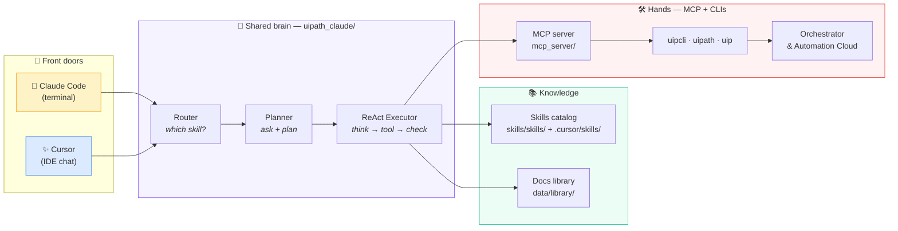
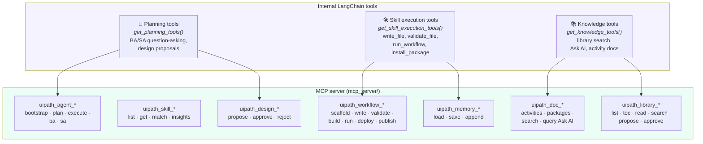
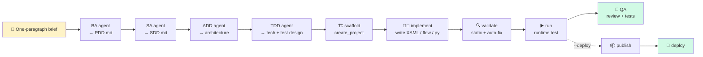
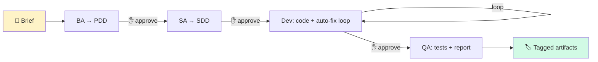
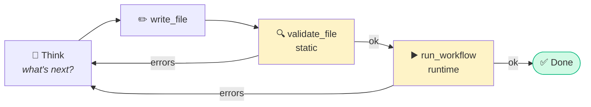
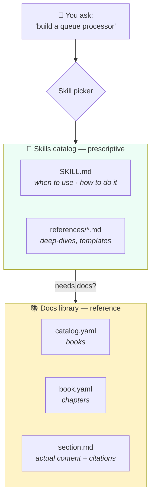

# How this project works — the illustrated tour

A friendly, visual walkthrough of the **UiPath Builder Agent**: what's inside,
how Claude Code and Cursor each use it, which tools exist, and how you
actually drive it day-to-day.

> TL;DR: one Python brain (`uipath_claude/`), one skills catalog
> (`skills/skills/` + `.cursor/skills/`), one UiPath documentation library
> (`data/library/`), exposed two ways — as **slash commands** in Claude Code
> and as **MCP tools + skill picker** in Cursor.

---

## 1. The big picture



Both front doors share the same brain, the same skills, the same library,
and the same hands. Only the entry point differs.

---

## 2. The tool surface

The agent has three internal tool packs plus an MCP server that re-exports
them with typed schemas for Cursor.



**Everyday tools you'll see in action:**

| Tool | What it does | When it fires |
|---|---|---|
| `write_file` | Writes a file; auto-fixes common XAML mistakes | Any code-gen step |
| `validate_file` | Static check: XML, properties, namespaces | After every write |
| `run_workflow` | Runtime test via `uipcli run` | After validation passes |
| `install_package` | Adds NuGet / Python deps via `uip` / `uv` | When an activity is missing |
| `lookup_uipath_knowledge` | Library → Ask AI → web (cites source) | Any "how do I..." question |
| `find_activity_info` | Looks up an activity's real properties | Before using a new activity |
| `run_uip_command` | Escape hatch for arbitrary `uip ...` | Custom CLI ops |
| `publish_project` / `deploy_to_orchestrator_v2` | Push to Orchestrator | Only with explicit approval |

Full catalog with parameters: [`docs/TOOLS.md`](TOOLS.md) and
[`docs/CURSOR_USER_GUIDE.md`](CURSOR_USER_GUIDE.md).

### Model routing

Every tool call is wrapped by a tiered model router
(`uipath_claude/llm/router.py`):

- **HEAVY** (default `claude-3-5-sonnet`): BA, SA, Developer, QA, Planner,
  ReAct executor.
- **LIGHT** (default `claude-3-5-haiku`): intent classifier, distiller,
  rename summaries — fast, cheap, judgement-light tasks.

Override per tier with `UIPATH_CLAUDE_MODEL_HEAVY` / `_LIGHT`.

---

## 3. The flows

There are two end-to-end flows plus the inner validation loop everything
runs on top of.

### 3a. `/pdd` — brief → deployed process (the full lifecycle)



Ten ordered stages. Every stage returns `{status: ok|failed}`; first failure
short-circuits. Documents land in `output_root/docs/<stage>/`; the generated
project in `output_root/generated/automation/<stamp>/`.

Code: [`uipath_claude/query/pdd_lifecycle.py`](../uipath_claude/query/pdd_lifecycle.py).

### 3b. `/bootstrap` — lighter four-stage flow with approvals



Good for iterating without publish/deploy. Each `approve` arrow is a real
human gate. Plan mode (`UIPATH_PLAN_MODE=1`) adds a read-only plan step
before any file is written.

Code: [`uipath_claude/query/bootstrap.py`](../uipath_claude/query/bootstrap.py).

### 3c. The inner loop — ReAct + validator gate



Up to 25 iterations (`UIPATH_MAX_ITERATIONS`). Both `/pdd` and `/bootstrap`
run on this loop during their implement stage, so every generated file goes
through static + runtime checks before being claimed as working.

---

## 4. The UiPath skills library

The project ships **two** knowledge assets and they do different jobs.



### Skills catalog (prescriptive — *what to do*)

Layered, first-source-wins:

1. `.uipath-claude/config.yaml → skills.sources` (optional overrides)
2. `~/.cursor/skills/` (user-level)
3. `.uipath-claude/skills/` (project-level)
4. `extensions/skills/` (team extensions — preferred for custom skills)
5. `skills/skills/` (official UiPath submodule — pinned, don't hand-edit)
6. Template-bundled skills (only if `UIPATH_INCLUDE_TEMPLATE_SKILLS=1`)

**The 14 skills currently available:**

| Skill | When to use |
|---|---|
| `uipath-planner` | Ambiguous/multi-skill requests — elicits prefs, plans execution |
| `uipath-rpa` | C# / XAML coded workflows (modern, .NET 8) |
| `uipath-rpa-legacy` | Legacy .NET Framework 4.6.1 XAML projects |
| `uipath-agents` | Python agents (LangGraph, LlamaIndex, OpenAI) + low-code agent.json |
| `uipath-maestro-flow` | `.flow` files — business process orchestration |
| `uipath-case-management` | Case Management (`caseplan.json`) |
| `uipath-coded-apps` | Coded Web / Action Apps (TypeScript SDK) |
| `uipath-data-fabric` | Entity/record CRUD via `uip df` |
| `uipath-human-in-the-loop` | Approval gates in Flows / Maestro / agents |
| `uipath-platform` | Orchestrator ops: folders, assets, queues, processes |
| `uipath-test` | Test Manager — cases, sets, reports |
| `uipath-servo` | Live desktop/browser automation for verification |
| `uipath-diagnostics` | Debugging failed jobs, selectors, permissions |
| `uipath-feedback` | `uip feedback send` — bug reports to UiPath |

Each `SKILL.md` has a trigger blurb at the top — that's how the skill
picker decides when to load it.

### Docs library (reference — *what the platform says*)

Located in `data/library/` and **only ever accessed via MCP tools**:

```
data/library/
├── catalog.yaml                         ← uipath_library_list
└── books/
    └── uipath-docs/
        ├── book.yaml                    ← uipath_library_toc
        └── orchestrator/
            └── queues.md                ← uipath_library_read_section
```

Never `Read`/`Grep` these files directly — the MCP tools apply ranking,
citation lines, and overlay precedence that raw reads silently skip (this
is enforced by `.cursor/rules/library-tools.mdc`).

**Three ways to query it:**

- `uipath_library_search "retry scope"` — keyword across all books.
- `uipath_library_lookup "how do I chunk a queue?"` — ranked answer + cite.
- `lookup_uipath_knowledge` — library → Ask AI → web, in that order, with
  `CAPTURED_SOURCE:` output you can turn into a library proposal.

### How they feed each other

- The **skills catalog** tells the agent *how* to build a thing.
- The **docs library** tells the agent *what the platform actually supports*.
- When a skill needs a fact it doesn't have, it calls `lookup_uipath_knowledge`.
- When that pulls in an answer from outside the library, it emits a
  structured blob the `/library-harvest` command can replay into the library
  — so the project gets smarter every time someone uses it.

---

## 5. How to use this project

Pick your door.

### A. In Cursor (the common case)

1. **Open the repo.** Rules (`CLAUDE.md`, `.cursor/rules/*`) auto-attach.
2. **Make sure MCP is enabled.** Check `.cursor/mcp.json` exists and that
   the `uipath-builder-agent` server shows as connected in Cursor Settings.
3. **Just ask in chat.** Skills match automatically by trigger.

```text
👤 "Build me a queue processor that reads invoices from a shared
    folder, extracts total + date, and uploads to Orchestrator."

→ uipath-planner fires first (ambiguous, multi-system)
→ asks up to one batched question card
→ hands off to uipath-rpa (C# XAML) + uipath-platform (queue setup)
→ runs write_file → validate_file → run_workflow loop
→ stops at publish with an approval prompt
```

**Useful chat phrases:**

| Phrase | Triggers |
|---|---|
| "search the UiPath library for X" | `uipath_library_search` |
| "what does the Orchestrator chapter cover?" | `uipath_library_toc` |
| "build a Maestro flow that…" | `uipath-maestro-flow` skill |
| "this job is failing with…" | `uipath-diagnostics` skill |
| "send this as feedback to UiPath" | `uipath-feedback` skill |

### B. In Claude Code (terminal)

Prerequisites: session hook must have run (installs `@uipath/cli`).

```powershell
# one-paragraph brief → running process
/pdd "Invoice intake bot that pulls attachments from a shared mailbox
      and logs line items to a queue"

# lighter: BA → SA → Dev → QA, no publish
/bootstrap "Approval flow for expense reports"

# ask the library
/recall "retry scope"

# refresh skills submodule
/scan-upstream-skills
```

### C. Via the Python CLI / MCP directly

```powershell
# activate venv
.\.venv\Scripts\Activate.ps1

# invoke a tool directly (useful for CI or scripts)
python -m uipath_claude.cli plan "build a queue processor"
python -m uipath_claude.cli execute --plan-file plan.md

# run the MCP server standalone (for other IDE integrations)
python -m mcp_server.server
```

### Typical day-to-day recipes

| You want to… | Do this |
|---|---|
| Understand a new UiPath feature | Chat: "search library for X" → read cited sections |
| Scaffold a new automation | Chat: "build me a … " → let the planner drive |
| Fix a broken job | Chat: paste error → `uipath-diagnostics` kicks in |
| Add a new skill to the project | Drop a `SKILL.md` under `extensions/skills/<name>/` |
| Teach the library a new fact | `lookup_uipath_knowledge` → `propose_library_update` → approve |
| Ship to Orchestrator | Finish in dev → approve at the publish prompt → check folder |

### Safety rails worth knowing

- `UIPATH_CLAUDE_TOOL_PROFILE=safe|uipath-dev|all` gates which slash
  commands are reachable in a session.
- `UIPATH_CLAUDE_REQUIRE_APPROVAL=true` forces a human approval on every
  guarded CLI operation. Grant per-run with `UIPATH_CLAUDE_CLI_APPROVED=true`.
- Nothing publishes or deploys without an explicit approval prompt.
- `skills/` submodule is pinned — the submodule guard refuses to advance
  it without a matching entry in `.uipath/skills-approved.sha`.

---

## 6. Where to look next

| I want to… | Open |
|---|---|
| See exact tool signatures | [`docs/TOOLS.md`](TOOLS.md) |
| Understand the full PDD lifecycle | [`docs/PDD_LIFECYCLE.md`](PDD_LIFECYCLE.md) |
| See all Cursor-side MCP tools with examples | [`docs/CURSOR_USER_GUIDE.md`](CURSOR_USER_GUIDE.md) |
| Architecture deep-dive | [`docs/ARCHITECTURE.md`](ARCHITECTURE.md) |
| How skills resolve on disk | [`docs/SKILL_LAYOUT.md`](SKILL_LAYOUT.md) |
| Write / author a library section | [`docs/LIBRARY_AUTHORING.md`](LIBRARY_AUTHORING.md) |
| CLI cheat sheet (uipcli, uipath, uip) | [`docs/uipath-cli.md`](uipath-cli.md) |
| Hard rules for any agent working here | [`CLAUDE.md`](../CLAUDE.md) |
