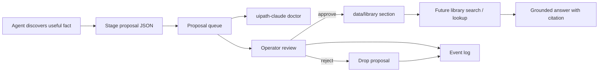
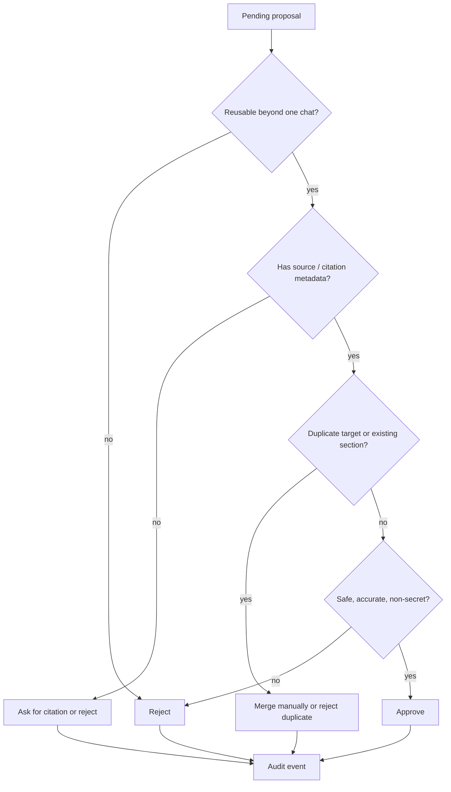

# Library

Single home for the documentation library: **how to author content**
for it, and **how the proposal/approval learning loop** works at
runtime.

The library is the agent's **first** source of truth. It lives under
`data/library/` (override with `UIPATH_CLAUDE_LIBRARY`) and is designed
for agents to browse deterministically (TOC -> chapter -> section), not
for humans to read front-to-back.

---

## Part 1 - Authoring guide

### Structure

```
data/library/
  catalog.yaml                       # list of books
  books/<book-id>/
    MANIFEST.yaml                    # metadata (audience, curator, license, ...)
    book.yaml                        # chapters (id, title, path, order)
    chapters/<NN-chapter-id>/
      chapter.yaml                   # sections (id, title, file, keywords[])
      <section-id>.md                # the actual content
```

### `MANIFEST.yaml` fields

| Field           | Notes                                                                |
| --------------- | -------------------------------------------------------------------- |
| `audience`      | `agent` (first-class) or `human` (reference only)                    |
| `curator`       | Who is responsible for this book                                     |
| `last_reviewed` | ISO-8601 date (`2026-04-18`)                                         |
| `homepage`      | Upstream URL for the source material (if any)                        |
| `license`       | SPDX id (e.g. `MIT`, `CC-BY-4.0`)                                    |

Books without a `MANIFEST.yaml` load fine - the fields default to empty.

### Writing rules (agent-first)

- **One idea per section.** Split long topics into multiple small
  sections.
- **Terse, imperative.** Skip narrative; write like a checklist.
- **Code before prose.** Put the snippet first, a brief explanation
  after.
- **Every section is addressable.** Keep section `id` stable - other
  tools cite it as `book/chapter/section`.
- **Budget: < ~400 words per section.** If you cross that, split.
- **Link internally by id** (e.g. `See orchestrator/releases`) - avoid
  URLs unless the source actually requires external context.

### Adding a new book

1. Create `data/library/books/<book-id>/` with `book.yaml`, optional
   `MANIFEST.yaml`, and one or more chapters.
2. Append `{id, path, title}` to `data/library/catalog.yaml`.
3. Run the unit test suite.

### Harvesting from upstream skills

`uipath-claude /library-harvest` walks the `skills/skills/*/SKILL.md`
files in the `UiPath/skills` submodule and enqueues a proposal per
skill into the `uipath-docs` book's `best-practices` chapter. Nothing
is applied until a human approves each proposal.

---

## Part 2 - Learning loop (propose -> review -> approve)

Sessions must not edit books directly; durable additions go through a
**proposal, review, approve** flow.

### Lifecycle

1. The agent calls the `propose_library_update` tool with
   book/chapter/section metadata and markdown body.
2. Proposals are stored under `~/.uipath-claude/library-proposals/`
   (one JSON file per book). Override the root with
   `UIPATH_CLAUDE_LIBRARY_PROPOSALS`. The evaluation runner sets this
   to a temp directory for `Library` category tests.
3. An operator lists and reviews proposals, then approves or rejects.
4. **Approve** applies the markdown into `data/library/` via
   `LibraryWriter` and removes the proposal from the queue.
   **Reject** drops the proposal only.



### CLI

```text
uipath-claude library-proposals list
uipath-claude library-proposals show <proposal_id>
uipath-claude library-proposals approve <proposal_id>
uipath-claude library-proposals reject <proposal_id>
```

Approve and reject append JSON lines to the structured event log
(default `~/.uipath-claude/logs/events.log`, override
`UIPATH_EVENT_LOG`) with `event` equal to `library_proposal_approved`
or `library_proposal_rejected`.

### Operator workflow

Use this loop when reviewing captured lessons:

1. Run `uipath-claude doctor` to see pending proposal count, stale
   proposals, duplicate targets, and catalog readability.
2. Run `uipath-claude library-proposals list` to identify pending
   proposals.
3. Inspect each proposal with
   `uipath-claude library-proposals show <proposal_id>`.
4. Approve durable, generally useful lessons with
   `uipath-claude library-proposals approve <proposal_id>`.
5. Reject one-off, duplicate, or low-confidence lessons with
   `uipath-claude library-proposals reject <proposal_id>`.
6. Check the structured event log when you need an audit trail of
   approval/rejection decisions.

Doctor is read-only. It reports library health but never applies,
rejects, or rewrites proposals.

### Retrospective sources (transcripts and postmortems)

Agent transcripts and project postmortems are valid proposal sources
when they surface repeated delivery gaps (for example recurring HITL
routing ambiguity, placeholder completion, or missing runtime evidence
contracts).

When proposing retrospective lessons:

1. Cite the parent conversation/transcript clearly (not only local
   notes).
2. Separate one-off project remediation from reusable builder-agent
   guidance.
3. Convert observations into durable rules ("always/never/required"),
   not raw logs or chat dumps.
4. Include confidence and scope boundaries when evidence is partial.
5. Reject proposals that cannot be verified beyond a single session.

### Review decision map



| Approve when... | Reject when... |
| --- | --- |
| The lesson is durable, cited, and useful for future UiPath work. | It is one-off, speculative, duplicated, secret-bearing, or missing source context. |
| The target book/chapter/section is clear. | The proposed section overlaps an existing approved section without adding value. |
| The content explains the why, not only the command. | The proposal is just raw chat transcript or temporary debugging noise. |

---

## Tool surface

### Agent tool (LangChain)

- `propose_library_update(book_id, chapter_id, section_id, section_title, content, keywords, rationale)`
  - returns JSON with `proposal_id` and `status: pending`.

### MCP tools

When driving the agent from Cursor or any other MCP client, use the
`uipath_library_*` tools (see
[`CURSOR_USER_GUIDE.md`](CURSOR_USER_GUIDE.md#library-tools-uipath_library_)):

| Action | Agent (LangChain) tool | MCP tool |
|--------|------------------------|----------|
| Browse books / TOC / sections | `list_library_books`, `browse_book_toc`, `read_section` | `uipath_library_list`, `uipath_library_toc`, `uipath_library_read_section` |
| Search / question lookup | `search_library` | `uipath_library_search`, `uipath_library_lookup` |
| Stage a section proposal | `propose_library_update` | `uipath_library_propose_section` |
| Stage a chapter proposal | `propose_library_chapter` | `uipath_library_propose_chapter` |
| Review queue | (CLI: `library-proposals list`) | `uipath_library_list_proposals` |
| Apply / drop proposal | (CLI: `library-proposals approve` / `reject`) | `uipath_library_approve_proposal` / `uipath_library_reject_proposal` |

---

## Evaluations

Library behavior is covered by CLI evaluations in
`docs/evaluations/test_cases.json` (`LIB-001` ... `LIB-006`, category
`Library`). Run:

```powershell
python docs/evaluations/run_evaluations.py --category Library
```

See [`evaluations/HOW_TO_RUN_TESTS.md`](evaluations/HOW_TO_RUN_TESTS.md)
for prerequisites (`UIPATH_SKIP_AUTH_CHECK`, `PYTHONIOENCODING`,
project directory).

---

## Related

- [`TOOLS.md`](TOOLS.md) - full tool surface.
- [`../uipath_claude/library/catalog.py`](../uipath_claude/library/catalog.py) - loader.
- [`../uipath_claude/library/writer.py`](../uipath_claude/library/writer.py) - create/update.
