# MCP tools reference (`uipath-builder-agent`)

This file is generated by `ops/scripts/generate_mcp_tools_doc.py`. Regenerate after changing tool definitions in `framework/mcp_server/tools/`.

Server entrypoint: `python -m mcp_server.server` (stdio).

Each tool has an **audience guide** (synthesized from the registered `Tool` metadata), the **author registration text** (verbatim `Tool.description` from code), the JSON **input schema**, and a **behavior flow** Mermaid chart that reflects the real dispatch path (see `framework/mcp_server/tools/*_tools.py` and `call_*_tool`). Diagrams follow a renderer-safe subset of Mermaid syntax to maximize compatibility across GitHub, Cursor, and CLI previews.

## Index (all tool names)

| Tool | Module | Side-effect hint |
|------|--------|------------------|
| `uipath_workflow_read_file` | workflow | read-only |
| `uipath_workflow_write_file` | workflow | destructive (idempotent where noted) |
| `uipath_workflow_list_directory` | workflow | read-only |
| `uipath_workflow_read_project` | workflow | read-only |
| `uipath_workflow_install_package` | workflow | destructive |
| `uipath_workflow_validate` | workflow | read-only |
| `uipath_workflow_validate_loop` | workflow | destructive |
| `uipath_workflow_build_and_verify` | workflow | destructive |
| `uipath_workflow_environment_probe` | workflow | read-only |
| `uipath_workflow_create_project` | workflow | destructive (idempotent where noted) |
| `uipath_workflow_run` | workflow | destructive |
| `uipath_workflow_debug` | workflow | destructive |
| `uipath_workflow_ensure_project` | workflow | read-only |
| `uipath_workflow_run_command` | workflow | destructive |
| `uipath_workflow_deploy` | workflow | destructive |
| `uipath_workflow_publish` | workflow | destructive |
| `uipath_workflow_session_status` | workflow | read-only |
| `uipath_skill_list` | skill | read-only |
| `uipath_skill_get` | skill | read-only |
| `uipath_skill_match` | skill | read-only |
| `uipath_skill_insights_query` | skill | read-only |
| `uipath_skill_insights_add` | skill | staging / non-read-only (not marked destructive) |
| `uipath_skill_manifest` | skill | read-only |
| `uipath_skill_check_updates` | skill | read-only |
| `uipath_skill_update` | skill | destructive |
| `uipath_skill_lessons_list` | skill | read-only |
| `uipath_skill_lessons_approve` | skill | destructive |
| `uipath_agent_bootstrap` | agent | destructive |
| `uipath_agent_plan` | agent | destructive |
| `uipath_agent_execute` | agent | destructive |
| `uipath_agent_classify_intent` | agent | read-only |
| `uipath_agent_ba` | agent | destructive |
| `uipath_agent_sa` | agent | destructive |
| `uipath_doc_list_packages` | doc | read-only |
| `uipath_doc_list_activities` | doc | read-only |
| `uipath_doc_get_activity` | doc | read-only |
| `uipath_doc_get_package_overview` | doc | read-only |
| `uipath_doc_search` | doc | read-only |
| `uipath_doc_find_activity` | doc | read-only |
| `query_uipath_docs` | doc | read-only |
| `uipath_doc_query` | doc | read-only |
| `uipath_doc_read_template` | doc | read-only |
| `uipath_doc_list_docs` | doc | read-only |
| `uipath_doc_read_doc` | doc | read-only |
| `uipath_doc_write_doc` | doc | destructive (idempotent where noted) |
| `uipath_memory_load` | memory | read-only |
| `uipath_memory_save` | memory | destructive (idempotent where noted) |
| `uipath_memory_append` | memory | destructive |
| `uipath_library_list` | library | read-only |
| `uipath_library_toc` | library | read-only |
| `uipath_library_read_section` | library | read-only |
| `uipath_library_search` | library | read-only |
| `uipath_library_lookup` | library | read-only |
| `uipath_library_propose_section` | library | staging / non-read-only (not marked destructive) |
| `uipath_library_propose_chapter` | library | staging / non-read-only (not marked destructive) |
| `uipath_library_list_proposals` | library | read-only |
| `uipath_library_approve_proposal` | library | destructive |
| `uipath_library_reject_proposal` | library | destructive (idempotent where noted) |
| `uipath_design_propose` | design | staging / non-read-only (not marked destructive) |
| `uipath_design_approve` | design | destructive (idempotent where noted) |
| `uipath_design_reject` | design | destructive (idempotent where noted) |
| `uipath_design_list` | design | read-only |
| `uipath_design_status` | design | read-only |
| `uipath_intent_classify` | intent | read-only |
| `uipath_plan_build` | plan | read-only |
| `uipath_plan_save` | plan | destructive (idempotent where noted) |
| `uipath_plan_list` | plan | read-only |
| `uipath_plan_read` | plan | read-only |
| `uipath_plan_status_set` | plan | staging / non-read-only (not marked destructive) |
| `uipath_plan_render_mermaid` | plan | read-only |
| `uipath_plan_new` | plan | staging / non-read-only (not marked destructive) |
| `uipath_plan_brainstorm` | plan | read-only |
| `uipath_plan_refine` | plan | destructive (idempotent where noted) |
| `uipath_plan_diff` | plan | read-only |
| `uipath_plan_accept` | plan | destructive (idempotent where noted) |
| `uipath_plan_reject` | plan | destructive (idempotent where noted) |
| `uipath_plan_publish` | plan | destructive (idempotent where noted) |
| `uipath_plan_ground` | plan | read-only |
| `uipath_plan_spec_new` | plan | destructive (idempotent where noted) |
| `uipath_plan_plan_new` | plan | destructive (idempotent where noted) |
| `uipath_plan_tasks_new` | plan | destructive (idempotent where noted) |
| `uipath_plan_review` | plan | read-only |
| `uipath_plan_uiplan_new` | plan | destructive (idempotent where noted) |
| `uipath_answer` | answer | read-only |
| `uipath_assistant_context` | assistant | read-only |
| `uipath_assistant_route` | assistant | read-only |

## How to add a new MCP tool

1. Implement `Tool(...)` in the appropriate `framework/mcp_server/tools/*.py` and wire `call_*_tool` dispatch.
2. Register the name branch in [`framework/mcp_server/server.py`](../framework/mcp_server/server.py) `call_tool`.
3. Add `ToolAnnotations` (read-only vs destructive vs staging) and extend [`framework/tests/mcp_tests/test_tool_annotations.py`](../framework/tests/mcp_tests/test_tool_annotations.py) so `READ_ONLY` / `DESTRUCTIVE` / `STAGING` covers every tool.
4. Add or adjust the tool-specific Mermaid body in [`ops/scripts/mcp_tools_doc_diagrams.py`](../ops/scripts/mcp_tools_doc_diagrams.py) (`diagram_body_for_tool`) so generated docs match real behavior.
5. Re-run `python ops/scripts/generate_mcp_tools_doc.py`.

## Module: `workflow`

### `uipath_workflow_read_file`

#### Audience guide

**Read file.** Read the UTF-8 contents of any file by absolute or project-relative path. Read-only; no UiPath CLI invoked. Use before editing XAML, project.json, or .cs files so subsequent writes preserve unrelated content.

**Required MCP arguments:**

- **`file_path`** — Absolute or project-relative path to the file.

**Typical return:** Typically a **string** or structured value serialized by the MCP server as text or JSON.

**Side effect (MCP `ToolAnnotations`):** read-only

**Dispatch:** [`framework/mcp_server/tools/workflow_tools.py`](../framework/mcp_server/tools/workflow_tools.py) `call_workflow_tool`

#### Author registration (`Tool.description` verbatim)

> Read the UTF-8 contents of any file by absolute or project-relative path. Read-only; no UiPath CLI invoked. Use before editing XAML, project.json, or .cs files so subsequent writes preserve unrelated content.

#### Input schema (JSON Schema)

```json
{
  "type": "object",
  "properties": {
    "file_path": {
      "type": "string",
      "description": "Absolute or project-relative path to the file."
    }
  },
  "required": [
    "file_path"
  ]
}
```

#### Behavior flow

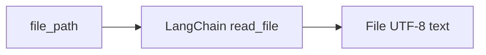

### `uipath_workflow_write_file`

#### Audience guide

**Write file in UiPath project.** Write content to a file in a UiPath project. DESIGN GATE: writes are rejected with [BLOCKED] when the owning project (nearest project.json) does not have an approved design. Submit one via uipath_design_propose and have the user approve via uipath_design_approve first. Ask the user (e.g. via Cursor's AskQuestion) to confirm the design choices before proposing. AFTER any write to a XAML, .cs, or project.json file the MCP session gate marks the project DIRTY: subsequent uipath_workflow_run / _debug / _install_package / _deploy / _run_command calls will be rejected with [BLOCKED] until uipath_workflow_build_and_verify returns success=true and verdict='pass'. Do not report the task complete before then.

**Required MCP arguments:**

- **`file_path`** — Absolute or project-relative path to the file to write.
- **`content`** — Full file body to write (overwrites existing file).

**Typical return:** Typically a **string** or structured value serialized by the MCP server as text or JSON.

**Side effect (MCP `ToolAnnotations`):** destructive (idempotent where noted)

**Dispatch:** [`framework/mcp_server/tools/workflow_tools.py`](../framework/mcp_server/tools/workflow_tools.py) `call_workflow_tool`

#### Author registration (`Tool.description` verbatim)

> Write content to a file in a UiPath project. DESIGN GATE: writes are rejected with [BLOCKED] when the owning project (nearest project.json) does not have an approved design. Submit one via uipath_design_propose and have the user approve via uipath_design_approve first. Ask the user (e.g. via Cursor's AskQuestion) to confirm the design choices before proposing. AFTER any write to a XAML, .cs, or project.json file the MCP session gate marks the project DIRTY: subsequent uipath_workflow_run / _debug / _install_package / _deploy / _run_command calls will be rejected with [BLOCKED] until uipath_workflow_build_and_verify returns success=true and verdict='pass'. Do not report the task complete before then. SCAFFOLD GUARD: writes to project.json / project.uiproj are rejected unless allow_scaffold_overwrite=true. Use uipath_workflow_create_project for new projects and uipath_workflow_install_package to add or change packages, and run uipath_workflow_environment_probe first to learn the local Studio's installed package versions.

#### Input schema (JSON Schema)

```json
{
  "type": "object",
  "properties": {
    "file_path": {
      "type": "string",
      "description": "Absolute or project-relative path to the file to write."
    },
    "content": {
      "type": "string",
      "description": "Full file body to write (overwrites existing file)."
    },
    "allow_scaffold_overwrite": {
      "type": "boolean",
      "default": false,
      "description": "Set true ONLY when the user explicitly asks to overwrite project.json / project.uiproj."
    },
    "allow_unapproved": {
      "type": "boolean",
      "default": false,
      "description": "Bypass the design-approval gate for this single call. Use only when the user explicitly waives the design step."
    }
  },
  "required": [
    "file_path",
    "content"
  ]
}
```

#### Behavior flow

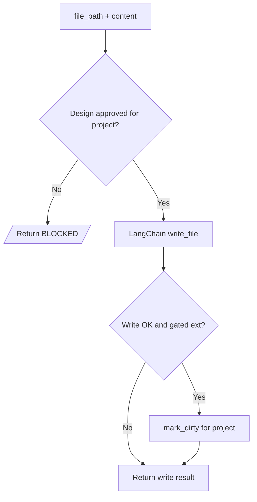

### `uipath_workflow_list_directory`

#### Audience guide

**List directory.** List files and subdirectories under a path, optionally filtered by a glob pattern. Read-only. Use to discover XAML files, .cs files, or project layout before reading or editing.

**Required MCP arguments:**

- **`directory_path`** — Absolute or project-relative directory path.

**Typical return:** Typically a **string** or structured value serialized by the MCP server as text or JSON.

**Side effect (MCP `ToolAnnotations`):** read-only

**Dispatch:** [`framework/mcp_server/tools/workflow_tools.py`](../framework/mcp_server/tools/workflow_tools.py) `call_workflow_tool`

#### Author registration (`Tool.description` verbatim)

> List files and subdirectories under a path, optionally filtered by a glob pattern. Read-only. Use to discover XAML files, .cs files, or project layout before reading or editing.

#### Input schema (JSON Schema)

```json
{
  "type": "object",
  "properties": {
    "directory_path": {
      "type": "string",
      "description": "Absolute or project-relative directory path."
    },
    "pattern": {
      "type": "string",
      "description": "Glob pattern (e.g. '*.xaml').",
      "default": "*"
    }
  },
  "required": [
    "directory_path"
  ]
}
```

#### Behavior flow

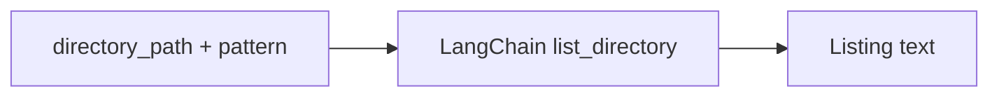

### `uipath_workflow_read_project`

#### Audience guide

**Read project.json.** Read and JSON-parse project.json from a UiPath project. Read-only. Use to inspect declared dependencies and entry point before calling uipath_workflow_install_package or uipath_workflow_validate.

**Required MCP arguments:**

_No required parameters (all optional)._

**Typical return:** Typically a **string** or structured value serialized by the MCP server as text or JSON.

**Side effect (MCP `ToolAnnotations`):** read-only

**Dispatch:** [`framework/mcp_server/tools/workflow_tools.py`](../framework/mcp_server/tools/workflow_tools.py) `call_workflow_tool`

#### Author registration (`Tool.description` verbatim)

> Read and JSON-parse project.json from a UiPath project. Read-only. Use to inspect declared dependencies and entry point before calling uipath_workflow_install_package or uipath_workflow_validate.

#### Input schema (JSON Schema)

```json
{
  "type": "object",
  "properties": {
    "project_dir": {
      "type": "string",
      "description": "Project root containing project.json (default: current dir).",
      "default": "."
    }
  }
}
```

#### Behavior flow

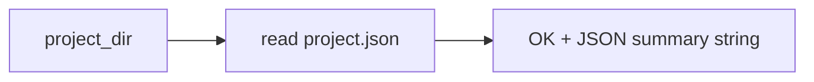

### `uipath_workflow_install_package`

#### Audience guide

**Install NuGet package.** Install or update a NuGet package in a UiPath project via 'uip rpa install-or-update-packages'. Mutates project.json and the local packages folder. Run uipath_workflow_environment_probe first so the chosen version matches Studio's installed packages, and follow with uipath_workflow_build_and_verify to confirm. GATED: blocked by the MCP session gate when the project has unverified writes; the call returns [BLOCKED] until uipath_workflow_build_and_verify reports success=true. Set allow_unverified=true only for explicit human override.

**Required MCP arguments:**

- **`project_dir`** — Project root containing project.json.
- **`package_id`** — NuGet package id (e.g. UiPath.System.Activities).

**Typical return:** Typically a **string** or structured value serialized by the MCP server as text or JSON.

**Side effect (MCP `ToolAnnotations`):** destructive

**Dispatch:** [`framework/mcp_server/tools/workflow_tools.py`](../framework/mcp_server/tools/workflow_tools.py) `call_workflow_tool`

#### Author registration (`Tool.description` verbatim)

> Install or update a NuGet package in a UiPath project via 'uip rpa install-or-update-packages'. Mutates project.json and the local packages folder. Run uipath_workflow_environment_probe first so the chosen version matches Studio's installed packages, and follow with uipath_workflow_build_and_verify to confirm. GATED: blocked by the MCP session gate when the project has unverified writes; the call returns [BLOCKED] until uipath_workflow_build_and_verify reports success=true. Set allow_unverified=true only for explicit human override.

#### Input schema (JSON Schema)

```json
{
  "type": "object",
  "properties": {
    "project_dir": {
      "type": "string",
      "description": "Project root containing project.json."
    },
    "package_id": {
      "type": "string",
      "description": "NuGet package id (e.g. UiPath.System.Activities)."
    },
    "version": {
      "type": "string",
      "description": "Optional package version; default is latest compatible."
    },
    "allow_unverified": {
      "type": "boolean",
      "default": false,
      "description": "Bypass the session gate. Use only when the user explicitly asks to override the dirty-state block."
    },
    "allow_unapproved": {
      "type": "boolean",
      "default": false,
      "description": "Bypass the design-approval gate for this call."
    }
  },
  "required": [
    "project_dir",
    "package_id"
  ]
}
```

#### Behavior flow

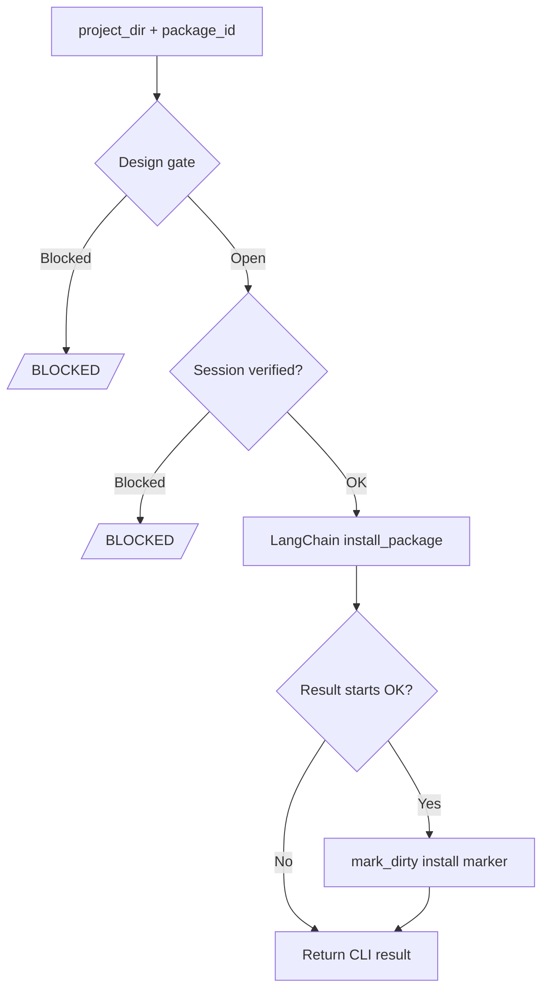

### `uipath_workflow_validate`

#### Audience guide

**Validate workflow (read-only).** Validate a single XAML workflow via 'uip rpa get-errors' and return the error list. Read-only and idempotent: surfaces errors but writes nothing. Prefer uipath_workflow_build_and_verify for the end-to-end validate+run+fix loop; use this only for a single static check, or uipath_workflow_validate_loop when you want auto-fix writes.

**Required MCP arguments:**

- **`project_dir`** — Project root containing project.json.
- **`file_path`** — Path to the .xaml workflow file to validate.

**Typical return:** Typically a **string** or structured value serialized by the MCP server as text or JSON.

**Side effect (MCP `ToolAnnotations`):** read-only

**Dispatch:** [`framework/mcp_server/tools/workflow_tools.py`](../framework/mcp_server/tools/workflow_tools.py) `call_workflow_tool`

#### Author registration (`Tool.description` verbatim)

> Validate a single XAML workflow via 'uip rpa get-errors' and return the error list. Read-only and idempotent: surfaces errors but writes nothing. Prefer uipath_workflow_build_and_verify for the end-to-end validate+run+fix loop; use this only for a single static check, or uipath_workflow_validate_loop when you want auto-fix writes.

#### Input schema (JSON Schema)

```json
{
  "type": "object",
  "properties": {
    "project_dir": {
      "type": "string",
      "description": "Project root containing project.json."
    },
    "file_path": {
      "type": "string",
      "description": "Path to the .xaml workflow file to validate."
    }
  },
  "required": [
    "project_dir",
    "file_path"
  ]
}
```

#### Behavior flow

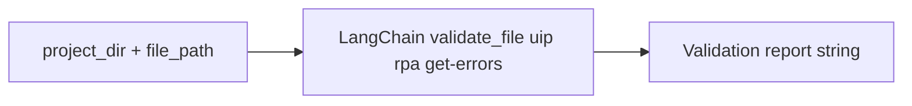

### `uipath_workflow_validate_loop`

#### Audience guide

**Validate and auto-fix loop.** DEPRECATED NAME: kept for backward compatibility. Calls uipath_workflow_build_and_verify with run_after_validate=false. Prefer uipath_workflow_build_and_verify directly so you also get runtime execution and dependency-mismatch detection.

**Required MCP arguments:**

- **`project_dir`** — Project root containing project.json.
- **`file_path`** — Path to the .xaml workflow file.

**Typical return:** Typically a **string** or structured value serialized by the MCP server as text or JSON.

**Side effect (MCP `ToolAnnotations`):** destructive

**Dispatch:** [`framework/mcp_server/tools/workflow_tools.py`](../framework/mcp_server/tools/workflow_tools.py) `call_workflow_tool`

#### Author registration (`Tool.description` verbatim)

> DEPRECATED NAME: kept for backward compatibility. Calls uipath_workflow_build_and_verify with run_after_validate=false. Prefer uipath_workflow_build_and_verify directly so you also get runtime execution and dependency-mismatch detection.

#### Input schema (JSON Schema)

```json
{
  "type": "object",
  "properties": {
    "project_dir": {
      "type": "string",
      "description": "Project root containing project.json."
    },
    "file_path": {
      "type": "string",
      "description": "Path to the .xaml workflow file."
    },
    "max_attempts": {
      "type": "integer",
      "description": "Max validate-then-fix iterations.",
      "default": 5
    }
  },
  "required": [
    "project_dir",
    "file_path"
  ]
}
```

#### Behavior flow

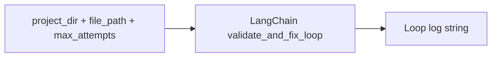

### `uipath_workflow_build_and_verify`

#### Audience guide

**Build, validate, run, debug and report fixes.** Build, validate, headless-run, and Studio-debug a workflow in a single server-side LOOP. Canonical 'did it actually work' tool and the only way to clear the MCP session gate. Pipeline per iteration: probe Studio + installed packages (with optional auto-install of mismatched packages) -> uip rpa get-errors over every .xaml -> if clean and run_after_validate=true execute the workflow headless -> if a Studio instance is detected and studio_debug_after_run=true also start a Studio debug session. Returns success=true and verdict='pass' ONLY when every step succeeds. The loop keeps iterating up to max_attempts when it can make automatic progress (e.g.

**Required MCP arguments:**

- **`project_dir`** — Project root containing project.json.

**Typical return:** Typically a **string** or structured value serialized by the MCP server as text or JSON.

**Side effect (MCP `ToolAnnotations`):** destructive

**Dispatch:** [`framework/mcp_server/tools/workflow_tools.py`](../framework/mcp_server/tools/workflow_tools.py) `call_workflow_tool`

#### Author registration (`Tool.description` verbatim)

> Build, validate, headless-run, and Studio-debug a workflow in a single server-side LOOP. Canonical 'did it actually work' tool and the only way to clear the MCP session gate. Pipeline per iteration: probe Studio + installed packages (with optional auto-install of mismatched packages) -> uip rpa get-errors over every .xaml -> if clean and run_after_validate=true execute the workflow headless -> if a Studio instance is detected and studio_debug_after_run=true also start a Studio debug session. Returns success=true and verdict='pass' ONLY when every step succeeds. The loop keeps iterating up to max_attempts when it can make automatic progress (e.g. just installed a package); for LLM-driven fixes it returns early so the agent can patch and re-call. After ANY write_file / install_package you MUST call this tool until verdict='pass' before claiming the task done.

#### Input schema (JSON Schema)

```json
{
  "type": "object",
  "properties": {
    "project_dir": {
      "type": "string",
      "description": "Project root containing project.json."
    },
    "file_path": {
      "type": "string",
      "description": "Optional. Path to a single .xaml workflow file. When omitted, every .xaml workflow under project_dir is validated; runtime execution still targets the project's main entry point."
    },
    "max_attempts": {
      "type": "integer",
      "description": "Max loop iterations before returning.",
      "default": 5
    },
    "run_after_validate": {
      "type": "boolean",
      "description": "If true, also execute the workflow once validation is clean.",
      "default": true
    },
    "input_arguments": {
      "type": "string",
      "description": "Optional JSON string of input arguments forwarded to run_workflow."
    },
    "timeout_seconds": {
      "type": "integer",
      "description": "Per-run timeout when run_after_validate=true.",
      "default": 60
    },
    "auto_install_packages": {
      "type": "boolean",
      "description": "When true (default), the loop attempts to resolve dependency mismatches via install_package itself.",
      "default": true
    },
    "studio_debug_after_run": {
      "type": "boolean",
      "description": "When true (default), also attach a UiPath Studio debug session after a successful headless run, when a Studio instance is detected.",
      "default": true
    },
    "require_studio_debug": {
      "type": "boolean",
      "description": "When true (default), the verify gate refuses to report success=true unless an attached Studio debug pass also ran. If Studio is unavailable, the call returns verdict='needs_human' with next_action='start_studio_or_waive'. Set false only when the user explicitly waives the Studio debug step (e.g. CI host without Studio).",
      "default": true
    }
  },
  "required": [
    "project_dir"
  ]
}
```

#### Behavior flow

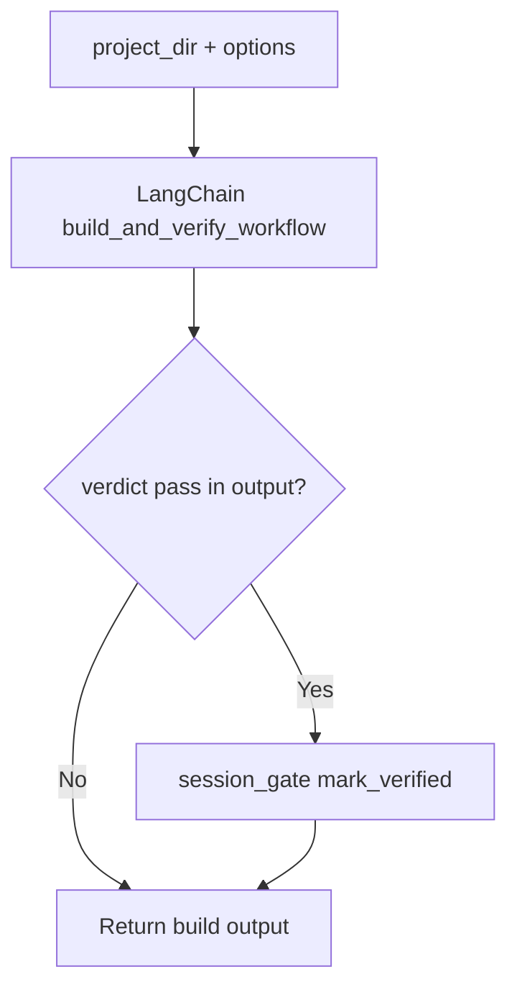

### `uipath_workflow_environment_probe`

#### Audience guide

**Probe Studio environment.** Probe the local UiPath Studio environment and installed packages (uip rpa list-instances + list-packages). Call this BEFORE choosing activity packages or creating / editing project.json so dependencies match the local Studio install. Reports any detected dependency mismatches (e.g. legacy UiPath.Core.Activities next to modern UiPath.System.Activities).

**Required MCP arguments:**

_No required parameters (all optional)._

**Typical return:** Typically a **string** or structured value serialized by the MCP server as text or JSON.

**Side effect (MCP `ToolAnnotations`):** read-only

**Dispatch:** [`framework/mcp_server/tools/workflow_tools.py`](../framework/mcp_server/tools/workflow_tools.py) `call_workflow_tool`

#### Author registration (`Tool.description` verbatim)

> Probe the local UiPath Studio environment and installed packages (uip rpa list-instances + list-packages). Call this BEFORE choosing activity packages or creating / editing project.json so dependencies match the local Studio install. Reports any detected dependency mismatches (e.g. legacy UiPath.Core.Activities next to modern UiPath.System.Activities).

#### Input schema (JSON Schema)

```json
{
  "type": "object",
  "properties": {
    "project_dir": {
      "type": "string",
      "description": "Optional project directory. If omitted, only Studio instances are reported."
    }
  }
}
```

#### Behavior flow

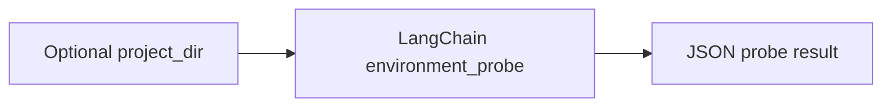

### `uipath_workflow_create_project`

#### Audience guide

**Create UiPath project.** Create a UiPath project via 'uip rpa create-project'. Use this INSTEAD of writing project.json by hand: the CLI generates a project.json whose dependencies match the local Studio install, avoiding legacy-vs-modern dependency mismatches that occur when an LLM hand-pins package versions.

**Required MCP arguments:**

- **`project_dir`** — Parent directory for the new project folder.
- **`project_name`** — Name of the new project folder created under project_dir.

**Typical return:** Typically a **string** or structured value serialized by the MCP server as text or JSON.

**Side effect (MCP `ToolAnnotations`):** destructive (idempotent where noted)

**Dispatch:** [`framework/mcp_server/tools/workflow_tools.py`](../framework/mcp_server/tools/workflow_tools.py) `call_workflow_tool`

#### Author registration (`Tool.description` verbatim)

> Create a UiPath project via 'uip rpa create-project'. Use this INSTEAD of writing project.json by hand: the CLI generates a project.json whose dependencies match the local Studio install, avoiding legacy-vs-modern dependency mismatches that occur when an LLM hand-pins package versions.

#### Input schema (JSON Schema)

```json
{
  "type": "object",
  "properties": {
    "project_dir": {
      "type": "string",
      "description": "Parent directory for the new project folder."
    },
    "project_name": {
      "type": "string",
      "description": "Name of the new project folder created under project_dir."
    },
    "project_type": {
      "type": "string",
      "enum": [
        "process",
        "library",
        "coded"
      ],
      "description": "UiPath project kind: process, library, or coded.",
      "default": "process"
    },
    "auto_verify": {
      "type": "boolean",
      "description": "When true (default), run uipath_workflow_build_and_verify on the new project (static validation only) and append the result. Set false to skip.",
      "default": true
    }
  },
  "required": [
    "project_dir",
    "project_name"
  ]
}
```

#### Behavior flow

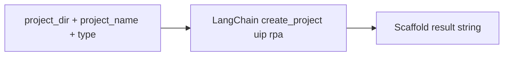

### `uipath_workflow_run`

#### Audience guide

**Run workflow.** Execute a workflow once via 'uip rpa run-file'. Destructive: any side effects of the workflow (HTTP calls, file writes, Orchestrator queue items) happen. Validate first with uipath_workflow_validate or uipath_workflow_build_and_verify; use uipath_workflow_debug for an attached Studio debug session. GATED: blocked by the MCP session gate when the project has unverified writes; the call returns [BLOCKED] until uipath_workflow_build_and_verify reports success=true.

**Required MCP arguments:**

- **`project_dir`** — Project root containing project.json.
- **`file_path`** — Path to the .xaml workflow to run.

**Typical return:** Typically a **string** or structured value serialized by the MCP server as text or JSON.

**Side effect (MCP `ToolAnnotations`):** destructive

**Dispatch:** [`framework/mcp_server/tools/workflow_tools.py`](../framework/mcp_server/tools/workflow_tools.py) `call_workflow_tool`

#### Author registration (`Tool.description` verbatim)

> Execute a workflow once via 'uip rpa run-file'. Destructive: any side effects of the workflow (HTTP calls, file writes, Orchestrator queue items) happen. Validate first with uipath_workflow_validate or uipath_workflow_build_and_verify; use uipath_workflow_debug for an attached Studio debug session. GATED: blocked by the MCP session gate when the project has unverified writes; the call returns [BLOCKED] until uipath_workflow_build_and_verify reports success=true.

#### Input schema (JSON Schema)

```json
{
  "type": "object",
  "properties": {
    "project_dir": {
      "type": "string",
      "description": "Project root containing project.json."
    },
    "file_path": {
      "type": "string",
      "description": "Path to the .xaml workflow to run."
    },
    "input_arguments": {
      "type": "string",
      "description": "JSON string of input arguments passed to the workflow."
    },
    "timeout_seconds": {
      "type": "integer",
      "description": "Hard timeout for the run.",
      "default": 60
    },
    "verbose": {
      "type": "boolean",
      "description": "If true, request verbose output from uip.",
      "default": false
    },
    "allow_unverified": {
      "type": "boolean",
      "default": false,
      "description": "Bypass the session gate. Use only when the user explicitly asks to override the dirty-state block."
    }
  },
  "required": [
    "project_dir",
    "file_path"
  ]
}
```

#### Behavior flow

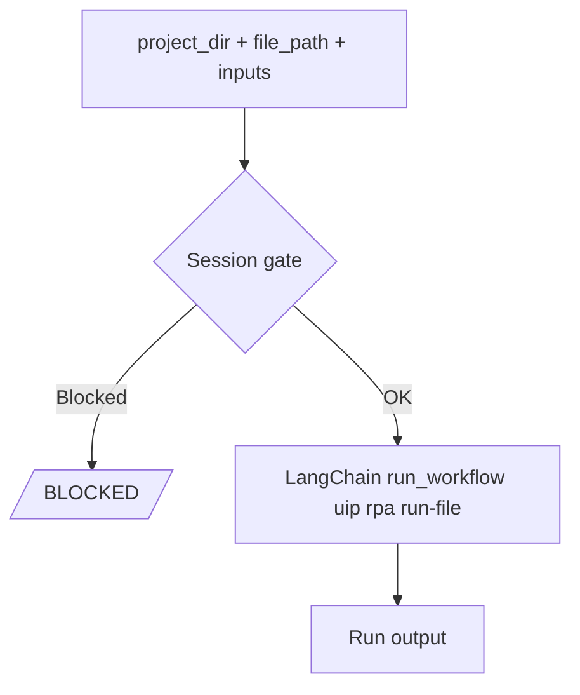

### `uipath_workflow_debug`

#### Audience guide

**Debug workflow in Studio.** Start a workflow in debug mode via 'uip rpa run-file StartDebugging', attaching to a running UiPath Studio if present. Destructive: the workflow executes. Prefer uipath_workflow_run for headless runs in CI; use this when stepping through in Studio. GATED: blocked by the MCP session gate when the project has unverified writes; the call returns [BLOCKED] until uipath_workflow_build_and_verify reports success=true.

**Required MCP arguments:**

- **`project_dir`** — Project root containing project.json.
- **`file_path`** — Path to the .xaml workflow to debug.

**Typical return:** Typically a **string** or structured value serialized by the MCP server as text or JSON.

**Side effect (MCP `ToolAnnotations`):** destructive

**Dispatch:** [`framework/mcp_server/tools/workflow_tools.py`](../framework/mcp_server/tools/workflow_tools.py) `call_workflow_tool`

#### Author registration (`Tool.description` verbatim)

> Start a workflow in debug mode via 'uip rpa run-file StartDebugging', attaching to a running UiPath Studio if present. Destructive: the workflow executes. Prefer uipath_workflow_run for headless runs in CI; use this when stepping through in Studio. GATED: blocked by the MCP session gate when the project has unverified writes; the call returns [BLOCKED] until uipath_workflow_build_and_verify reports success=true.

#### Input schema (JSON Schema)

```json
{
  "type": "object",
  "properties": {
    "project_dir": {
      "type": "string",
      "description": "Project root containing project.json."
    },
    "file_path": {
      "type": "string",
      "description": "Path to the .xaml workflow to debug."
    },
    "allow_unverified": {
      "type": "boolean",
      "default": false,
      "description": "Bypass the session gate. Use only when the user explicitly asks to override the dirty-state block."
    }
  },
  "required": [
    "project_dir",
    "file_path"
  ]
}
```

#### Behavior flow

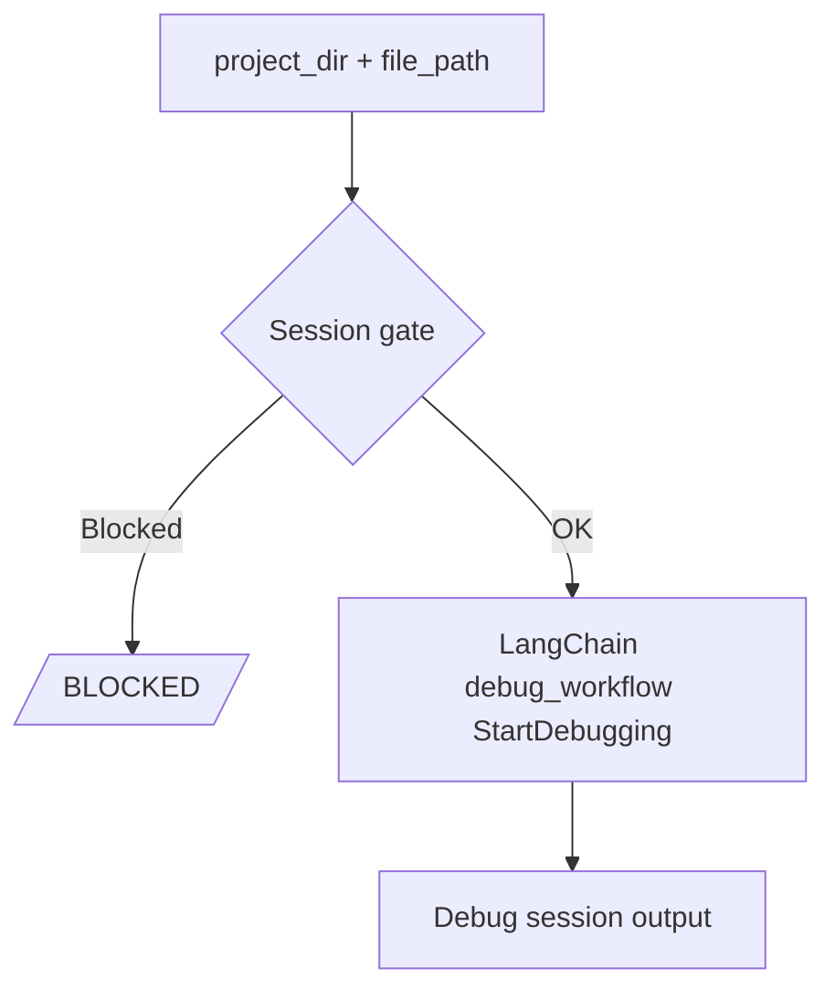

### `uipath_workflow_ensure_project`

#### Audience guide

**Check project.json exists.** Confirm a project.json exists under project_dir. Returns success when present and a clear error pointing at uipath_workflow_create_project when absent (this tool no longer hand-writes a minimal project.json - that caused Studio dependency mismatches). Use uipath_workflow_create_project to scaffold a new project.

**Required MCP arguments:**

- **`project_dir`** — Project root path to check.

**Typical return:** Typically a **string** or structured value serialized by the MCP server as text or JSON.

**Side effect (MCP `ToolAnnotations`):** read-only

**Dispatch:** [`framework/mcp_server/tools/workflow_tools.py`](../framework/mcp_server/tools/workflow_tools.py) `call_workflow_tool`

#### Author registration (`Tool.description` verbatim)

> Confirm a project.json exists under project_dir. Returns success when present and a clear error pointing at uipath_workflow_create_project when absent (this tool no longer hand-writes a minimal project.json - that caused Studio dependency mismatches). Use uipath_workflow_create_project to scaffold a new project.

#### Input schema (JSON Schema)

```json
{
  "type": "object",
  "properties": {
    "project_dir": {
      "type": "string",
      "description": "Project root path to check."
    },
    "project_name": {
      "type": "string",
      "description": "If set, checks project_dir/project_name instead."
    }
  },
  "required": [
    "project_dir"
  ]
}
```

#### Behavior flow

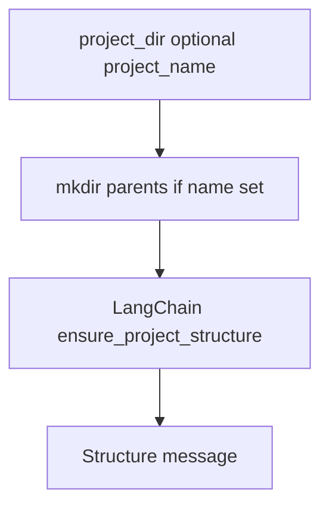

### `uipath_workflow_run_command`

#### Audience guide

**Run arbitrary uip command.** Escape hatch: invoke an arbitrary uip CLI subcommand. Destructive by default since uip can mutate the project. Prefer the specific tools (uipath_workflow_validate, _run, _install_package, _deploy, _create_project) when one exists; only reach for this when no wrapper covers the command you need. GATED: blocked by the MCP session gate when project_dir has unverified writes.

**Required MCP arguments:**

- **`command`** — First uip token (e.g. 'rpa', 'orchestrator').
- **`args`** — Args after command, e.g. ['get-errors', '--project-dir', '.'].

**Typical return:** Typically a **string** or structured value serialized by the MCP server as text or JSON.

**Side effect (MCP `ToolAnnotations`):** destructive

**Dispatch:** [`framework/mcp_server/tools/workflow_tools.py`](../framework/mcp_server/tools/workflow_tools.py) `call_workflow_tool`

#### Author registration (`Tool.description` verbatim)

> Escape hatch: invoke an arbitrary uip CLI subcommand. Destructive by default since uip can mutate the project. Prefer the specific tools (uipath_workflow_validate, _run, _install_package, _deploy, _create_project) when one exists; only reach for this when no wrapper covers the command you need. GATED: blocked by the MCP session gate when project_dir has unverified writes.

#### Input schema (JSON Schema)

```json
{
  "type": "object",
  "properties": {
    "command": {
      "type": "string",
      "description": "First uip token (e.g. 'rpa', 'orchestrator')."
    },
    "args": {
      "type": "array",
      "items": {
        "type": "string"
      },
      "description": "Args after command, e.g. ['get-errors', '--project-dir', '.']."
    },
    "project_dir": {
      "type": "string",
      "description": "Working directory the uip command runs in."
    },
    "allow_unverified": {
      "type": "boolean",
      "default": false,
      "description": "Bypass the session gate. Use only when the user explicitly asks to override the dirty-state block."
    }
  },
  "required": [
    "command",
    "args"
  ]
}
```

#### Behavior flow

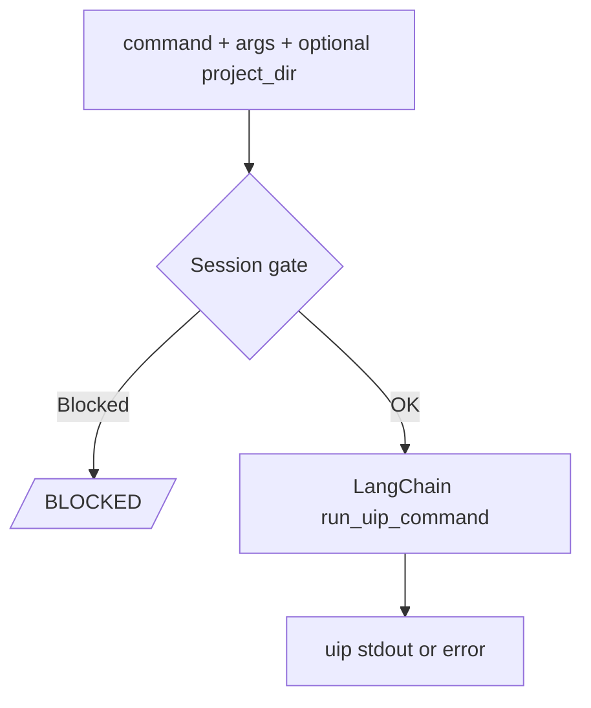

### `uipath_workflow_deploy`

#### Audience guide

**Deploy project to Orchestrator.** Pack the project and publish it to UiPath Orchestrator, optionally creating a Process. Read docs/ORCHESTRATOR_DEPLOYMENT.md first; requires explicit human approval before use; target only personal workspace or a named Dev folder, never Production. Destructive and network-dependent: requires an Orchestrator URL plus tenant, and uses ambient uip auth credentials. Returns a JSON string with the publish result. GATED: blocked by the MCP session gate when the project has unverified writes; the call returns [BLOCKED] until uipath_workflow_build_and_verify reports success=true.

**Required MCP arguments:**

- **`project_path`** — Path to the UiPath project to pack and publish.
- **`orchestrator_url`** — Base URL of the Orchestrator instance.
- **`tenant_name`** — Orchestrator tenant name.
- **`folder_path`** — Orchestrator folder path. Required; no default Shared folder is allowed. Production is blocked.

**Typical return:** Usually a **string** (sometimes JSON text) returned from the underlying helper.

**Side effect (MCP `ToolAnnotations`):** destructive

**Dispatch:** [`framework/mcp_server/tools/workflow_tools.py`](../framework/mcp_server/tools/workflow_tools.py) `call_workflow_tool`

#### Author registration (`Tool.description` verbatim)

> Pack the project and publish it to UiPath Orchestrator, optionally creating a Process. Read docs/ORCHESTRATOR_DEPLOYMENT.md first; requires explicit human approval before use; target only personal workspace or a named Dev folder, never Production. Destructive and network-dependent: requires an Orchestrator URL plus tenant, and uses ambient uip auth credentials. Returns a JSON string with the publish result. GATED: blocked by the MCP session gate when the project has unverified writes; the call returns [BLOCKED] until uipath_workflow_build_and_verify reports success=true.

#### Input schema (JSON Schema)

```json
{
  "type": "object",
  "properties": {
    "project_path": {
      "type": "string",
      "description": "Path to the UiPath project to pack and publish."
    },
    "orchestrator_url": {
      "type": "string",
      "description": "Base URL of the Orchestrator instance."
    },
    "tenant_name": {
      "type": "string",
      "description": "Orchestrator tenant name."
    },
    "folder_path": {
      "type": "string",
      "description": "Orchestrator folder path. Required; no default Shared folder is allowed. Production is blocked."
    },
    "human_confirmed": {
      "type": "boolean",
      "default": false,
      "description": "Required true for shared or non-personal/non-Dev targets after explicit human approval."
    },
    "approved_by": {
      "type": "string",
      "description": "Human approver identity for shared/non-Dev targets."
    },
    "account_name": {
      "type": "string",
      "description": "Cloud Orchestrator account name (for cloud tenants)."
    },
    "process_name": {
      "type": "string",
      "description": "Process display name; defaults to the project name."
    },
    "create_process": {
      "type": "boolean",
      "description": "If true, create a Process for the package.",
      "default": true
    },
    "environment": {
      "type": "string",
      "description": "Optional environment to associate with the process."
    },
    "project_type": {
      "type": "string",
      "enum": [
        "process",
        "maestro"
      ],
      "default": "process",
      "description": "Project family. 'process' uses uip solution pack/publish + uip or processes create. 'maestro' uses uip flow pack + uip solution publish + uip flow process create."
    },
    "allow_unverified": {
      "type": "boolean",
      "default": false,
      "description": "Bypass the session gate. Use only when the user explicitly asks to deploy unverified changes."
    }
  },
  "required": [
    "project_path",
    "orchestrator_url",
    "tenant_name",
    "folder_path"
  ]
}
```

#### Behavior flow

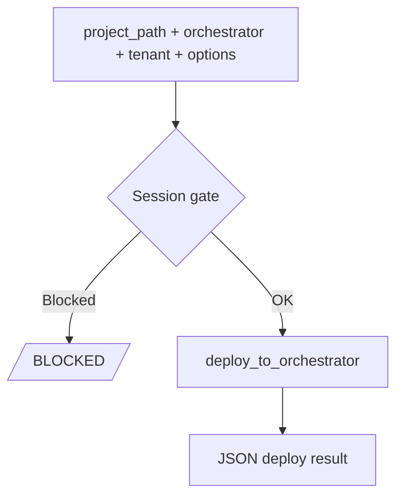

### `uipath_workflow_publish`

#### Audience guide

**Publish project package to Orchestrator.** Pack and publish a UiPath project to Orchestrator without creating a Process. Read docs/ORCHESTRATOR_DEPLOYMENT.md first; requires explicit human approval before use; target only personal workspace or a Dev target, never Production. Wraps the modern uip CLI (uip solution pack/publish for RPA, uip flow pack + uip solution publish for Maestro). Returns the package path and CLI output. GATED by the MCP session gate; blocked until uipath_workflow_build_and_verify reports success.

**Required MCP arguments:**

- **`project_dir`** — Path to the project directory to pack and publish.

**Typical return:** Usually a **string** (sometimes JSON text) returned from the underlying helper.

**Side effect (MCP `ToolAnnotations`):** destructive

**Dispatch:** [`framework/mcp_server/tools/workflow_tools.py`](../framework/mcp_server/tools/workflow_tools.py) `call_workflow_tool`

#### Author registration (`Tool.description` verbatim)

> Pack and publish a UiPath project to Orchestrator without creating a Process. Read docs/ORCHESTRATOR_DEPLOYMENT.md first; requires explicit human approval before use; target only personal workspace or a Dev target, never Production. Wraps the modern uip CLI (uip solution pack/publish for RPA, uip flow pack + uip solution publish for Maestro). Returns the package path and CLI output. GATED by the MCP session gate; blocked until uipath_workflow_build_and_verify reports success.

#### Input schema (JSON Schema)

```json
{
  "type": "object",
  "properties": {
    "project_dir": {
      "type": "string",
      "description": "Path to the project directory to pack and publish."
    },
    "project_type": {
      "type": "string",
      "enum": [
        "process",
        "maestro"
      ],
      "default": "process"
    },
    "folder_path": {
      "type": "string",
      "description": "Intended Orchestrator target folder for approval policy. Production is blocked; shared/non-Dev requires approval metadata."
    },
    "human_confirmed": {
      "type": "boolean",
      "default": false
    },
    "approved_by": {
      "type": "string"
    },
    "allow_unverified": {
      "type": "boolean",
      "default": false,
      "description": "Bypass the session gate."
    }
  },
  "required": [
    "project_dir"
  ]
}
```

#### Behavior flow

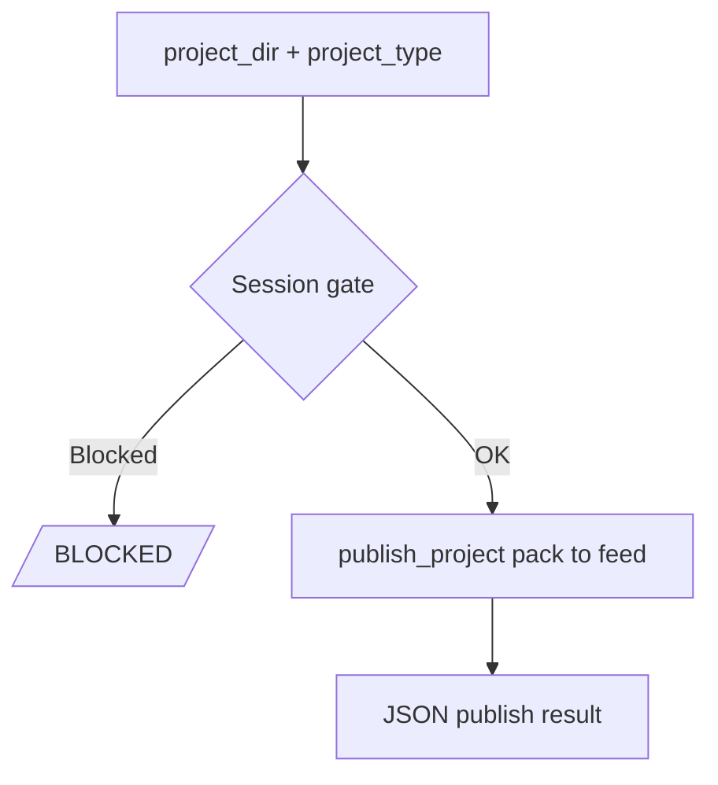

### `uipath_workflow_session_status`

#### Audience guide

**Session gate status.** Inspect the per-project verification gate. Read-only. Reports whether the gate is enabled (UIPATH_MCP_GATE_ENABLED) and the current status for project_dir (unknown / dirty / verified) plus the files that triggered the dirty flag and the last verify outcome. Pass no project_dir to dump every tracked project. Use this when a tool returns [BLOCKED] to confirm what changed and re-run uipath_workflow_build_and_verify.

**Required MCP arguments:**

_No required parameters (all optional)._

**Typical return:** Usually a **string** (sometimes JSON text) returned from the underlying helper.

**Side effect (MCP `ToolAnnotations`):** read-only

**Dispatch:** [`framework/mcp_server/tools/workflow_tools.py`](../framework/mcp_server/tools/workflow_tools.py) `call_workflow_tool`

#### Author registration (`Tool.description` verbatim)

> Inspect the per-project verification gate. Read-only. Reports whether the gate is enabled (UIPATH_MCP_GATE_ENABLED) and the current status for project_dir (unknown / dirty / verified) plus the files that triggered the dirty flag and the last verify outcome. Pass no project_dir to dump every tracked project. Use this when a tool returns [BLOCKED] to confirm what changed and re-run uipath_workflow_build_and_verify.

#### Input schema (JSON Schema)

```json
{
  "type": "object",
  "properties": {
    "project_dir": {
      "type": "string",
      "description": "Optional project directory to inspect. Omit for a full snapshot of every tracked project."
    }
  }
}
```

#### Behavior flow

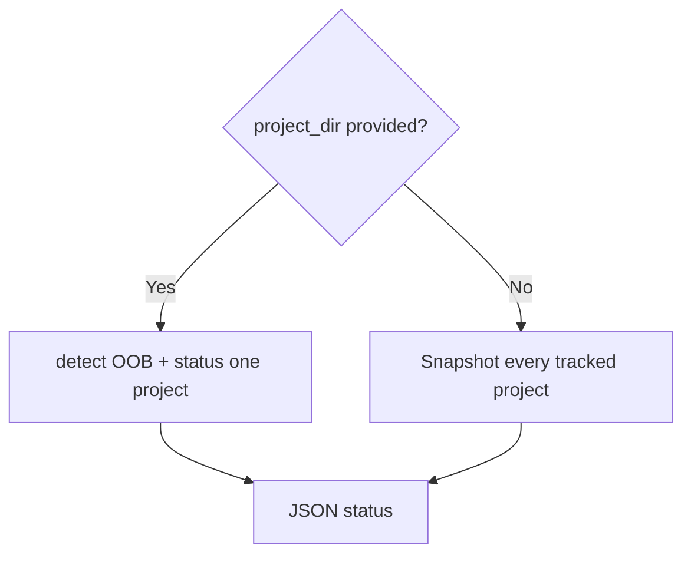

## Module: `skill`

### `uipath_skill_list`

#### Audience guide

**List skills.** Enumerate every loaded UiPath skill, optionally filtered by agent role (ba, sa, developer, qa, conversational). Read-only. Use for discovery; uipath_skill_match ranks by relevance to a user request, and uipath_skill_get loads the full markdown body.

**Required MCP arguments:**

_No required parameters (all optional)._

**Typical return:** **List, dict, or string**, depending on the operation (registry rows, insights dict, or plain text).

**Side effect (MCP `ToolAnnotations`):** read-only

**Dispatch:** [`framework/mcp_server/tools/skill_tools.py`](../framework/mcp_server/tools/skill_tools.py) `call_skill_tool`

#### Author registration (`Tool.description` verbatim)

> PREFER THIS over Glob/Read on the skills/ submodule; this tool is the API, those files are the storage backend. Enumerate every loaded UiPath skill, optionally filtered by agent role (ba, sa, developer, qa, conversational). Read-only. Use for discovery; uipath_skill_match ranks by relevance to a user request, and uipath_skill_get loads the full markdown body.

#### Input schema (JSON Schema)

```json
{
  "type": "object",
  "properties": {
    "agent_role": {
      "type": "string",
      "enum": [
        "ba",
        "sa",
        "developer",
        "qa",
        "conversational"
      ],
      "description": "Optional agent role filter."
    }
  }
}
```

#### Behavior flow

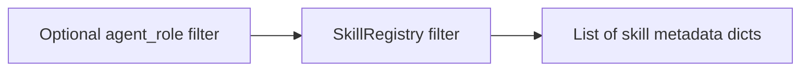

### `uipath_skill_get`

#### Audience guide

**Read skill body.** Load the full markdown body of a single skill by name. Read-only. Use after uipath_skill_list or uipath_skill_match identifies the skill you want to apply.

**Required MCP arguments:**

- **`skill_name`** — Skill name as returned by uipath_skill_list.

**Typical return:** **List, dict, or string**, depending on the operation (registry rows, insights dict, or plain text).

**Side effect (MCP `ToolAnnotations`):** read-only

**Dispatch:** [`framework/mcp_server/tools/skill_tools.py`](../framework/mcp_server/tools/skill_tools.py) `call_skill_tool`

#### Author registration (`Tool.description` verbatim)

> PREFER THIS over reading skills/skills/<skill_name>/SKILL.md directly; this resolver applies overlay/origin precedence. Load the full markdown body of a single skill by name. Read-only. Use after uipath_skill_list or uipath_skill_match identifies the skill you want to apply.

#### Input schema (JSON Schema)

```json
{
  "type": "object",
  "properties": {
    "skill_name": {
      "type": "string",
      "description": "Skill name as returned by uipath_skill_list."
    }
  },
  "required": [
    "skill_name"
  ]
}
```

#### Behavior flow

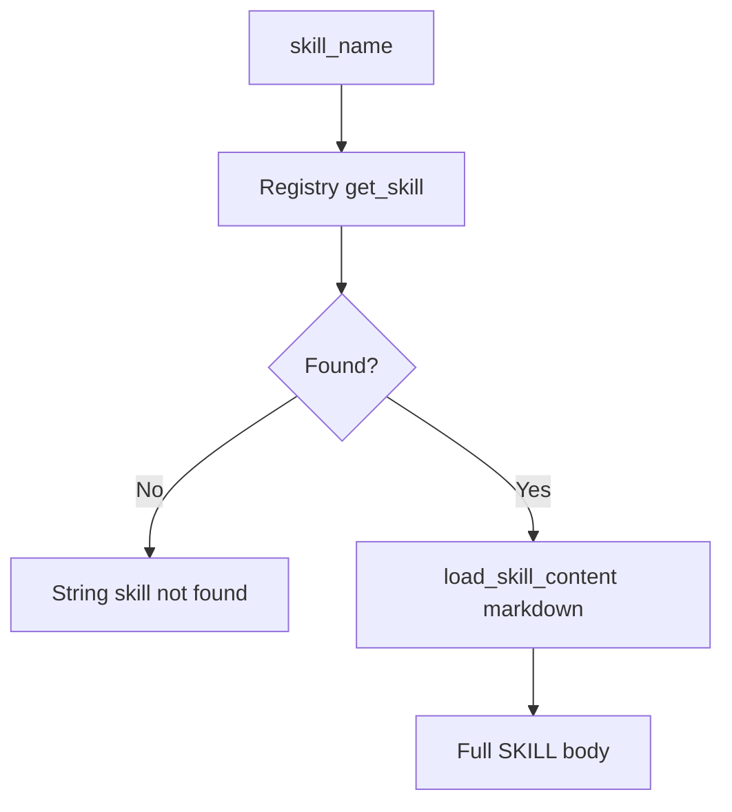

### `uipath_skill_match`

#### Audience guide

**Match skills to input.** Rank skills by relevance to a free-form user input using the same heuristic as the CLI chat. Read-only. Use to pick which skill(s) to load with uipath_skill_get; for the full inventory use uipath_skill_list.

**Required MCP arguments:**

- **`user_input`** — Free-text request to match skills against.

**Typical return:** **List, dict, or string**, depending on the operation (registry rows, insights dict, or plain text).

**Side effect (MCP `ToolAnnotations`):** read-only

**Dispatch:** [`framework/mcp_server/tools/skill_tools.py`](../framework/mcp_server/tools/skill_tools.py) `call_skill_tool`

#### Author registration (`Tool.description` verbatim)

> Rank skills by relevance to a free-form user input using the same heuristic as the CLI chat. Read-only. Use to pick which skill(s) to load with uipath_skill_get; for the full inventory use uipath_skill_list.

#### Input schema (JSON Schema)

```json
{
  "type": "object",
  "properties": {
    "user_input": {
      "type": "string",
      "description": "Free-text request to match skills against."
    },
    "top_k": {
      "type": "integer",
      "description": "How many ranked matches to return.",
      "default": 3
    }
  },
  "required": [
    "user_input"
  ]
}
```

#### Behavior flow

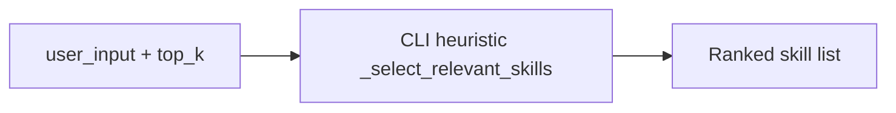

### `uipath_skill_insights_query`

#### Audience guide

**Read skill insights.** Read operator-curated insights (gotchas, tips, decisions) for one skill, plus a short summary. Read-only. Insights are human-authored notes; for auto-promoted high-confidence failure patterns use uipath_skill_lessons_list.

**Required MCP arguments:**

- **`skill_name`** — Skill name to read insights for.

**Typical return:** **List, dict, or string**, depending on the operation (registry rows, insights dict, or plain text).

**Side effect (MCP `ToolAnnotations`):** read-only

**Dispatch:** [`framework/mcp_server/tools/skill_tools.py`](../framework/mcp_server/tools/skill_tools.py) `call_skill_tool`

#### Author registration (`Tool.description` verbatim)

> Read operator-curated insights (gotchas, tips, decisions) for one skill, plus a short summary. Read-only. Insights are human-authored notes; for auto-promoted high-confidence failure patterns use uipath_skill_lessons_list.

#### Input schema (JSON Schema)

```json
{
  "type": "object",
  "properties": {
    "skill_name": {
      "type": "string",
      "description": "Skill name to read insights for."
    }
  },
  "required": [
    "skill_name"
  ]
}
```

#### Behavior flow

```mermaid
flowchart LR
  SN[skill_name]:::process --> ST[SkillInsightsTool query]:::service
  ST --> INS[Insights dict or summary]:::data
```

### `uipath_skill_insights_add`

#### Audience guide

**Add skill insight.** Append a new insight (gotcha, failure_pattern, etc.) for a skill into the chosen layer (user, project, or shared). Stages locally; not committed to the shared submodule. Use for operator-curated notes; lessons promoted from observed failures go through uipath_skill_lessons_approve.

**Required MCP arguments:**

- **`skill_name`** — Skill the insight is about.
- **`insight_type`** — Kind of insight (e.g. gotcha, tip, failure_pattern).
- **`content`** — Insight body in markdown.

**Typical return:** **List, dict, or string**, depending on the operation (registry rows, insights dict, or plain text).

**Side effect (MCP `ToolAnnotations`):** staging / non-read-only (not marked destructive)

**Dispatch:** [`framework/mcp_server/tools/skill_tools.py`](../framework/mcp_server/tools/skill_tools.py) `call_skill_tool`

#### Author registration (`Tool.description` verbatim)

> Append a new insight (gotcha, failure_pattern, etc.) for a skill into the chosen layer (user, project, or shared). Stages locally; not committed to the shared submodule. Use for operator-curated notes; lessons promoted from observed failures go through uipath_skill_lessons_approve.

#### Input schema (JSON Schema)

```json
{
  "type": "object",
  "properties": {
    "skill_name": {
      "type": "string",
      "description": "Skill the insight is about."
    },
    "insight_type": {
      "type": "string",
      "description": "Kind of insight (e.g. gotcha, tip, failure_pattern)."
    },
    "content": {
      "type": "string",
      "description": "Insight body in markdown."
    },
    "context": {
      "type": "string",
      "description": "Optional context (where you hit it)."
    },
    "layer": {
      "type": "string",
      "enum": [
        "user",
        "project",
        "shared"
      ],
      "description": "Storage layer; project is the default.",
      "default": "project"
    }
  },
  "required": [
    "skill_name",
    "insight_type",
    "content"
  ]
}
```

#### Behavior flow

```mermaid
flowchart LR
  IN[skill_name type content layer]:::process --> ST[SkillInsightsTool add]:::stage
  ST --> RES[Success or duplicate error dict]:::data
```

### `uipath_skill_manifest`

#### Audience guide

**Read skill manifest.** Return a JSON manifest of all loaded skills (names, origins, absolute paths). Read-only. Use to debug skill resolution and see which submodule version each skill came from.

**Required MCP arguments:**

_No required parameters (all optional)._

**Typical return:** **List, dict, or string**, depending on the operation (registry rows, insights dict, or plain text).

**Side effect (MCP `ToolAnnotations`):** read-only

**Dispatch:** [`framework/mcp_server/tools/skill_tools.py`](../framework/mcp_server/tools/skill_tools.py) `call_skill_tool`

#### Author registration (`Tool.description` verbatim)

> Return a JSON manifest of all loaded skills (names, origins, absolute paths). Read-only. Use to debug skill resolution and see which submodule version each skill came from.

#### Input schema (JSON Schema)

```json
{
  "type": "object",
  "properties": {}
}
```

#### Behavior flow

```mermaid
flowchart LR
  REG[Registry generate_manifest]:::service
  REG --> MAN[JSON manifest paths origins]:::data
```

### `uipath_skill_check_updates`

#### Audience guide

**Check skill updates.** Report whether the skills git submodule (learning cache) has remote updates pending, with current and remote commit hashes. Read-only; does NOT mutate the cache. Run uipath_skill_update to actually pull.

**Required MCP arguments:**

_No required parameters (all optional)._

**Typical return:** **List, dict, or string**, depending on the operation (registry rows, insights dict, or plain text).

**Side effect (MCP `ToolAnnotations`):** read-only

**Dispatch:** [`framework/mcp_server/tools/skill_tools.py`](../framework/mcp_server/tools/skill_tools.py) `call_skill_tool`

#### Author registration (`Tool.description` verbatim)

> Report whether the skills git submodule (learning cache) has remote updates pending, with current and remote commit hashes. Read-only; does NOT mutate the cache. Run uipath_skill_update to actually pull.

#### Input schema (JSON Schema)

```json
{
  "type": "object",
  "properties": {}
}
```

#### Behavior flow

```mermaid
flowchart LR
  CH[check_for_updates git submodule]:::service
  CH --> D[has_updates message commits dict]:::data
```

### `uipath_skill_update`

#### Audience guide

**Refresh skills submodule cache.** Refresh the skills submodule cache by fetching and resetting to the remote head, throttled to once every 6 hours unless force=true. Destructive: rewrites .git submodule state and the on-disk skills tree. Pair with uipath_skill_check_updates for a read-only preview.

**Required MCP arguments:**

_No required parameters (all optional)._

**Typical return:** **List, dict, or string**, depending on the operation (registry rows, insights dict, or plain text).

**Side effect (MCP `ToolAnnotations`):** destructive

**Dispatch:** [`framework/mcp_server/tools/skill_tools.py`](../framework/mcp_server/tools/skill_tools.py) `call_skill_tool`

#### Author registration (`Tool.description` verbatim)

> Refresh the skills submodule cache by fetching and resetting to the remote head, throttled to once every 6 hours unless force=true. Destructive: rewrites .git submodule state and the on-disk skills tree. Pair with uipath_skill_check_updates for a read-only preview.

#### Input schema (JSON Schema)

```json
{
  "type": "object",
  "properties": {
    "force": {
      "type": "boolean",
      "description": "If true, bypass the 6h throttle.",
      "default": false
    }
  }
}
```

#### Behavior flow

```mermaid
flowchart LR
  F[force flag]:::process --> EF[ensure_fresh submodule reset]:::mutate
  EF --> INFO[get_skills_info commit count]:::data
```

### `uipath_skill_lessons_list`

#### Audience guide

**List skill lessons.** List high-confidence lessons (auto-promoted failure patterns) for a skill. Read-only. Lessons are derived from observed failures; for human-authored notes use uipath_skill_insights_query.

**Required MCP arguments:**

- **`skill_name`** — Skill to read lessons for.

**Typical return:** **List, dict, or string**, depending on the operation (registry rows, insights dict, or plain text).

**Side effect (MCP `ToolAnnotations`):** read-only

**Dispatch:** [`framework/mcp_server/tools/skill_tools.py`](../framework/mcp_server/tools/skill_tools.py) `call_skill_tool`

#### Author registration (`Tool.description` verbatim)

> List high-confidence lessons (auto-promoted failure patterns) for a skill. Read-only. Lessons are derived from observed failures; for human-authored notes use uipath_skill_insights_query.

#### Input schema (JSON Schema)

```json
{
  "type": "object",
  "properties": {
    "skill_name": {
      "type": "string",
      "description": "Skill to read lessons for."
    },
    "limit": {
      "type": "integer",
      "description": "Max lessons to return, ranked by confidence.",
      "default": 5
    }
  },
  "required": [
    "skill_name"
  ]
}
```

#### Behavior flow

```mermaid
flowchart LR
  SN[skill_name + limit]:::process --> LF[load_for_skill lessons]:::service
  LF --> D[lessons array dict]:::data
```

### `uipath_skill_lessons_approve`

#### Audience guide

**Approve skill lesson (persists failure pattern).** Persist an approved lesson (failure pattern) for a skill into the project insights store. Destructive: appends to the skill insights database; use uipath_skill_lessons_list first to avoid duplicates.

**Required MCP arguments:**

- **`skill_name`** — Skill the lesson applies to.
- **`content`** — Lesson body (failure pattern + remediation).

**Typical return:** **List, dict, or string**, depending on the operation (registry rows, insights dict, or plain text).

**Side effect (MCP `ToolAnnotations`):** destructive

**Dispatch:** [`framework/mcp_server/tools/skill_tools.py`](../framework/mcp_server/tools/skill_tools.py) `call_skill_tool`

#### Author registration (`Tool.description` verbatim)

> Persist an approved lesson (failure pattern) for a skill into the project insights store. Destructive: appends to the skill insights database; use uipath_skill_lessons_list first to avoid duplicates.

#### Input schema (JSON Schema)

```json
{
  "type": "object",
  "properties": {
    "skill_name": {
      "type": "string",
      "description": "Skill the lesson applies to."
    },
    "content": {
      "type": "string",
      "description": "Lesson body (failure pattern + remediation)."
    }
  },
  "required": [
    "skill_name",
    "content"
  ]
}
```

#### Behavior flow

```mermaid
flowchart LR
  IN[skill_name + content]:::process --> AP[SkillInsightsStore append FAILURE_PATTERN]:::mutate
  AP --> OK[ok content_hash dict]:::data
```

## Module: `agent`

### `uipath_agent_bootstrap`

#### Audience guide

**Bootstrap full BA->SA->Dev->QA flow.** Run the full BA -> SA -> Developer -> QA bootstrap flow end to end, writing PDD, SDD, generated code, and a validation report under output_dir/docs and output_dir/. Long-running and destructive (mutates the project tree). Requires Amazon Bedrock access (UIPATH_CLAUDE_MODEL_HEAVY / UIPATH_CLAUDE_MODEL + AWS credentials in the configured region).

**Required MCP arguments:**

- **`user_request`** — Natural-language description of what to build.

**Typical return:** **Dict** with keys such as `success`, `final_response`, `iterations`, `tool_calls`, previews, or intent classification fields.

**Side effect (MCP `ToolAnnotations`):** destructive

**Dispatch:** [`framework/mcp_server/tools/agent_tools.py`](../framework/mcp_server/tools/agent_tools.py) `call_agent_tool`

#### Author registration (`Tool.description` verbatim)

> Run the full BA -> SA -> Developer -> QA bootstrap flow end to end, writing PDD, SDD, generated code, and a validation report under output_dir/docs and output_dir/. Long-running and destructive (mutates the project tree). Requires Amazon Bedrock access (UIPATH_CLAUDE_MODEL_HEAVY / UIPATH_CLAUDE_MODEL + AWS credentials in the configured region).

#### Input schema (JSON Schema)

```json
{
  "type": "object",
  "properties": {
    "user_request": {
      "type": "string",
      "description": "Natural-language description of what to build."
    },
    "output_dir": {
      "type": "string",
      "description": "Project root to write docs and code into (default: current dir)."
    }
  },
  "required": [
    "user_request"
  ]
}
```

#### Behavior flow

```mermaid
flowchart LR
  UR[user_request + output_dir]:::process --> BS[run_bootstrap_flow async]:::mutate
  BS --> PV[paths + text previews dict]:::data
```

### `uipath_agent_plan`

#### Audience guide

**Plan task (read-only intent).** Run the planner agent: produces a structured plan and tool-call trace from a user request without touching the project. Read-only by intent but classified as orchestration because the underlying Bedrock model can pick destructive tools if configured. Use before uipath_agent_execute. Requires Amazon Bedrock access (UIPATH_CLAUDE_MODEL_HEAVY / UIPATH_CLAUDE_MODEL + AWS credentials in the configured region).

**Required MCP arguments:**

- **`user_request`** — Natural-language task to plan.

**Typical return:** **Dict** with keys such as `success`, `final_response`, `iterations`, `tool_calls`, previews, or intent classification fields.

**Side effect (MCP `ToolAnnotations`):** destructive

**Dispatch:** [`framework/mcp_server/tools/agent_tools.py`](../framework/mcp_server/tools/agent_tools.py) `call_agent_tool`

#### Author registration (`Tool.description` verbatim)

> Run the planner agent: produces a structured plan and tool-call trace from a user request without touching the project. Read-only by intent but classified as orchestration because the underlying Bedrock model can pick destructive tools if configured. Use before uipath_agent_execute. Requires Amazon Bedrock access (UIPATH_CLAUDE_MODEL_HEAVY / UIPATH_CLAUDE_MODEL + AWS credentials in the configured region).

#### Input schema (JSON Schema)

```json
{
  "type": "object",
  "properties": {
    "user_request": {
      "type": "string",
      "description": "Natural-language task to plan."
    },
    "project_context": {
      "type": "object",
      "description": "Optional project context dict (paths, env, prior decisions)."
    }
  },
  "required": [
    "user_request"
  ]
}
```

#### Behavior flow

```mermaid
flowchart LR
  UR[user_request + project_context]:::process --> PL[run_planner_agent Bedrock]:::mutate
  PL --> RES[success response iterations tool_calls]:::data
```

### `uipath_agent_execute`

#### Audience guide

**Execute agentic ReAct loop.** Run the agentic ReAct loop with the full skill-execution tool belt for a chosen skill. Destructive: can transitively call uipath_workflow_write_file, _install_package, _run, _deploy, etc. Use uipath_agent_plan first for a dry-run trace. Requires Amazon Bedrock access (UIPATH_CLAUDE_MODEL_HEAVY / UIPATH_CLAUDE_MODEL + AWS credentials in the configured region).

**Required MCP arguments:**

- **`task`** — Task description for the agent to execute.

**Typical return:** **Dict** with keys such as `success`, `final_response`, `iterations`, `tool_calls`, previews, or intent classification fields.

**Side effect (MCP `ToolAnnotations`):** destructive

**Dispatch:** [`framework/mcp_server/tools/agent_tools.py`](../framework/mcp_server/tools/agent_tools.py) `call_agent_tool`

#### Author registration (`Tool.description` verbatim)

> Run the agentic ReAct loop with the full skill-execution tool belt for a chosen skill. Destructive: can transitively call uipath_workflow_write_file, _install_package, _run, _deploy, etc. Use uipath_agent_plan first for a dry-run trace. Requires Amazon Bedrock access (UIPATH_CLAUDE_MODEL_HEAVY / UIPATH_CLAUDE_MODEL + AWS credentials in the configured region).

#### Input schema (JSON Schema)

```json
{
  "type": "object",
  "properties": {
    "task": {
      "type": "string",
      "description": "Task description for the agent to execute."
    },
    "skill_name": {
      "type": "string",
      "description": "Skill to load as the agent's system prompt.",
      "default": "uipath-rpa"
    },
    "max_iterations": {
      "type": "integer",
      "description": "Hard cap on ReAct iterations.",
      "default": 25
    },
    "project_context": {
      "type": "object",
      "description": "Optional project context dict passed to the executor."
    }
  },
  "required": [
    "task"
  ]
}
```

#### Behavior flow

```mermaid
flowchart TD
  TK[task + skill_name]:::process --> SK[Load skill markdown from registry]:::service
  SK --> EX[AgenticExecutor ReAct + skill tools]:::mutate
  EX --> RES[success files_written validation_status]:::data
```

### `uipath_agent_classify_intent`

#### Audience guide

**Classify user intent.** Classify a user message into one of: question, build, ambiguous, documentation. Read-only and cheap (no LLM call required). Use as a triage step before deciding between uipath_agent_plan, uipath_agent_execute, uipath_doc_query, or a library lookup.

**Required MCP arguments:**

- **`user_input`** — Raw user message to classify.

**Typical return:** **Dict** with keys such as `success`, `final_response`, `iterations`, `tool_calls`, previews, or intent classification fields.

**Side effect (MCP `ToolAnnotations`):** read-only

**Dispatch:** [`framework/mcp_server/tools/agent_tools.py`](../framework/mcp_server/tools/agent_tools.py) `call_agent_tool`

#### Author registration (`Tool.description` verbatim)

> Classify a user message into one of: question, build, ambiguous, documentation. Read-only and cheap (no LLM call required). Use as a triage step before deciding between uipath_agent_plan, uipath_agent_execute, uipath_doc_query, or a library lookup.

#### Input schema (JSON Schema)

```json
{
  "type": "object",
  "properties": {
    "user_input": {
      "type": "string",
      "description": "Raw user message to classify."
    }
  },
  "required": [
    "user_input"
  ]
}
```

#### Behavior flow

```mermaid
flowchart LR
  ARGS[MCP arguments]:::process --> T["uipath_agent_classify_intent"]:::service
  T --> RES[Tool-specific result]:::data
```

### `uipath_agent_ba`

#### Audience guide

**Generate PDD (BA agent).** Single-shot BA agent: turn free-form requirements into a PDD draft and return it as text (does NOT write the file). Pair with uipath_doc_write_doc to persist. Requires Amazon Bedrock access (UIPATH_CLAUDE_MODEL_HEAVY / UIPATH_CLAUDE_MODEL + AWS credentials in the configured region).

**Required MCP arguments:**

- **`requirements`** — Free-form requirements / user story.

**Typical return:** **Dict** with keys such as `success`, `final_response`, `iterations`, `tool_calls`, previews, or intent classification fields.

**Side effect (MCP `ToolAnnotations`):** destructive

**Dispatch:** [`framework/mcp_server/tools/agent_tools.py`](../framework/mcp_server/tools/agent_tools.py) `call_agent_tool`

#### Author registration (`Tool.description` verbatim)

> Single-shot BA agent: turn free-form requirements into a PDD draft and return it as text (does NOT write the file). Pair with uipath_doc_write_doc to persist. Requires Amazon Bedrock access (UIPATH_CLAUDE_MODEL_HEAVY / UIPATH_CLAUDE_MODEL + AWS credentials in the configured region).

#### Input schema (JSON Schema)

```json
{
  "type": "object",
  "properties": {
    "requirements": {
      "type": "string",
      "description": "Free-form requirements / user story."
    }
  },
  "required": [
    "requirements"
  ]
}
```

#### Behavior flow

```mermaid
flowchart LR
  REQ[requirements]:::process --> LLM[BAAgent + invoke_agent_llm Bedrock]:::mutate
  LLM --> PDD[pdd text dict]:::data
```

### `uipath_agent_sa`

#### Audience guide

**Generate SDD (SA agent).** Single-shot SA agent: turn a PDD into an SDD draft and return it as text (does NOT write the file). Pair with uipath_doc_write_doc to persist. Requires Amazon Bedrock access (UIPATH_CLAUDE_MODEL_HEAVY / UIPATH_CLAUDE_MODEL + AWS credentials in the configured region).

**Required MCP arguments:**

- **`pdd`** — Existing PDD text to design from.

**Typical return:** **Dict** with keys such as `success`, `final_response`, `iterations`, `tool_calls`, previews, or intent classification fields.

**Side effect (MCP `ToolAnnotations`):** destructive

**Dispatch:** [`framework/mcp_server/tools/agent_tools.py`](../framework/mcp_server/tools/agent_tools.py) `call_agent_tool`

#### Author registration (`Tool.description` verbatim)

> Single-shot SA agent: turn a PDD into an SDD draft and return it as text (does NOT write the file). Pair with uipath_doc_write_doc to persist. Requires Amazon Bedrock access (UIPATH_CLAUDE_MODEL_HEAVY / UIPATH_CLAUDE_MODEL + AWS credentials in the configured region).

#### Input schema (JSON Schema)

```json
{
  "type": "object",
  "properties": {
    "pdd": {
      "type": "string",
      "description": "Existing PDD text to design from."
    }
  },
  "required": [
    "pdd"
  ]
}
```

#### Behavior flow

```mermaid
flowchart LR
  PDD[pdd text]:::process --> LLM[SAAgent + invoke_agent_llm Bedrock]:::mutate
  LLM --> SDD[sdd text dict]:::data
```

## Module: `doc`

### `uipath_doc_list_packages`

#### Audience guide

**List activity packages.** List UiPath activity packages that ship with bundled markdown docs under skills/references/activity-docs. Read-only; no network. Call this first to discover valid package_id values for the other uipath_doc_* activity tools.

**Required MCP arguments:**

_No required parameters (all optional)._

**Typical return:** Typically a **string** or structured value serialized by the MCP server as text or JSON.

**Side effect (MCP `ToolAnnotations`):** read-only

**Dispatch:** [`framework/mcp_server/tools/doc_tools.py`](../framework/mcp_server/tools/doc_tools.py) `call_doc_tool`

#### Author registration (`Tool.description` verbatim)

> PREFER THIS over Glob/Read on skills/references/activity-docs/; this tool is the API, those files are the storage backend. List UiPath activity packages that ship with bundled markdown docs under skills/references/activity-docs. Read-only; no network. Call this first to discover valid package_id values for the other uipath_doc_* activity tools.

#### Input schema (JSON Schema)

```json
{
  "type": "object",
  "properties": {}
}
```

#### Behavior flow

```mermaid
flowchart LR
  IDX[list_available_packages activity-docs dirs]:::service
  IDX --> PKG[Sorted package id list]:::data
```

### `uipath_doc_list_activities`

#### Audience guide

**List package activities.** List documented activity names for one package (latest version unless 'version' is set). Read-only; no network. Use after uipath_doc_list_packages, then feed an activity_name into uipath_doc_get_activity.

**Required MCP arguments:**

- **`package_id`** — Package id from uipath_doc_list_packages (e.g. UiPath.System.Activities).

**Typical return:** Typically a **string** or structured value serialized by the MCP server as text or JSON.

**Side effect (MCP `ToolAnnotations`):** read-only

**Dispatch:** [`framework/mcp_server/tools/doc_tools.py`](../framework/mcp_server/tools/doc_tools.py) `call_doc_tool`

#### Author registration (`Tool.description` verbatim)

> List documented activity names for one package (latest version unless 'version' is set). Read-only; no network. Use after uipath_doc_list_packages, then feed an activity_name into uipath_doc_get_activity.

#### Input schema (JSON Schema)

```json
{
  "type": "object",
  "properties": {
    "package_id": {
      "type": "string",
      "description": "Package id from uipath_doc_list_packages (e.g. UiPath.System.Activities)."
    },
    "version": {
      "type": "string",
      "description": "Optional package version; defaults to the latest bundled version."
    }
  },
  "required": [
    "package_id"
  ]
}
```

#### Behavior flow

```mermaid
flowchart LR
  PID[package_id + optional version]:::process --> LA[list_activities]:::service
  LA --> NAMES[Activity name list]:::data
```

### `uipath_doc_get_activity`

#### Audience guide

**Read activity documentation.** Read the full markdown documentation for one activity in a package and version. Read-only; no network. Prefer uipath_doc_find_activity when you only have a fuzzy name and need fallback resolution.

**Required MCP arguments:**

- **`package_id`** — Package id (e.g. UiPath.System.Activities).
- **`activity_name`** — Exact activity name as listed by uipath_doc_list_activities.

**Typical return:** Typically a **string** or structured value serialized by the MCP server as text or JSON.

**Side effect (MCP `ToolAnnotations`):** read-only

**Dispatch:** [`framework/mcp_server/tools/doc_tools.py`](../framework/mcp_server/tools/doc_tools.py) `call_doc_tool`

#### Author registration (`Tool.description` verbatim)

> PREFER THIS over reading skills/references/activity-docs/<package>/<version>/<activity>.md directly. Read the full markdown documentation for one activity in a package and version. Read-only; no network. Prefer uipath_doc_find_activity when you only have a fuzzy name and need fallback resolution.

#### Input schema (JSON Schema)

```json
{
  "type": "object",
  "properties": {
    "package_id": {
      "type": "string",
      "description": "Package id (e.g. UiPath.System.Activities)."
    },
    "activity_name": {
      "type": "string",
      "description": "Exact activity name as listed by uipath_doc_list_activities."
    },
    "version": {
      "type": "string",
      "description": "Optional package version; defaults to latest bundled."
    }
  },
  "required": [
    "package_id",
    "activity_name"
  ]
}
```

#### Behavior flow

```mermaid
flowchart LR
  IN[package_id activity_name version]:::process --> GD[get_activity_doc md]:::service
  GD --> MD[Markdown or not found string]:::data
```

### `uipath_doc_get_package_overview`

#### Audience guide

**Read package overview.** Read the package overview markdown (intro, common patterns) for one UiPath activity package. Read-only. Use before drilling into individual activities with uipath_doc_get_activity.

**Required MCP arguments:**

- **`package_id`** — Package id (e.g. UiPath.System.Activities).

**Typical return:** Typically a **string** or structured value serialized by the MCP server as text or JSON.

**Side effect (MCP `ToolAnnotations`):** read-only

**Dispatch:** [`framework/mcp_server/tools/doc_tools.py`](../framework/mcp_server/tools/doc_tools.py) `call_doc_tool`

#### Author registration (`Tool.description` verbatim)

> Read the package overview markdown (intro, common patterns) for one UiPath activity package. Read-only. Use before drilling into individual activities with uipath_doc_get_activity.

#### Input schema (JSON Schema)

```json
{
  "type": "object",
  "properties": {
    "package_id": {
      "type": "string",
      "description": "Package id (e.g. UiPath.System.Activities)."
    },
    "version": {
      "type": "string",
      "description": "Optional package version; defaults to latest bundled."
    }
  },
  "required": [
    "package_id"
  ]
}
```

#### Behavior flow

```mermaid
flowchart LR
  PID[package_id + version]:::process --> GO[get_package_overview]:::service
  GO --> MD[Overview md or empty]:::data
```

### `uipath_doc_search`

#### Audience guide

**Search activity names.** Substring-search activity NAMES across all bundled activity docs. Read-only; no semantic match. Use uipath_doc_find_activity when you want fallback resolution via .local/docs and the uip CLI.

**Required MCP arguments:**

- **`query`** — Substring to match against activity names.

**Typical return:** Typically a **string** or structured value serialized by the MCP server as text or JSON.

**Side effect (MCP `ToolAnnotations`):** read-only

**Dispatch:** [`framework/mcp_server/tools/doc_tools.py`](../framework/mcp_server/tools/doc_tools.py) `call_doc_tool`

#### Author registration (`Tool.description` verbatim)

> Substring-search activity NAMES across all bundled activity docs. Read-only; no semantic match. Use uipath_doc_find_activity when you want fallback resolution via .local/docs and the uip CLI.

#### Input schema (JSON Schema)

```json
{
  "type": "object",
  "properties": {
    "query": {
      "type": "string",
      "description": "Substring to match against activity names."
    }
  },
  "required": [
    "query"
  ]
}
```

#### Behavior flow

```mermaid
flowchart LR
  Q[query substring]:::process --> SA[search_activities all packages]:::service
  SA --> HITS[Match list]:::data
```

### `uipath_doc_find_activity`

#### Audience guide

**Find activity (with fallback).** Resolve activity documentation by trying bundled docs first, then .local/docs, then 'uip find-activities' as a last resort. Read-only but may shell out to the uip CLI. Prefer uipath_doc_search or uipath_doc_get_activity when you already know the package.

**Required MCP arguments:**

- **`query`** — Activity name or fuzzy phrase to look up.

**Typical return:** Typically a **string** or structured value serialized by the MCP server as text or JSON.

**Side effect (MCP `ToolAnnotations`):** read-only

**Dispatch:** [`framework/mcp_server/tools/doc_tools.py`](../framework/mcp_server/tools/doc_tools.py) `call_doc_tool`

#### Author registration (`Tool.description` verbatim)

> Resolve activity documentation by trying bundled docs first, then .local/docs, then 'uip find-activities' as a last resort. Read-only but may shell out to the uip CLI. Prefer uipath_doc_search or uipath_doc_get_activity when you already know the package.

#### Input schema (JSON Schema)

```json
{
  "type": "object",
  "properties": {
    "query": {
      "type": "string",
      "description": "Activity name or fuzzy phrase to look up."
    },
    "project_dir": {
      "type": "string",
      "description": "Project root used to scope .local/docs and uip lookups."
    }
  },
  "required": [
    "query"
  ]
}
```

#### Behavior flow

```mermaid
flowchart LR
  Q[query + optional project_dir]:::process --> FA[find_activity_info bundled then local then uip CLI]:::service
  FA --> RES[Resolution payload]:::data
```

### `query_uipath_docs`

#### Audience guide

**Ask UiPath Ask AI.** Ask UiPath's official Ask AI service a question about UiPath products (Studio, Orchestrator, Robots, Insights, Apps, etc.). Network call via the uipath-askai SDK with HTTP fallback. Prefer uipath_library_lookup when an answer might already exist in the local library; reach for this when you need fresh, official guidance straight from UiPath.

**Required MCP arguments:**

- **`question`** — Free-text question about UiPath products.

**Typical return:** Typically a **string** or structured value serialized by the MCP server as text or JSON.

**Side effect (MCP `ToolAnnotations`):** read-only

**Dispatch:** [`framework/mcp_server/tools/doc_tools.py`](../framework/mcp_server/tools/doc_tools.py) `call_doc_tool`

#### Author registration (`Tool.description` verbatim)

> Ask UiPath's official Ask AI service a question about UiPath products (Studio, Orchestrator, Robots, Insights, Apps, etc.). Network call via the uipath-askai SDK with HTTP fallback. Prefer uipath_library_lookup when an answer might already exist in the local library; reach for this when you need fresh, official guidance straight from UiPath.

#### Input schema (JSON Schema)

```json
{
  "type": "object",
  "properties": {
    "question": {
      "type": "string",
      "description": "Free-text question about UiPath products."
    }
  },
  "required": [
    "question"
  ]
}
```

#### Behavior flow

```mermaid
flowchart LR
  Q[question]:::process --> ASK[query_uipath_docs Ask AI SDK or HTTP]:::service
  ASK --> ANS[Answer text]:::data
```

### `uipath_doc_query`

#### Audience guide

**Ask UiPath Ask AI (deprecated).** DEPRECATED alias of query_uipath_docs kept for one release for back-compat with existing Cursor MCP configs. Prefer query_uipath_docs in new clients; behavior is identical.

**Required MCP arguments:**

- **`question`** — Free-text question about UiPath products.

**Typical return:** Typically a **string** or structured value serialized by the MCP server as text or JSON.

**Side effect (MCP `ToolAnnotations`):** read-only

**Dispatch:** [`framework/mcp_server/tools/doc_tools.py`](../framework/mcp_server/tools/doc_tools.py) `call_doc_tool`

#### Author registration (`Tool.description` verbatim)

> DEPRECATED alias of query_uipath_docs kept for one release for back-compat with existing Cursor MCP configs. Prefer query_uipath_docs in new clients; behavior is identical.

#### Input schema (JSON Schema)

```json
{
  "type": "object",
  "properties": {
    "question": {
      "type": "string",
      "description": "Free-text question about UiPath products."
    }
  },
  "required": [
    "question"
  ]
}
```

#### Behavior flow

```mermaid
flowchart LR
  ARGS[MCP arguments]:::process --> T["uipath_doc_query"]:::service
  T --> RES[Tool-specific result]:::data
```

### `uipath_doc_read_template`

#### Audience guide

**Read doc template.** Read the bundled markdown template (placeholders only) for a PDD, SDD, ADD, or TDD. Read-only; does not touch the project. Call this first, fill the placeholders, then persist with uipath_doc_write_doc. Classic RPA: PDD then SDD then TDD. Agentic: PDD then ADD then TDD. Full guidance: see uipath_claude/templates/README.md.

**Required MCP arguments:**

- **`doc_type`** — Document kind: pdd, sdd, add (agentic), or tdd. Allowed values: `['pdd', 'sdd', 'add', 'tdd']`.

**Typical return:** Typically a **string** or structured value serialized by the MCP server as text or JSON.

**Side effect (MCP `ToolAnnotations`):** read-only

**Dispatch:** [`framework/mcp_server/tools/doc_tools.py`](../framework/mcp_server/tools/doc_tools.py) `call_doc_tool`

#### Author registration (`Tool.description` verbatim)

> Read the bundled markdown template (placeholders only) for a PDD, SDD, ADD, or TDD. Read-only; does not touch the project. Call this first, fill the placeholders, then persist with uipath_doc_write_doc. Classic RPA: PDD then SDD then TDD. Agentic: PDD then ADD then TDD. Full guidance: see uipath_claude/templates/README.md.

#### Input schema (JSON Schema)

```json
{
  "type": "object",
  "properties": {
    "doc_type": {
      "type": "string",
      "enum": [
        "pdd",
        "sdd",
        "add",
        "tdd"
      ],
      "description": "Document kind: pdd, sdd, add (agentic), or tdd."
    }
  },
  "required": [
    "doc_type"
  ]
}
```

#### Behavior flow

```mermaid
flowchart LR
  DT[doc_type enum]:::process --> TM[read_template bundled md]:::service
  TM --> MD[Placeholder template string]:::data
```

### `uipath_doc_list_docs`

#### Audience guide

**List project docs.** Report which of pdd.md, sdd.md, add.md, tdd.md exist under the project's docs/ folder, with size and mtime. Read-only but creates the docs/ directory if missing so subsequent writes succeed. Returns a dict keyed by doc_type. Classic RPA: PDD then SDD then TDD. Agentic: PDD then ADD then TDD. Full guidance: see uipath_claude/templates/README.md.

**Required MCP arguments:**

_No required parameters (all optional)._

**Typical return:** Typically a **string** or structured value serialized by the MCP server as text or JSON.

**Side effect (MCP `ToolAnnotations`):** read-only

**Dispatch:** [`framework/mcp_server/tools/doc_tools.py`](../framework/mcp_server/tools/doc_tools.py) `call_doc_tool`

#### Author registration (`Tool.description` verbatim)

> Report which of pdd.md, sdd.md, add.md, tdd.md exist under the project's docs/ folder, with size and mtime. Read-only but creates the docs/ directory if missing so subsequent writes succeed. Returns a dict keyed by doc_type. Classic RPA: PDD then SDD then TDD. Agentic: PDD then ADD then TDD. Full guidance: see uipath_claude/templates/README.md.

#### Input schema (JSON Schema)

```json
{
  "type": "object",
  "properties": {
    "project_dir": {
      "type": "string",
      "description": "Project root (default: current working directory)."
    }
  }
}
```

#### Behavior flow

```mermaid
flowchart LR
  PD[optional project_dir]:::process --> LD[list_docs exists sizes mtimes]:::service
  LD --> MAP[Per doc_type dict]:::data
```

### `uipath_doc_read_doc`

#### Audience guide

**Read project doc.** Read an existing project doc from <project_dir>/docs/<doc_type>.md. Read-only. Use uipath_doc_list_docs first if you are not sure the file exists. Classic RPA: PDD then SDD then TDD. Agentic: PDD then ADD then TDD. Full guidance: see uipath_claude/templates/README.md.

**Required MCP arguments:**

- **`doc_type`** — Document kind: pdd, sdd, add (agentic), or tdd. Allowed values: `['pdd', 'sdd', 'add', 'tdd']`.

**Typical return:** Typically a **string** or structured value serialized by the MCP server as text or JSON.

**Side effect (MCP `ToolAnnotations`):** read-only

**Dispatch:** [`framework/mcp_server/tools/doc_tools.py`](../framework/mcp_server/tools/doc_tools.py) `call_doc_tool`

#### Author registration (`Tool.description` verbatim)

> Read an existing project doc from <project_dir>/docs/<doc_type>.md. Read-only. Use uipath_doc_list_docs first if you are not sure the file exists. Classic RPA: PDD then SDD then TDD. Agentic: PDD then ADD then TDD. Full guidance: see uipath_claude/templates/README.md.

#### Input schema (JSON Schema)

```json
{
  "type": "object",
  "properties": {
    "doc_type": {
      "type": "string",
      "enum": [
        "pdd",
        "sdd",
        "add",
        "tdd"
      ],
      "description": "Document kind: pdd, sdd, add (agentic), or tdd."
    },
    "project_dir": {
      "type": "string",
      "description": "Project root (default: current working directory)."
    }
  },
  "required": [
    "doc_type"
  ]
}
```

#### Behavior flow

```mermaid
flowchart LR
  DT[doc_type + project_dir]:::process --> RD[read_doc from docs folder]:::service
  RD --> MD[Markdown body]:::data
```

### `uipath_doc_write_doc`

#### Audience guide

**Write project documentation file.** Write markdown to <project_dir>/docs/<doc_type>.md, OVERWRITING any existing file at that path. Destructive (Cursor will surface its approval card). Returns dict with success, path, bytes_written. Typical flow: uipath_doc_read_template -> fill -> uipath_doc_write_doc. Classic RPA: PDD then SDD then TDD. Agentic: PDD then ADD then TDD. Full guidance: see uipath_claude/templates/README.md.

**Required MCP arguments:**

- **`doc_type`** — Document kind: pdd, sdd, add (agentic), or tdd. Allowed values: `['pdd', 'sdd', 'add', 'tdd']`.
- **`content`** — Full markdown body to write (overwrites existing file).

**Typical return:** Typically a **string** or structured value serialized by the MCP server as text or JSON.

**Side effect (MCP `ToolAnnotations`):** destructive (idempotent where noted)

**Dispatch:** [`framework/mcp_server/tools/doc_tools.py`](../framework/mcp_server/tools/doc_tools.py) `call_doc_tool`

#### Author registration (`Tool.description` verbatim)

> Write markdown to <project_dir>/docs/<doc_type>.md, OVERWRITING any existing file at that path. Destructive (Cursor will surface its approval card). Returns dict with success, path, bytes_written. Typical flow: uipath_doc_read_template -> fill -> uipath_doc_write_doc. Classic RPA: PDD then SDD then TDD. Agentic: PDD then ADD then TDD. Full guidance: see uipath_claude/templates/README.md.

#### Input schema (JSON Schema)

```json
{
  "type": "object",
  "properties": {
    "doc_type": {
      "type": "string",
      "enum": [
        "pdd",
        "sdd",
        "add",
        "tdd"
      ],
      "description": "Document kind: pdd, sdd, add (agentic), or tdd."
    },
    "content": {
      "type": "string",
      "description": "Full markdown body to write (overwrites existing file)."
    },
    "project_dir": {
      "type": "string",
      "description": "Project root (default: current working directory)."
    }
  },
  "required": [
    "doc_type",
    "content"
  ]
}
```

#### Behavior flow

```mermaid
flowchart LR
  IN[doc_type + content + project_dir]:::process --> WR[write_doc overwrite path]:::mutate
  WR --> D[success path bytes dict]:::data
```

## Module: `memory`

### `uipath_memory_load`

#### Audience guide

**Load memory.** Read-only. Returns the combined global memory (~/.uipath-claude/memory.md) plus the project memory at <project_path>/.uipath-claude/memory.md when project_path is provided. Use before writing so uipath_memory_save / _append do not clobber existing notes.

**Required MCP arguments:**

_No required parameters (all optional)._

**Typical return:** Typically a **string** or structured value serialized by the MCP server as text or JSON.

**Side effect (MCP `ToolAnnotations`):** read-only

**Dispatch:** [`framework/mcp_server/tools/memory_tools.py`](../framework/mcp_server/tools/memory_tools.py) `call_memory_tool`

#### Author registration (`Tool.description` verbatim)

> Read-only. Returns the combined global memory (~/.uipath-claude/memory.md) plus the project memory at <project_path>/.uipath-claude/memory.md when project_path is provided. Use before writing so uipath_memory_save / _append do not clobber existing notes.

#### Input schema (JSON Schema)

```json
{
  "type": "object",
  "properties": {
    "project_path": {
      "type": "string",
      "description": "Optional project root for the project memory layer."
    }
  }
}
```

#### Behavior flow

```mermaid
flowchart TD
  PP{project_path?}:::decision
  PP -->|No| G[Read global memory md only]:::service
  PP -->|Yes| B[Merge global + project memory md]:::service
  G --> T[Combined text]:::data
  B --> T
```

### `uipath_memory_save`

#### Audience guide

**Overwrite memory layer.** Overwrite the memory file at the chosen layer (project when project_path is set, otherwise global) with the given content. Destructive but idempotent (same content yields same file). Use uipath_memory_append when you want to extend existing memory without losing it.

**Required MCP arguments:**

- **`content`** — Full markdown body to write (overwrites the file).

**Typical return:** Typically a **string** or structured value serialized by the MCP server as text or JSON.

**Side effect (MCP `ToolAnnotations`):** destructive (idempotent where noted)

**Dispatch:** [`framework/mcp_server/tools/memory_tools.py`](../framework/mcp_server/tools/memory_tools.py) `call_memory_tool`

#### Author registration (`Tool.description` verbatim)

> Overwrite the memory file at the chosen layer (project when project_path is set, otherwise global) with the given content. Destructive but idempotent (same content yields same file). Use uipath_memory_append when you want to extend existing memory without losing it.

#### Input schema (JSON Schema)

```json
{
  "type": "object",
  "properties": {
    "content": {
      "type": "string",
      "description": "Full markdown body to write (overwrites the file)."
    },
    "project_path": {
      "type": "string",
      "description": "If set, writes the project layer; otherwise writes the global layer."
    }
  },
  "required": [
    "content"
  ]
}
```

#### Behavior flow

```mermaid
flowchart LR
  IN[content + optional project_path]:::process --> SV[save_memory overwrite layer file]:::mutate
  SV --> MSG[Memory saved]:::endOk
```

### `uipath_memory_append`

#### Audience guide

**Append to memory.** Load the chosen memory layer, append the new content separated by a blank line, and save. Destructive and idempotent only when the content is unique. Prefer uipath_memory_save when replacing the file wholesale.

**Required MCP arguments:**

- **`content`** — Markdown to append (added after a blank line separator).

**Typical return:** Typically a **string** or structured value serialized by the MCP server as text or JSON.

**Side effect (MCP `ToolAnnotations`):** destructive

**Dispatch:** [`framework/mcp_server/tools/memory_tools.py`](../framework/mcp_server/tools/memory_tools.py) `call_memory_tool`

#### Author registration (`Tool.description` verbatim)

> Load the chosen memory layer, append the new content separated by a blank line, and save. Destructive and idempotent only when the content is unique. Prefer uipath_memory_save when replacing the file wholesale.

#### Input schema (JSON Schema)

```json
{
  "type": "object",
  "properties": {
    "content": {
      "type": "string",
      "description": "Markdown to append (added after a blank line separator)."
    },
    "project_path": {
      "type": "string",
      "description": "If set, appends to the project layer; otherwise the global layer."
    }
  },
  "required": [
    "content"
  ]
}
```

#### Behavior flow

```mermaid
flowchart LR
  IN[content + optional project_path]:::process --> LD[load_memory existing]:::service
  LD --> MRG[Merge with blank separator]:::process
  MRG --> SV[save_memory]:::mutate
  SV --> MSG[Memory appended]:::endOk
```

## Module: `library`

### `uipath_library_list`

#### Audience guide

**List UiPath library books (authoritative).** List all curated UiPath documentation books available locally, including each book's id, title, audience, curator, and chapter count. Call this first to discover which book_id values are valid for the other uipath_library_* tools.

**Required MCP arguments:**

_No required parameters (all optional)._

**Typical return:** Typically a **string** or structured value serialized by the MCP server as text or JSON.

**Side effect (MCP `ToolAnnotations`):** read-only

**Dispatch:** [`framework/mcp_server/tools/library_tools.py`](../framework/mcp_server/tools/library_tools.py) `call_library_tool`

#### Author registration (`Tool.description` verbatim)

> PREFER THIS over reading data/library/catalog.yaml or scanning data/library/books/ with Read/Glob/Grep/SemanticSearch; those files are the storage backend, this tool is the API. List all curated UiPath documentation books available locally, including each book's id, title, audience, curator, and chapter count. Call this first to discover which book_id values are valid for the other uipath_library_* tools.

#### Input schema (JSON Schema)

```json
{
  "type": "object",
  "properties": {}
}
```

#### Behavior flow

```mermaid
flowchart LR
  LB[list_library_books invoke]:::service
  LB --> CAT[Books metadata string or structure]:::data
```

### `uipath_library_toc`

#### Audience guide

**Read UiPath book table of contents (authoritative).** Return the chapter and section hierarchy of a UiPath documentation book. Use this to discover the chapter_id and section_id values needed by uipath_library_read_section.

**Required MCP arguments:**

- **`book_id`** — Book id from uipath_library_list (e.g. 'uipath-docs').

**Typical return:** Typically a **string** or structured value serialized by the MCP server as text or JSON.

**Side effect (MCP `ToolAnnotations`):** read-only

**Dispatch:** [`framework/mcp_server/tools/library_tools.py`](../framework/mcp_server/tools/library_tools.py) `call_library_tool`

#### Author registration (`Tool.description` verbatim)

> PREFER THIS over reading data/library/books/<book_id>/book.yaml directly. Return the chapter and section hierarchy of a UiPath documentation book. Use this to discover the chapter_id and section_id values needed by uipath_library_read_section.

#### Input schema (JSON Schema)

```json
{
  "type": "object",
  "properties": {
    "book_id": {
      "type": "string",
      "description": "Book id from uipath_library_list (e.g. 'uipath-docs')."
    }
  },
  "required": [
    "book_id"
  ]
}
```

#### Behavior flow

```mermaid
flowchart LR
  B[book_id]:::process --> TOC[browse_book_toc invoke]:::service
  TOC --> TREE[Chapter section hierarchy]:::data
```

### `uipath_library_read_section`

#### Audience guide

**Read UiPath library section (authoritative).** Fetch the full markdown body of a specific section of a UiPath documentation book and append a citation line. Requires the exact book_id/chapter_id/section_id triple; obtain those from uipath_library_toc or uipath_library_search.

**Required MCP arguments:**

- **`book_id`** — Book id from uipath_library_list.
- **`chapter_id`** — Chapter id from uipath_library_toc.
- **`section_id`** — Section id from uipath_library_toc or _search.

**Typical return:** Typically a **string** or structured value serialized by the MCP server as text or JSON.

**Side effect (MCP `ToolAnnotations`):** read-only

**Dispatch:** [`framework/mcp_server/tools/library_tools.py`](../framework/mcp_server/tools/library_tools.py) `call_library_tool`

#### Author registration (`Tool.description` verbatim)

> PREFER THIS over reading data/library/books/<book_id>/<chapter_id>/<section_id>.md directly; the tool appends the citation line agents must quote in answers. Fetch the full markdown body of a specific section of a UiPath documentation book and append a citation line. Requires the exact book_id/chapter_id/section_id triple; obtain those from uipath_library_toc or uipath_library_search.

#### Input schema (JSON Schema)

```json
{
  "type": "object",
  "properties": {
    "book_id": {
      "type": "string",
      "description": "Book id from uipath_library_list."
    },
    "chapter_id": {
      "type": "string",
      "description": "Chapter id from uipath_library_toc."
    },
    "section_id": {
      "type": "string",
      "description": "Section id from uipath_library_toc or _search."
    }
  },
  "required": [
    "book_id",
    "chapter_id",
    "section_id"
  ]
}
```

#### Behavior flow

```mermaid
flowchart LR
  T[book_id chapter_id section_id]:::process --> RS[read_section invoke]:::service
  RS --> MD[Markdown + citation line]:::data
```

### `uipath_library_search`

#### Audience guide

**Search the UiPath library (authoritative).** Keyword search across all UiPath library section titles, keywords, chapter titles, and book titles. Multi-word queries are tokenised and ranked. Returns the top_n matches with the machine-parseable 'book_id/chapter_id/section_id' triple suitable for uipath_library_read_section.

**Required MCP arguments:**

- **`query`** — Free-text query; tokens are matched against titles and keywords.

**Typical return:** Typically a **string** or structured value serialized by the MCP server as text or JSON.

**Side effect (MCP `ToolAnnotations`):** read-only

**Dispatch:** [`framework/mcp_server/tools/library_tools.py`](../framework/mcp_server/tools/library_tools.py) `call_library_tool`

#### Author registration (`Tool.description` verbatim)

> PREFER THIS over Grep/SemanticSearch on data/library/; the library is indexed and ranked, raw file search is not. Keyword search across all UiPath library section titles, keywords, chapter titles, and book titles. Multi-word queries are tokenised and ranked. Returns the top_n matches with the machine-parseable 'book_id/chapter_id/section_id' triple suitable for uipath_library_read_section.

#### Input schema (JSON Schema)

```json
{
  "type": "object",
  "properties": {
    "query": {
      "type": "string",
      "description": "Free-text query; tokens are matched against titles and keywords."
    },
    "top_n": {
      "type": "integer",
      "description": "Maximum number of ranked results to return (1-20).",
      "default": 5,
      "minimum": 1,
      "maximum": 20
    }
  },
  "required": [
    "query"
  ]
}
```

#### Behavior flow

```mermaid
flowchart LR
  Q[query + optional top_n]:::process --> SR[search_library ranked]:::service
  SR --> HITS[Top matches with ids]:::data
```

### `uipath_library_lookup`

#### Audience guide

**Lookup UiPath knowledge.** Answer a UiPath product or RPA question using the local library first, then UiPath Ask AI, then optional web search if allow_network=true and UIPATH_WEB_SEARCH_ENABLED=1. The reply always ends with a 'SOURCE:' line and an optional CAPTURED_SOURCE JSON suitable for proposing a new library section. Prefer this over uipath_doc_query when the answer might exist locally.

**Required MCP arguments:**

- **`question`** — The question to answer about UiPath / RPA.

**Typical return:** Typically a **string** or structured value serialized by the MCP server as text or JSON.

**Side effect (MCP `ToolAnnotations`):** read-only

**Dispatch:** [`framework/mcp_server/tools/library_tools.py`](../framework/mcp_server/tools/library_tools.py) `call_library_tool`

#### Author registration (`Tool.description` verbatim)

> PREFER THIS over Grep/SemanticSearch on data/library/ for any UiPath product or RPA question. Answer a UiPath product or RPA question using the local library first, then UiPath Ask AI, then optional web search if allow_network=true and UIPATH_WEB_SEARCH_ENABLED=1. The reply always ends with a 'SOURCE:' line and an optional CAPTURED_SOURCE JSON suitable for proposing a new library section. Prefer this over uipath_doc_query when the answer might exist locally.

#### Input schema (JSON Schema)

```json
{
  "type": "object",
  "properties": {
    "question": {
      "type": "string",
      "description": "The question to answer about UiPath / RPA."
    },
    "allow_network": {
      "type": "boolean",
      "description": "If false, skip the web-search fallback even when enabled.",
      "default": true
    }
  },
  "required": [
    "question"
  ]
}
```

#### Behavior flow

```mermaid
flowchart LR
  Q[question + allow_network]:::process --> LK[lookup_uipath_knowledge]:::service
  LK --> ANS[Answer with SOURCE routing]:::data
```

### `uipath_library_propose_section`

#### Audience guide

**Propose new library section.** Enqueue a NEW_SECTION proposal for the UiPath library. Stages in the proposal queue only; does NOT write to data/library/ until uipath_library_approve_proposal is invoked on the returned proposal_id. Typical trigger: uipath_library_lookup returned Ask-AI or web content worth promoting locally.

**Required MCP arguments:**

- **`book_id`** — Target book id (from uipath_library_list).
- **`chapter_id`** — Target chapter id (existing chapter in the book).
- **`section_id`** — New section slug (lowercase, dash-separated).
- **`section_title`** — Human-readable section title.
- **`content`** — Markdown body of the new section.
- **`keywords`** — Search keywords for the section.

**Typical return:** Typically a **string** or structured value serialized by the MCP server as text or JSON.

**Side effect (MCP `ToolAnnotations`):** staging / non-read-only (not marked destructive)

**Dispatch:** [`framework/mcp_server/tools/library_tools.py`](../framework/mcp_server/tools/library_tools.py) `call_library_tool`

#### Author registration (`Tool.description` verbatim)

> Enqueue a NEW_SECTION proposal for the UiPath library. Stages in the proposal queue only; does NOT write to data/library/ until uipath_library_approve_proposal is invoked on the returned proposal_id. Typical trigger: uipath_library_lookup returned Ask-AI or web content worth promoting locally.

#### Input schema (JSON Schema)

```json
{
  "type": "object",
  "properties": {
    "book_id": {
      "type": "string",
      "description": "Target book id (from uipath_library_list)."
    },
    "chapter_id": {
      "type": "string",
      "description": "Target chapter id (existing chapter in the book)."
    },
    "section_id": {
      "type": "string",
      "description": "New section slug (lowercase, dash-separated)."
    },
    "section_title": {
      "type": "string",
      "description": "Human-readable section title."
    },
    "content": {
      "type": "string",
      "description": "Markdown body of the new section."
    },
    "keywords": {
      "type": "array",
      "items": {
        "type": "string"
      },
      "description": "Search keywords for the section."
    },
    "rationale": {
      "type": "string",
      "description": "Why this section should be added (shown in proposal queue).",
      "default": ""
    }
  },
  "required": [
    "book_id",
    "chapter_id",
    "section_id",
    "section_title",
    "content",
    "keywords"
  ]
}
```

#### Behavior flow

```mermaid
flowchart LR
  IN[book chapter section title content keywords]:::process --> PR[propose_library_update queue]:::stage
  PR --> ACK[Queued proposal message]:::data
```

### `uipath_library_propose_chapter`

#### Audience guide

**Propose new library chapter.** Enqueue a NEW_CHAPTER proposal for the UiPath library (creates the TOC entry plus folder when approved). Optionally include initial sections inline via initial_sections_json. Stages only; does NOT write to data/library/ until uipath_library_approve_proposal is invoked on the returned id.

**Required MCP arguments:**

- **`book_id`** — Target book id (from uipath_library_list).
- **`chapter_id`** — New chapter slug (lowercase, dash-separated).
- **`chapter_title`** — Human-readable chapter title.

**Typical return:** Typically a **string** or structured value serialized by the MCP server as text or JSON.

**Side effect (MCP `ToolAnnotations`):** staging / non-read-only (not marked destructive)

**Dispatch:** [`framework/mcp_server/tools/library_tools.py`](../framework/mcp_server/tools/library_tools.py) `call_library_tool`

#### Author registration (`Tool.description` verbatim)

> Enqueue a NEW_CHAPTER proposal for the UiPath library (creates the TOC entry plus folder when approved). Optionally include initial sections inline via initial_sections_json. Stages only; does NOT write to data/library/ until uipath_library_approve_proposal is invoked on the returned id.

#### Input schema (JSON Schema)

```json
{
  "type": "object",
  "properties": {
    "book_id": {
      "type": "string",
      "description": "Target book id (from uipath_library_list)."
    },
    "chapter_id": {
      "type": "string",
      "description": "New chapter slug (lowercase, dash-separated)."
    },
    "chapter_title": {
      "type": "string",
      "description": "Human-readable chapter title."
    },
    "order": {
      "type": "integer",
      "description": "Sort order in the book TOC.",
      "default": 99
    },
    "rationale": {
      "type": "string",
      "default": ""
    },
    "initial_sections_json": {
      "type": "string",
      "description": "JSON array of section objects, each with id, title, content, optional keywords. Use '[]' for none.",
      "default": "[]"
    }
  },
  "required": [
    "book_id",
    "chapter_id",
    "chapter_title"
  ]
}
```

#### Behavior flow

```mermaid
flowchart LR
  IN[book chapter title order sections json]:::process --> PR[propose_library_chapter queue]:::stage
  PR --> ACK[Queued proposal message]:::data
```

### `uipath_library_list_proposals`

#### Audience guide

**List pending library proposals.** List pending UiPath library proposals waiting for human approval, with id, target book/chapter/section, kind (new_section / new_chapter / update_section), and title.

**Required MCP arguments:**

_No required parameters (all optional)._

**Typical return:** Typically a **string** or structured value serialized by the MCP server as text or JSON.

**Side effect (MCP `ToolAnnotations`):** read-only

**Dispatch:** [`framework/mcp_server/tools/library_tools.py`](../framework/mcp_server/tools/library_tools.py) `call_library_tool`

#### Author registration (`Tool.description` verbatim)

> List pending UiPath library proposals waiting for human approval, with id, target book/chapter/section, kind (new_section / new_chapter / update_section), and title.

#### Input schema (JSON Schema)

```json
{
  "type": "object",
  "properties": {}
}
```

#### Behavior flow

```mermaid
flowchart LR
  ST[ProposalStore list_pending]:::service
  ST --> TXT[Lines or no pending message]:::data
```

### `uipath_library_approve_proposal`

#### Audience guide

**Approve library proposal (writes data/library/).** Approve a pending UiPath library proposal by id and write the proposed chapter or section to data/library/. Irreversible; the proposal is removed from the queue on success.

**Required MCP arguments:**

- **`proposal_id`** — Proposal id from uipath_library_list_proposals.

**Typical return:** Typically a **string** or structured value serialized by the MCP server as text or JSON.

**Side effect (MCP `ToolAnnotations`):** destructive

**Dispatch:** [`framework/mcp_server/tools/library_tools.py`](../framework/mcp_server/tools/library_tools.py) `call_library_tool`

#### Author registration (`Tool.description` verbatim)

> Approve a pending UiPath library proposal by id and write the proposed chapter or section to data/library/. Irreversible; the proposal is removed from the queue on success.

#### Input schema (JSON Schema)

```json
{
  "type": "object",
  "properties": {
    "proposal_id": {
      "type": "string",
      "description": "Proposal id from uipath_library_list_proposals."
    }
  },
  "required": [
    "proposal_id"
  ]
}
```

#### Behavior flow

```mermaid
flowchart LR
  PID[proposal_id]:::process --> AP[apply_proposal writes data library]:::mutate
  AP --> MSG[Applied message]:::data
```

### `uipath_library_reject_proposal`

#### Audience guide

**Reject library proposal (drops from queue).** Drop a pending UiPath library proposal by id without modifying the library on disk. The proposal disappears from uipath_library_list_proposals.

**Required MCP arguments:**

- **`proposal_id`** — Proposal id from uipath_library_list_proposals.

**Typical return:** Typically a **string** or structured value serialized by the MCP server as text or JSON.

**Side effect (MCP `ToolAnnotations`):** destructive (idempotent where noted)

**Dispatch:** [`framework/mcp_server/tools/library_tools.py`](../framework/mcp_server/tools/library_tools.py) `call_library_tool`

#### Author registration (`Tool.description` verbatim)

> Drop a pending UiPath library proposal by id without modifying the library on disk. The proposal disappears from uipath_library_list_proposals.

#### Input schema (JSON Schema)

```json
{
  "type": "object",
  "properties": {
    "proposal_id": {
      "type": "string",
      "description": "Proposal id from uipath_library_list_proposals."
    }
  },
  "required": [
    "proposal_id"
  ]
}
```

#### Behavior flow

```mermaid
flowchart LR
  PID[proposal_id]:::process --> RJ[reject_proposal drop queue]:::mutate
  RJ --> MSG[Result message]:::data
```

## Module: `design`

### `uipath_design_propose`

#### Audience guide

**Propose UiPath project design.** Submit a design proposal for a UiPath project to the approval queue. The proposal must include a short user-facing summary (the architectural choices the user needs to approve), a longer body (workflow shape, packages, error handling, Orchestrator interactions), and citations to the library / official docs the design rests on. Returns a design_id and leaves the project WRITE-LOCKED: uipath_workflow_write_file and uipath_workflow_install_package will return [BLOCKED] until uipath_design_approve is invoked on this design_id. BEFORE calling this tool, ask the user (e.g.

**Required MCP arguments:**

- **`project_dir`** — Project root the design applies to.
- **`title`** — Short title shown in approval prompts.
- **`summary`** — User-facing summary of the design choices that need approval (1-3 short paragraphs).
- **`body`** — Full design body: workflow shape, packages, error handling, Orchestrator interactions.

**Typical return:** Typically a **string** or structured value serialized by the MCP server as text or JSON.

**Side effect (MCP `ToolAnnotations`):** staging / non-read-only (not marked destructive)

**Dispatch:** [`framework/mcp_server/tools/design_tools.py`](../framework/mcp_server/tools/design_tools.py) `call_design_tool`

#### Author registration (`Tool.description` verbatim)

> Submit a design proposal for a UiPath project to the approval queue. The proposal must include a short user-facing summary (the architectural choices the user needs to approve), a longer body (workflow shape, packages, error handling, Orchestrator interactions), and citations to the library / official docs the design rests on. Returns a design_id and leaves the project WRITE-LOCKED: uipath_workflow_write_file and uipath_workflow_install_package will return [BLOCKED] until uipath_design_approve is invoked on this design_id. BEFORE calling this tool, ask the user (e.g. via Cursor's AskQuestion) to confirm the design choices, especially when trade-offs exist (REFramework vs simple sequence, library vs process, sync vs queue-driven). Only one pending proposal per project is kept; resubmitting replaces the prior pending.

#### Input schema (JSON Schema)

```json
{
  "type": "object",
  "properties": {
    "project_dir": {
      "type": "string",
      "description": "Project root the design applies to."
    },
    "title": {
      "type": "string",
      "description": "Short title shown in approval prompts."
    },
    "summary": {
      "type": "string",
      "description": "User-facing summary of the design choices that need approval (1-3 short paragraphs)."
    },
    "body": {
      "type": "string",
      "description": "Full design body: workflow shape, packages, error handling, Orchestrator interactions."
    },
    "rationale": {
      "type": "string",
      "description": "Why this design over alternatives (optional).",
      "default": ""
    },
    "citations": {
      "type": "array",
      "items": {
        "type": "string"
      },
      "description": "Library section ids or doc URLs the design draws from.",
      "default": []
    },
    "resolutions": {
      "type": "object",
      "description": "Structured echo of every project-shape decision the planner / BA resolved before proposing this design. The approver sees these verbatim on the approval card so they can catch wrong defaults BEFORE any file is written. Recommended keys: project_type, target_framework, expression_language, attended_unattended, external_systems (list), orchestrator_folder, deploy (bool), destructive_actions (list), open_questions_residue (list of items the agent consciously defaulted and the user may override at approval time). Unknown keys are preserved under _extra. Omitting this field is deprecated but still accepted for backwards compatibility; a warning is returned in that case.",
      "default": {}
    }
  },
  "required": [
    "project_dir",
    "title",
    "summary",
    "body"
  ]
}
```

#### Behavior flow

```mermaid
flowchart LR
  IN[project_dir title summary body citations resolutions]:::process --> PR[design_store.propose]:::stage
  PR --> OUT[STAGED design_id JSON write locked]:::data
```

### `uipath_design_approve`

#### Audience guide

**Approve project design.** Approve a pending design by id. After approval the project's design gate opens and uipath_workflow_write_file / _install_package can run for that project. Approval persists across MCP restarts (stored under ~/.uipath-builder-agent/design_proposals.json or UIPATH_DESIGN_STORE_PATH).

**Required MCP arguments:**

- **`design_id`** — Design id from uipath_design_propose.

**Typical return:** Typically a **string** or structured value serialized by the MCP server as text or JSON.

**Side effect (MCP `ToolAnnotations`):** destructive (idempotent where noted)

**Dispatch:** [`framework/mcp_server/tools/design_tools.py`](../framework/mcp_server/tools/design_tools.py) `call_design_tool`

#### Author registration (`Tool.description` verbatim)

> Approve a pending design by id. After approval the project's design gate opens and uipath_workflow_write_file / _install_package can run for that project. Approval persists across MCP restarts (stored under ~/.uipath-builder-agent/design_proposals.json or UIPATH_DESIGN_STORE_PATH).

#### Input schema (JSON Schema)

```json
{
  "type": "object",
  "properties": {
    "design_id": {
      "type": "string",
      "description": "Design id from uipath_design_propose."
    },
    "note": {
      "type": "string",
      "description": "Optional note recorded with the approval.",
      "default": ""
    },
    "actor": {
      "type": "string",
      "description": "Who approved (defaults to 'human').",
      "default": "human"
    }
  },
  "required": [
    "design_id"
  ]
}
```

#### Behavior flow

```mermaid
flowchart TD
  ID[design_id + note actor]:::process --> AP[design_store.approve]:::mutate
  AP --> OK{Found?}:::decision
  OK -->|No| ERR[ERR KeyError string]:::error
  OK -->|Yes| MSG[OK approved JSON]:::endOk
```

### `uipath_design_reject`

#### Audience guide

**Reject project design.** Reject a pending design by id. The project stays write-locked until a new design is proposed and approved.

**Required MCP arguments:**

- **`design_id`** — Design id from uipath_design_propose.

**Typical return:** Typically a **string** or structured value serialized by the MCP server as text or JSON.

**Side effect (MCP `ToolAnnotations`):** destructive (idempotent where noted)

**Dispatch:** [`framework/mcp_server/tools/design_tools.py`](../framework/mcp_server/tools/design_tools.py) `call_design_tool`

#### Author registration (`Tool.description` verbatim)

> Reject a pending design by id. The project stays write-locked until a new design is proposed and approved.

#### Input schema (JSON Schema)

```json
{
  "type": "object",
  "properties": {
    "design_id": {
      "type": "string",
      "description": "Design id from uipath_design_propose."
    },
    "note": {
      "type": "string",
      "description": "Optional reason for the rejection.",
      "default": ""
    },
    "actor": {
      "type": "string",
      "description": "Who rejected (defaults to 'human').",
      "default": "human"
    }
  },
  "required": [
    "design_id"
  ]
}
```

#### Behavior flow

```mermaid
flowchart TD
  ID[design_id + note]:::process --> RJ[design_store.reject]:::mutate
  RJ --> OK{Found?}:::decision
  OK -->|No| ERR[ERR string]:::error
  OK -->|Yes| MSG[OK rejected JSON]:::endOk
```

### `uipath_design_list`

#### Audience guide

**List design proposals.** List design proposals, optionally filtered by project_dir and / or status (pending|approved|rejected). Read-only.

**Required MCP arguments:**

_No required parameters (all optional)._

**Typical return:** Typically a **string** or structured value serialized by the MCP server as text or JSON.

**Side effect (MCP `ToolAnnotations`):** read-only

**Dispatch:** [`framework/mcp_server/tools/design_tools.py`](../framework/mcp_server/tools/design_tools.py) `call_design_tool`

#### Author registration (`Tool.description` verbatim)

> List design proposals, optionally filtered by project_dir and / or status (pending|approved|rejected). Read-only.

#### Input schema (JSON Schema)

```json
{
  "type": "object",
  "properties": {
    "project_dir": {
      "type": "string",
      "description": "Optional project filter."
    },
    "status_filter": {
      "type": "string",
      "enum": [
        "pending",
        "approved",
        "rejected"
      ],
      "description": "Optional status filter."
    }
  }
}
```

#### Behavior flow

```mermaid
flowchart LR
  F[Optional project_dir status_filter]:::process --> LS[design_store.list_proposals]:::service
  LS --> JSON[JSON array or no match message]:::data
```

### `uipath_design_status`

#### Audience guide

**Design gate status.** Read-only status of the design gate for a project. Reports whether approval is enabled, whether an approved design exists, and the latest pending proposal (if any).

**Required MCP arguments:**

- **`project_dir`** — Project root to inspect.

**Typical return:** Usually a **string** (sometimes JSON text) returned from the underlying helper.

**Side effect (MCP `ToolAnnotations`):** read-only

**Dispatch:** [`framework/mcp_server/tools/design_tools.py`](../framework/mcp_server/tools/design_tools.py) `call_design_tool`

#### Author registration (`Tool.description` verbatim)

> Read-only status of the design gate for a project. Reports whether approval is enabled, whether an approved design exists, and the latest pending proposal (if any).

#### Input schema (JSON Schema)

```json
{
  "type": "object",
  "properties": {
    "project_dir": {
      "type": "string",
      "description": "Project root to inspect."
    }
  },
  "required": [
    "project_dir"
  ]
}
```

#### Behavior flow

```mermaid
flowchart LR
  PD[project_dir]:::process --> ST[has_approved latest pending resolutions snapshot]:::service
  ST --> JSON[JSON status blob]:::data
```

## Module: `intent`

### `uipath_intent_classify`

#### Audience guide

**Classify UiPath intent.** Classify a free-form user message into a UiPath build/question/documentation/ambiguous intent and return the recommended next MCP tool, a suggested persona, and library-search hints. This is the single entry point MCP clients should call first when a user says something that might be either a question or a build request in a UiPath workspace.

**Required MCP arguments:**

- **`text`** — The raw user message to classify.

**Typical return:** **Dict** with `intent`, `reason`, `recommended_next_tool`, `persona`, `library_hints`, `project_root`.

**Side effect (MCP `ToolAnnotations`):** read-only

**Dispatch:** [`framework/mcp_server/tools/intent_tools.py`](../framework/mcp_server/tools/intent_tools.py) `call_intent_tool`

#### Author registration (`Tool.description` verbatim)

> Classify a free-form user message into a UiPath build/question/documentation/ambiguous intent and return the recommended next MCP tool, a suggested persona, and library-search hints. This is the single entry point MCP clients should call first when a user says something that might be either a question or a build request in a UiPath workspace.

#### Input schema (JSON Schema)

```json
{
  "type": "object",
  "properties": {
    "text": {
      "type": "string",
      "description": "The raw user message to classify."
    },
    "project_root": {
      "type": "string",
      "description": "Optional absolute path of the UiPath project root the user is working in; logged alongside the classification for traceability."
    }
  },
  "required": [
    "text"
  ]
}
```

#### Behavior flow

```mermaid
flowchart LR
  TX[text + optional project_root]:::process --> CL[classify intent + hints]:::service
  CL --> PAY[Structured routing payload dict]:::data
```

## Module: `plan`

### `uipath_plan_build`

#### Audience guide

**Plan a UiPath build (discovery-fronted).** Produce an executable UiPath build plan. First runs the submodule guard to ensure the UiPath/skills submodule is pinned and clean, then runs the uipath-project-discovery-agent from that submodule to populate .claude/rules/project-context.md, then invokes the read-only planner with the discovery document as context. Returns the planner's final response plus traceability metadata.

**Required MCP arguments:**

- **`user_request`** — Natural-language build request.

**Typical return:** **Dict** (or similar) from the planner-with-discovery pipeline, including trace metadata.

**Side effect (MCP `ToolAnnotations`):** read-only

**Dispatch:** [`framework/mcp_server/tools/plan_tools.py`](../framework/mcp_server/tools/plan_tools.py) `call_plan_tool`

#### Author registration (`Tool.description` verbatim)

> Produce an executable UiPath build plan. First runs the submodule guard to ensure the UiPath/skills submodule is pinned and clean, then runs the uipath-project-discovery-agent from that submodule to populate .claude/rules/project-context.md, then invokes the read-only planner with the discovery document as context. Returns the planner's final response plus traceability metadata.

#### Input schema (JSON Schema)

```json
{
  "type": "object",
  "properties": {
    "user_request": {
      "type": "string",
      "description": "Natural-language build request."
    },
    "project_root": {
      "type": "string",
      "description": "Optional absolute path to the UiPath project root. Defaults to the workspace the MCP server is running in."
    },
    "force_rediscover": {
      "type": "boolean",
      "description": "Force re-running the discovery agent even when a recent project-context.md exists.",
      "default": false
    },
    "bypass_guard": {
      "type": "boolean",
      "description": "Opt-out of the submodule guard check. Only for read-only tooling development; never set this in production flows.",
      "default": false
    }
  },
  "required": [
    "user_request"
  ]
}
```

#### Behavior flow

```mermaid
flowchart TD
  UR[user_request]:::process --> GD{Submodule guard}:::decision
  GD -->|Fail| BL[Blocked message dict]:::error
  GD -->|OK| DC[Discovery agent project context md]:::human
  DC --> PL[run_planner_agent_with_discovery]:::service
  PL --> OUT[Planner result dict]:::data
```

### `uipath_plan_save`

#### Audience guide

**Save implementation plan under docs/plans/.** Create or overwrite a markdown plan under docs/plans/. ``content`` must include YAML front matter (slug, title, date, status, owner, project_type) and at least one ```mermaid block in the body. Filename defaults to {date}-{slug}.md. Regenerates docs/plans/README.md index when the save succeeds.

**Required MCP arguments:**

- **`content`** — Full markdown file including --- front matter ---.

**Typical return:** **Dict** (or similar) from the planner-with-discovery pipeline, including trace metadata.

**Side effect (MCP `ToolAnnotations`):** destructive (idempotent where noted)

**Dispatch:** [`framework/mcp_server/tools/plan_tools.py`](../framework/mcp_server/tools/plan_tools.py) `call_plan_tool`

#### Author registration (`Tool.description` verbatim)

> Create or overwrite a markdown plan under docs/plans/. ``content`` must include YAML front matter (slug, title, date, status, owner, project_type) and at least one ```mermaid block in the body. Filename defaults to {date}-{slug}.md. Regenerates docs/plans/README.md index when the save succeeds.

#### Input schema (JSON Schema)

```json
{
  "type": "object",
  "properties": {
    "content": {
      "type": "string",
      "description": "Full markdown file including --- front matter ---."
    },
    "project_root": {
      "type": "string",
      "description": "Repository root (defaults to cwd)."
    },
    "filename": {
      "type": "string",
      "description": "Optional basename YYYY-MM-DD-slug.md; must match front matter date/slug when omitted."
    }
  },
  "required": [
    "content"
  ]
}
```

#### Behavior flow

```mermaid
flowchart TD
  C[content plus optional filename]:::process --> V[Validate front matter and mermaid]:::decision
  V -->|Fail| E[ValueError]:::error
  V -->|OK| W[Write docs/plans file]:::mutate
  W --> I[Regenerate plan index script]:::service
  I --> R[ok path relative index_regen]:::data
```

### `uipath_plan_list`

#### Audience guide

**List plans (drafts and/or published).** List markdown plans, returning file names and parsed front-matter fields. Default scope 'published' reads docs/plans/ (git-tracked); 'drafts' reads .cursor/plans/ (per-user, git-ignored); 'both' returns a combined list with a scope marker per entry.

**Required MCP arguments:**

_No required parameters (all optional)._

**Typical return:** **Dict** (or similar) from the planner-with-discovery pipeline, including trace metadata.

**Side effect (MCP `ToolAnnotations`):** read-only

**Dispatch:** [`framework/mcp_server/tools/plan_tools.py`](../framework/mcp_server/tools/plan_tools.py) `call_plan_tool`

#### Author registration (`Tool.description` verbatim)

> List markdown plans, returning file names and parsed front-matter fields. Default scope 'published' reads docs/plans/ (git-tracked); 'drafts' reads .cursor/plans/ (per-user, git-ignored); 'both' returns a combined list with a scope marker per entry.

#### Input schema (JSON Schema)

```json
{
  "type": "object",
  "properties": {
    "project_root": {
      "type": "string",
      "description": "Repository root (defaults to cwd)."
    },
    "scope": {
      "type": "string",
      "enum": [
        "both",
        "drafts",
        "published"
      ],
      "description": "drafts | published | both (default published)."
    }
  }
}
```

#### Behavior flow

```mermaid
flowchart LR
  R[project_root optional]:::process --> D[Scan docs/plans md]:::service
  D --> P[Parse front matter per file]:::process
  P --> J[JSON plans array]:::data
```

### `uipath_plan_read`

#### Audience guide

**Read one implementation plan.** Read one plan file from docs/plans/ by basename (e.g. 2026-04-21-my-slug.md) or by slug (must be unique among plan files).

**Required MCP arguments:**

_No required parameters (all optional)._

**Typical return:** **Dict** (or similar) from the planner-with-discovery pipeline, including trace metadata.

**Side effect (MCP `ToolAnnotations`):** read-only

**Dispatch:** [`framework/mcp_server/tools/plan_tools.py`](../framework/mcp_server/tools/plan_tools.py) `call_plan_tool`

#### Author registration (`Tool.description` verbatim)

> Read one plan file from docs/plans/ by basename (e.g. 2026-04-21-my-slug.md) or by slug (must be unique among plan files).

#### Input schema (JSON Schema)

```json
{
  "type": "object",
  "properties": {
    "project_root": {
      "type": "string",
      "description": "Repository root (defaults to cwd)."
    },
    "filename": {
      "type": "string",
      "description": "Basename under docs/plans/, e.g. 2026-04-21-feature.md"
    },
    "slug": {
      "type": "string",
      "description": "Front-matter slug when filename is unknown."
    }
  }
}
```

#### Behavior flow

```mermaid
flowchart LR
  F[filename or slug]:::process --> L[Resolve path under docs/plans]:::service
  L --> T[Read full markdown]:::data
```

### `uipath_plan_status_set`

#### Audience guide

**Set plan status in front matter.** Update the status field in a plan's YAML front matter. Values: draft, refining, accepted, rejected, in-progress, done, superseded. Transition to 'done' requires an approved design for project_dir when UIPATH_DESIGN_APPROVAL_ENABLED is on (same gate as workflow writes). For acceptance/rejection prefer the dedicated uipath_plan_accept / uipath_plan_reject tools which also stamp actor/timestamp/reason.

**Required MCP arguments:**

- **`new_status`** — New status value. Allowed values: `['accepted', 'done', 'draft', 'in-progress', 'refining', 'rejected', 'superseded']`.

**Typical return:** **Dict** (or similar) from the planner-with-discovery pipeline, including trace metadata.

**Side effect (MCP `ToolAnnotations`):** staging / non-read-only (not marked destructive)

**Dispatch:** [`framework/mcp_server/tools/plan_tools.py`](../framework/mcp_server/tools/plan_tools.py) `call_plan_tool`

#### Author registration (`Tool.description` verbatim)

> Update the status field in a plan's YAML front matter. Values: draft, refining, accepted, rejected, in-progress, done, superseded. Transition to 'done' requires an approved design for project_dir when UIPATH_DESIGN_APPROVAL_ENABLED is on (same gate as workflow writes). For acceptance/rejection prefer the dedicated uipath_plan_accept / uipath_plan_reject tools which also stamp actor/timestamp/reason.

#### Input schema (JSON Schema)

```json
{
  "type": "object",
  "properties": {
    "project_root": {
      "type": "string",
      "description": "Repository root (defaults to cwd)."
    },
    "filename": {
      "type": "string",
      "description": "Plan basename under docs/plans/."
    },
    "slug": {
      "type": "string",
      "description": "Alternative to filename when basename is unknown."
    },
    "new_status": {
      "type": "string",
      "enum": [
        "accepted",
        "done",
        "draft",
        "in-progress",
        "refining",
        "rejected",
        "superseded"
      ],
      "description": "New status value."
    },
    "project_dir": {
      "type": "string",
      "description": "Project directory for design approval check when new_status is done; defaults to project_root."
    }
  },
  "required": [
    "new_status"
  ]
}
```

#### Behavior flow

```mermaid
flowchart TD
  NS[new_status]:::process --> P[Load plan by filename or slug]:::service
  P --> D{new_status is done?}:::decision
  D -->|Yes| G{design_store.has_approved}:::decision
  G -->|No| B[blocked design_not_approved]:::error
  G -->|Yes| U[Rewrite front matter status]:::mutate
  D -->|No| U
  U --> IDX[Regenerate index]:::service
```

### `uipath_plan_render_mermaid`

#### Audience guide

**Extract Mermaid blocks from a plan.** Extract fenced ```mermaid blocks from a plan file for quick syntax review or reuse in docs. Searches drafts under .cursor/plans/ first, then published under docs/plans/.

**Required MCP arguments:**

_No required parameters (all optional)._

**Typical return:** **Dict** (or similar) from the planner-with-discovery pipeline, including trace metadata.

**Side effect (MCP `ToolAnnotations`):** read-only

**Dispatch:** [`framework/mcp_server/tools/plan_tools.py`](../framework/mcp_server/tools/plan_tools.py) `call_plan_tool`

#### Author registration (`Tool.description` verbatim)

> Extract fenced ```mermaid blocks from a plan file for quick syntax review or reuse in docs. Searches drafts under .cursor/plans/ first, then published under docs/plans/.

#### Input schema (JSON Schema)

```json
{
  "type": "object",
  "properties": {
    "project_root": {
      "type": "string",
      "description": "Repository root (defaults to cwd)."
    },
    "filename": {
      "type": "string"
    },
    "slug": {
      "type": "string"
    },
    "scope": {
      "type": "string",
      "enum": [
        "both",
        "drafts",
        "published"
      ],
      "description": "Where to look: drafts, published, or both (default both)."
    }
  }
}
```

#### Behavior flow

```mermaid
flowchart LR
  F[filename or slug]:::process --> RD[Read plan body]:::service
  RD --> EX[Regex extract mermaid fences]:::process
  EX --> BL[blocks plus count JSON]:::data
```

### `uipath_plan_new`

#### Audience guide

**Create a new plan draft.** Scaffold a new plan draft under .cursor/plans/ (per-user, git-ignored). Seeds front matter (slug, title, date, status=draft, owner, project_type) plus the docs/plans/_TEMPLATE.md skeleton and a placeholder ``## Context`` section for grounding output. Use uipath_plan_refine to add tasks and grounding, and uipath_plan_publish to promote to docs/plans/ after acceptance.

**Required MCP arguments:**

- **`title`** — Short human-readable plan title.
- **`intent`** — One to two sentences describing the goal.

**Typical return:** **Dict** (or similar) from the planner-with-discovery pipeline, including trace metadata.

**Side effect (MCP `ToolAnnotations`):** staging / non-read-only (not marked destructive)

**Dispatch:** [`framework/mcp_server/tools/plan_tools.py`](../framework/mcp_server/tools/plan_tools.py) `call_plan_tool`

#### Author registration (`Tool.description` verbatim)

> Scaffold a new plan draft under .cursor/plans/ (per-user, git-ignored). Seeds front matter (slug, title, date, status=draft, owner, project_type) plus the docs/plans/_TEMPLATE.md skeleton and a placeholder ``## Context`` section for grounding output. Use uipath_plan_refine to add tasks and grounding, and uipath_plan_publish to promote to docs/plans/ after acceptance.

#### Input schema (JSON Schema)

```json
{
  "type": "object",
  "properties": {
    "title": {
      "type": "string",
      "description": "Short human-readable plan title."
    },
    "intent": {
      "type": "string",
      "description": "One to two sentences describing the goal."
    },
    "slug": {
      "type": "string",
      "description": "Lowercase-kebab slug; auto-derived from title when omitted."
    },
    "owner": {
      "type": "string",
      "description": "GitHub/Cursor handle (default: $USER or 'local')."
    },
    "project_type": {
      "type": "string",
      "enum": [
        "coded-agent",
        "coded-app",
        "mixed",
        "rpa",
        "solution"
      ],
      "description": "UiPath project type; defaults to 'mixed'."
    },
    "project_root": {
      "type": "string",
      "description": "Repository root (defaults to cwd)."
    }
  },
  "required": [
    "title",
    "intent"
  ]
}
```

#### Behavior flow

```mermaid
flowchart LR
  ARGS[MCP arguments]:::process --> T["uipath_plan_new"]:::service
  T --> RES[Tool-specific result]:::data
```

### `uipath_plan_brainstorm`

#### Audience guide

**Brainstorm grounding hints.** Read-only grounding helper for drafting plans. Given a draft's intent (or an explicit prompt), returns a context pack of hints the caller should use to flesh out tasks: suggested library searches (call uipath_library_search with these), candidate specialist skills to load (uipath_skill_get), PDD/SDD/ADD candidates under docs/, and up to three clarifying questions to batch back to the user. When UIPATH_PLAN_WEB=1 and no web tool is registered, the response notes that web research was requested but skipped. This tool does NOT write to the plan.

**Required MCP arguments:**

_No required parameters (all optional)._

**Typical return:** **Dict** (or similar) from the planner-with-discovery pipeline, including trace metadata.

**Side effect (MCP `ToolAnnotations`):** read-only

**Dispatch:** [`framework/mcp_server/tools/plan_tools.py`](../framework/mcp_server/tools/plan_tools.py) `call_plan_tool`

#### Author registration (`Tool.description` verbatim)

> Read-only grounding helper for drafting plans. Given a draft's intent (or an explicit prompt), returns a context pack of hints the caller should use to flesh out tasks: suggested library searches (call uipath_library_search with these), candidate specialist skills to load (uipath_skill_get), PDD/SDD/ADD candidates under docs/, and up to three clarifying questions to batch back to the user. When UIPATH_PLAN_WEB=1 and no web tool is registered, the response notes that web research was requested but skipped. This tool does NOT write to the plan.

#### Input schema (JSON Schema)

```json
{
  "type": "object",
  "properties": {
    "prompt": {
      "type": "string",
      "description": "Free-text intent; when omitted the tool reads the draft's title + Goal section."
    },
    "slug": {
      "type": "string",
      "description": "Draft slug under .cursor/plans/ (optional)."
    },
    "filename": {
      "type": "string",
      "description": "Draft basename under .cursor/plans/ (optional)."
    },
    "project_root": {
      "type": "string",
      "description": "Repository root (defaults to cwd)."
    }
  }
}
```

#### Behavior flow

```mermaid
flowchart LR
  ARGS[MCP arguments]:::process --> T["uipath_plan_brainstorm"]:::service
  T --> RES[Tool-specific result]:::data
```

### `uipath_plan_refine`

#### Audience guide

**Apply structured patch to draft plan.** Apply a structured patch to a draft under .cursor/plans/. Operations: set_title / set_goal / append_task / replace_body_section (section_heading + new_body) / add_mermaid (appends a fenced mermaid block under ``## Architecture diagram``). Validates that the resulting file still has front matter + at least one mermaid block. Flips status to 'refining' unless explicitly set.

**Required MCP arguments:**

- **`operations`** — List of patch operations to apply in order.

**Typical return:** **Dict** (or similar) from the planner-with-discovery pipeline, including trace metadata.

**Side effect (MCP `ToolAnnotations`):** destructive (idempotent where noted)

**Dispatch:** [`framework/mcp_server/tools/plan_tools.py`](../framework/mcp_server/tools/plan_tools.py) `call_plan_tool`

#### Author registration (`Tool.description` verbatim)

> Apply a structured patch to a draft under .cursor/plans/. Operations: set_title / set_goal / append_task / replace_body_section (section_heading + new_body) / add_mermaid (appends a fenced mermaid block under ``## Architecture diagram``). Validates that the resulting file still has front matter + at least one mermaid block. Flips status to 'refining' unless explicitly set.

#### Input schema (JSON Schema)

```json
{
  "type": "object",
  "properties": {
    "slug": {
      "type": "string"
    },
    "filename": {
      "type": "string"
    },
    "operations": {
      "type": "array",
      "description": "List of patch operations to apply in order.",
      "items": {
        "type": "object",
        "properties": {
          "op": {
            "type": "string",
            "enum": [
              "set_title",
              "set_goal",
              "append_task",
              "replace_body_section",
              "add_mermaid"
            ]
          },
          "value": {
            "type": "string"
          },
          "section_heading": {
            "type": "string"
          },
          "new_body": {
            "type": "string"
          }
        },
        "required": [
          "op"
        ]
      }
    },
    "project_root": {
      "type": "string"
    }
  },
  "required": [
    "operations"
  ]
}
```

#### Behavior flow

```mermaid
flowchart LR
  ARGS[MCP arguments]:::process --> T["uipath_plan_refine"]:::service
  T --> RES[Tool-specific result]:::data
```

### `uipath_plan_diff`

#### Audience guide

**Diff a plan draft.** Return a unified diff for a plan. By default compares a draft in .cursor/plans/ against its published twin in docs/plans/ (same basename); pass mode='self' to diff the draft against its own last-saved snapshot when one exists in .cursor/plans/.snapshots/.

**Required MCP arguments:**

_No required parameters (all optional)._

**Typical return:** **Dict** (or similar) from the planner-with-discovery pipeline, including trace metadata.

**Side effect (MCP `ToolAnnotations`):** read-only

**Dispatch:** [`framework/mcp_server/tools/plan_tools.py`](../framework/mcp_server/tools/plan_tools.py) `call_plan_tool`

#### Author registration (`Tool.description` verbatim)

> Return a unified diff for a plan. By default compares a draft in .cursor/plans/ against its published twin in docs/plans/ (same basename); pass mode='self' to diff the draft against its own last-saved snapshot when one exists in .cursor/plans/.snapshots/.

#### Input schema (JSON Schema)

```json
{
  "type": "object",
  "properties": {
    "slug": {
      "type": "string"
    },
    "filename": {
      "type": "string"
    },
    "mode": {
      "type": "string",
      "enum": [
        "vs-published",
        "self"
      ],
      "description": "vs-published (default) or self."
    },
    "project_root": {
      "type": "string"
    }
  }
}
```

#### Behavior flow

```mermaid
flowchart LR
  ARGS[MCP arguments]:::process --> T["uipath_plan_diff"]:::service
  T --> RES[Tool-specific result]:::data
```

### `uipath_plan_accept`

#### Audience guide

**Accept a plan draft.** Mark a draft plan as accepted: status='accepted', stamps accepted_at (UTC ISO) and accepted_by. The draft is the source of truth until uipath_plan_publish promotes it to docs/plans/. When UIPATH_PLAN_GATE=1, destructive workflow tools consult this acceptance record for project_dir before writing.

**Required MCP arguments:**

_No required parameters (all optional)._

**Typical return:** **Dict** (or similar) from the planner-with-discovery pipeline, including trace metadata.

**Side effect (MCP `ToolAnnotations`):** destructive (idempotent where noted)

**Dispatch:** [`framework/mcp_server/tools/plan_tools.py`](../framework/mcp_server/tools/plan_tools.py) `call_plan_tool`

#### Author registration (`Tool.description` verbatim)

> Mark a draft plan as accepted: status='accepted', stamps accepted_at (UTC ISO) and accepted_by. The draft is the source of truth until uipath_plan_publish promotes it to docs/plans/. When UIPATH_PLAN_GATE=1, destructive workflow tools consult this acceptance record for project_dir before writing.

#### Input schema (JSON Schema)

```json
{
  "type": "object",
  "properties": {
    "slug": {
      "type": "string"
    },
    "filename": {
      "type": "string"
    },
    "actor": {
      "type": "string",
      "description": "Who accepted (default: $USER or 'human')."
    },
    "note": {
      "type": "string",
      "description": "Optional short acceptance note."
    },
    "project_dir": {
      "type": "string",
      "description": "Project directory this accepted plan authorizes when UIPATH_PLAN_GATE=1. Defaults to project_root."
    },
    "project_root": {
      "type": "string"
    }
  }
}
```

#### Behavior flow

```mermaid
flowchart LR
  ARGS[MCP arguments]:::process --> T["uipath_plan_accept"]:::service
  T --> RES[Tool-specific result]:::data
```

### `uipath_plan_reject`

#### Audience guide

**Reject a plan draft.** Mark a draft as rejected and record the reason. Refuses when rejection_reason is empty; the rationale lives in front matter for auditability. Does NOT delete the draft - the caller may archive or supersede it.

**Required MCP arguments:**

- **`rejection_reason`** — Non-empty rationale recorded in front matter.

**Typical return:** **Dict** (or similar) from the planner-with-discovery pipeline, including trace metadata.

**Side effect (MCP `ToolAnnotations`):** destructive (idempotent where noted)

**Dispatch:** [`framework/mcp_server/tools/plan_tools.py`](../framework/mcp_server/tools/plan_tools.py) `call_plan_tool`

#### Author registration (`Tool.description` verbatim)

> Mark a draft as rejected and record the reason. Refuses when rejection_reason is empty; the rationale lives in front matter for auditability. Does NOT delete the draft - the caller may archive or supersede it.

#### Input schema (JSON Schema)

```json
{
  "type": "object",
  "properties": {
    "slug": {
      "type": "string"
    },
    "filename": {
      "type": "string"
    },
    "rejection_reason": {
      "type": "string",
      "description": "Non-empty rationale recorded in front matter."
    },
    "actor": {
      "type": "string"
    },
    "project_root": {
      "type": "string"
    }
  },
  "required": [
    "rejection_reason"
  ]
}
```

#### Behavior flow

```mermaid
flowchart LR
  ARGS[MCP arguments]:::process --> T["uipath_plan_reject"]:::service
  T --> RES[Tool-specific result]:::data
```

### `uipath_plan_publish`

#### Audience guide

**Publish accepted plan to docs/plans/.** Promote an accepted draft from .cursor/plans/ to docs/plans/ (git-tracked). Refuses when status != 'accepted'. Stamps published_at (UTC ISO) and regenerates docs/plans/README.md. Overwrites any existing same-named file only when force=true.

**Required MCP arguments:**

_No required parameters (all optional)._

**Typical return:** **Dict** (or similar) from the planner-with-discovery pipeline, including trace metadata.

**Side effect (MCP `ToolAnnotations`):** destructive (idempotent where noted)

**Dispatch:** [`framework/mcp_server/tools/plan_tools.py`](../framework/mcp_server/tools/plan_tools.py) `call_plan_tool`

#### Author registration (`Tool.description` verbatim)

> Promote an accepted draft from .cursor/plans/ to docs/plans/ (git-tracked). Refuses when status != 'accepted'. Stamps published_at (UTC ISO) and regenerates docs/plans/README.md. Overwrites any existing same-named file only when force=true.

#### Input schema (JSON Schema)

```json
{
  "type": "object",
  "properties": {
    "slug": {
      "type": "string"
    },
    "filename": {
      "type": "string"
    },
    "force": {
      "type": "boolean",
      "default": false
    },
    "project_root": {
      "type": "string"
    }
  }
}
```

#### Behavior flow

```mermaid
flowchart LR
  ARGS[MCP arguments]:::process --> T["uipath_plan_publish"]:::service
  T --> RES[Tool-specific result]:::data
```

### `uipath_plan_ground`

#### Audience guide

**Ground UiPlan from workspace.** Build a grounding pack for UiPlan: project-context excerpt, CLAUDE.md excerpt, ranked skills, library search hits, PDD/SDD candidates, suggested project template path, constitution gates, and suggested citation strings. Read-only.

**Required MCP arguments:**

- **`topic`** — Feature or build intent to ground (non-empty).

**Typical return:** **Dict** (or similar) from the planner-with-discovery pipeline, including trace metadata.

**Side effect (MCP `ToolAnnotations`):** read-only

**Dispatch:** [`framework/mcp_server/tools/plan_tools.py`](../framework/mcp_server/tools/plan_tools.py) `call_plan_tool`

#### Author registration (`Tool.description` verbatim)

> Build a grounding pack for UiPlan: project-context excerpt, CLAUDE.md excerpt, ranked skills, library search hits, PDD/SDD candidates, suggested project template path, constitution gates, and suggested citation strings. Read-only.

#### Input schema (JSON Schema)

```json
{
  "type": "object",
  "properties": {
    "topic": {
      "type": "string",
      "description": "Feature or build intent to ground (non-empty)."
    },
    "project_root": {
      "type": "string"
    }
  },
  "required": [
    "topic"
  ]
}
```

#### Behavior flow

```mermaid
flowchart LR
  T[topic]:::process --> PC[read project-context excerpt]:::service
  T --> SK[uipath_skill_match ranked skills]:::service
  T --> LB[uipath_library_search snippets]:::service
  T --> PD[scan docs for PDD SDD ADD]:::service
  PC --> PACK[grounding pack JSON]:::data
  SK --> PACK
  LB --> PACK
  PD --> PACK
```

### `uipath_plan_spec_new`

#### Audience guide

**Create UiPlan spec.md draft folder.** Create a UiPlan draft folder under .cursor/plans/ with spec.md from templates/uiplan/_spec-template.md plus .meta.yaml (plan_kind=uiplan). Optionally pass grounding_pack from uipath_plan_ground; otherwise grounding is computed from intent.

**Required MCP arguments:**

- **`title`** — Human-readable feature title.

**Typical return:** **Dict** (or similar) from the planner-with-discovery pipeline, including trace metadata.

**Side effect (MCP `ToolAnnotations`):** destructive (idempotent where noted)

**Dispatch:** [`framework/mcp_server/tools/plan_tools.py`](../framework/mcp_server/tools/plan_tools.py) `call_plan_tool`

#### Author registration (`Tool.description` verbatim)

> Create a UiPlan draft folder under .cursor/plans/ with spec.md from templates/uiplan/_spec-template.md plus .meta.yaml (plan_kind=uiplan). Optionally pass grounding_pack from uipath_plan_ground; otherwise grounding is computed from intent.

#### Input schema (JSON Schema)

```json
{
  "type": "object",
  "properties": {
    "title": {
      "type": "string",
      "description": "Human-readable feature title."
    },
    "intent": {
      "type": "string",
      "description": "Goal description (same as topic if single field)."
    },
    "topic": {
      "type": "string",
      "description": "Alias for intent when intent is omitted."
    },
    "slug": {
      "type": "string"
    },
    "owner": {
      "type": "string"
    },
    "project_type": {
      "type": "string",
      "enum": [
        "coded-agent",
        "coded-app",
        "mixed",
        "rpa",
        "solution"
      ]
    },
    "project_root": {
      "type": "string"
    },
    "grounding_pack": {
      "type": "object",
      "description": "Optional output from uipath_plan_ground."
    }
  },
  "required": [
    "title"
  ]
}
```

#### Behavior flow

```mermaid
flowchart TD
  IN[title intent optional grounding_pack]:::process --> G[build_grounding_pack if needed]:::service
  G --> MK[mkdir date-slug folder]:::mutate
  MK --> META[write .meta.yaml plan_kind uiplan]:::mutate
  META --> SP[write spec.md from template]:::mutate
  SP --> OUT[ok path slug]:::data
```

### `uipath_plan_plan_new`

#### Audience guide

**Write UiPlan plan.md.** Write plan.md into an existing UiPlan folder (run uipath_plan_spec_new first). Fills Technical Context, Constitution Check from repo constitution, and structure decision.

**Required MCP arguments:**

- **`slug`** — UiPlan slug (meta.slug).

**Typical return:** **Dict** (or similar) from the planner-with-discovery pipeline, including trace metadata.

**Side effect (MCP `ToolAnnotations`):** destructive (idempotent where noted)

**Dispatch:** [`framework/mcp_server/tools/plan_tools.py`](../framework/mcp_server/tools/plan_tools.py) `call_plan_tool`

#### Author registration (`Tool.description` verbatim)

> Write plan.md into an existing UiPlan folder (run uipath_plan_spec_new first). Fills Technical Context, Constitution Check from repo constitution, and structure decision.

#### Input schema (JSON Schema)

```json
{
  "type": "object",
  "properties": {
    "slug": {
      "type": "string",
      "description": "UiPlan slug (meta.slug)."
    },
    "project_root": {
      "type": "string"
    },
    "grounding_pack": {
      "type": "object"
    }
  },
  "required": [
    "slug"
  ]
}
```

#### Behavior flow

```mermaid
flowchart LR
  SL[slug]:::process --> RES[resolve UiPlan folder]:::service
  RES --> PL[fill plan.md template]:::mutate
  PL --> CON[constitution checklist from gates]:::process
  CON --> OUT[ok path]:::data
```

### `uipath_plan_tasks_new`

#### Audience guide

**Write UiPlan tasks.md.** Write tasks.md into an existing UiPlan folder after plan.md exists. Phase-grouped tasks with [USn] markers and test-first sections.

**Required MCP arguments:**

- **`slug`** — UiPlan slug from .meta.yaml (same as folder meta slug).

**Typical return:** **Dict** (or similar) from the planner-with-discovery pipeline, including trace metadata.

**Side effect (MCP `ToolAnnotations`):** destructive (idempotent where noted)

**Dispatch:** [`framework/mcp_server/tools/plan_tools.py`](../framework/mcp_server/tools/plan_tools.py) `call_plan_tool`

#### Author registration (`Tool.description` verbatim)

> Write tasks.md into an existing UiPlan folder after plan.md exists. Phase-grouped tasks with [USn] markers and test-first sections.

#### Input schema (JSON Schema)

```json
{
  "type": "object",
  "properties": {
    "slug": {
      "type": "string",
      "description": "UiPlan slug from .meta.yaml (same as folder meta slug)."
    },
    "project_root": {
      "type": "string"
    },
    "grounding_pack": {
      "type": "object"
    }
  },
  "required": [
    "slug"
  ]
}
```

#### Behavior flow

```mermaid
flowchart LR
  SL[slug]:::process --> RD[read spec.md plan.md]:::service
  RD --> TK[write tasks.md phases USn]:::mutate
  TK --> OUT[ok path]:::data
```

### `uipath_plan_review`

#### Audience guide

**Review UiPlan bundle.** Run structured UiPlan review on spec.md/plan.md/tasks.md in a folder-shaped draft. Returns ok, findings[], next_action. stage: spec | plan | tasks | all (default all).

**Required MCP arguments:**

- **`slug`** — UiPlan slug identifying the draft folder under .cursor/plans/.

**Typical return:** **Dict** (or similar) from the planner-with-discovery pipeline, including trace metadata.

**Side effect (MCP `ToolAnnotations`):** read-only

**Dispatch:** [`framework/mcp_server/tools/plan_tools.py`](../framework/mcp_server/tools/plan_tools.py) `call_plan_tool`

#### Author registration (`Tool.description` verbatim)

> Run structured UiPlan review on spec.md/plan.md/tasks.md in a folder-shaped draft. Returns ok, findings[], next_action. stage: spec | plan | tasks | all (default all).

#### Input schema (JSON Schema)

```json
{
  "type": "object",
  "properties": {
    "slug": {
      "type": "string",
      "description": "UiPlan slug identifying the draft folder under .cursor/plans/."
    },
    "stage": {
      "type": "string",
      "enum": [
        "spec",
        "plan",
        "tasks",
        "all"
      ],
      "description": "Which checks to run (default all)."
    },
    "project_root": {
      "type": "string"
    }
  },
  "required": [
    "slug"
  ]
}
```

#### Behavior flow

```mermaid
flowchart TD
  SL[slug stage]:::process --> LD[load spec plan tasks]:::service
  LD --> R1{spec rules}:::decision
  LD --> R2{plan rules}:::decision
  LD --> R3{tasks rules}:::decision
  LD --> R4{cross doc citations}:::decision
  R1 --> SUM[findings plus ok flag]:::data
  R2 --> SUM
  R3 --> SUM
  R4 --> SUM
```

### `uipath_plan_uiplan_new`

#### Audience guide

**Scaffold full UiPlan bundle.** UiPlan orchestrator: uipath_plan_ground -> spec_new -> plan_new -> tasks_new -> uipath_plan_review(all). Returns paths and review payload; refine spec/plan/tasks before accept if review has errors. Generated deploy tasks reference docs/ORCHESTRATOR_DEPLOYMENT.md for compatibility preflight and explicit approval.

**Required MCP arguments:**

- **`title`** — Human-readable feature title for the UiPlan bundle.

**Typical return:** **Dict** (or similar) from the planner-with-discovery pipeline, including trace metadata.

**Side effect (MCP `ToolAnnotations`):** destructive (idempotent where noted)

**Dispatch:** [`framework/mcp_server/tools/plan_tools.py`](../framework/mcp_server/tools/plan_tools.py) `call_plan_tool`

#### Author registration (`Tool.description` verbatim)

> UiPlan orchestrator: uipath_plan_ground -> spec_new -> plan_new -> tasks_new -> uipath_plan_review(all). Returns paths and review payload; refine spec/plan/tasks before accept if review has errors. Generated deploy tasks reference docs/ORCHESTRATOR_DEPLOYMENT.md for compatibility preflight and explicit approval.

#### Input schema (JSON Schema)

```json
{
  "type": "object",
  "properties": {
    "title": {
      "type": "string",
      "description": "Human-readable feature title for the UiPlan bundle."
    },
    "intent": {
      "type": "string"
    },
    "topic": {
      "type": "string",
      "description": "Alias for intent."
    },
    "slug": {
      "type": "string"
    },
    "owner": {
      "type": "string"
    },
    "project_type": {
      "type": "string",
      "enum": [
        "coded-agent",
        "coded-app",
        "mixed",
        "rpa",
        "solution"
      ]
    },
    "project_root": {
      "type": "string"
    }
  },
  "required": [
    "title"
  ]
}
```

#### Behavior flow

```mermaid
flowchart LR
  TI[title intent]:::process --> GR[uipath_plan_ground]:::service
  GR --> SP[uipath_plan_spec_new]:::mutate
  SP --> PL[uipath_plan_plan_new]:::mutate
  PL --> TS[uipath_plan_tasks_new]:::mutate
  TS --> RV[uipath_plan_review all]:::service
  RV --> OUT[bundle paths plus review]:::data
```

## Module: `answer`

### `uipath_answer`

#### Audience guide

**Answer a UiPath question (persona-routed, read-only).** Answer a general UiPath question under a specific persona (business analyst, solution architect, developer, QA, ADD, or TDD). Read-only: the persona can only call the uipath_library_* and uipath_doc_* tools — it cannot modify the workspace. For BUILD requests use uipath_plan_build instead.

**Required MCP arguments:**

- **`question`** — The user's UiPath question.

**Typical return:** **Markdown string** (or wrapped text) from the persona router using read-only doc/library tools only.

**Side effect (MCP `ToolAnnotations`):** read-only

**Dispatch:** [`framework/mcp_server/tools/answer_tools.py`](../framework/mcp_server/tools/answer_tools.py) `call_answer_tool`

#### Author registration (`Tool.description` verbatim)

> Answer a general UiPath question under a specific persona (business analyst, solution architect, developer, QA, ADD, or TDD). Read-only: the persona can only call the uipath_library_* and uipath_doc_* tools — it cannot modify the workspace. For BUILD requests use uipath_plan_build instead.

#### Input schema (JSON Schema)

```json
{
  "type": "object",
  "properties": {
    "question": {
      "type": "string",
      "description": "The user's UiPath question."
    },
    "persona": {
      "type": "string",
      "enum": [
        "ba",
        "sa",
        "developer",
        "qa",
        "add",
        "tdd"
      ],
      "description": "Which persona should answer. Defaults to 'sa' (Solution Architect). Use uipath_intent_classify to pick a persona automatically."
    }
  },
  "required": [
    "question"
  ]
}
```

#### Behavior flow

```mermaid
flowchart LR
  Q[question + optional persona]:::process --> RT[persona_router answer_question]:::service
  RT --> ANS[Markdown answer read-only tool belt]:::data
```

## Module: `assistant`

### `uipath_assistant_context`

#### Audience guide

**Assistant context pack.** Build a compact orchestration context for the current request: grounding pack (including referenced .md paths from the request), matched skills, deterministic intent hint, and command names. Read-only. Use before uipath_assistant_route in plain Claude Code.

**Required MCP arguments:**

- **`request`** — User message to route or understand.

**Typical return:** See dispatch implementation for the concrete return type.

**Side effect (MCP `ToolAnnotations`):** read-only

**Dispatch:** [`framework/mcp_server/tools/assistant_tools.py`](../framework/mcp_server/tools/assistant_tools.py) `call_assistant_tool`

#### Author registration (`Tool.description` verbatim)

> Build a compact orchestration context for the current request: grounding pack (including referenced .md paths from the request), matched skills, deterministic intent hint, and command names. Read-only. Use before uipath_assistant_route in plain Claude Code.

#### Input schema (JSON Schema)

```json
{
  "type": "object",
  "properties": {
    "request": {
      "type": "string",
      "description": "User message to route or understand."
    },
    "project_root": {
      "type": "string",
      "description": "Optional repo root; defaults to workspace / cwd."
    },
    "tool_profile": {
      "type": "string",
      "description": "Tool profile label for documentation (default all)."
    },
    "command_names": {
      "type": "array",
      "items": {
        "type": "string"
      },
      "description": "Optional list of slash command names (no leading slash)."
    },
    "history": {
      "type": "array",
      "items": {
        "type": "object",
        "properties": {
          "role": {
            "type": "string"
          },
          "content": {
            "type": "string"
          }
        }
      },
      "description": "Optional recent chat turns."
    }
  },
  "required": [
    "request"
  ]
}
```

#### Behavior flow

```mermaid
flowchart LR
  ARGS[MCP arguments]:::process --> T["uipath_assistant_context"]:::service
  T --> RES[Tool-specific result]:::data
```

### `uipath_assistant_route`

#### Audience guide

**Assistant route decision.** LLM orchestration router: returns a structured route (answer, clarify, documentation, uiplan, plan, execute, command_hint, refuse) with confidence and rationale. Read-only. Same logic as uipath-claude chat when orchestration routing is enabled.

**Required MCP arguments:**

- **`request`** — User message.

**Typical return:** See dispatch implementation for the concrete return type.

**Side effect (MCP `ToolAnnotations`):** read-only

**Dispatch:** [`framework/mcp_server/tools/assistant_tools.py`](../framework/mcp_server/tools/assistant_tools.py) `call_assistant_tool`

#### Author registration (`Tool.description` verbatim)

> LLM orchestration router: returns a structured route (answer, clarify, documentation, uiplan, plan, execute, command_hint, refuse) with confidence and rationale. Read-only. Same logic as uipath-claude chat when orchestration routing is enabled.

#### Input schema (JSON Schema)

```json
{
  "type": "object",
  "properties": {
    "request": {
      "type": "string",
      "description": "User message."
    },
    "project_root": {
      "type": "string"
    },
    "tool_profile": {
      "type": "string"
    },
    "command_names": {
      "type": "array",
      "items": {
        "type": "string"
      }
    },
    "history": {
      "type": "array",
      "items": {
        "type": "object",
        "properties": {
          "role": {
            "type": "string"
          },
          "content": {
            "type": "string"
          }
        }
      }
    },
    "allowed_routes": {
      "type": "array",
      "items": {
        "type": "string"
      },
      "description": "Optional allow-list of route string values."
    }
  },
  "required": [
    "request"
  ]
}
```

#### Behavior flow

```mermaid
flowchart LR
  ARGS[MCP arguments]:::process --> T["uipath_assistant_route"]:::service
  T --> RES[Tool-specific result]:::data
```

