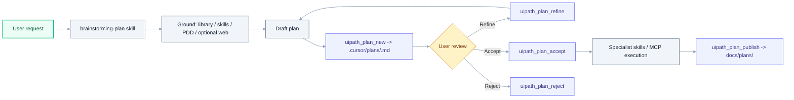

# Planning Framework (Brainstorm -> Plan -> Execute)

A superpowers-style loop for UiPath work in Cursor. Drafts live per-user
(git-ignored), brainstorming is grounded in the repo's documentation and
skills, and acceptance is recorded both in Cursor's plan UI and on disk so
destructive MCP tools can optionally gate on it.

## When to use it

Load `brainstorming-plan` (the Cursor skill) and follow this loop when:

- The user requests a multi-step UiPath build, refactor, or migration.
- The task touches more than one file, project, or skill domain.
- Requirements are ambiguous and you'd otherwise ask multiple clarifying
  questions in a row.
- A PDD/SDD/ADD exists and the work should trace back to it.

Skip the loop for:

- Single-file tweaks or one-shot commands.
- Pure QUESTION intents (answering what something is).
- Emergencies where the user explicitly asks you to just do it.

## The loop



## Storage model

| Location | Git tracked | Purpose |
|---|---|---|
| `.cursor/plans/<YYYY-MM-DD-slug>.md` | No (in `.gitignore`) | Per-user drafts |
| `.cursor/plans/.snapshots/` | No | Auto snapshots written by `uipath_plan_refine` |
| `docs/plans/<same-name>.md` | Yes | Published plans, indexed by `docs/plans/README.md` |

Promotion from draft to published is explicit via `uipath_plan_publish`
(MCP) or `uipath plan publish` (CLI).

## Front matter (template-of-record)

See [docs/plans/\_TEMPLATE.md](plans/_TEMPLATE.md). New status values and
auditable fields:

- `status`: `draft | refining | accepted | rejected | in-progress | done | superseded`
- `accepted_at`, `accepted_by`: stamped by `uipath_plan_accept`
- `rejection_reason`, `rejected_at`, `rejected_by`: stamped by `uipath_plan_reject`
- `published_at`: stamped by `uipath_plan_publish`

## Grounding rules

`uipath_plan_brainstorm` is read-only and returns hints only. Call these
tools as follow-ups to flesh out the draft:

1. `uipath_library_search` / `uipath_library_lookup` - UiPath docs in the
   library.
2. `uipath_skill_match` - best specialist skills for the request.
3. PDD/SDD/ADD under `docs/` - surfaced as `pdd_candidates` in the hint pack.
4. Project discovery - run `uipath-project-discovery-agent` if
   `.claude/rules/project-context.md` is missing before build work.
5. Web research - only when `UIPATH_PLAN_WEB=1`. If no web tool is available
   inside MCP, the response notes it and you should use the host agent's
   web search skill separately.

## Acceptance (two layers)

1. **Cursor plan UI** - primary UX. The `brainstorming-plan` skill presents
   the plan, user clicks accept, Cursor routes execution.
2. **MCP record + optional hard gate** - `uipath_plan_accept` stamps the
   file. When `UIPATH_PLAN_GATE=1`, these workflow tools refuse to run
   without an accepted plan:
   - `uipath_workflow_write_file`
   - `uipath_workflow_install_package`
   - `uipath_workflow_deploy`
   - `uipath_workflow_publish`

   This complements the design-approval gate
   (`UIPATH_DESIGN_APPROVAL_ENABLED`). Both gates default off so current
   flows are unaffected.

## MCP tool reference

| Tool | Purpose |
|---|---|
| `uipath_plan_new` | Scaffold a draft under `.cursor/plans/`. |
| `uipath_plan_brainstorm` | Read-only grounding pack (queries, pdd candidates, clarifying questions). |
| `uipath_plan_refine` | Apply structured patch ops (`set_title`, `set_goal`, `append_task`, `replace_body_section`, `add_mermaid`). |
| `uipath_plan_diff` | Unified diff: draft vs published twin, or draft vs last snapshot. |
| `uipath_plan_accept` | Stamp `accepted_at` / `accepted_by`. |
| `uipath_plan_reject` | Stamp `rejection_reason` / `rejected_at`. Requires a non-empty reason. |
| `uipath_plan_publish` | Promote accepted draft to `docs/plans/`, regenerate index. |
| `uipath_plan_list` | List plans by `scope` = `drafts` / `published` / `both`. |
| `uipath_plan_read` | Read any plan by filename or slug (drafts first, then published). |
| `uipath_plan_render_mermaid` | Extract Mermaid blocks (default scope `both`). |
| `uipath_plan_status_set` | Direct status flip (prefer accept/reject for audit). |
| `uipath_plan_build` | Discovery-fronted planner agent (unchanged). |
| `uipath_plan_save` | Full-content overwrite under `docs/plans/` (unchanged). |

## CLI reference

Every MCP tool above is mirrored as `uipath plan <verb>`:

```bash
uipath plan new "Intake routing" --intent "Route invoices to approvers"
uipath plan brainstorm --slug intake-routing
uipath plan refine '[{"op":"append_task","value":"Write failing test"}]' --slug intake-routing
uipath plan diff --slug intake-routing
uipath plan accept --slug intake-routing --note "reviewed with Daniela"
uipath plan publish --slug intake-routing
uipath plan list --scope both
```

## Environment variables

| Variable | Default | Effect |
|---|---|---|
| `UIPATH_PLAN_WEB` | `0` | `1` requests the brainstorm tool consider web research (noted in output when unavailable). |
| `UIPATH_PLAN_GATE` | `0` | `1` makes the listed destructive workflow tools require an accepted plan. |
| `UIPATH_DESIGN_APPROVAL_ENABLED` | project default | Existing design-approval gate; works alongside `UIPATH_PLAN_GATE`. |

## Related

- [.cursor/skills/brainstorming-plan/SKILL.md](../.cursor/skills/brainstorming-plan/SKILL.md) - how the assistant runs the loop.
- [.cursor/skills/writing-uipath-plans/SKILL.md](../.cursor/skills/writing-uipath-plans/SKILL.md) - plan authoring conventions.
- [docs/PDD_LIFECYCLE.md](PDD_LIFECYCLE.md) - PDD/SDD/ADD lifecycle that plans link back to.
- [docs/MCP_TOOLS.md](MCP_TOOLS.md) - full MCP tool reference with Mermaid diagrams.
