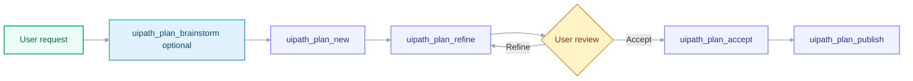

# Planning Framework (UiPlan first, legacy single-file optional)

A superpowers-style loop for UiPath work in Cursor. **Default:** the **UiPlan**
three-file bundle under `.cursor/plans/<slug>/`, grounded with `uipath_plan_ground`,
reviewed with `uipath_plan_review`, accepted with `uipath_plan_accept`, then
published to `docs/plans/` so destructive MCP tools can optionally gate on it.

The canonical Cursor skill is **`uiplan`** (`.cursor/skills/uiplan/SKILL.md`).
There is no separate brainstorming skill; discovery is part of UiPlan.

## When to use it

Load **`uiplan`** and follow the UiPlan loop when:

- The user requests a multi-step UiPath build, refactor, or migration.
- The task touches more than one file, project, or skill domain.
- Requirements are ambiguous and you'd otherwise ask multiple clarifying
  questions in a row.
- A PDD/SDD/ADD exists and the work should trace back to it.

Skip the loop for:

- Single-file tweaks or one-shot commands.
- Pure QUESTION intents (answering what something is).
- Emergencies where the user explicitly asks you to just do it.

## The loop (UiPlan — default)

```mermaid
flowchart LR
  Req[User request]:::in --> UI[uiplan skill]:::process
  UI --> Ground[uipath_plan_ground]:::ro
  Ground --> Spec[uipath_plan_spec_new]:::write
  Spec --> Plan[uipath_plan_plan_new]:::write
  Plan --> Tasks[uipath_plan_tasks_new]:::write
  Tasks --> Rev[uipath_plan_review]:::ro
  Rev --> Review{User review}:::decision
  Review -->|Fix| Spec
  Review -->|Accept| Accept[uipath_plan_accept]:::write
  Review -->|Reject| Reject[uipath_plan_reject]:::write
  Accept --> Execute[Specialist skills / MCP execution]:::process
  Execute --> Publish["uipath_plan_publish -> docs/plans/"]:::write

  classDef in       fill:#ECFDF5,stroke:#10B981,color:#065F46,stroke-width:2px
  classDef process  fill:#F1F5F9,stroke:#64748B,color:#0F172A,stroke-width:1.25px
  classDef decision fill:#FEF3C7,stroke:#D97706,color:#78350F,stroke-width:1.25px
  classDef write    fill:#EEF2FF,stroke:#6366F1,color:#312E81,stroke-width:1.25px
  classDef ro fill:#E0F2FE,stroke:#0284C7,color:#0C4A6E,stroke-width:1.25px

  linkStyle default stroke:#94A3B8,stroke-width:1.5px
```



**Shortcut:** `uipath_plan_uiplan_new` runs ground through `uipath_plan_review(all)` in one call; iterate on findings, then accept and publish as above.

## Legacy loop (single-file plan only)

Use only when the user explicitly wants one markdown file under `.cursor/plans/<slug>.md` (not the UiPlan folder). `uipath_plan_refine` / `uipath_plan_diff` apply here **only**, not to UiPlan folders.



## Storage model

| Location | Git tracked | Purpose |
|---|---|---|
| `.cursor/plans/<YYYY-MM-DD-slug>.md` | No (in `.gitignore`) | Per-user drafts |
| `.cursor/plans/.snapshots/` | No | Auto snapshots written by `uipath_plan_refine` |
| `docs/plans/<same-name>.md` | Yes | Published plans, indexed by `docs/plans/README.md` |
| `.cursor/plans/<YYYY-MM-DD>-<slug>/` (folder) | No | **UiPlan** drafts: `spec.md`, `plan.md`, `tasks.md`, `.meta.yaml` (`plan_kind: uiplan`) |
| `docs/plans/<YYYY-MM-DD>-<slug>/` (folder) | Yes | Published UiPlan (same layout), indexed as `.../spec.md` in `docs/plans/README.md` |

Promotion from draft to published is explicit via `uipath_plan_publish`
(MCP) or `uipath plan publish` (CLI).

## UiPlan (spec-kit-style)

Use UiPlan when you want **three linked artifacts** plus a **structured review** pass before build:

1. **`uipath_plan_ground`** — read-only pack: project-context excerpt, `CLAUDE.md` excerpt, `uipath_skill_match` results, `uipath_library_search` snippets, PDD/SDD candidates, suggested `scaffold/template/` starter, constitution gates from `docs/plans/constitution.md` (or built-in defaults).
2. **`uipath_plan_spec_new`** — creates the draft folder + `spec.md` from `templates/uiplan/_spec-template.md`.
3. **`uipath_plan_plan_new`** — writes `plan.md` (Technical Context, Constitution Check, Project Structure).
4. **`uipath_plan_tasks_new`** — writes `tasks.md` (phases, `[USn]` traceability, test-before-impl sections). It also appends **Resolved activity docs** for each **`[activity:PackageId:ActivityName]`** tag found in **plan.md** or **spec.md** (inline excerpts from the activity-docs cache), and a short **TDD reference (excerpt)** from `framework/uipath_claude/templates/tdd.md` when that file exists in the repo.
5. **`uipath_plan_review`** — returns `{ ok, findings[], next_action }` for `stage`: `spec` \| `plan` \| `tasks` \| `all`.
6. **`uipath_plan_uiplan_new`** — runs ground through review in one call.

```mermaid
flowchart LR
  topic[Topic]:::in --> ground[uipath_plan_ground]:::ro
  ground --> spec[uipath_plan_spec_new]:::write
  spec --> plan[uipath_plan_plan_new]:::write
  plan --> tasks[uipath_plan_tasks_new]:::write
  tasks --> rev[uipath_plan_review]:::ro
  rev --> ok{ok?}:::decision
  ok -->|yes| acc[uipath_plan_accept]:::write
  ok -->|no| spec
  acc --> pub[uipath_plan_publish]:::write
  classDef in fill:#ECFDF5,stroke:#10B981,color:#065F46,stroke-width:2px
  classDef ro fill:#E0F2FE,stroke:#0284C7,color:#0C4A6E,stroke-width:1.25px
  classDef write fill:#EEF2FF,stroke:#6366F1,color:#312E81,stroke-width:1.25px
  classDef decision fill:#FEF3C7,stroke:#D97706,color:#78350F,stroke-width:1.25px
  linkStyle default stroke:#94A3B8,stroke-width:1.5px
```



**Cursor:** use `/uiplan` from `.cursor/commands/uiplan.md`; it loads
`.cursor/skills/uiplan/SKILL.md` and dispatches `full`, `ground`, `spec`,
`plan`, `tasks`, and `review` to the matching `uipath_plan_*` MCP tools.
**Chat:** `/uiplan-ground`, `/uiplan-spec`, `/uiplan-plan`, `/uiplan-tasks`,
`/uiplan-review`, `/uiplan-full`; `/uiplan ...` remains as a dispatcher alias.
**CLI:** `uipath-claude plan uiplan <subcommand>`.

Grounding is not just metadata. `uipath_plan_ground` returns the `uipath-planner`
route, matched specialist skill excerpts, local library hits, and
`uipath_library_lookup` / AskAI-style knowledge snippets. `uipath_plan_plan_new`
writes those inputs into `plan.md` under **Grounding Inputs** so tasks and review
can trace implementation decisions back to skills, library, and project context.

Legacy **single-file** drafts (`uipath_plan_new`, refine, diff) are unchanged. UiPlan folders skip `uipath_plan_refine` / `uipath_plan_diff` (edit markdown directly or regenerate stages).

### UiPlan template kit and two-step runtime (local `tools/uiplan`)

For normalized templates and the **generate-docs → human approval → scaffold-code** flow, see [docs/uiplan/README.md](uiplan/README.md) and [docs/uiplan/HOW_TO_USE.md](uiplan/HOW_TO_USE.md). From the repo root, the local runtime is:

1. `uv run python -m tools.uiplan generate-docs <slug>` — materialize or refresh the doc bundle (drafts under `.cursor/plans/`, published copies under `docs/plans/`, per storage rules above).
2. Human approval on that bundle before implementation.
3. `uv run python -m tools.uiplan scaffold-code <slug> --max-loops N` — drive implementation with an explicit loop cap; omit `--max-loops` to use the **`UIPLAN_MAX_LOOPS`** default.

## Front matter (template-of-record)

See [docs/plans/\_TEMPLATE.md](plans/_TEMPLATE.md). New status values and
auditable fields:

- `status`: `draft | refining | accepted | rejected | in-progress | done | superseded`
- `accepted_at`, `accepted_by`: stamped by `uipath_plan_accept`
- `rejection_reason`, `rejected_at`, `rejected_by`: stamped by `uipath_plan_reject`
- `published_at`: stamped by `uipath_plan_publish`

## Grounding rules

For **UiPlan**, start with **`uipath_plan_ground`** (read-only grounding pack).

**`uipath_plan_brainstorm`** is also read-only and returns hints only; use it as
an optional supplement, or when driving the **legacy single-file** path above.
Follow-ups to flesh out any draft:

1. `uipath_library_search` / `uipath_library_lookup` - UiPath docs in the
   library.
2. `uipath_skill_match` - best specialist skills for the request.
3. PDD/SDD/ADD under `docs/` - surfaced as `pdd_candidates` in the hint pack.
4. Project discovery - run `uipath-project-discovery-agent` if
   `.claude/rules/project-context.md` is missing before build work.
5. Web research - only when `UIPATH_PLAN_WEB=1`. If no web tool is available
   inside MCP, the response notes it and you should use the host agent's
   web search skill separately.

## Acceptance (two layers)

1. **Cursor plan UI** - primary UX. The **`uiplan`** skill presents the plan
   bundle, user clicks accept, Cursor routes execution.
2. **MCP record + optional hard gate** - `uipath_plan_accept` stamps the
   file. When `UIPATH_PLAN_GATE=1`, these workflow tools refuse to run
   without an accepted plan:
   - `uipath_workflow_write_file`
   - `uipath_workflow_install_package`
   - `uipath_workflow_deploy`
   - `uipath_workflow_publish`

   This complements the design-approval gate
   (`UIPATH_DESIGN_APPROVAL_ENABLED`). Both gates default off so current
   flows are unaffected.

## MCP tool reference

| Tool | Purpose |
|---|---|
| `uipath_plan_new` | Scaffold a draft under `.cursor/plans/`. |
| `uipath_plan_brainstorm` | Read-only grounding pack (queries, pdd candidates, clarifying questions). |
| `uipath_plan_refine` | Apply structured patch ops (`set_title`, `set_goal`, `append_task`, `replace_body_section`, `add_mermaid`). |
| `uipath_plan_diff` | Unified diff: draft vs published twin, or draft vs last snapshot. |
| `uipath_plan_accept` | Stamp `accepted_at` / `accepted_by`. |
| `uipath_plan_reject` | Stamp `rejection_reason` / `rejected_at`. Requires a non-empty reason. |
| `uipath_plan_publish` | Promote accepted draft to `docs/plans/`, regenerate index. |
| `uipath_plan_list` | List plans by `scope` = `drafts` / `published` / `both`. |
| `uipath_plan_read` | Read any plan by filename or slug (drafts first, then published). |
| `uipath_plan_render_mermaid` | Extract Mermaid blocks (default scope `both`). |
| `uipath_plan_status_set` | Direct status flip (prefer accept/reject for audit). |
| `uipath_plan_build` | Discovery-fronted planner agent (unchanged). |
| `uipath_plan_save` | Full-content overwrite under `docs/plans/` (unchanged). |

## CLI reference

Every MCP tool above is mirrored as `uipath plan <verb>`:

```bash
uipath plan new "Intake routing" --intent "Route invoices to approvers"
uipath plan brainstorm --slug intake-routing
uipath plan refine '[{"op":"append_task","value":"Write failing test"}]' --slug intake-routing
uipath plan diff --slug intake-routing
uipath plan accept --slug intake-routing --note "reviewed with Daniela"
uipath plan publish --slug intake-routing
uipath plan list --scope both
```

## Environment variables

| Variable | Default | Effect |
|---|---|---|
| `UIPATH_PLAN_WEB` | `0` | `1` requests the brainstorm tool consider web research (noted in output when unavailable). |
| `UIPATH_PLAN_GATE` | `0` | `1` makes the listed destructive workflow tools require an accepted plan. |
| `UIPATH_DESIGN_APPROVAL_ENABLED` | project default | Existing design-approval gate; works alongside `UIPATH_PLAN_GATE`. |

## Related

- [.cursor/skills/uiplan/SKILL.md](../.cursor/skills/uiplan/SKILL.md) - canonical planning loop (UiPlan + discovery).
- [.cursor/skills/writing-uipath-plans/SKILL.md](../.cursor/skills/writing-uipath-plans/SKILL.md) - plan authoring conventions.
- [docs/PDD_LIFECYCLE.md](PDD_LIFECYCLE.md) - PDD/SDD/ADD lifecycle that plans link back to.
- [docs/MCP_TOOLS.md](MCP_TOOLS.md) - full MCP tool reference with Mermaid diagrams.
