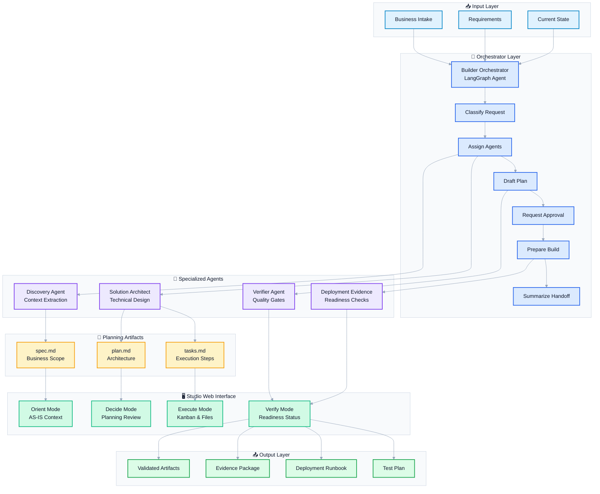
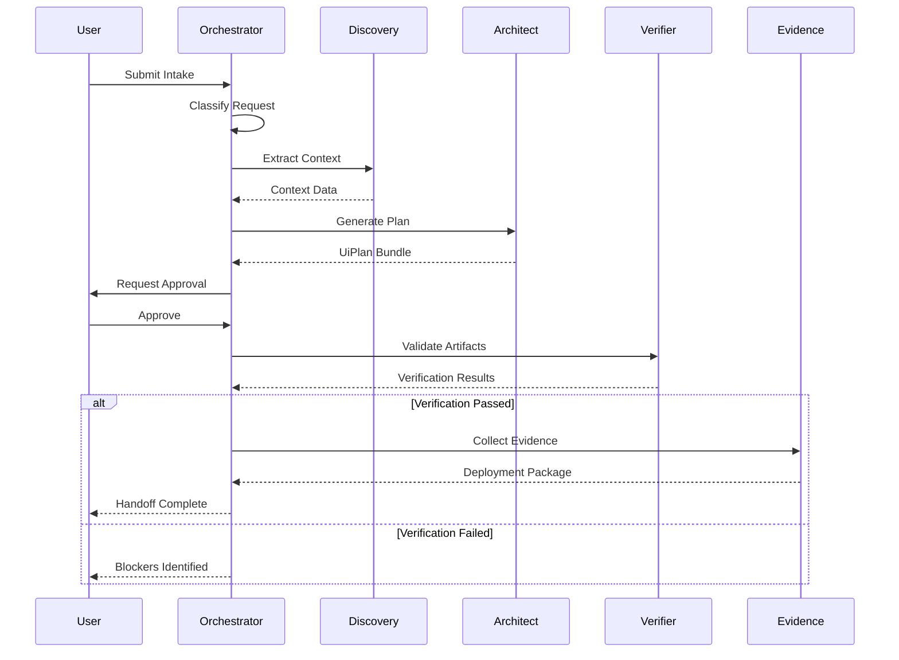

# UiPath Builder Agent - Complete Project Overview

**Status:** AgentHack Submission Ready  
**Last Updated:** May 17, 2026  
**Version:** 0.2

---

## Executive Summary

UiPath Builder Agent is an **agent-of-agents orchestration system** designed for enterprise automation delivery. It bridges business intent and technical implementation through a structured planning framework (spec → plan → tasks), multi-agent coordination, and visual traceability across Orient, Decide, Execute, and Verify modes.

**Core Innovation:** Transforms disconnected planning documents into an executable delivery workflow with governed build steps, validation evidence, and stakeholder-to-developer alignment.

---

## Table of Contents

1. [Project Architecture](#project-architecture)
2. [Agent System](#agent-system)
3. [Workflows](#workflows)
4. [Studio Web Interface](#studio-web-interface)
5. [Documentation Generated](#documentation-generated)
6. [Repository Structure](#repository-structure)
7. [How to Navigate](#how-to-navigate)
8. [Validation Status](#validation-status)
9. [Demo Materials](#demo-materials)
10. [AgentHack Submission](#agenthack-submission)

---

## Project Architecture

### High-Level System Flow



### Technology Stack

| Layer | Technology | Purpose |
|-------|-----------|---------|
| **Orchestration** | LangGraph + Python | Multi-agent coordination and state management |
| **Agents** | Python + UiPath SDK | Specialized agent implementations |
| **Backend API** | FastAPI + Python | REST endpoints for UI and workflow integration |
| **Frontend** | React + TypeScript | Studio Web interface with 4 modes |
| **Storage** | File system + SQLite | Artifact persistence and state tracking |
| **UiPath Integration** | `uipcli`, `uipath` CLI, MCP tools | Native UiPath tooling and validation |

---

## Agent System

### 1. Builder Orchestrator (Main Coordinator)

**Location:** `agents/builder-orchestrator/`

**Purpose:** Coordinates the entire delivery workflow from intake to handoff

**Graph Flow:**

```mermaid
flowchart LR
    START([Start]) --> CLASSIFY[Classify Request]
    CLASSIFY --> ASSIGN[Assign Agents]
    ASSIGN --> DRAFT[Draft Solution Plan]
    DRAFT --> APPROVE[Request Approval]
    APPROVE --> BUILD[Prepare Build]
    BUILD --> HANDOFF[Summarize Handoff]
    HANDOFF --> END([End])
    
    classDef nodeStyle fill:#EFF6FF,stroke:#3B82F6,color:#0F172A,stroke-width:2px
    class CLASSIFY,ASSIGN,DRAFT,APPROVE,BUILD,HANDOFF nodeStyle
```



**State Contract:**
- `intake` - Business requirements input
- `classification` - Categorized request type
- `agentAssignments` - Specialist agent routing
- `planSummary` - Consolidated planning artifacts
- `verificationStatus` - Quality gate results
- `deploymentReadiness` - Go/no-go assessment
- `handoff` - Final delivery package

**Run Command:**
```bash
cd agents/builder-orchestrator
uip codedagent run --input-file ../../samples/invoice-exception/intake.json --output-file out/orchestrator-run.json
```

### 2. Discovery Agent

**Location:** `agents/discovery-agent/`

**Purpose:** Extracts and normalizes business context, current state, and stakeholder requirements

**Key Functions:**
- Parse business intake documents
- Identify systems and integration points
- Extract stakeholder concerns
- Generate AS-IS process documentation

**Output:** Structured context for solution architect

### 3. Solution Architect Agent

**Location:** `agents/solution-architect-agent/`

**Purpose:** Translates business requirements into technical architecture and implementation plan

**Key Functions:**
- Generate `spec.md` (business scope + acceptance criteria)
- Generate `plan.md` (architecture + technology choices)
- Generate `tasks.md` (ordered build steps with evidence requirements)
- Map UiPath capabilities to requirements
- Identify integration patterns

**Output:** Complete UiPlan bundle (spec/plan/tasks)

### 4. Verifier Agent

**Location:** `agents/verifier-agent/`

**Purpose:** Validates artifacts, checks completeness, enforces quality gates

**Key Functions:**
- Validate spec completeness
- Check plan feasibility
- Verify task traceability
- Enforce evidence requirements
- Block incomplete work

**Quality Gates:**
- Spec must define clear acceptance criteria
- Plan must map to UiPath capabilities
- Tasks must include validation commands
- Evidence paths must exist

### 5. Deployment Evidence Agent

**Location:** `agents/deployment-evidence-agent/`

**Purpose:** Collects and validates deployment readiness evidence

**Key Functions:**
- Check telemetry data
- Validate smoke test results
- Verify documentation completeness
- Generate deployment runbook
- Assess go/no-go status

**Output:** Evidence package with deployment clearance or blockers

### Agent Interaction Pattern



### Shared Contracts

**Location:** `agents/shared/agent_contracts.py`

**Contracts:**
```python
class IntakeRequest:
    businessGoal: str
    systems: List[str]
    stakeholders: List[str]
    constraints: List[str]

class ClassificationResult:
    requestType: str  # RPA, Agent, Flow, Case, Solution
    complexity: str   # Simple, Moderate, Complex
    suggestedAgents: List[str]

class PlanBundle:
    spec: str         # spec.md content
    plan: str         # plan.md content
    tasks: str        # tasks.md content
    diagrams: List[str]

class VerificationResult:
    status: str       # passed, failed, pending
    findings: List[Finding]
    blockers: List[str]

class DeploymentEvidence:
    telemetry: Dict
    smokeTest: Dict
    documentation: List[str]
    readiness: str    # ready, blocked, pending
```

---

## Workflows

### 1. CI/CD Telemetry Workflow

**Location:** `workflows/cicd-telemetry-workflow/`

**Purpose:** Collects and normalizes CI/CD execution data

**Input:** CI/CD run logs, test results  
**Output:** `docs/evidence/cicd-telemetry.json`

### 2. Orchestrator Monitor Workflow

**Location:** `workflows/orchestrator-monitor-workflow/`

**Purpose:** Tracks orchestrator execution metrics and agent health

**Input:** Orchestrator state snapshots  
**Output:** `docs/evidence/orchestrator-telemetry.json`

### 3. Documentation Factory Workflow

**Location:** `workflows/documentation-factory-workflow/`

**Purpose:** Generates standardized documentation from templates

**Outputs:**
- `docs/generated/pdd.md` - Process Design Document
- `docs/generated/sdd.md` - Solution Design Document
- `docs/generated/add.md` - Agent Design Document
- `docs/generated/test-plan.md` - Test Plan
- `docs/generated/deployment-runbook.md` - Deployment Guide
- `docs/generated/monitoring-runbook.md` - Operations Guide
- `docs/generated/handoff.md` - Handoff Summary

### 4. Evidence API Workflow

**Location:** `workflows/evidence-api-workflow/`

**Purpose:** Aggregates evidence from all sources into unified handoff package

**Input:** Telemetry files, test results, artifacts  
**Output:** `workflows/evidence-api-workflow/out/handoff-summary.json`

### 5. Smoke Test Workflow

**Location:** `workflows/smoke-test-workflow/`

**Purpose:** Validates deployment readiness with safety checks

**Input:** Handoff summary  
**Output:** `workflows/smoke-test-workflow/out/smoke-result.json`

**Safety Rules:**
- No production deployments from agent sessions
- Evidence validation required
- Blocks on missing artifacts

---

## Studio Web Interface

**Location:** `studio/web/`

**Technology:** React + TypeScript + Vite

### Four Operating Modes

#### 1. Orient Mode
**Purpose:** AS-IS business context and stakeholder alignment

**Views:**
- Business goal visualization
- Current state process map
- System integration points
- Stakeholder concerns

**File:** `studio/web/src/components/OrientMode.tsx`

#### 2. Decide Mode
**Purpose:** Planning review and approval

**Views:**
- Spec review (scope + acceptance criteria)
- Architecture diagrams
- Risk assessment
- Assumptions and constraints

**File:** `studio/web/src/components/DecideMode.tsx`

#### 3. Execute Mode
**Purpose:** Implementation tracking and file management

**Views:**
- Kanban board (tasks by status)
- File explorer with syntax highlighting
- Skill and integration mapping
- Progress tracking

**Features:**
- Drag-and-drop task status updates
- Inline file editing
- Mermaid diagram rendering
- Activity linking

**File:** `studio/web/src/components/ExecuteMode.tsx`

#### 4. Verify Mode
**Purpose:** Readiness validation and evidence review

**Views:**
- Verification checklist
- Evidence artifact listing
- Deployment readiness status
- Blocker identification

**File:** `studio/web/src/components/VerifyMode.tsx`

### Backend API

**Location:** `studio/api/`

**Framework:** FastAPI

**Key Endpoints:**

| Route | Method | Purpose |
|-------|--------|---------|
| `/api/projects` | GET | List all projects |
| `/api/projects/{id}` | GET | Get project details |
| `/api/projects/{id}/graph` | GET | Get project file graph |
| `/api/projects/{id}/files/{path}` | GET | Read file contents |
| `/api/projects/{id}/files/{path}` | PUT | Update file contents |
| `/api/projects/{id}/tasks` | GET | Get task list |
| `/api/projects/{id}/tasks/{id}` | PATCH | Update task status |
| `/api/agentops/intake` | POST | Submit business intake |
| `/api/agentops/orchestrate` | POST | Trigger orchestrator |

**Tests:** `studio/api/tests/` (201 tests passing)

---

## Documentation Generated

All generated documentation is created from templates by the Documentation Factory Workflow.

### 1. Process Design Document (PDD)

**Path:** `docs/generated/pdd.md`

**Sections:**
- Executive Summary
- Business Context
- Process Overview
- Actors and Systems
- Success Metrics
- Assumptions and Constraints

### 2. Solution Design Document (SDD)

**Path:** `docs/generated/sdd.md`

**Sections:**
- Architecture Overview
- Technology Stack
- Integration Patterns
- Data Flows
- Error Handling
- Security Model

### 3. Agent Design Document (ADD)

**Path:** `docs/generated/add.md`

**Sections:**
- Agent Purpose
- State Model
- Graph Design
- Tool Integration
- Evaluation Strategy
- Deployment Model

### 4. Test Plan

**Path:** `docs/generated/test-plan.md`

**Sections:**
- Test Strategy
- Test Cases by Priority
- Acceptance Criteria Mapping
- Regression Suite
- Performance Benchmarks

### 5. Deployment Runbook

**Path:** `docs/generated/deployment-runbook.md`

**Sections:**
- Pre-deployment Checklist
- Deployment Steps
- Rollback Procedures
- Smoke Test Plan
- Post-deployment Verification

### 6. Monitoring Runbook

**Path:** `docs/generated/monitoring-runbook.md`

**Sections:**
- Key Metrics
- Alert Definitions
- Troubleshooting Guide
- Escalation Paths

### 7. Handoff Summary

**Path:** `docs/generated/handoff.md`

**Sections:**
- Delivery Summary
- Artifacts List
- Evidence Package
- Known Issues
- Next Steps

---

## Repository Structure

### Complete Directory Map

```
uipath-builder-agent/
├── agents/                          # Multi-agent system
│   ├── builder-orchestrator/        # Main coordinator agent
│   │   ├── main.py                  # LangGraph implementation
│   │   ├── langgraph.json          # Graph configuration
│   │   ├── agent.mermaid           # Visual graph
│   │   ├── tests/                  # Agent tests
│   │   └── README.md               # Agent documentation
│   ├── discovery-agent/             # Context extraction agent
│   ├── solution-architect-agent/    # Planning agent
│   ├── verifier-agent/              # Quality gate agent
│   ├── deployment-evidence-agent/   # Readiness agent
│   └── shared/                      # Shared contracts
│       ├── agent_contracts.py       # Type definitions
│       └── tests/                   # Contract tests
│
├── workflows/                       # Task 6 workflow implementations
│   ├── cicd-telemetry-workflow/     # CI/CD data collection
│   ├── orchestrator-monitor-workflow/ # Agent health tracking
│   ├── documentation-factory-workflow/ # Doc generation
│   ├── evidence-api-workflow/       # Evidence aggregation
│   └── smoke-test-workflow/         # Deployment validation
│
├── studio/                          # Studio Web UI
│   ├── api/                         # FastAPI backend
│   │   ├── app/
│   │   │   ├── main.py              # API routes
│   │   │   ├── explorer_indexer.py  # File graph builder
│   │   │   └── routers/
│   │   │       ├── agentops_demo.py # AgentOps endpoints
│   │   │       └── mcp_tools.py     # MCP integration
│   │   └── tests/                   # API tests (201 passing)
│   │
│   └── web/                         # React frontend
│       ├── src/
│       │   ├── components/
│       │   │   ├── OrientMode.tsx   # AS-IS context view
│       │   │   ├── DecideMode.tsx   # Planning review
│       │   │   ├── ExecuteMode.tsx  # Kanban + files
│       │   │   ├── VerifyMode.tsx   # Readiness checks
│       │   │   └── UiplanCanvas.tsx # Visual canvas
│       │   ├── projectGraph/
│       │   │   ├── api.ts           # Graph API client
│       │   │   └── types.ts         # Type definitions
│       │   └── __tests__/           # Frontend tests (16 passing)
│       └── package.json
│
├── solution/                        # UiPath Solution packaging
│   ├── solution.uipx                # Solution descriptor
│   ├── bindings/
│   │   └── dev.json                 # Environment bindings
│   └── docs/
│       └── solution-design.md       # Solution architecture
│
├── examples/                        # Demo projects
│   └── 05-agenthack-enterprise-intake/
│       ├── Main.xaml                # Sample workflow
│       ├── project.json             # UiPath project
│       └── README.md                # Usage guide
│
├── samples/                         # Test fixtures
│   └── invoice-exception/
│       └── intake.json              # Sample business intake
│
├── docs/                            # Documentation
│   ├── agenthack/                   # AgentHack submission materials
│   │   ├── README.md                # Submission overview
│   │   ├── submission-materials.md  # Validated assets list
│   │   ├── forum-submission.md      # Forum post draft
│   │   ├── pitch-deck-outline.md    # Pitch deck content
│   │   ├── demo-script.md           # Video narration
│   │   ├── judging-matrix.md        # Criteria alignment
│   │   └── submission-checklist.md  # Final checklist
│   │
│   ├── generated/                   # Generated documentation
│   │   ├── pdd.md                   # Process Design Document
│   │   ├── sdd.md                   # Solution Design Document
│   │   ├── add.md                   # Agent Design Document
│   │   ├── test-plan.md             # Test Plan
│   │   ├── deployment-runbook.md    # Deployment Guide
│   │   ├── monitoring-runbook.md    # Operations Guide
│   │   └── handoff.md               # Handoff Summary
│   │
│   ├── evidence/                    # Validation evidence
│   │   ├── cicd-telemetry.json      # CI/CD metrics
│   │   ├── orchestrator-telemetry.json # Agent metrics
│   │   ├── solution-analyze.json    # Analyzer results
│   │   ├── solution-verification.md # Verification log
│   │   ├── workflow-verification.md # Workflow tests
│   │   └── deployment-smoke.md      # Smoke test results
│   │
│   ├── assets/                      # Media assets
│   │   ├── agenthack/
│   │   │   ├── agenthack-application-walkthrough-voiced.mp4 # Demo video
│   │   │   ├── agenthack-workflow-run-demo.mp4 # Workflow demo
│   │   │   └── frames/              # Video frames
│   │   └── agentops-builder-ui.gif  # UI showcase
│   │
│   ├── README.md                    # Documentation index
│   ├── ARCHITECTURE.md              # System architecture
│   ├── CURSOR_USER_GUIDE.md         # Cursor integration guide
│   ├── USER_GUIDE.md                # CLI usage guide
│   └── CAPABILITY_CONTRACT.md       # API contracts
│
├── framework/                       # Core framework code
│   ├── agentops_builder/           # AgentOps integration
│   │   └── mcp/                    # MCP tools
│   └── tests/                      # Framework tests
│
├── ops/                            # Operations scripts
│   └── scripts/
│       ├── record-agenthack-application-demo.mjs # Demo recording
│       ├── create-agenthack-workflow-demo-video.py # Video processing
│       └── verify-local.ps1        # Local verification
│
├── README.md                       # Main project README
├── AGENTS.md                       # Agent system guide
├── CLAUDE.md                       # AI assistant rules
└── pyproject.toml                  # Python dependencies
```

### Key File Categories

| Category | Location | Purpose |
|----------|----------|---------|
| **Agent Implementations** | `agents/*/main.py` | Specialized agent logic |
| **Agent Tests** | `agents/*/tests/` | Unit and integration tests |
| **Workflow Scripts** | `workflows/*/run.py` | Task execution logic |
| **API Endpoints** | `studio/api/app/routers/` | REST API routes |
| **UI Components** | `studio/web/src/components/` | React components |
| **Documentation** | `docs/` | Guides and references |
| **Demo Assets** | `docs/assets/agenthack/` | Videos and screenshots |
| **Evidence** | `docs/evidence/` | Validation artifacts |
| **Generated Docs** | `docs/generated/` | Template-based docs |

---

## How to Navigate

### For Different Roles

#### 1. Business Analyst / Product Owner
**Start here:**
1. Read `README.md` for project overview
2. Watch `docs/assets/agenthack/agenthack-application-walkthrough-voiced.mp4`
3. Review `docs/generated/pdd.md` to understand process design
4. Check `docs/agenthack/demo-script.md` for quick walkthrough

**Key artifacts:**
- Business intake format: `samples/invoice-exception/intake.json`
- Planning output: `docs/generated/spec.md` (via workflows)
- Acceptance criteria: In spec.md

#### 2. Solution Architect
**Start here:**
1. Read `docs/ARCHITECTURE.md`
2. Review `agents/builder-orchestrator/agent.mermaid`
3. Study `solution/solution.uipx` for packaging structure
4. Check `docs/generated/sdd.md`

**Key artifacts:**
- Agent contracts: `agents/shared/agent_contracts.py`
- Solution design: `docs/generated/sdd.md`
- Architecture diagrams: In plan.md outputs
- Integration patterns: `studio/api/app/routers/`

#### 3. Developer
**Start here:**
1. Read `README.md` → `docs/USER_GUIDE.md`
2. Run setup: `ops/scripts/cursor-quickstart.ps1`
3. Explore agent code: `agents/*/main.py`
4. Run tests: `pytest agents/*/tests -q`

**Key artifacts:**
- Agent implementations: `agents/*/main.py`
- Shared contracts: `agents/shared/agent_contracts.py`
- API routes: `studio/api/app/routers/`
- UI components: `studio/web/src/components/`
- Test suites: `*/tests/`

#### 4. QA / Tester
**Start here:**
1. Read `docs/generated/test-plan.md`
2. Review validation status: `docs/evidence/`
3. Run smoke tests: `workflows/smoke-test-workflow/run.py`
4. Check test results: pytest output

**Key artifacts:**
- Test plan: `docs/generated/test-plan.md`
- Evidence files: `docs/evidence/*.json`
- Smoke test results: `workflows/smoke-test-workflow/out/smoke-result.json`
- Verification logs: `docs/evidence/*-verification.md`

#### 5. Operations / DevOps
**Start here:**
1. Read `docs/generated/deployment-runbook.md`
2. Review `docs/generated/monitoring-runbook.md`
3. Check solution packaging: `solution/solution.uipx`
4. Validate evidence: `docs/evidence/`

**Key artifacts:**
- Deployment runbook: `docs/generated/deployment-runbook.md`
- Monitoring runbook: `docs/generated/monitoring-runbook.md`
- Evidence package: `docs/evidence/`
- Solution bindings: `solution/bindings/`

### For Key Tasks

#### Running the Full System

1. **Start the backend:**
```bash
cd studio/api
uvicorn app.main:app --reload --port 8000
```

2. **Start the frontend:**
```bash
cd studio/web
pnpm dev
```

3. **Access the UI:**
```
http://localhost:5174
```

4. **Run orchestrator:**
```bash
cd agents/builder-orchestrator
uip codedagent run --input-file ../../samples/invoice-exception/intake.json --output-file out/orchestrator-run.json
```

#### Running Tests

**All agent tests:**
```bash
pytest agents/*/tests -q
# Expected: 18 passed
```

**API tests:**
```bash
cd studio/api
pytest tests -q
# Expected: 201 passed
```

**Frontend tests:**
```bash
cd studio/web
pnpm test
# Expected: 16 tests passed
```

**Full validation suite:**
```bash
python ops/scripts/verify-local.ps1
```

#### Generating Documentation

**Run documentation factory:**
```bash
cd workflows/documentation-factory-workflow
python run.py
```

**Output:**
- `docs/generated/pdd.md`
- `docs/generated/sdd.md`
- `docs/generated/add.md`
- `docs/generated/test-plan.md`
- `docs/generated/deployment-runbook.md`
- `docs/generated/monitoring-runbook.md`
- `docs/generated/handoff.md`

#### Creating Demo Videos

**Record UI walkthrough:**
```bash
cd studio/web
pnpm exec node ../../ops/scripts/record-agenthack-application-demo.mjs http://127.0.0.1:5174/
```

**Add voiceover:**
```bash
python ops/scripts/add-uiplan-voiceover.py \
  --video docs/assets/agenthack/recording.webm \
  --srt docs/assets/agenthack/recording.srt \
  --output docs/assets/agenthack/recording-voiced.mp4
```

---

## Validation Status

### Test Results (Latest Run)

| Test Suite | Status | Tests | Location |
|------------|--------|-------|----------|
| Agent Tests | ✅ PASS | 18 passed | `agents/*/tests/` |
| API Tests | ✅ PASS | 201 passed | `studio/api/tests/` |
| Frontend Tests | ✅ PASS | 16 passed | `studio/web/__tests__/` |

### Regression Fixes Applied

**Issue:** XAML invoke indexing failed on namespaced nodes  
**File:** `studio/api/app/explorer_indexer.py`  
**Fix:** Improved `InvokeWorkflowFile` extraction to handle both namespaced and non-namespaced nodes  
**Impact:** Restored workflow-children behavior in project graph

### Evidence Files Generated

| Evidence Type | Path | Status |
|---------------|------|--------|
| CI/CD Telemetry | `docs/evidence/cicd-telemetry.json` | ✅ |
| Orchestrator Telemetry | `docs/evidence/orchestrator-telemetry.json` | ✅ |
| Solution Analysis | `docs/evidence/solution-analyze.json` | ✅ |
| Verification Log | `docs/evidence/solution-verification.md` | ✅ |
| Workflow Verification | `docs/evidence/workflow-verification.md` | ✅ |
| Smoke Test Results | `docs/evidence/deployment-smoke.md` | ✅ |

---

## Demo Materials

### Primary Demo Assets

#### 1. Application Walkthrough Video
**Path:** `docs/assets/agenthack/agenthack-application-walkthrough-voiced.mp4`  
**Duration:** 3-4 minutes  
**Content:** Orient → Decide → Execute → Verify flow with voiceover  
**Subtitles:** `docs/assets/agenthack/agenthack-application-walkthrough.srt`

#### 2. Workflow Run Demo
**Path:** `docs/assets/agenthack/agenthack-workflow-run-demo.mp4`  
**Content:** Live orchestrator execution with agent coordination

#### 3. UI Showcase GIF
**Path:** `docs/assets/agentops-builder-ui.gif`  
**Content:** Animated UI mode transitions

### Demo Script

**Path:** `docs/agenthack/demo-script.md`

**Structure:**
```
0:00-0:20  Opening (problem statement)
0:20-0:55  Problem framing (handoff pain)
0:55-1:30  Orient and Decide modes
1:30-2:20  Execute mode (Kanban + files)
2:20-2:50  Verify mode (evidence + readiness)
2:50-3:20  Agent architecture explanation
3:20-3:40  Validation proof
3:40-4:00  Close (impact summary)
```

### Recording Scripts

**UI Recording:**
```bash
cd studio/web
node ../../ops/scripts/record-agenthack-application-demo.mjs http://127.0.0.1:5174/
```

**Workflow Demo:**
```bash
python ops/scripts/create-agenthack-workflow-demo-video.py
```

---

## AgentHack Submission

### Submission Category

**Primary:** Enterprise Agents  
**Secondary:** UI Agent (agentic automation capabilities)

### Judging Criteria Alignment

**Path:** `docs/agenthack/judging-matrix.md`

| Criterion | Weight | Our Approach |
|-----------|--------|--------------|
| Agentic automation advantage | 25% | Multi-agent orchestration with specialized roles |
| Business impact | 20% | Solves cross-functional handoff pain |
| Technical feasibility | 20% | Working MVP with 235 passing tests |
| Completeness | 15% | Full demo, docs, and evidence package |
| Presentation | 10% | Clear storyline with video and deck |
| Community favorite | 10% | Shareable narrative with practical value |

### Submission Checklist

**Path:** `docs/agenthack/submission-checklist.md`

- [x] Demo video (3-4 min, with voiceover and subtitles)
- [x] Forum post draft ready
- [x] Pitch deck outline complete
- [x] All tests passing (235 total)
- [x] Evidence package validated
- [x] GitHub repository public
- [x] README updated with submission details
- [x] Video hosted and accessible
- [x] Demo script validated

### Forum Submission

**Path:** `docs/agenthack/forum-submission.md`

**Ready to post:** Includes project description, demo link, GitHub link, and judging criteria mapping

### Pitch Deck

**Path:** `docs/agenthack/pitch-deck-outline.md`

**Slide outline ready for official template**

---

## Key Innovation Points

### 1. Agent-of-Agents Architecture
Not a single prompt runner - true multi-agent coordination with:
- Orchestrator for workflow state management
- Specialized agents for domain tasks
- Shared contracts for communication
- LangGraph for graph execution

### 2. Planning-to-Execution Continuity
Structured artifacts (spec/plan/tasks) become executable workflow:
- No disconnected documents
- Visual traceability through UI modes
- Evidence requirements embedded in tasks
- Governed handoff process

### 3. Visual Stakeholder Alignment
Four UI modes bridge business and technical:
- **Orient:** AS-IS context for stakeholders
- **Decide:** Planning review with diagrams
- **Execute:** Implementation tracking with Kanban
- **Verify:** Evidence-based readiness assessment

### 4. UiPath-Native Integration
Built for UiPath ecosystem:
- Compatible with UiPath CLI (`uipcli`, `uipath`, `uip`)
- Solution packaging (`solution.uipx`)
- Workflow analyzer integration
- Activity-first planning approach

### 5. Evidence-Driven Delivery
Every artifact includes evidence requirements:
- Telemetry collection
- Smoke test automation
- Validation checkpoints
- Deployment blockers

---

## Next Steps

### For Developers

1. **Extend agent capabilities:**
   - Add new specialist agents (test automation, integration testing)
   - Enhance orchestrator routing logic
   - Implement agent learning/feedback loops

2. **Enhance UI:**
   - Add real-time agent execution visualization
   - Implement collaborative editing
   - Add diagram authoring tools

3. **Improve workflows:**
   - Automate more evidence collection
   - Add performance benchmarking
   - Enhance deployment automation

### For Product Teams

1. **User research:**
   - Validate with real enterprise teams
   - Gather feedback on UI modes
   - Identify missing capabilities

2. **Integration expansion:**
   - Add more UiPath product integrations
   - Connect to external planning tools
   - Enable API-first usage

3. **Documentation:**
   - Create user guides
   - Record training videos
   - Build community resources

### For Operations

1. **Productionization:**
   - Add authentication/authorization
   - Implement multi-tenancy
   - Set up monitoring and alerting

2. **Scalability:**
   - Optimize agent execution
   - Add result caching
   - Implement queue management

3. **Governance:**
   - Add audit logging
   - Implement approval workflows
   - Create deployment gates

---

## Support and Resources

### Documentation

- **Main README:** `README.md`
- **Architecture:** `docs/ARCHITECTURE.md`
- **User Guides:** `docs/USER_GUIDE.md`, `docs/CURSOR_USER_GUIDE.md`
- **API Reference:** `docs/CAPABILITY_CONTRACT.md`
- **AgentHack Materials:** `docs/agenthack/`

### Code Locations

- **Agents:** `agents/`
- **Workflows:** `workflows/`
- **UI:** `studio/web/`
- **API:** `studio/api/`
- **Tests:** `*/tests/`

### Demo Assets

- **Videos:** `docs/assets/agenthack/`
- **Screenshots:** `docs/assets/screenshots/`
- **Scripts:** `docs/agenthack/demo-script.md`

---

## Change Log

**v0.2 (May 17, 2026)**
- Created comprehensive project overview
- Documented all agents, workflows, and UI components
- Validated submission materials
- Fixed XAML indexing regression
- Generated complete evidence package

**v0.1 (Initial Release)**
- Basic agent system
- Studio Web UI prototype
- Initial workflows
- Core documentation

---

## License and Attribution

Internal project for AgentHack submission.  
Built with UiPath SDK, LangGraph, FastAPI, and React.

---

**End of Project Overview**

For specific questions or detailed navigation, refer to the section links above or the detailed README files in each component directory.
