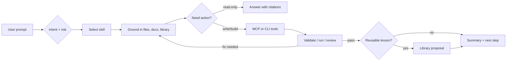
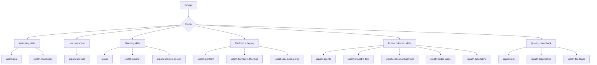
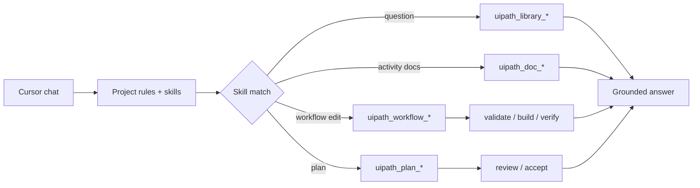
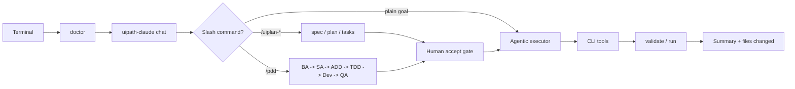
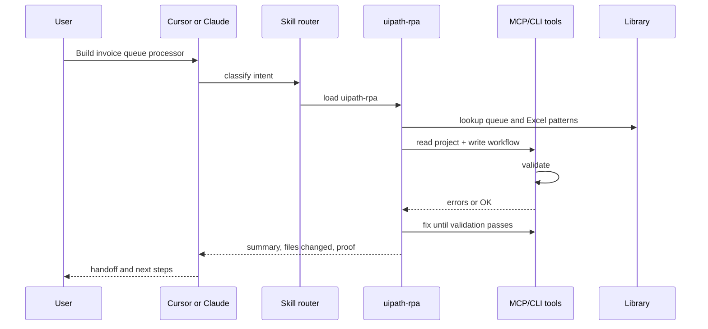

# Skills: layout and visual guide

Single home for how the skill catalog is laid out on disk and how
skills, MCP tools, Cursor, Claude/CLI, UiPlan, and the library work
together at runtime.

---

## Part 1 - Skill folder layout

This repository exposes the same skill catalog to **Cursor** and to the
**Python CLI / MCP server** using different mechanisms. Only one
directory holds the official catalog; the rest are overlays or runtime
code.

### Official catalog (git submodule)

- **`skills/`** - Root of the [UiPath/skills](https://github.com/UiPath/skills)
  submodule. Do not treat it as "our" Python package; it ships plugin
  metadata (`.claude-plugin/`), hooks, agents, and the nested catalog.
- **`skills/skills/<name>/`** - Actual `SKILL.md` trees for each UiPath
  skill. This is the **single copy** of upstream skills in the repo.

### Cursor discovery (generated view, not source of truth)

- **`.cursor/skills`** - Cursor indexes skills here. It should be
  treated as a generated Cursor view of `skills/skills/` plus approved
  Cursor-only overlays, not as the authoritative catalog.
- In this repo `ops/scripts/setup-cursor.*` builds a physical view from
  `skills/skills/` plus `extensions/skills/`. That keeps Cursor and the
  Python loader aligned while preserving approved overlays such as
  `uiplan`, `writing-uipath-plans`, `mermaid-diagram-builder`, and the
  legacy `uipath-servo` redirect.
- After every `git pull` or submodule advance, run
  **`uipath-claude doctor`**. It warns when `.cursor/skills` is missing
  upstream skills or contains unmanaged extras.

### Monitoring upstream (already wired)

- **Canonical content** lives only in the **`skills/` git submodule**
  (`skills/skills/<name>/`). Commit hash is pinned for reproducibility;
  see `.uipath/skills-approved.sha` and
  `python -m uipath_claude.skills.submodule_guard`.
- **SessionStart hook** (repo root `.cursor/hooks.json`) runs
  **`.cursor/hooks/check-skills-update.ps1`**: at most every few days it
  checks whether the submodule is behind `origin/main` and prints a
  **banner** suggesting `/update-skills` or
  `ops/scripts/update-skills.ps1`. It does not auto-pull.
- **`uipath-claude doctor`** checks Cursor skill alignment against
  `skills/skills/` and the approved overlay list in
  `uipath_claude.capabilities`.
- **Claude Code / `uip` session** uses the submodule's
  **`skills/hooks/hooks.json`** (e.g. `ensure-uip.sh`) for npm-based
  tooling, not for copying skill markdown into `.cursor/`.

### Knowledge library (not under `.cursor/`)

- **`data/library/`** - Curated **content**: `catalog.yaml`,
  `books/<id>/...` markdown. MCP tools `uipath_library_*` read from
  here by default (`UIPATH_CLAUDE_LIBRARY` overrides the root). This is
  **not** the Cursor config folder; it is normal repo data.
- **`framework/uipath_claude/library/`** - **Python code** for that
  feature (`catalog.py`, `harvest.py`, `reader.py`, ...). It lives
  under `framework/` with the rest of `uipath_claude` because the MCP
  server and CLI import it as `uipath_claude.library`. Same pattern as
  `framework/uipath_claude/skills/` (code) vs `skills/` (markdown
  submodule).

### Python skill engine (not skill content)

- **`framework/uipath_claude/skills/`** - Code: `registry.py`,
  `loader.py`, `sources.py`, `insights.py`, etc. This loads and merges
  skill roots; it is **not** a folder of `SKILL.md` files.

### `extensions/` at repo root (purpose and structure)

The **`extensions/`** directory groups **git-tracked, team-owned
material** that is not the UiPath submodule and not Cursor-only config:

| Path | Role |
| --- | --- |
| **`extensions/skills/`** | Team skill overlays. Loaded by `build_skill_sources` **after** user/project paths and **before** `skills/skills/`, so same skill name can override upstream. See `extensions/skills/README.md`. |
| **`extensions/skill-insights/`** | Curated PR-reviewed insight JSON (vs raw captures under `.uipath-claude/skill-insights/`). See `extensions/skill-insights/README.md` and `framework/uipath_claude/skills/insights.py`. |
| **`extensions/uipath-rule-bundle/`** | A **portable drop-in kit** (CLAUDE.md, `.cursor/rules`, docs, hooks, optional zip) for other UiPath repos - not consumed as Python imports by this builder. Duplicate of patterns at repo root by design. |

**Should it merge into another folder?** Generally **no**. Moving
overlays under `.cursor/` would mix **editor config** with **versioned
team extensions**; moving them into `skills/` would violate the
submodule boundary. The layout matches `sources.py`
(`project_root / "extensions" / "skills"`). See also
[`extensions/README.md`](../extensions/README.md) for a one-page index
of the three subfolders.

### Team and local overlays

- **`extensions/skills/`** - Optional team-authored skills (may be
  empty; see `extensions/skills/README.md`).
- **`.uipath-claude/skills/`** - Optional per-checkout overrides
  (often gitignored; see `uipath_claude/skills/sources.py`).
- **`~/.cursor/skills/`** - User-wide overrides on the machine running
  the agent.

### Merge order (first wins on name collision)

Implemented in `uipath_claude.skills.sources.build_skill_sources`:

1. Paths from `.uipath-claude/config.yaml` `skills.sources` (if
   present), each as `project` origin
2. `~/.cursor/skills` (`user`)
3. `.uipath-claude/skills` (`project`)
4. `extensions/skills` (`extensions`)
5. `skills/skills` (`uipath-submodule`)
6. Optional template paths when `UIPATH_INCLUDE_TEMPLATE_SKILLS=1`

### Skill insights (separate from skill markdown)

- **`.uipath-claude/skill-insights/`** - Auto-captured or
  machine-local insight JSON.
- **`extensions/skill-insights/`** - Curated team insights promoted
  via PR (see `extensions/skill-insights/README.md`).

### MCP vs LangGraph "tools"

- **`mcp_server/tools/`** - MCP tool handlers wired to `SkillRegistry`
  and related classes.
- **`uipath_claude/tools/`** - LangChain/LangGraph tool wrappers for
  the same product features.

Naming overlap (`skill_tools`, `doc_tools`) reflects two transport
surfaces, not two copies of the skill files on disk.

---

## Part 2 - Skill visual guide

This part is the visual map for how skills, MCP tools, Cursor,
Claude/CLI, UiPlan, and the library work together. Use it when you want
to understand which skill should wake up, what it is allowed to do, and
how the result gets verified.

### The skill runtime loop

Every skill follows the same operating rhythm: route the request, load
the smallest useful skill context, ground facts in
project/library/docs, act through tools, verify, then preserve durable
lessons.

### Skill families

### What each skill does

| Skill | When it should trigger | First move | Output |
| --- | --- | --- | --- |
| `uipath-rpa` | Build, edit, validate, or explain modern UiPath workflow projects. | Read `project.json` / XAML, identify packages and target runtime. | XAML/coded workflow edits plus validation guidance. |
| `uipath-rpa-legacy` | Maintain older .NET Framework / classic workflow projects. | Check framework/runtime assumptions before changing activities. | Legacy-safe XAML edits and migration notes. |
| `uipath-interact` | Inspect or operate a live browser/desktop UI. | Capture current UI state before suggesting selectors or clicks. | Screenshots, UI observations, click/type/read-state results. |
| `uipath-planner` | Ambiguous, multi-skill, or cross-product requests. | Ask one batched clarification only when context cannot answer. | Routed plan and selected specialist skills. |
| `uiplan` | Structured work that needs `spec.md`, `plan.md`, and `tasks.md`. | Ground project context and create/review the UiPlan bundle. | Accepted plan folder ready for implementation. |
| `uipath-solution-design` | Architecture, solution blueprint, integration boundaries. | Separate business process, systems, and non-functional constraints. | Design guidance or solution artifact. |
| `uipath-platform` | Orchestrator, folders, queues, assets, packages, publish/deploy. | Confirm tenant/folder/environment and whether the action is destructive. | Platform commands, deployment guidance, or safe preflight. |
| `uipath-human-in-the-loop` | Action Center, approvals, human review gates. | Identify the decision point and actor/resolution model. | HITL design and implementation guidance. |
| `uipath-gov-aops-policy` | Governance, policy, operational guardrails. | Classify the policy surface and risk. | Guardrail/policy recommendations. |
| `uipath-agents` | UiPath agent design or implementation. | Determine low-code vs coded agent and tool boundaries. | Agent design, code, or configuration guidance. |
| `uipath-maestro-flow` | Maestro `.flow` process orchestration. | Model states, events, human/system tasks, and integration points. | Maestro flow structure or review. |
| `uipath-case-management` | Case plans, stages, case lifecycle automation. | Identify case type, states, tasks, and data model. | Case management design/config guidance. |
| `uipath-coded-apps` | Coded apps and app UI integration. | Identify app surface, actions, data bindings, and SDK needs. | Coded app implementation guidance. |
| `uipath-data-fabric` | Data Fabric entities, records, schemas. | Inspect entity and record operation requirements. | Data model / CRUD guidance. |
| `uipath-test` | Test Manager, test cases, validation scenarios. | Map happy path, edge cases, and failure modes. | Test plan, test cases, or execution guidance. |
| `uipath-diagnostics` | Broken jobs, selectors, auth, runtime failures. | Preserve exact error and reproduction context. | Root-cause path and fix plan. |
| `uipath-feedback` | Product or skill feedback to UiPath. | Collect product area, reproduction, expected/actual, impact. | Structured feedback payload. |

### Cursor helper skills

Some Cursor-visible skills are local helper or compatibility skills
rather than UiPath product-domain skills.

| Skill | Role | How it should behave |
| --- | --- | --- |
| `uiplan` | Canonical planning helper. | Creates and reviews `spec.md`, `plan.md`, and `tasks.md` bundles before implementation (slash: `/uiplan-*`, dispatcher `/uiplan`). |
| `writing-uipath-plans` | Plan-writing helper. | Helps structure implementation plans and review criteria. |
| `mermaid-diagram-builder` | Diagram helper. | Produces Mermaid diagrams that are readable in GitHub and strict renderers. |
| `uipath-servo` | Legacy redirect only. | Points users to `uipath-interact`; do not use it as a canonical skill in new docs/prompts. |

### Cursor flow

Cursor is strongest when skills provide judgment and MCP tools verify
facts.

Cursor best practice:

| Prompt needs | Add this |
| --- | --- |
| Build/edit workflow | Project path, target file, runtime, packages, validation expectation. |
| Live UI inspection | Say `uipath-interact`, name the running app/browser, and forbid file edits if observation only. |
| Platform/deploy | Tenant/folder/environment, whether publish/deploy is allowed, and approval boundary. |
| Q&A | Ask to search the library/docs and cite the result. |

### Claude / CLI flow

Claude/terminal is strongest for bounded agent sessions, slash commands,
and repeatable verification.

Claude best practice:

| Session moment | Best move |
| --- | --- |
| Before work | `uv run uipath-claude doctor`. |
| Before risky edits | Cursor `/uiplan-full "<title>"` or `/pdd`; accepted UiPlans build with `/uiplan-implement <slug>`. |
| During implementation | Keep the prompt scoped to one project or feature slice. |
| Before handoff | Ask which command/tool proved validation. |
| After a durable fix | Stage a library proposal. |

### MCP tool families

```mermaid
flowchart TB
    MCP[MCP server] --> Workflow[uipath_workflow_*]
    MCP --> SkillTools[uipath_skill_*]
    MCP --> AgentTools[uipath_agent_*]
    MCP --> DocTools[uipath_doc_*]
    MCP --> LibraryTools[uipath_library_*]
    MCP --> DesignTools[uipath_design_*]
    MCP --> MemoryTools[uipath_memory_*]

    Workflow --> W1[create / read / write]
    Workflow --> W2[install / validate / run]
    Workflow --> W3[publish / deploy]

    SkillTools --> S1[list / get / match]
    SkillTools --> S2[updates / lessons]

    AgentTools --> A1[plan / execute / bootstrap]
    AgentTools --> A2[BA / SA / intent]

    DocTools --> D1[activity docs]
    DocTools --> D2[project docs]

    LibraryTools --> L1[list / toc / read]
    LibraryTools --> L2[search / lookup]
    LibraryTools --> L3[propose / approve / reject]

    DesignTools --> G1[propose / approve / reject]
    MemoryTools --> M1[load / save / append]
```

### End-to-end example

### Visual legend

| Shape | Meaning |
| --- | --- |
| Rectangle | Work step, tool group, or artifact. |
| Diamond | Routing or risk decision. |
| Loop-back arrow | Validation failure or refinement. |
| Library node | Grounded knowledge or durable learning. |
| Gate node | Human approval before risky/destructive work. |
