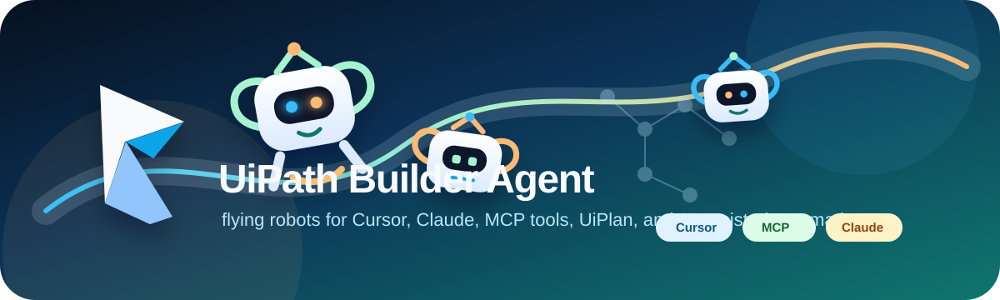
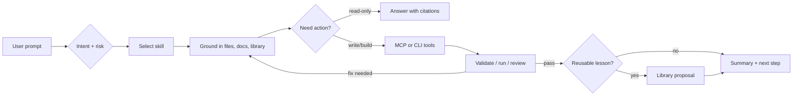
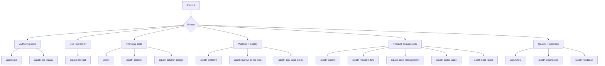
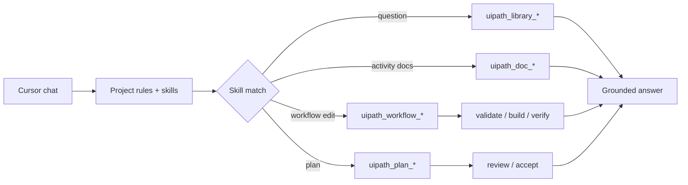
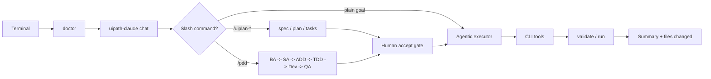
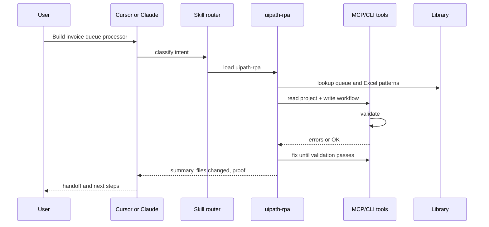

# Skill visual guide

This guide is the visual map for how skills, MCP tools, Cursor, Claude/CLI, UiPlan, and the library work together. Use it when you want to understand which skill should wake up, what it is allowed to do, and how the result gets verified.

## The Skill Runtime Loop

Every skill follows the same operating rhythm: route the request, load the smallest useful skill context, ground facts in project/library/docs, act through tools, verify, then preserve durable lessons.

## Skill Families

## What Each Skill Does

| Skill | When It Should Trigger | First Move | Output |
| --- | --- | --- | --- |
| `uipath-rpa` | Build, edit, validate, or explain modern UiPath workflow projects. | Read `project.json` / XAML, identify packages and target runtime. | XAML/coded workflow edits plus validation guidance. |
| `uipath-rpa-legacy` | Maintain older .NET Framework / classic workflow projects. | Check framework/runtime assumptions before changing activities. | Legacy-safe XAML edits and migration notes. |
| `uipath-interact` | Inspect or operate a live browser/desktop UI. | Capture current UI state before suggesting selectors or clicks. | Screenshots, UI observations, click/type/read-state results. |
| `uipath-planner` | Ambiguous, multi-skill, or cross-product requests. | Ask one batched clarification only when context cannot answer. | Routed plan and selected specialist skills. |
| `uiplan` | Structured work that needs `spec.md`, `plan.md`, and `tasks.md`. | Ground project context and create/review the UiPlan bundle. | Accepted plan folder ready for implementation. |
| `uipath-solution-design` | Architecture, solution blueprint, integration boundaries. | Separate business process, systems, and non-functional constraints. | Design guidance or solution artifact. |
| `uipath-platform` | Orchestrator, folders, queues, assets, packages, publish/deploy. | Confirm tenant/folder/environment and whether the action is destructive. | Platform commands, deployment guidance, or safe preflight. |
| `uipath-human-in-the-loop` | Action Center, approvals, human review gates. | Identify the decision point and actor/resolution model. | HITL design and implementation guidance. |
| `uipath-gov-aops-policy` | Governance, policy, operational guardrails. | Classify the policy surface and risk. | Guardrail/policy recommendations. |
| `uipath-agents` | UiPath agent design or implementation. | Determine low-code vs coded agent and tool boundaries. | Agent design, code, or configuration guidance. |
| `uipath-maestro-flow` | Maestro `.flow` process orchestration. | Model states, events, human/system tasks, and integration points. | Maestro flow structure or review. |
| `uipath-case-management` | Case plans, stages, case lifecycle automation. | Identify case type, states, tasks, and data model. | Case management design/config guidance. |
| `uipath-coded-apps` | Coded apps and app UI integration. | Identify app surface, actions, data bindings, and SDK needs. | Coded app implementation guidance. |
| `uipath-data-fabric` | Data Fabric entities, records, schemas. | Inspect entity and record operation requirements. | Data model / CRUD guidance. |
| `uipath-test` | Test Manager, test cases, validation scenarios. | Map happy path, edge cases, and failure modes. | Test plan, test cases, or execution guidance. |
| `uipath-diagnostics` | Broken jobs, selectors, auth, runtime failures. | Preserve exact error and reproduction context. | Root-cause path and fix plan. |
| `uipath-feedback` | Product or skill feedback to UiPath. | Collect product area, reproduction, expected/actual, impact. | Structured feedback payload. |

## Cursor Helper Skills

Some Cursor-visible skills are local helper or compatibility skills rather than UiPath product-domain skills.

| Skill | Role | How It Should Behave |
| --- | --- | --- |
| `uiplan` | Canonical planning helper. | Creates and reviews `spec.md`, `plan.md`, and `tasks.md` bundles before implementation (slash: `/uiplan-*`, dispatcher `/uiplan`). |
| `writing-uipath-plans` | Plan-writing helper. | Helps structure implementation plans and review criteria. |
| `mermaid-diagram-builder` | Diagram helper. | Produces Mermaid diagrams that are readable in GitHub and strict renderers. |
| `uipath-servo` | Legacy redirect only. | Points users to `uipath-interact`; do not use it as a canonical skill in new docs/prompts. |

## Cursor Flow

Cursor is strongest when skills provide judgment and MCP tools verify facts.

Cursor best practice:

| Prompt Needs | Add This |
| --- | --- |
| Build/edit workflow | Project path, target file, runtime, packages, validation expectation. |
| Live UI inspection | Say `uipath-interact`, name the running app/browser, and forbid file edits if observation only. |
| Platform/deploy | Tenant/folder/environment, whether publish/deploy is allowed, and approval boundary. |
| Q&A | Ask to search the library/docs and cite the result. |

## Claude / CLI Flow

Claude/terminal is strongest for bounded agent sessions, slash commands, and repeatable verification.

Claude best practice:

| Session Moment | Best Move |
| --- | --- |
| Before work | `uv run uipath-claude doctor`. |
| Before risky edits | Cursor `/uiplan full "<title>"` or `/pdd`. |
| During implementation | Keep the prompt scoped to one project or feature slice. |
| Before handoff | Ask which command/tool proved validation. |
| After a durable fix | Stage a library proposal. |

## MCP Tool Families

```mermaid
flowchart TB
    MCP[MCP server] --> Workflow[uipath_workflow_*]
    MCP --> SkillTools[uipath_skill_*]
    MCP --> AgentTools[uipath_agent_*]
    MCP --> DocTools[uipath_doc_*]
    MCP --> LibraryTools[uipath_library_*]
    MCP --> DesignTools[uipath_design_*]
    MCP --> MemoryTools[uipath_memory_*]

    Workflow --> W1[create / read / write]
    Workflow --> W2[install / validate / run]
    Workflow --> W3[publish / deploy]

    SkillTools --> S1[list / get / match]
    SkillTools --> S2[updates / lessons]

    AgentTools --> A1[plan / execute / bootstrap]
    AgentTools --> A2[BA / SA / intent]

    DocTools --> D1[activity docs]
    DocTools --> D2[project docs]

    LibraryTools --> L1[list / toc / read]
    LibraryTools --> L2[search / lookup]
    LibraryTools --> L3[propose / approve / reject]

    DesignTools --> G1[propose / approve / reject]
    MemoryTools --> M1[load / save / append]
```

## End-To-End Example

## Visual Legend

| Shape | Meaning |
| --- | --- |
| Rectangle | Work step, tool group, or artifact. |
| Diamond | Routing or risk decision. |
| Loop-back arrow | Validation failure or refinement. |
| Library node | Grounded knowledge or durable learning. |
| Gate node | Human approval before risky/destructive work. |
