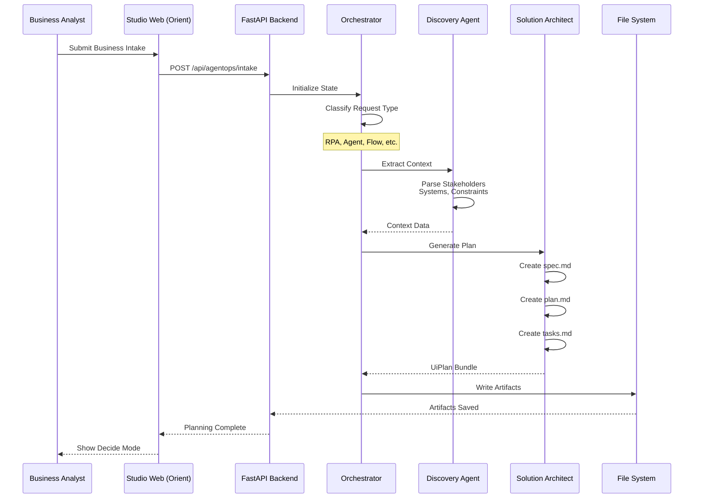
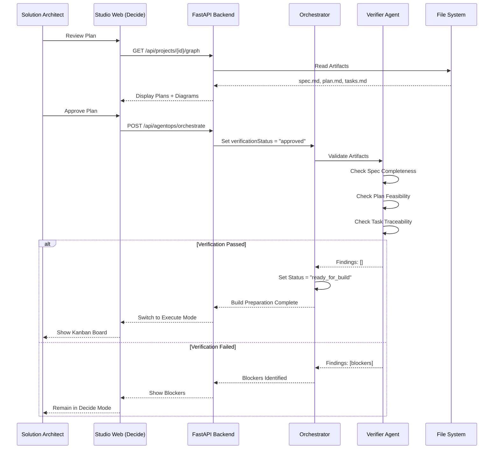
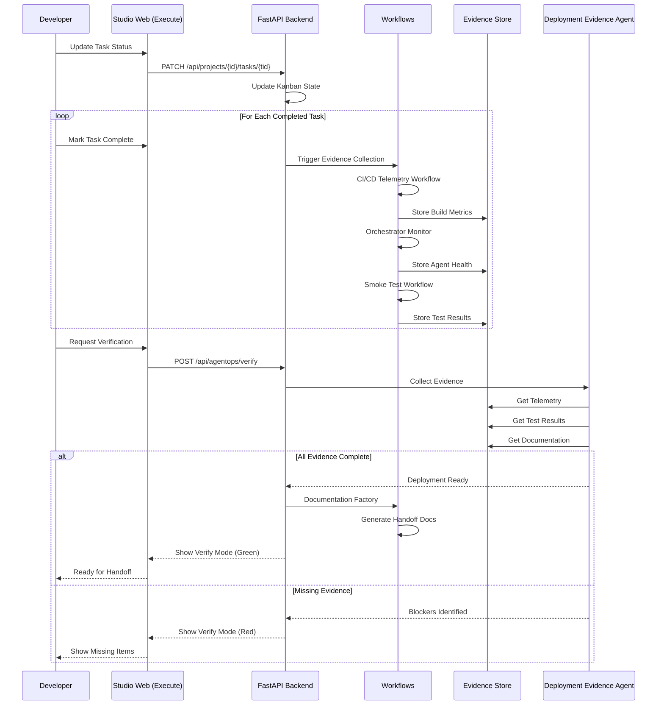
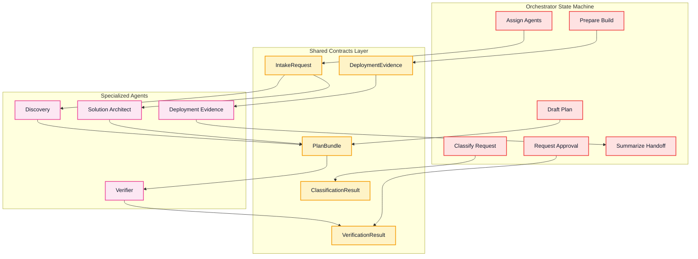
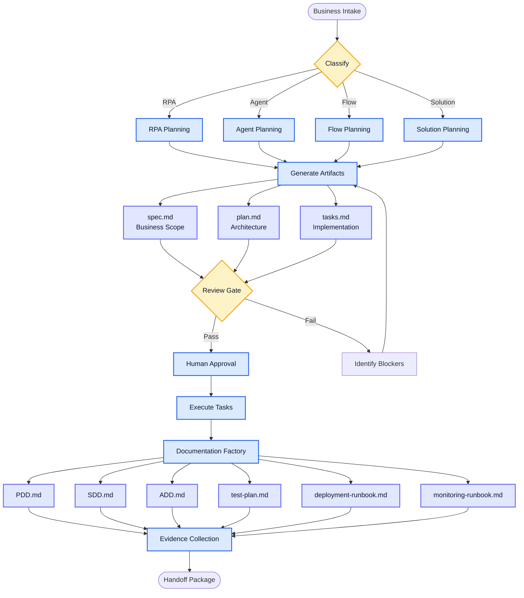
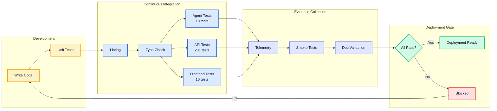
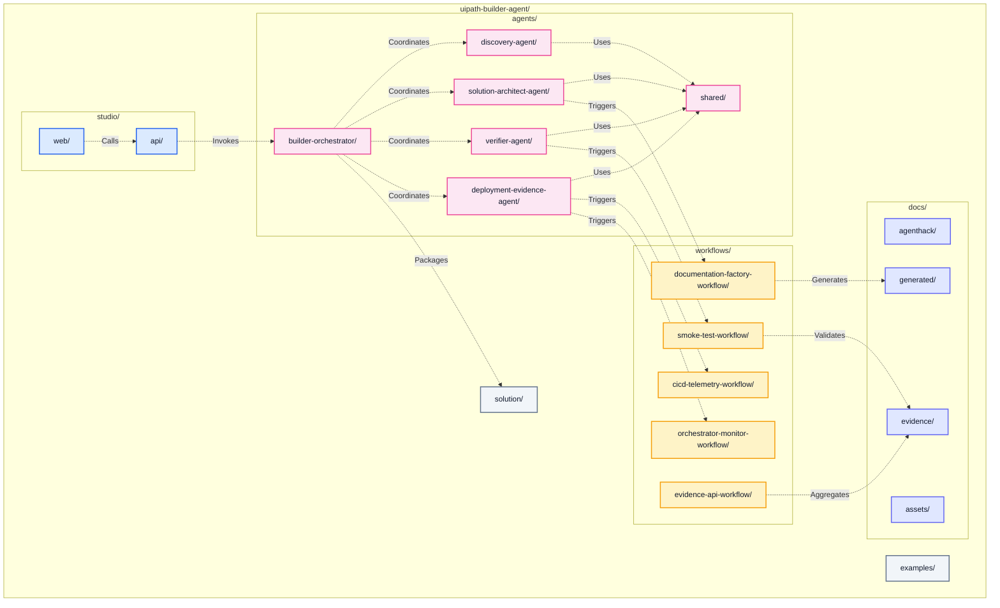

# UiPath Builder Agent - System Diagram

**Visual guide to system architecture and data flow**

---

## Complete System Architecture

```mermaid
%%{init: {'theme':'base','themeVariables':{'primaryColor':'#E2E8F0','primaryTextColor':'#0F172A','primaryBorderColor':'#94A3B8','lineColor':'#94A3B8','secondaryColor':'#F1F5F9','tertiaryColor':'#F8FAFC','background':'#FFFFFF','clusterBkg':'#F8FAFC','clusterBorder':'#CBD5E1','titleColor':'#0F172A','edgeLabelBackground':'#FFFFFF','fontFamily':'Inter, ui-sans-serif, system-ui'}}}%%
graph TB
    subgraph UserLayer["👤 User Layer"]
        BA[Business Analyst]
        SA[Solution Architect]
        DEV[Developer]
        QA[QA Engineer]
        OPS[Operations]
    end
    
    subgraph InterfaceLayer["🖥️ Interface Layer - Studio Web"]
        UI1[Orient Mode<br/>AS-IS Context]
        UI2[Decide Mode<br/>Planning Review]
        UI3[Execute Mode<br/>Kanban + Files]
        UI4[Verify Mode<br/>Evidence + Readiness]
    end
    
    subgraph APILayer["⚡ API Layer - FastAPI"]
        API1[/api/projects]
        API2[/api/agentops/intake]
        API3[/api/agentops/orchestrate]
        API4[/api/projects/{id}/graph]
        API5[/api/projects/{id}/tasks]
    end
    
    subgraph OrchestrationLayer["🎯 Orchestration Layer"]
        ORCH[Builder Orchestrator<br/>LangGraph State Machine]
        ORCH_CLASSIFY[Classify Request]
        ORCH_ASSIGN[Assign Agents]
        ORCH_DRAFT[Draft Plan]
        ORCH_APPROVE[Request Approval]
        ORCH_BUILD[Prepare Build]
        ORCH_HANDOFF[Summarize Handoff]
    end
    
    subgraph AgentLayer["🤖 Agent Layer"]
        AGENT1[Discovery Agent<br/>Context Extraction]
        AGENT2[Solution Architect<br/>Technical Design]
        AGENT3[Verifier Agent<br/>Quality Gates]
        AGENT4[Deployment Evidence<br/>Readiness Checks]
    end
    
    subgraph WorkflowLayer["🔄 Workflow Layer"]
        WF1[CI/CD Telemetry<br/>Build Metrics]
        WF2[Orchestrator Monitor<br/>Agent Health]
        WF3[Documentation Factory<br/>Doc Generation]
        WF4[Evidence API<br/>Data Aggregation]
        WF5[Smoke Test<br/>Deployment Validation]
    end
    
    subgraph ArtifactLayer["📄 Artifact Layer"]
        ART1[spec.md<br/>Business Scope]
        ART2[plan.md<br/>Architecture]
        ART3[tasks.md<br/>Implementation]
        ART4[PDD/SDD/ADD<br/>Formal Docs]
        ART5[Evidence Package<br/>Validation Data]
    end
    
    subgraph StorageLayer["💾 Storage Layer"]
        FS[(File System<br/>Projects & Artifacts)]
        DB[(SQLite<br/>State & Metadata)]
        EVIDENCE[(Evidence Store<br/>Telemetry & Logs)]
    end
    
    subgraph IntegrationLayer["🔌 Integration Layer"]
        UIPATH[UiPath Platform<br/>Orchestrator + Studio]
        MCP[MCP Tools<br/>Skill Registry]
        CLI[UiPath CLI<br/>uipcli, uipath, uip]
    end
    
    %% User to Interface
    BA --> UI1
    SA --> UI2
    DEV --> UI3
    QA --> UI4
    OPS --> UI4
    
    %% Interface to API
    UI1 --> API1
    UI2 --> API2
    UI3 --> API3
    UI3 --> API4
    UI3 --> API5
    UI4 --> API5
    
    %% API to Orchestration
    API2 --> ORCH
    API3 --> ORCH
    
    %% Orchestration Flow
    ORCH --> ORCH_CLASSIFY
    ORCH_CLASSIFY --> ORCH_ASSIGN
    ORCH_ASSIGN --> ORCH_DRAFT
    ORCH_DRAFT --> ORCH_APPROVE
    ORCH_APPROVE --> ORCH_BUILD
    ORCH_BUILD --> ORCH_HANDOFF
    
    %% Orchestration to Agents
    ORCH_ASSIGN --> AGENT1
    ORCH_ASSIGN --> AGENT2
    ORCH_DRAFT --> AGENT3
    ORCH_BUILD --> AGENT4
    
    %% Agents to Workflows
    AGENT1 --> WF4
    AGENT2 --> WF3
    AGENT3 --> WF5
    AGENT4 --> WF1
    AGENT4 --> WF2
    
    %% Workflows to Artifacts
    WF3 --> ART1
    WF3 --> ART2
    WF3 --> ART3
    WF3 --> ART4
    WF4 --> ART5
    WF5 --> ART5
    
    %% Artifacts to Storage
    ART1 --> FS
    ART2 --> FS
    ART3 --> FS
    ART4 --> FS
    ART5 --> EVIDENCE
    
    %% Orchestration to Storage
    ORCH --> DB
    
    %% Integration Layer
    ORCH --> MCP
    AGENT2 --> CLI
    WF5 --> UIPATH
    
    %% Storage to API (read back)
    FS --> API4
    DB --> API5
    EVIDENCE --> API5
    
    classDef userStyle fill:#F3E8FF,stroke:#9333EA,color:#0F172A,stroke-width:2px
    classDef uiStyle fill:#DBEAFE,stroke:#2563EB,color:#0F172A,stroke-width:2px
    classDef apiStyle fill:#D1FAE5,stroke:#10B981,color:#0F172A,stroke-width:2px
    classDef orchStyle fill:#FEE2E2,stroke:#EF4444,color:#0F172A,stroke-width:2px
    classDef agentStyle fill:#FCE7F3,stroke:#EC4899,color:#0F172A,stroke-width:2px
    classDef workflowStyle fill:#FEF3C7,stroke:#F59E0B,color:#0F172A,stroke-width:2px
    classDef artifactStyle fill:#E0E7FF,stroke:#6366F1,color:#0F172A,stroke-width:2px
    classDef storageStyle fill:#F1F5F9,stroke:#64748B,color:#0F172A,stroke-width:2px
    classDef integrationStyle fill:#FED7AA,stroke:#EA580C,color:#0F172A,stroke-width:2px
    
    class BA,SA,DEV,QA,OPS userStyle
    class UI1,UI2,UI3,UI4 uiStyle
    class API1,API2,API3,API4,API5 apiStyle
    class ORCH,ORCH_CLASSIFY,ORCH_ASSIGN,ORCH_DRAFT,ORCH_APPROVE,ORCH_BUILD,ORCH_HANDOFF orchStyle
    class AGENT1,AGENT2,AGENT3,AGENT4 agentStyle
    class WF1,WF2,WF3,WF4,WF5 workflowStyle
    class ART1,ART2,ART3,ART4,ART5 artifactStyle
    class FS,DB,EVIDENCE storageStyle
    class UIPATH,MCP,CLI integrationStyle
```

---

## Data Flow Diagrams

### 1. Business Intake to Artifacts



### 2. Planning Review to Execution



### 3. Implementation to Evidence Collection



---

## Component Interaction Map

### Frontend to Backend

```mermaid
graph LR
    subgraph Frontend["React Frontend (Port 5174)"]
        Orient[OrientMode.tsx]
        Decide[DecideMode.tsx]
        Execute[ExecuteMode.tsx]
        Verify[VerifyMode.tsx]
    end
    
    subgraph Backend["FastAPI Backend (Port 8000)"]
        ProjectAPI[/api/projects]
        GraphAPI[/api/projects/{id}/graph]
        TaskAPI[/api/projects/{id}/tasks]
        IntakeAPI[/api/agentops/intake]
        OrchestrateAPI[/api/agentops/orchestrate]
        VerifyAPI[/api/agentops/verify]
    end
    
    Orient -->|GET| ProjectAPI
    Orient -->|GET| GraphAPI
    
    Decide -->|GET| GraphAPI
    Decide -->|POST| IntakeAPI
    Decide -->|POST| OrchestrateAPI
    
    Execute -->|GET| TaskAPI
    Execute -->|PATCH| TaskAPI
    Execute -->|GET| GraphAPI
    
    Verify -->|GET| TaskAPI
    Verify -->|POST| VerifyAPI
    
    classDef frontendStyle fill:#DBEAFE,stroke:#2563EB,color:#0F172A,stroke-width:2px
    classDef backendStyle fill:#D1FAE5,stroke:#10B981,color:#0F172A,stroke-width:2px
    
    class Orient,Decide,Execute,Verify frontendStyle
    class ProjectAPI,GraphAPI,TaskAPI,IntakeAPI,OrchestrateAPI,VerifyAPI backendStyle
```

### Agent Communication Pattern



---

## Artifact Generation Flow



---

## Test and Validation Pipeline



---

## Directory to Component Mapping



---

## Key Takeaways

### System Layers (Top to Bottom)
1. **User Layer:** BA, SA, Dev, QA, Ops personas
2. **Interface Layer:** 4 UI modes (Orient, Decide, Execute, Verify)
3. **API Layer:** RESTful endpoints for frontend-backend communication
4. **Orchestration Layer:** LangGraph state machine coordination
5. **Agent Layer:** Specialized agents for domain tasks
6. **Workflow Layer:** Evidence collection and doc generation
7. **Artifact Layer:** Planning files and documentation
8. **Storage Layer:** File system, database, evidence store
9. **Integration Layer:** UiPath platform, MCP, CLI tools

### Data Flow Pattern
```
Intake → Classification → Agent Assignment → Planning → Approval → 
Implementation → Evidence Collection → Verification → Handoff
```

### Key Integration Points
- Frontend ↔ Backend: REST API (JSON)
- Backend ↔ Orchestrator: Python function calls
- Orchestrator ↔ Agents: Shared contracts (typed)
- Agents ↔ Workflows: File system writes
- Workflows ↔ Storage: Evidence persistence
- System ↔ UiPath: CLI commands and MCP tools

---

**Navigate to:**
- [Project Overview](PROJECT_OVERVIEW.md) - Complete documentation
- [Navigation Guide](NAVIGATION_GUIDE.md) - Find what you need
- [Main README](../README.md) - Quick start

**Last Updated:** May 17, 2026  
**Version:** 1.0
