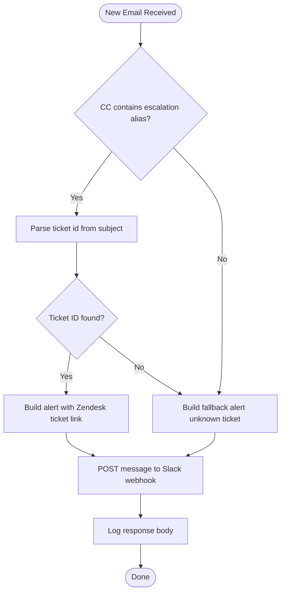

# Process Definition Document (PDD)

**Process Name**: Escalations alerts  
**Version**: 1.0  
**Date**: 2026-05-04  
**Author**: AI Assistant (derived from exported process definition)  
**Status**: Draft

---

## I. Introduction

### Purpose
This document defines the business and technical intent of the Escalations alerts
automation. The process monitors incoming escalation-related emails and notifies
support leadership in Slack with relevant Zendesk context when available.

### Objectives
- Reduce missed or delayed handling of escalation emails.
- Improve support leadership visibility into unassigned Zendesk escalation tickets.

### Key Contacts
| Role | Name | Contact Details | Notes |
| --- | --- | --- | --- |
| Process Owner | Support Management Team | escalations@catonetworks.com | Escalation policy owner |
| Automation Owner | UiPath Automation Team | Internal UiPath team channel | Maintains workflow and connections |
| Operations Stakeholder | Support Leaders | Slack user group `@support-leaders` | Primary alert audience |

### Minimum Pre-requisites
1. Active UiPath Integration Service connection to Microsoft Office 365 mailbox.
2. Active Slack webhook endpoint and valid outbound network access.
3. Monitored mailbox folder set to `Inbox` for escalation trigger processing.

### Important Process Data
| Item | Value | Notes |
| --- | --- | --- |
| Process ID | `bf1a7e3f-cd91-42d5-a8f2-1ec7047a952d` | Studio Web process identifier |
| Solution ID | `003c0f7e-9045-486f-c3bc-08de8671d449` | Parent solution identifier |
| Entry Point | `Main.xaml` | Single workflow entry |
| Escalation Alias | `escalations@catonetworks.com` | CC-based escalation gate |
| Ticket Regex | `Support\\s+#(\\d+)` | Extracts Zendesk ticket id from subject |
| Office 365 Connector | `UIPATH_CATO_ROBOT_PROD@catonetworks.com` | Connected trigger mailbox resource |
| Slack Connector | `supporty #3` (`supporty_2`) | Connected Slack resource |
| Alert Channel | Slack incoming webhook | Support leaders notification destination |

---

## II. AS IS Process Description

### Process Overview
| Item | Description |
| --- | --- |
| Process Area | Support Operations |
| Short Description | Escalation emails are manually reviewed and relayed to support leadership. |
| Role(s) Required | Support Engineer / Escalation Manager |
| Process Schedule | Event-driven (when escalation emails arrive) |
| Number of Executions | Variable; depends on incoming escalation volume |
| Process Execution Time | Manual relay typically 1-5 minutes per escalation |
| Peak Period(s) | Incident spikes / outage windows |
| Input Data | Escalation email metadata and content |
| Output Data | Manual Slack escalation messages and Zendesk follow-up |

### Applications Used
| Application | Version | Language | Type | Access Method |
| --- | --- | --- | --- | --- |
| Microsoft Office 365 Mail | SaaS | English | Web/API | Integration Service connector |
| Slack | SaaS | English | Web/API | Incoming webhook |
| Zendesk | SaaS | English | Web | Ticket URL reference |

### High Level Process Map (AS IS)
1. Support escalation emails arrive in monitored inbox.
2. Human operator checks if mail is relevant to escalation CC routing.
3. Human operator extracts ticket reference from subject/body and posts to Slack.

### Process Statistics (AS IS)
| Metric | Value |
| --- | --- |
| Average triage latency | 1-5 minutes per escalation (manual) |
| Manual effort | Continuous monitoring overhead |
| Error risk | Medium (missed routing or incorrect ticket reference) |

### Current Pain Points
- Reliance on manual inbox monitoring causes delays.
- Ticket identifiers may be missed or copied incorrectly.
- Escalation visibility is inconsistent during high-volume periods.

---

## III. TO BE Process Description

### TO BE Flow Chart

### Detailed TO BE Process Map
1. **[AUTO]** `NewEmailReceived` trigger captures a new Office 365 inbox message.
2. **[AUTO]** Workflow logs email content and checks whether CC contains
   `escalations@catonetworks.com`.
3. **[DECISION]** If escalation CC exists, parse subject using regex
   `Support\s+#(\d+)` to derive `Zendesk_ticket_id`; otherwise use fallback branch.
4. **[MANUAL]** Human-in-the-loop remains outside the workflow in Slack/Zendesk for
   post-alert decisioning and assignment.
5. **[AUTO]** Workflow sends Slack webhook payload to support leaders with sender,
   ticket context, and Zendesk link when available.

### In Scope for Automation
| Action | Description | Automation Level |
| --- | --- | --- |
| Email event intake | Trigger on new message in configured inbox | Full |
| Escalation routing check | Evaluate CC for escalation alias | Full |
| Ticket ID extraction | Regex parse from subject pattern | Full |
| Slack notification | Post formatted escalation payload via webhook | Full |
| Ticket assignment decision | Actual support handling in Zendesk | Manual |

### Out of Scope
- Automatic ticket assignment or status transition in Zendesk.
- SLA management workflows beyond notification.
- Advanced retry queueing and dead-letter handling.

---

## IV. Exception Handling

### Known Business Exceptions
| Exception | Description/Parameters | Robot Action |
| --- | --- | --- |
| Ticket ID missing | Subject does not match `Support #<digits>` | Send fallback Slack alert with unknown ticket wording |
| Non-escalation email | CC does not include escalation alias | Follow configured fallback notification branch |

### Known Application Errors
| Error | Description/Parameters | Robot Action |
| --- | --- | --- |
| Office 365 trigger failure | Connector auth/token/network issue | Run fails per platform behavior; investigate connector health |
| Slack webhook HTTP failure | Non-2xx or timeout response | Response logged; no explicit retry in current workflow |
| Runtime exception | Unhandled activity error | Job faults; requires operational follow-up |

---

## V. Reporting Requirements

| Report Type | Frequency | Details | Tool |
| --- | --- | --- | --- |
| Execution logs | Per run | Email body log + Slack response payload | UiPath job logs |
| Failure review | Daily/On incident | Trigger/connector faults and failed notifications | UiPath Orchestrator monitoring |
| Escalation alert audit | Weekly | Sample of Slack alerts vs incoming escalation emails | Slack + mailbox review |

---

## VI. Success Metrics

### Business Value Metrics
| Metric | Current (Manual) | Target (Automated) | Business Impact |
| --- | --- | --- | --- |
| Escalation notification latency | 1-5 min typical | < 1 min event-to-alert | Faster leadership visibility |
| Missed escalation alerts | Non-zero risk | Near-zero for correctly routed emails | Reduced incident communication gaps |
| Manual triage effort | Continuous monitoring | Event-driven exception handling only | Lower operational overhead |

### ROI Summary
| Component | Metric | Value/Impact |
| --- | --- | --- |
| Time saved | Manual relay reduction | Moderate recurring ops savings |
| Quality gain | Better consistency of alerts | Lower missed/incorrect escalation communication |
| Risk reduction | Faster incident awareness | Improved response posture |

### Run Cost Estimate
| Cost Type | Monthly $ | Notes |
| --- | --- | --- |
| UiPath platform (robot runtime) | TBD | Based on execution volume |
| Infrastructure/network | TBD | Dependent on environment setup |
| LLM & vector store (if agentic) | N/A | Not applicable for current process |
| Support / ops allocation | TBD | Monitoring and incident support |
| **Total monthly run cost** | TBD | Consolidated estimate |

**Net monthly benefit**: (Business value from §VI) − (Total monthly run cost) = $ TBD  
**Payback period**: (Implementation cost) ÷ (Net monthly benefit) = TBD months

---

## VII. Additional Documentation
- **Workflow Diagrams**: `Escalations alerts/Main.xaml`
- **Sample Inputs/Outputs**: Escalation email event payload and Slack webhook response
- **LLM Prompts (if applicable)**: N/A

