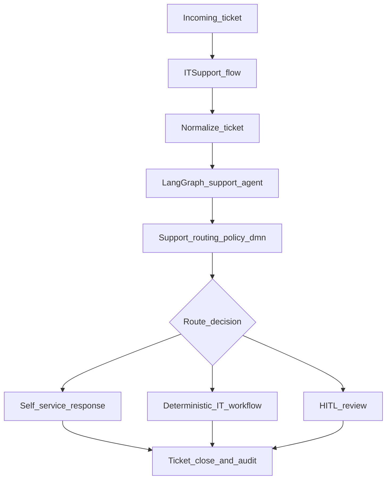
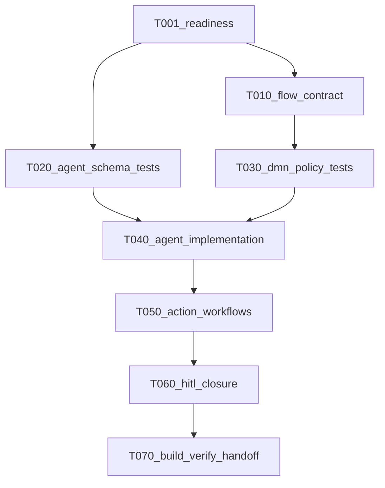
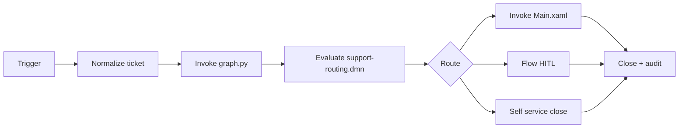
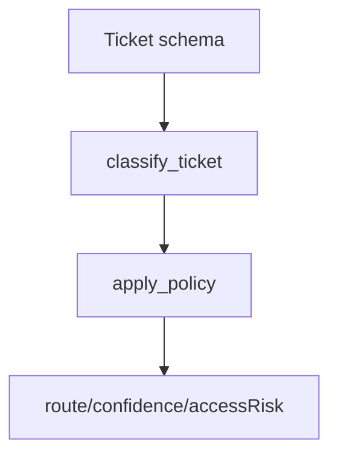
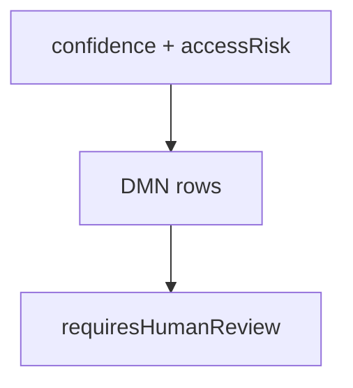
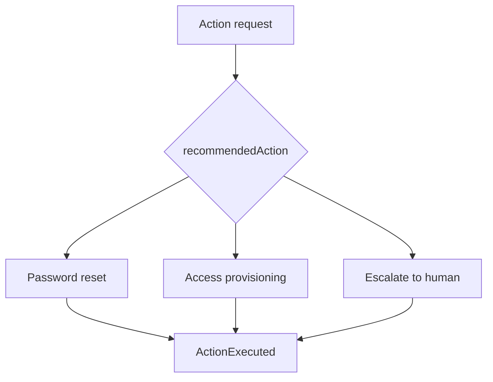

# IT Support Agent: Flow + DMN + HITL Demo

> Superseded for implementation by the UiPlan folder bundle at
> `.cursor/plans/2026-04-28-it-support-flow-dmn-hitl-demo/`
> (`spec.md`, `plan.md`, `tasks.md`), which contains the 360 visibility contract
> and executable task-level detail.

## 360 bundle navigation

| Need | Navigate to |
| --- | --- |
| Business scope and outcomes | `.cursor/plans/2026-04-28-it-support-flow-dmn-hitl-demo/spec.md` |
| Architecture, dependencies, skill/tool/subagent routing | `.cursor/plans/2026-04-28-it-support-flow-dmn-hitl-demo/plan.md` |
| Step-by-step execution, task IDs, verify commands, evidence paths | `.cursor/plans/2026-04-28-it-support-flow-dmn-hitl-demo/tasks.md` |

Source use-case reference:
- [IT Support Agent - Coded agents challenge](https://forum.uipath.com/t/it-support-agent-coded-agents-challenge/5671451)
- [Forum reply](https://forum.uipath.com/t/it-support-agent-coded-agents-challenge/5671451/2)

Execution-grade demo plan: Flow owns orchestration and HITL, LangGraph owns
semantic reasoning, DMN owns deterministic policy, and Modern RPA workflows own
deterministic IT actions.

## Scope

- Build a ticket-triage demo for Information Technology and Services.
- Resolve self-serviceable tickets automatically where policy allows.
- Trigger deterministic UiPath actions for standard IT requests.
- Escalate to human review when policy or confidence requires it.

## Solution topology

## Plan phases

| Phase | Goal | Deliverable |
| --- | --- | --- |
| Phase 1 | Readiness and access gates | `out/tool-readiness.txt` |
| Phase 2 | Flow + agent + DMN test baseline | validation + JUnit evidence |
| Phase 3 | Implement graph/action/flow branches | updated `graph.py`, `Main.xaml`, `it-support.flow` |
| Phase 4 | HITL closure and route finalization | Flow HITL paths validated |
| Phase 5 | Build, verify, diagnose/rerun | `out/verification-summary.md`, `out/diagnose-rerun.md` |

## Task dependency map

## Workflow-level build visuals

### `it-support.flow`

### `graph.py`

### `support-routing.dmn`

### `Main.xaml`

## Readiness gate for execution

- `uipcli --help`, `uip --version`, `uipath --version`, `uv --version`
- Studio Web access for Flow/HITL
- Orchestrator Dev/personal workspace only for smoke tests
- No secrets in repo; assets/env vars only
- DMN in scope explicitly recorded before task generation
