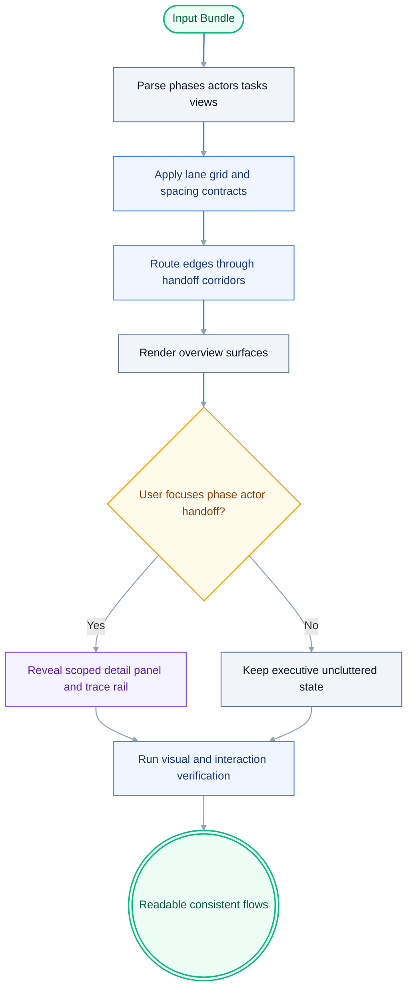

# UiPlan Visual Reorganization Execution Plan

> For agentic workers: implement task-by-task; use checkboxes below.

**Goal:** Reorganize all UiPlan flow visuals so `AS-IS`, `TO-BE`, workflow,
phase, and kanban views remain readable, non-overlapping, and ownership-clear.

**Architecture:** The execution introduces deterministic layout contracts
(phase-row + actor-column), orthogonal edge routing, and adaptive progressive
disclosure. Core behavior is centered in canvas rendering components so all
views share a consistent visual grammar while preserving each view's planning
purpose.

## Architecture diagram



## File plan

| Path | Responsibility |
|------|------------------|
| `studio/web/src/components/UiplanCanvas.tsx` | View orchestration, tabs, shared layout and interaction state |
| `studio/web/src/components/AsIsCanvas.tsx` | `AS-IS` lane layout, ownership cues, pain-point readable rendering |
| `studio/web/src/components/ToBeCanvas.tsx` | `TO-BE` architecture layout, automation emphasis, SLA markers |
| `studio/web/src/projectGraph/types.ts` | Optional typed metadata support for phase/actor/lane/density contracts |
| `templates/uiplan/_spec-template.md` | Keep `AS-IS` anchor expectations aligned with visual contracts |
| `templates/uiplan/_plan-template.md` | Keep `TO-BE` and runtime visual contracts aligned with renderer |
| `docs/uiplan/EXPLORER.md` | Document explorer/view mapping expectations after layout changes |
| `docs/superpowers/specs/2026-05-11-uiplan-visual-organization-design.md` | Approved design baseline referenced by implementation |

## Bite-sized tasks

- [ ] Add explicit lane model (`phase`, `actor`, `depth`) for all primary nodes
- [ ] Implement deterministic slot assignment and minimum spacing guarantees
- [ ] Replace free/curved connector routing with orthogonal corridor routing
- [ ] Add overview density cap and cluster collapsing in `AS-IS`/`TO-BE`
- [ ] Add focus chips and one-click reset behavior in `UiplanCanvas`
- [ ] Add scoped expansion panel for selected phase/actor/handoff
- [ ] Add trace rail/breadcrumb state shared across views
- [ ] Add `AS-IS vs TO-BE` delta highlighting mode
- [ ] Ensure workflow/phase/kanban use same semantic IDs and styling tokens
- [ ] Add long-label handling and overflow-safe card rendering
- [ ] Add fixture-based visual regression checks for overlap and crossing limits
- [ ] Add interaction tests for focus, reset, and cross-view selection coherence
- [ ] Update UiPlan docs/templates to reflect final visual contracts
- [ ] Run verification commands
- [ ] Commit with a clear implementation message

## Verification

```bash
pnpm --dir studio/web test
pnpm --dir studio/web lint
pnpm --dir studio/web build
```

## Rollback

Revert implementation commits touching UiPlan canvas and view components, then
restore previous rendering behavior while retaining the design/spec docs for the
next iteration.
