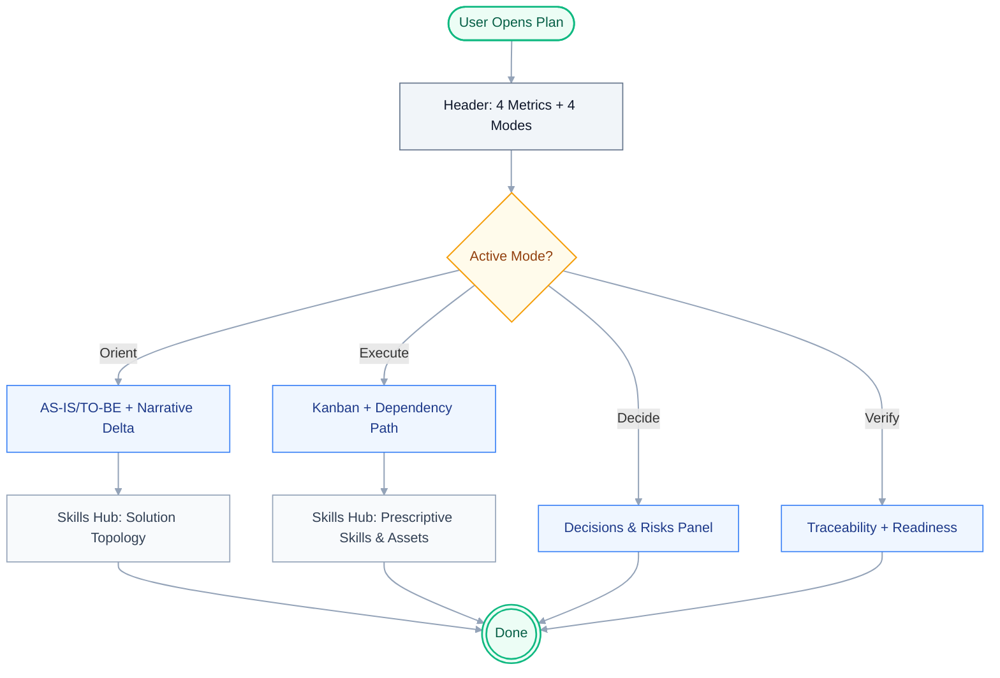

# UiPlan UX Modes and Skills Hub Implementation

> For agentic workers: implement task-by-task; use checkboxes below.

**Goal:** Implement the 4-mode IA (Orient, Decide, Execute, Verify), L0-L3 progressive disclosure, and dynamic Skills Hub in UiPlan Studio.

**Architecture:** Refactor `UiplanCanvas.tsx` to use the 4 canonical modes instead of ad-hoc views. The header will permanently display 4 landing metrics. The `ContextKnowledgePanel` will be upgraded into a mode-aware Skills & Integrations Hub. CSS fixes for overflow and truncation will be applied.

## Architecture diagram



## File plan

| Path | Responsibility |
|------|------------------|
| `studio/web/src/components/UiplanCanvas.tsx` | Mode state, header metrics, view routing, Skills Hub logic, CSS fixes |
| `studio/web/src/components/OrientView.tsx` | (New) Executive summary, AS-IS/TO-BE diagrams, narrative delta |
| `studio/web/src/components/DecideView.tsx` | (New) Decisions, assumptions, risks inspector |
| `studio/web/src/components/VerifyView.tsx` | (New) Traceability map, readiness gate scores |

## Bite-sized tasks

- [ ] Update `UiplanCanvas.tsx` state to use `orient`, `decide`, `execute`, `verify` modes.
- [ ] Refactor header in `UiplanCanvas.tsx` to show Phase, Blocker Count, Next Action, Approval State.
- [ ] Create `OrientView` component (Executive Summary + Narrative Delta).
- [ ] Create `DecideView` component.
- [ ] Create `VerifyView` component.
- [ ] Upgrade `ContextKnowledgePanel` to be mode-aware (Skills & Integrations Hub).
- [ ] Implement L0-L3 drill-down logic in `UiplanCanvas.tsx`.
- [ ] Apply CSS fix: `overflowX: auto` for `docFlowRail`.
- [ ] Apply CSS fix: `textOverflow: ellipsis` for `ContextItem` labels.
- [ ] Run linter and tests.
- [ ] Commit with clear message.

## Verification

```bash
pnpm --dir studio/web test
pnpm --dir studio/web lint
pnpm --dir studio/web build
```

## Rollback

Revert the commits touching `studio/web/src/components/UiplanCanvas.tsx` and the new view components.
