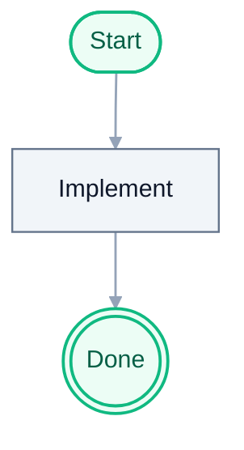

# Example Implementation Plan

> For agentic workers: implement task-by-task; use checkboxes below.

**Goal:** One sentence describing the outcome.

**Architecture:** Two or three sentences on approach and boundaries.

## Architecture diagram



## File plan

| Path | Responsibility |
|------|------------------|
| `path/to/file.py` | ... |

## Bite-sized tasks

- [ ] Write or adjust failing test
- [ ] Run test, confirm red
- [ ] Minimal implementation
- [ ] Run `pytest` (or project test command)
- [ ] Update docs if behavior changed
- [ ] Commit with clear message

## Verification

```bash
pytest tests/ -q
```

## Rollback

Revert the commit / delete the branch; note any data migrations separately.
