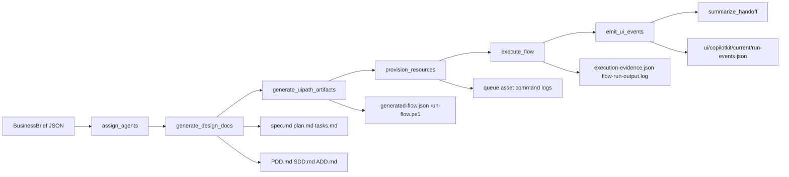

# UiPlan Architecture Deep Dive

## System overview

UiPlan is a deterministic LangGraph supervisor that transforms a structured business brief into
documentation, build artifacts, resource provisioning checks, execution evidence, and a viewer
payload for post-run review.

## Runtime state contract

The orchestrator state tracks:

- `brief`: normalized intake (scope, systems, constraints, loop settings, commands)
- `agentAssignments`: specialist ownership by phase
- `phaseHistory` and `hitlDecisions`: timeline + approvals
- `buildIterations` and `deployIterations`: loop control telemetry
- `generatedDocuments`, `buildArtifacts`, `provisionedResources`: deliverables
- `executionEvidence`: run outputs and command traces
- `handoff`: final summary with evidence checklist

## Phase behavior

### 1) `assign_agents`

Defines phase owners:

- intake-analyst
- solution-architect
- workflow-generator
- platform-provisioner
- run-verifier
- supervisor

### 2) `generate_design_docs`

Creates:

- UiPlan: `spec.md`, `plan.md`, `tasks.md`
- Design docs: `PDD.md`, `SDD.md`, `ADD.md`

Templating is grounded by brief fields (objective, constraints, systems, stakeholders, criteria).

### 3) `generate_uipath_artifacts`

Creates:

- `generated-flow.json`
- `run-flow.ps1`

Runs a build/analyze loop with configurable budgets and forced-failure testing hooks.

### 4) `provision_resources`

Behavior:

- `dryRun=true`: marks queue/asset as `simulated`
- `dryRun=false`: executes `queueProvisionCommand` and `assetProvisionCommand`
- Missing commands in real mode become explicit failures

In this submission run, resource commands query real Orchestrator data from `Shared`.

### 5) `execute_flow`

Behavior:

- `dryRun=true`: simulated deploy-test pass/fail loop
- `dryRun=false`: executes `flowRunCommand`, persists raw output logs, tracks deploy iterations

### 6) `emit_ui_events`

Serializes full run state to:

- `<out>/ui/run-events.json`
- `ui/copilotkit/current/run-events.json` (viewer auto-load path)

Also enriches payload with constraints graph data.

### 7) `summarize_handoff`

Builds final handoff package:

- summary, status
- artifacts/resources/evidence
- phase history and escalation data
- evidence checklist for review gates

## Constraints intelligence

The pipeline extracts and merges constraints from:

- Brief constraints
- Skill critical-rules sections (`skills/skills/*/SKILL.md`)
- Codebase constraint lines (`.py`, `.md`, `.json`)

It classifies severity (`high`, `medium`, `low`) and detects likely violations with regex
heuristics, then emits:

- severity counts
- violations list
- top files by density
- Mermaid constraints graph
- markdown codebase constraints summary

## CopilotKit viewer model

The viewer renders seven tabs from a single event payload:

1. UiPlan
2. Diagrams
3. Constraints
4. Tasks (Kanban parsed from `tasks.md`)
5. Execution
6. Resources
7. Docs

This gives a unified lens for planning quality, runtime behavior, and evidence quality.

## Real run used for submission

- Run ID: `enterpriseincidentagentbuilder-20260524163750`
- Output root: `agents/builder-orchestrator/out/enterpriseincidentagentbuilder-20260524163750`
- Handoff status: `completed`
- Queue/asset evidence: pulled live from Orchestrator Shared folder

## Deployment pathway

Project-level and solution-level deployment are intentionally separate:

- Orchestrator resource visibility: via `uip resource` and `uip or`
- Coded agent runtime validation: local `python`/`uipath run`
- Solution packaging/deployment: `uipcli solution pack` + `uipcli solution deploy` (non-prod)

This separation keeps build visibility high while preserving deploy safety gates.
