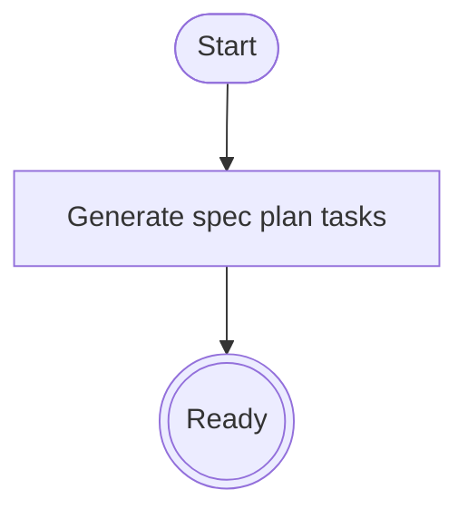

# Track B UiPlan Runtime Restructure Implementation Plan

> **Plan record:** **Merged to `main` 2026-04-23** via `feat/parallel-a-b-impl` (fast-forward). Original task checkboxes below remain the historical script; see [§ Plan closure](#plan-closure-2026-04-23) for verification.

> **For agentic workers:** REQUIRED SUB-SKILL: Use superpowers:subagent-driven-development (recommended) or superpowers:executing-plans to implement this plan task-by-task. Steps use checkbox (`- [ ]`) syntax for tracking.

**Goal:** Build a spec-kit style UiPlan runtime with explicit `generate-docs` and `scaffold-code` commands and a configurable skill-driven validation loop.

**Architecture:** Implement the runtime under `tools/uiplan/` and publish template kit assets under `docs/plans/_uiplan-kit/`, while preserving compatibility with existing planner/MCP flows. Use existing specialist skills for build loops and enforce `restore -> analyze -> test -> pack` gates with configurable retries.

**Tech Stack:** Python 3.11, Typer/CLI patterns, pytest, existing MCP plan tools, UiPath skill orchestration

---

### Task 1: Create UiPlan runtime package skeleton and command entrypoints

**Files:**
- Create: `tools/uiplan/__init__.py`
- Create: `tools/uiplan/cli.py`
- Create: `tools/uiplan/config.py`
- Create: `tools/uiplan/generators/__init__.py`
- Test: `tools/uiplan/tests/test_cli_entrypoints.py`

- [ ] **Step 1: Write failing CLI entrypoint test**

```python
# tools/uiplan/tests/test_cli_entrypoints.py
from tools.uiplan.cli import app


def test_commands_registered():
    names = {c.name for c in app.registered_commands}
    assert "generate-docs" in names
    assert "scaffold-code" in names
```

- [ ] **Step 2: Run test and verify fail state**

Run: `uv run pytest tools/uiplan/tests/test_cli_entrypoints.py -q`  
Expected: FAIL (module/command missing).

- [ ] **Step 3: Add minimal CLI with required commands**

```python
# tools/uiplan/cli.py
import typer

app = typer.Typer(help="UiPlan runtime commands")


@app.command("generate-docs")
def generate_docs(plan_slug: str) -> None:
    print(f"generate-docs:{plan_slug}")


@app.command("scaffold-code")
def scaffold_code(plan_slug: str, max_loops: int = 5) -> None:
    print(f"scaffold-code:{plan_slug}:max_loops={max_loops}")
```

- [ ] **Step 4: Re-run CLI test**

Run: `uv run pytest tools/uiplan/tests/test_cli_entrypoints.py -q`  
Expected: PASS.

- [ ] **Step 5: Commit**

```bash
git add tools/uiplan/__init__.py tools/uiplan/cli.py tools/uiplan/config.py tools/uiplan/generators/__init__.py tools/uiplan/tests/test_cli_entrypoints.py
git commit -m "feat(uiplan): add runtime package and explicit command entrypoints"
```

### Task 2: Move and normalize `_uiplan` templates into `_uiplan-kit`

**Files:**
- Create: `docs/plans/_uiplan-kit/_spec-template.md`
- Create: `docs/plans/_uiplan-kit/_plan-template.md`
- Create: `docs/plans/_uiplan-kit/_tasks-template.md`
- Create: `docs/plans/_uiplan-kit/README.md`
- Create: `tools/uiplan/tests/test_template_kit.py`

- [ ] **Step 1: Write failing template-kit test**

```python
from pathlib import Path


def test_uiplan_kit_contains_required_templates():
    root = Path(__file__).resolve().parents[3]
    kit = root / "docs" / "plans" / "_uiplan-kit"
    required = ["_spec-template.md", "_plan-template.md", "_tasks-template.md", "README.md"]
    assert all((kit / name).is_file() for name in required)
```

- [ ] **Step 2: Run test to verify fail state**

Run: `uv run pytest tools/uiplan/tests/test_template_kit.py -q`  
Expected: FAIL.

- [ ] **Step 3: Create normalized kit templates with mandatory mermaid section**

```markdown
## Architecture diagram


```

- [ ] **Step 4: Re-run template-kit test**

Run: `uv run pytest tools/uiplan/tests/test_template_kit.py -q`  
Expected: PASS.

- [ ] **Step 5: Commit**

```bash
git add docs/plans/_uiplan-kit/_spec-template.md docs/plans/_uiplan-kit/_plan-template.md docs/plans/_uiplan-kit/_tasks-template.md docs/plans/_uiplan-kit/README.md tools/uiplan/tests/test_template_kit.py
git commit -m "feat(uiplan): add normalized template kit for generate-docs flow"
```

### Task 3: Implement configurable loop policy and skill-driven execution gates

**Files:**
- Create: `tools/uiplan/scaffold/loop_runner.py`
- Create: `tools/uiplan/integrations/skills_bridge.py`
- Modify: `tools/uiplan/cli.py`
- Create: `tools/uiplan/tests/test_loop_policy.py`

- [ ] **Step 1: Write failing loop policy test**

```python
from tools.uiplan.scaffold.loop_runner import resolve_max_loops


def test_cli_flag_overrides_env(monkeypatch):
    monkeypatch.setenv("UIPLAN_MAX_LOOPS", "9")
    assert resolve_max_loops(flag_value=4) == 4
```

- [ ] **Step 2: Add loop resolver and bounds**

```python
def resolve_max_loops(flag_value: int | None, env_value: str | None = None) -> int:
    source = flag_value if flag_value is not None else int(env_value or 5)
    if source < 1 or source > 25:
        raise ValueError("max loops must be within 1..25")
    return source
```

- [ ] **Step 3: Add gate runner skeleton (`restore`, `analyze`, `test`, `pack`)**

```python
def run_gate_sequence(skill_executor, max_loops: int) -> dict:
    for i in range(1, max_loops + 1):
        result = skill_executor(iteration=i, gates=["restore", "analyze", "test", "pack"])
        if result["status"] == "ok":
            return {"status": "ok", "iteration": i}
        if result["recoverable"] is False:
            return {"status": "failed", "iteration": i, "reason": result["reason"]}
    return {"status": "failed", "reason": "max_loops_exhausted"}
```

- [ ] **Step 4: Run loop policy tests**

Run: `uv run pytest tools/uiplan/tests/test_loop_policy.py -q`  
Expected: PASS.

- [ ] **Step 5: Commit**

```bash
git add tools/uiplan/scaffold/loop_runner.py tools/uiplan/integrations/skills_bridge.py tools/uiplan/cli.py tools/uiplan/tests/test_loop_policy.py
git commit -m "feat(uiplan): add configurable loop policy and skill-driven gate runner"
```

### Task 4: Update skill/docs references and preserve compatibility

**Files:**
- Modify: `.cursor/skills/uiplan/SKILL.md`
- Modify: `docs/PLANNING_FRAMEWORK.md`
- Create: `tools/uiplan/tests/test_docs_links.py`

- [ ] **Step 1: Add failing docs-link test**

```python
from pathlib import Path


def test_uiplan_skill_mentions_generate_then_scaffold():
    root = Path(__file__).resolve().parents[3]
    text = (root / ".cursor" / "skills" / "uiplan" / "SKILL.md").read_text(encoding="utf-8")
    assert "generate-docs" in text
    assert "scaffold-code" in text
```

- [ ] **Step 2: Update skill to explicit two-step model**

```markdown
1) Run `uiplan generate-docs`
2) Obtain human approval on generated docs
3) Run `uiplan scaffold-code --max-loops <n>`
```

- [ ] **Step 3: Re-run docs-link test**

Run: `uv run pytest tools/uiplan/tests/test_docs_links.py -q`  
Expected: PASS.

- [ ] **Step 4: Run full Track B test subset**

Run:
```bash
uv run pytest tools/uiplan/tests -q
uv run pytest tests/mcp/test_plan_tools.py -q
```
Expected: PASS.

- [ ] **Step 5: Commit**

```bash
git add .cursor/skills/uiplan/SKILL.md docs/PLANNING_FRAMEWORK.md tools/uiplan/tests/test_docs_links.py
git commit -m "docs(uiplan): align skill/docs with explicit two-step runtime workflow"
```

## Verification

Run:

```bash
uv run pytest tools/uiplan/tests -q
uv run pytest tests/mcp/test_plan_tools.py tests/mcp/test_tool_annotations.py -q
```

Expected:
- runtime package tests green,
- plan MCP tools unaffected,
- two-step command model documented and test-verified.

## Rollback

- Keep `docs/plans/_uiplan/` untouched until `_uiplan-kit` is fully wired.
- Revert only `tools/uiplan/` if loop policy integration causes regressions.
- If Track A path changes land first, adapt imports to contract resolver before continuing Track B.

---

## Plan closure (2026-04-23)

**Disposition:** **Implemented on `main`** — `tools/uiplan/` (Typer CLI, `generate-docs` / `scaffold-code`, loop runner, `UIPLAN_MAX_LOOPS`), `docs/plans/_uiplan-kit/`, tests under `tools/uiplan/tests/`, and doc/skill alignment per Task 4 landed with the same merge as Track A.

**Design:** `docs/superpowers/specs/2026-04-23-uiplan-runtime-restructure-design.md` (finalized baseline).

**Post-merge verification (2026-04-23):** `uv run pytest tools/uiplan/tests framework/tests/migration -q` green; full `uv run pytest -q` green on merged tree (see Track A closure for counts).

**Follow-up:** Wire deeper MCP/planner integration or Phase 4 path cleanup under the same **subagent-driven-development** + board checkpoint discipline.
