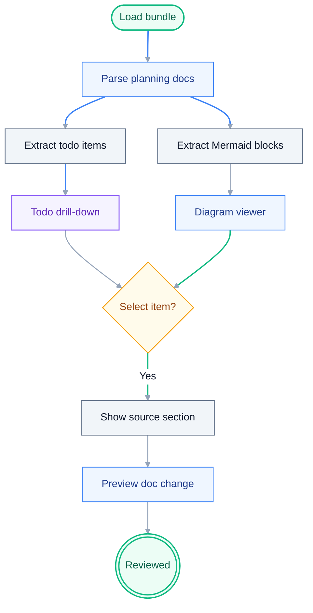

# UiPlan Studio Planning Doc Visualization Implementation Plan

> **For agentic workers:** REQUIRED SUB-SKILL: Use superpowers:subagent-driven-development (recommended) or superpowers:executing-plans to implement this plan task-by-task. Steps use checkbox (`- [ ]`) syntax for tracking.

**Goal:** Build a visual planning workspace that turns `spec.md`, `plan.md`, and `tasks.md` into an interactive todo checklist, rendered Mermaid workflow diagrams, and drill-down views connected to the existing UiPlan Studio canvas.

**Architecture:** Add a backend document visualization service that parses planning markdown into typed sections, tasks, and Mermaid blocks. The React app loads that model through a new API endpoint and renders it in a right-size set of focused panels: overview, todo drill-down, Mermaid diagram viewer, and selected planning item details. The implementation preserves the existing preview/apply invariant: parsing and rendering are read-only, and any document changes still go through existing preview/apply flows.

**Tech Stack:** Python 3.11, FastAPI, Pydantic, React 18, TypeScript, Vite, Vitest, React Testing Library, `mermaid` for browser-side rendering.

---

## Source Context

**Product spec:** `docs/superpowers/specs/2026-05-05-uiplan-studio-generation-graph-design.md`

**Existing frontend files:**
- `apps/uiplan-studio/src/App.tsx`
- `apps/uiplan-studio/src/types.ts`
- `apps/uiplan-studio/src/api/client.ts`
- `apps/uiplan-studio/src/components/DiagramCanvas.tsx`
- `apps/uiplan-studio/src/components/ApprovalPackagePanel.tsx`
- `apps/uiplan-studio/src/__tests__/App.test.tsx`

**Existing backend files:**
- `services/uiplan-studio-api/app/main.py`
- `services/uiplan-studio-api/app/schemas.py`
- `services/uiplan-studio-api/app/generation_service.py`
- `services/uiplan-studio-api/tests/test_main.py`

## Visualization Design

**Context:** UiPlan Studio already has a typed diagram canvas, document editor, library/skill context, and approval package drill-down. This feature adds a second visual layer over the planning documents themselves.

**Business goal:** Help the user see what work remains, where each task came from, and which workflow diagrams explain the plan before generating or applying approval packages.

**Source files:**
- `apps/uiplan-studio/src/App.tsx`
- `services/uiplan-studio-api/app/document_visualization_service.py`
- `apps/uiplan-studio/src/components/PlanningDocsPanel.tsx`
- `apps/uiplan-studio/src/components/MermaidDiagramViewer.tsx`



**Code References**
- `services/uiplan-studio-api/app/main.py`
- `apps/uiplan-studio/src/App.tsx`
- `apps/uiplan-studio/src/components/ApprovalPackagePanel.tsx`

## File Structure

- Create `services/uiplan-studio-api/app/document_visualization_service.py`
  - Parse markdown headings, checkbox tasks, and fenced Mermaid code blocks from loaded bundle documents.
  - Return deterministic ids and source line ranges for drill-down.

- Modify `services/uiplan-studio-api/app/schemas.py`
  - Add response models for planning document visualization.

- Modify `services/uiplan-studio-api/app/main.py`
  - Add `GET /documents/visualization` with `bundle_root`.
  - Add the route to `/health`.

- Create `services/uiplan-studio-api/tests/test_document_visualization_service.py`
  - Unit coverage for section, task, and Mermaid extraction.

- Modify `services/uiplan-studio-api/tests/test_main.py`
  - Endpoint and health-route coverage.

- Modify `apps/uiplan-studio/package.json`
  - Add `mermaid`.

- Modify `apps/uiplan-studio/src/types.ts`
  - Add `PlanningDocsVisualization`, `PlanningTask`, and `PlanningMermaidDiagram` types.

- Modify `apps/uiplan-studio/src/api/client.ts`
  - Add `loadPlanningDocsVisualization(bundleRoot)`.

- Create `apps/uiplan-studio/src/components/PlanningDocsPanel.tsx`
  - Render document tabs, section summary, todo checklist, diagram list, and selected item drill-down.

- Create `apps/uiplan-studio/src/components/MermaidDiagramViewer.tsx`
  - Render Mermaid source using the `mermaid` package with neutral defaults.

- Modify `apps/uiplan-studio/src/App.tsx`
  - Load visualization after bundle load and after apply.
  - Place the new panel near the existing document editor and approval package review area.

- Modify `apps/uiplan-studio/src/styles.css`
  - Add layout and status styles for checklist, diagrams, and selected planning item details.

- Modify `apps/uiplan-studio/src/__tests__/App.test.tsx`
  - Cover loading visualization, selecting tasks, and rendering Mermaid source through a mocked viewer.

---

### Task 1: Backend Markdown Visualization Parser

**Files:**
- Create: `services/uiplan-studio-api/app/document_visualization_service.py`
- Create: `services/uiplan-studio-api/tests/test_document_visualization_service.py`

- [ ] **Step 1: Write failing parser tests**

Create `services/uiplan-studio-api/tests/test_document_visualization_service.py`:

```python
from app.document_visualization_service import build_document_visualization


def test_build_document_visualization_extracts_sections_tasks_and_mermaid() -> None:
    documents = {
        "spec.md": "# Spec\n\n## Intake\n\n- [ ] Confirm invoice source\n",
        "plan.md": (
            "# Plan\n\n"
            "## Workflow\n\n"
            "```mermaid\n"
            "flowchart TD\n"
            "  Start([Start]) --> End([Done])\n"
            "```\n"
        ),
        "tasks.md": "# Tasks\n\n- [x] Read spec\n- [ ] Build diagram panel\n",
    }

    result = build_document_visualization(documents)

    assert result["summary"]["document_count"] == 3
    assert result["summary"]["task_count"] == 3
    assert result["summary"]["open_task_count"] == 2
    assert result["summary"]["diagram_count"] == 1
    assert result["documents"]["tasks.md"]["tasks"][0]["checked"] is True
    assert result["documents"]["tasks.md"]["tasks"][1]["text"] == "Build diagram panel"
    assert result["documents"]["plan.md"]["diagrams"][0]["diagram_type"] == "flowchart"
    assert "Start([Start]) --> End([Done])" in result["documents"]["plan.md"]["diagrams"][0]["source"]


def test_build_document_visualization_assigns_stable_ids_and_line_ranges() -> None:
    documents = {
        "spec.md": "# Spec\n\n## Scope\n\n- [ ] First task\n",
        "plan.md": "# Plan\n",
        "tasks.md": "# Tasks\n",
    }

    result = build_document_visualization(documents)
    task = result["documents"]["spec.md"]["tasks"][0]
    section = result["documents"]["spec.md"]["sections"][1]

    assert task["id"] == "spec-md-task-5"
    assert task["document_name"] == "spec.md"
    assert task["line_start"] == 5
    assert task["line_end"] == 5
    assert section["id"] == "spec-md-section-3"
    assert section["title"] == "Scope"
    assert section["level"] == 2
```

- [ ] **Step 2: Run tests to verify failure**

Run:

```bash
pytest services/uiplan-studio-api/tests/test_document_visualization_service.py -q
```

Expected: FAIL with `ModuleNotFoundError: No module named 'app.document_visualization_service'`.

- [ ] **Step 3: Implement the parser**

Create `services/uiplan-studio-api/app/document_visualization_service.py`:

```python
from __future__ import annotations

import re
from typing import Any


DOCUMENT_ORDER = ("spec.md", "plan.md", "tasks.md")
HEADING_RE = re.compile(r"^(#{1,6})\s+(.+?)\s*$")
TASK_RE = re.compile(r"^\s*[-*]\s+\[(?P<mark>[ xX])\]\s+(?P<text>.+?)\s*$")
FENCE_RE = re.compile(r"^\s*```\s*(?P<lang>[A-Za-z0-9_-]+)?\s*$")


def build_document_visualization(documents: dict[str, str]) -> dict[str, Any]:
    parsed_documents = {
        document_name: _parse_document(document_name, documents.get(document_name, ""))
        for document_name in DOCUMENT_ORDER
    }
    tasks = [
        task
        for document in parsed_documents.values()
        for task in document["tasks"]
    ]
    diagrams = [
        diagram
        for document in parsed_documents.values()
        for diagram in document["diagrams"]
    ]

    return {
        "summary": {
            "document_count": len(parsed_documents),
            "task_count": len(tasks),
            "open_task_count": sum(1 for task in tasks if not task["checked"]),
            "completed_task_count": sum(1 for task in tasks if task["checked"]),
            "diagram_count": len(diagrams),
        },
        "documents": parsed_documents,
    }


def _parse_document(document_name: str, content: str) -> dict[str, Any]:
    lines = content.splitlines()
    sections: list[dict[str, Any]] = []
    tasks: list[dict[str, Any]] = []
    diagrams: list[dict[str, Any]] = []
    active_section_id: str | None = None
    in_fence = False
    fence_language = ""
    fence_start_line = 0
    fence_lines: list[str] = []

    for index, line in enumerate(lines, start=1):
        fence_match = FENCE_RE.match(line)
        if fence_match:
            if not in_fence:
                in_fence = True
                fence_language = (fence_match.group("lang") or "").casefold()
                fence_start_line = index
                fence_lines = []
            else:
                if fence_language == "mermaid":
                    source = "\n".join(fence_lines).strip()
                    diagrams.append(
                        {
                            "id": _make_id(document_name, "diagram", fence_start_line),
                            "document_name": document_name,
                            "section_id": active_section_id,
                            "line_start": fence_start_line,
                            "line_end": index,
                            "diagram_type": _detect_mermaid_type(source),
                            "source": source,
                        }
                    )
                in_fence = False
                fence_language = ""
                fence_start_line = 0
                fence_lines = []
            continue

        if in_fence:
            fence_lines.append(line)
            continue

        heading_match = HEADING_RE.match(line)
        if heading_match:
            active_section_id = _make_id(document_name, "section", index)
            sections.append(
                {
                    "id": active_section_id,
                    "document_name": document_name,
                    "title": heading_match.group(2).strip(),
                    "level": len(heading_match.group(1)),
                    "line_start": index,
                    "line_end": index,
                }
            )
            continue

        task_match = TASK_RE.match(line)
        if task_match:
            tasks.append(
                {
                    "id": _make_id(document_name, "task", index),
                    "document_name": document_name,
                    "section_id": active_section_id,
                    "line_start": index,
                    "line_end": index,
                    "checked": task_match.group("mark").casefold() == "x",
                    "text": task_match.group("text").strip(),
                }
            )

    return {
        "document_name": document_name,
        "sections": sections,
        "tasks": tasks,
        "diagrams": diagrams,
    }


def _make_id(document_name: str, kind: str, line_number: int) -> str:
    slug = re.sub(r"[^a-z0-9]+", "-", document_name.casefold()).strip("-")
    return f"{slug}-{kind}-{line_number}"


def _detect_mermaid_type(source: str) -> str:
    first_line = next((line.strip() for line in source.splitlines() if line.strip()), "")
    if first_line.startswith("flowchart"):
        return "flowchart"
    if first_line.startswith("sequenceDiagram"):
        return "sequence"
    if first_line.startswith("stateDiagram"):
        return "state"
    if first_line.startswith("classDiagram"):
        return "class"
    return "mermaid"
```

- [ ] **Step 4: Run parser tests**

Run:

```bash
pytest services/uiplan-studio-api/tests/test_document_visualization_service.py -q
```

Expected: PASS.

- [ ] **Step 5: Commit**

```bash
git add services/uiplan-studio-api/app/document_visualization_service.py services/uiplan-studio-api/tests/test_document_visualization_service.py
git commit -m "feat: parse planning docs for visualization"
```

---

### Task 2: Backend Visualization API

**Files:**
- Modify: `services/uiplan-studio-api/app/schemas.py`
- Modify: `services/uiplan-studio-api/app/main.py`
- Modify: `services/uiplan-studio-api/tests/test_main.py`

- [ ] **Step 1: Add failing API tests**

Append to `services/uiplan-studio-api/tests/test_main.py`:

```python
def test_health_includes_document_visualization_route() -> None:
    client = TestClient(app)
    response = client.get("/health")

    assert response.status_code == 200
    assert "/documents/visualization" in response.json()["routes"]


def test_documents_visualization_returns_tasks_and_diagrams(monkeypatch, tmp_path) -> None:
    plans_root = tmp_path / "plans"
    bundle_root = plans_root / "example"
    bundle_root.mkdir(parents=True)
    (bundle_root / ".meta.yaml").write_text("slug: example\nstatus: draft\n", encoding="utf-8")
    (bundle_root / "spec.md").write_text("# Spec\n\n- [ ] Confirm scope\n", encoding="utf-8")
    (bundle_root / "plan.md").write_text(
        "# Plan\n\n```mermaid\nflowchart TD\n  A --> B\n```\n",
        encoding="utf-8",
    )
    (bundle_root / "tasks.md").write_text("# Tasks\n\n- [x] Read plan\n", encoding="utf-8")
    monkeypatch.setattr(main, "PLANS_ROOT", plans_root.resolve())

    client = TestClient(app)
    response = client.get("/documents/visualization", params={"bundle_root": str(bundle_root)})

    assert response.status_code == 200
    payload = response.json()
    assert payload["summary"]["task_count"] == 2
    assert payload["summary"]["diagram_count"] == 1
    assert payload["documents"]["spec.md"]["tasks"][0]["text"] == "Confirm scope"
```

- [ ] **Step 2: Run API tests to verify failure**

Run:

```bash
pytest services/uiplan-studio-api/tests/test_main.py::test_health_includes_document_visualization_route services/uiplan-studio-api/tests/test_main.py::test_documents_visualization_returns_tasks_and_diagrams -q
```

Expected: FAIL because `/documents/visualization` is not registered.

- [ ] **Step 3: Add schema models**

In `services/uiplan-studio-api/app/schemas.py`, add:

```python
class PlanningDocSection(BaseModel):
    id: str
    document_name: str
    title: str
    level: int
    line_start: int
    line_end: int


class PlanningTask(BaseModel):
    id: str
    document_name: str
    section_id: str | None = None
    line_start: int
    line_end: int
    checked: bool
    text: str


class PlanningMermaidDiagram(BaseModel):
    id: str
    document_name: str
    section_id: str | None = None
    line_start: int
    line_end: int
    diagram_type: str
    source: str


class PlanningDocumentVisualization(BaseModel):
    document_name: str
    sections: list[PlanningDocSection]
    tasks: list[PlanningTask]
    diagrams: list[PlanningMermaidDiagram]


class PlanningDocsVisualizationSummary(BaseModel):
    document_count: int
    task_count: int
    open_task_count: int
    completed_task_count: int
    diagram_count: int


class PlanningDocsVisualizationResponse(BaseModel):
    summary: PlanningDocsVisualizationSummary
    documents: dict[str, PlanningDocumentVisualization]
```

- [ ] **Step 4: Add endpoint**

In `services/uiplan-studio-api/app/main.py`, import the service and response model:

```python
from app.document_visualization_service import build_document_visualization
```

Add `PlanningDocsVisualizationResponse` to the `from app.schemas import (...)` import list.

Add `"/documents/visualization"` to the `routes` list in `health()`.

Add the endpoint:

```python
@app.get("/documents/visualization", response_model=PlanningDocsVisualizationResponse)
def documents_visualization(bundle_root: str) -> PlanningDocsVisualizationResponse:
    root = _resolve_bundle_root(bundle_root)
    try:
        bundle = load_bundle(root)
    except FileNotFoundError as exc:
        raise HTTPException(status_code=404, detail=str(exc)) from exc
    except (IsADirectoryError, PermissionError, UnicodeDecodeError) as exc:
        raise HTTPException(status_code=422, detail=str(exc)) from exc

    return PlanningDocsVisualizationResponse.model_validate(
        build_document_visualization(bundle.documents)
    )
```

- [ ] **Step 5: Run backend tests**

Run:

```bash
pytest services/uiplan-studio-api/tests/test_document_visualization_service.py services/uiplan-studio-api/tests/test_main.py -q
```

Expected: PASS.

- [ ] **Step 6: Commit**

```bash
git add services/uiplan-studio-api/app/schemas.py services/uiplan-studio-api/app/main.py services/uiplan-studio-api/tests/test_main.py
git commit -m "feat: expose planning doc visualization API"
```

---

### Task 3: Frontend API Types and Client

**Files:**
- Modify: `apps/uiplan-studio/src/types.ts`
- Modify: `apps/uiplan-studio/src/api/client.ts`
- Modify: `apps/uiplan-studio/src/__tests__/App.test.tsx`

- [ ] **Step 1: Add failing frontend expectation**

In `apps/uiplan-studio/src/__tests__/App.test.tsx`, add a new test before the final tests:

```tsx
test("loads planning document visualization from API", async () => {
  const fetchMock = vi.spyOn(globalThis, "fetch").mockImplementation((input) => {
    const url = String(input);
    if (url.includes("/bundle/load")) {
      return mockJsonResponse({
        slug: "example",
        status: "draft",
        root: ".cursor/plans/example",
        documents: {
          "spec.md": "# Spec\n",
          "plan.md": "# Plan\n",
          "tasks.md": "# Tasks\n",
        },
      });
    }
    if (url.includes("/documents/visualization")) {
      return mockJsonResponse({
        summary: {
          document_count: 3,
          task_count: 2,
          open_task_count: 1,
          completed_task_count: 1,
          diagram_count: 1,
        },
        documents: {
          "spec.md": { document_name: "spec.md", sections: [], tasks: [], diagrams: [] },
          "plan.md": {
            document_name: "plan.md",
            sections: [],
            tasks: [],
            diagrams: [
              {
                id: "plan-md-diagram-3",
                document_name: "plan.md",
                section_id: null,
                line_start: 3,
                line_end: 6,
                diagram_type: "flowchart",
                source: "flowchart TD\n  A --> B",
              },
            ],
          },
          "tasks.md": {
            document_name: "tasks.md",
            sections: [],
            tasks: [
              {
                id: "tasks-md-task-3",
                document_name: "tasks.md",
                section_id: null,
                line_start: 3,
                line_end: 3,
                checked: false,
                text: "Build visual panel",
              },
            ],
            diagrams: [],
          },
        },
      });
    }
    return mockJsonResponse({ categories: [] });
  });

  render(<App />);
  await screen.findByText("UiPlan Studio");

  await waitFor(() =>
    expect(fetchMock).toHaveBeenCalledWith(
      "http://localhost:8000/documents/visualization?bundle_root=.cursor%2Fplans%2Fexample",
    ),
  );
});
```

- [ ] **Step 2: Run test to verify failure**

Run:

```bash
npm test -- --runInBand=false
```

Expected: FAIL because the client does not call `/documents/visualization`.

- [ ] **Step 3: Add TypeScript types**

In `apps/uiplan-studio/src/types.ts`, add:

```ts
export interface PlanningDocSection {
  id: string;
  document_name: DocumentName;
  title: string;
  level: number;
  line_start: number;
  line_end: number;
}

export interface PlanningTask {
  id: string;
  document_name: DocumentName;
  section_id: string | null;
  line_start: number;
  line_end: number;
  checked: boolean;
  text: string;
}

export interface PlanningMermaidDiagram {
  id: string;
  document_name: DocumentName;
  section_id: string | null;
  line_start: number;
  line_end: number;
  diagram_type: string;
  source: string;
}

export interface PlanningDocumentVisualization {
  document_name: DocumentName;
  sections: PlanningDocSection[];
  tasks: PlanningTask[];
  diagrams: PlanningMermaidDiagram[];
}

export interface PlanningDocsVisualization {
  summary: {
    document_count: number;
    task_count: number;
    open_task_count: number;
    completed_task_count: number;
    diagram_count: number;
  };
  documents: Record<DocumentName, PlanningDocumentVisualization>;
}
```

- [ ] **Step 4: Add client method**

In `apps/uiplan-studio/src/api/client.ts`, import `PlanningDocsVisualization` and add:

```ts
loadPlanningDocsVisualization(bundleRoot: string) {
  const encodedRoot = encodeURIComponent(bundleRoot);
  return request<PlanningDocsVisualization>(
    `/documents/visualization?bundle_root=${encodedRoot}`,
  );
},
```

- [ ] **Step 5: Run frontend tests**

Run:

```bash
npm test -- --runInBand=false
```

Expected: the new test still fails until `App.tsx` uses the new method. Existing tests should still compile.

- [ ] **Step 6: Commit**

```bash
git add apps/uiplan-studio/src/types.ts apps/uiplan-studio/src/api/client.ts apps/uiplan-studio/src/__tests__/App.test.tsx
git commit -m "feat: add planning visualization client contract"
```

---

### Task 4: Planning Docs Panel

**Files:**
- Create: `apps/uiplan-studio/src/components/PlanningDocsPanel.tsx`
- Modify: `apps/uiplan-studio/src/App.tsx`
- Modify: `apps/uiplan-studio/src/styles.css`
- Modify: `apps/uiplan-studio/src/__tests__/App.test.tsx`

- [ ] **Step 1: Add failing UI test**

Append to `apps/uiplan-studio/src/__tests__/App.test.tsx`:

```tsx
test("renders planning todos and diagram drill-down", async () => {
  vi.spyOn(globalThis, "fetch").mockImplementation((input) => {
    const url = String(input);
    if (url.includes("/bundle/load")) {
      return mockJsonResponse({
        slug: "example",
        status: "draft",
        root: ".cursor/plans/example",
        documents: {
          "spec.md": "# Spec\n",
          "plan.md": "# Plan\n",
          "tasks.md": "# Tasks\n",
        },
      });
    }
    if (url.includes("/documents/visualization")) {
      return mockJsonResponse({
        summary: {
          document_count: 3,
          task_count: 1,
          open_task_count: 1,
          completed_task_count: 0,
          diagram_count: 1,
        },
        documents: {
          "spec.md": { document_name: "spec.md", sections: [], tasks: [], diagrams: [] },
          "plan.md": {
            document_name: "plan.md",
            sections: [],
            tasks: [],
            diagrams: [
              {
                id: "plan-md-diagram-3",
                document_name: "plan.md",
                section_id: null,
                line_start: 3,
                line_end: 6,
                diagram_type: "flowchart",
                source: "flowchart TD\n  A --> B",
              },
            ],
          },
          "tasks.md": {
            document_name: "tasks.md",
            sections: [],
            tasks: [
              {
                id: "tasks-md-task-3",
                document_name: "tasks.md",
                section_id: null,
                line_start: 3,
                line_end: 3,
                checked: false,
                text: "Build visual panel",
              },
            ],
            diagrams: [],
          },
        },
      });
    }
    return mockJsonResponse({ categories: [] });
  });

  render(<App />);

  expect(await screen.findByText("Planning Docs")).toBeInTheDocument();
  expect(screen.getByText("Open tasks: 1")).toBeInTheDocument();
  fireEvent.click(screen.getByRole("button", { name: "Task: Build visual panel" }));
  expect(screen.getByText("tasks.md:3")).toBeInTheDocument();
  fireEvent.click(screen.getByRole("button", { name: "Diagram: flowchart in plan.md" }));
  expect(screen.getByText("plan.md:3-6")).toBeInTheDocument();
  expect(screen.getByText("flowchart TD")).toBeInTheDocument();
});
```

- [ ] **Step 2: Run test to verify failure**

Run:

```bash
npm test -- --runInBand=false
```

Expected: FAIL because `PlanningDocsPanel` does not exist.

- [ ] **Step 3: Create panel component**

Create `apps/uiplan-studio/src/components/PlanningDocsPanel.tsx`:

```tsx
import React, { useMemo, useState } from "react";

import type {
  DocumentName,
  PlanningDocsVisualization,
  PlanningMermaidDiagram,
  PlanningTask,
} from "../types";

type SelectedPlanningItem =
  | { kind: "task"; value: PlanningTask }
  | { kind: "diagram"; value: PlanningMermaidDiagram }
  | null;

interface PlanningDocsPanelProps {
  visualization: PlanningDocsVisualization | null;
  onSelectDocument: (documentName: DocumentName) => void;
}

const DOCUMENTS: DocumentName[] = ["spec.md", "plan.md", "tasks.md"];

export default function PlanningDocsPanel({
  visualization,
  onSelectDocument,
}: PlanningDocsPanelProps) {
  const [selectedItem, setSelectedItem] = useState<SelectedPlanningItem>(null);
  const allTasks = useMemo(
    () =>
      visualization
        ? DOCUMENTS.flatMap((documentName) => visualization.documents[documentName]?.tasks ?? [])
        : [],
    [visualization],
  );
  const allDiagrams = useMemo(
    () =>
      visualization
        ? DOCUMENTS.flatMap((documentName) => visualization.documents[documentName]?.diagrams ?? [])
        : [],
    [visualization],
  );

  if (!visualization) {
    return (
      <section aria-label="Planning Docs">
        <div className="panel-heading">
          <div>
            <p className="eyebrow">Planning</p>
            <h2>Planning Docs</h2>
          </div>
        </div>
        <p className="muted">Planning visualization is loading.</p>
      </section>
    );
  }

  return (
    <section aria-label="Planning Docs" className="planning-docs-panel">
      <div className="panel-heading">
        <div>
          <p className="eyebrow">Planning</p>
          <h2>Planning Docs</h2>
        </div>
        <p className="muted">
          Open tasks: {visualization.summary.open_task_count}
        </p>
      </div>
      <div className="planning-summary-grid">
        <span>Total tasks: {visualization.summary.task_count}</span>
        <span>Done: {visualization.summary.completed_task_count}</span>
        <span>Diagrams: {visualization.summary.diagram_count}</span>
      </div>
      <div className="planning-docs-grid">
        <div>
          <h3>Todo List</h3>
          {allTasks.length === 0 ? (
            <p className="muted">No markdown checkbox tasks found.</p>
          ) : (
            <ul className="compact-list planning-task-list">
              {allTasks.map((task) => (
                <li key={task.id}>
                  <button
                    type="button"
                    onClick={() => {
                      onSelectDocument(task.document_name);
                      setSelectedItem({ kind: "task", value: task });
                    }}
                  >
                    {task.checked ? "[x]" : "[ ]"} Task: {task.text}
                  </button>
                </li>
              ))}
            </ul>
          )}
        </div>
        <div>
          <h3>Mermaid Diagrams</h3>
          {allDiagrams.length === 0 ? (
            <p className="muted">No Mermaid blocks found in planning docs.</p>
          ) : (
            <ul className="compact-list">
              {allDiagrams.map((diagram) => (
                <li key={diagram.id}>
                  <button
                    type="button"
                    onClick={() => {
                      onSelectDocument(diagram.document_name);
                      setSelectedItem({ kind: "diagram", value: diagram });
                    }}
                  >
                    Diagram: {diagram.diagram_type} in {diagram.document_name}
                  </button>
                </li>
              ))}
            </ul>
          )}
        </div>
      </div>
      <div className="planning-drilldown">
        <h3>Drill-down</h3>
        {selectedItem?.kind === "task" ? (
          <div>
            <p>{selectedItem.value.document_name}:{selectedItem.value.line_start}</p>
            <p>{selectedItem.value.text}</p>
          </div>
        ) : null}
        {selectedItem?.kind === "diagram" ? (
          <div>
            <p>
              {selectedItem.value.document_name}:{selectedItem.value.line_start}-
              {selectedItem.value.line_end}
            </p>
            <pre className="mermaid-source-preview">{selectedItem.value.source}</pre>
          </div>
        ) : null}
        {!selectedItem ? (
          <p className="muted">Select a task or diagram to see source lines.</p>
        ) : null}
      </div>
    </section>
  );
}
```

- [ ] **Step 4: Wire panel into App**

In `apps/uiplan-studio/src/App.tsx`, import types and component:

```tsx
import PlanningDocsPanel from "./components/PlanningDocsPanel";
```

Add `PlanningDocsVisualization` to the `./types` import list.

Add state:

```tsx
const [planningVisualization, setPlanningVisualization] =
  useState<PlanningDocsVisualization | null>(null);
```

Add helper inside `App`:

```tsx
const loadPlanningVisualization = async (root: string) => {
  try {
    const visualization = await apiClient.loadPlanningDocsVisualization(root);
    setPlanningVisualization(visualization);
  } catch {
    setPlanningVisualization(null);
  }
};
```

In the bundle load effect, after `setDocuments(bundle.documents);`, add:

```tsx
void loadPlanningVisualization(bundle.root);
```

After `setDocuments(bundle.documents);` in `handleApplyPreview`, add:

```tsx
void loadPlanningVisualization(bundle.root);
```

Render the panel below `SectionEditor`:

```tsx
<div className="studio-card">
  <PlanningDocsPanel
    visualization={planningVisualization}
    onSelectDocument={setSelectedDocument}
  />
</div>
```

- [ ] **Step 5: Add minimal styles**

In `apps/uiplan-studio/src/styles.css`, add:

```css
.planning-docs-panel {
  display: grid;
  gap: 1rem;
}

.planning-summary-grid,
.planning-docs-grid {
  display: grid;
  gap: 0.75rem;
}

.planning-summary-grid {
  grid-template-columns: repeat(3, minmax(0, 1fr));
}

.planning-docs-grid {
  grid-template-columns: repeat(2, minmax(0, 1fr));
}

.planning-task-list button {
  text-align: left;
}

.planning-drilldown {
  border-top: 1px solid #e2e8f0;
  padding-top: 0.75rem;
}

.mermaid-source-preview {
  max-height: 12rem;
  overflow: auto;
  white-space: pre-wrap;
}
```

- [ ] **Step 6: Run frontend tests**

Run:

```bash
npm test -- --runInBand=false
```

Expected: PASS.

- [ ] **Step 7: Commit**

```bash
git add apps/uiplan-studio/src/components/PlanningDocsPanel.tsx apps/uiplan-studio/src/App.tsx apps/uiplan-studio/src/styles.css apps/uiplan-studio/src/__tests__/App.test.tsx
git commit -m "feat: show planning docs checklist drilldown"
```

---

### Task 5: Mermaid Rendering

**Files:**
- Modify: `apps/uiplan-studio/package.json`
- Create: `apps/uiplan-studio/src/components/MermaidDiagramViewer.tsx`
- Modify: `apps/uiplan-studio/src/components/PlanningDocsPanel.tsx`
- Modify: `apps/uiplan-studio/src/__tests__/App.test.tsx`

- [ ] **Step 1: Add Mermaid dependency**

Run:

```bash
npm install mermaid
```

Expected: `apps/uiplan-studio/package.json` and lockfile update with `mermaid`.

- [ ] **Step 2: Add failing rendered-diagram test**

Add this mock near the existing test setup in `apps/uiplan-studio/src/__tests__/App.test.tsx`:

```tsx
vi.mock("mermaid", () => ({
  default: {
    initialize: vi.fn(),
    render: vi.fn(async (_id: string, source: string) => ({
      svg: `<svg role="img"><text>${source}</text></svg>`,
    })),
  },
}));
```

Add this assertion to `renders planning todos and diagram drill-down` after selecting the diagram:

```tsx
expect(await screen.findByTestId("mermaid-rendered-diagram")).toHaveTextContent("A --> B");
```

Run:

```bash
npm test -- --runInBand=false
```

Expected: FAIL because the viewer does not render Mermaid yet.

- [ ] **Step 3: Create Mermaid viewer**

Create `apps/uiplan-studio/src/components/MermaidDiagramViewer.tsx`:

```tsx
import React, { useEffect, useId, useState } from "react";
import mermaid from "mermaid";

interface MermaidDiagramViewerProps {
  source: string;
}

mermaid.initialize({
  startOnLoad: false,
  theme: "base",
  themeVariables: {
    primaryColor: "#E2E8F0",
    primaryTextColor: "#0F172A",
    primaryBorderColor: "#94A3B8",
    lineColor: "#94A3B8",
    secondaryColor: "#F1F5F9",
    tertiaryColor: "#F8FAFC",
    background: "#FFFFFF",
    clusterBkg: "#F8FAFC",
    clusterBorder: "#CBD5E1",
    titleColor: "#0F172A",
    edgeLabelBackground: "#FFFFFF",
    fontFamily: "Inter, ui-sans-serif, system-ui",
  },
});

export default function MermaidDiagramViewer({ source }: MermaidDiagramViewerProps) {
  const reactId = useId();
  const [svg, setSvg] = useState("");
  const [errorMessage, setErrorMessage] = useState<string | null>(null);

  useEffect(() => {
    let cancelled = false;
    const renderDiagram = async () => {
      try {
        const renderId = `uiplan-mermaid-${reactId.replace(/[^a-zA-Z0-9_-]/g, "")}`;
        const result = await mermaid.render(renderId, source);
        if (!cancelled) {
          setSvg(result.svg);
          setErrorMessage(null);
        }
      } catch (error) {
        if (!cancelled) {
          setSvg("");
          setErrorMessage(error instanceof Error ? error.message : "Mermaid rendering failed.");
        }
      }
    };
    void renderDiagram();
    return () => {
      cancelled = true;
    };
  }, [reactId, source]);

  if (errorMessage) {
    return <p role="alert">Mermaid rendering failed: {errorMessage}</p>;
  }

  return (
    <div
      className="mermaid-rendered-diagram"
      data-testid="mermaid-rendered-diagram"
      dangerouslySetInnerHTML={{ __html: svg }}
    />
  );
}
```

- [ ] **Step 4: Use viewer in planning panel**

In `apps/uiplan-studio/src/components/PlanningDocsPanel.tsx`, import:

```tsx
import MermaidDiagramViewer from "./MermaidDiagramViewer";
```

Inside the diagram drill-down block, after the `<pre>`:

```tsx
<MermaidDiagramViewer source={selectedItem.value.source} />
```

- [ ] **Step 5: Run frontend tests**

Run:

```bash
npm test -- --runInBand=false
```

Expected: PASS.

- [ ] **Step 6: Commit**

```bash
git add apps/uiplan-studio/package.json apps/uiplan-studio/package-lock.json apps/uiplan-studio/src/components/MermaidDiagramViewer.tsx apps/uiplan-studio/src/components/PlanningDocsPanel.tsx apps/uiplan-studio/src/__tests__/App.test.tsx
git commit -m "feat: render planning mermaid diagrams"
```

---

### Task 6: Refresh and Safety Integration

**Files:**
- Modify: `apps/uiplan-studio/src/App.tsx`
- Modify: `apps/uiplan-studio/src/__tests__/App.test.tsx`
- Modify: `services/uiplan-studio-api/tests/test_main.py`

- [ ] **Step 1: Add failing refresh test**

Extend the existing apply-preview test in `apps/uiplan-studio/src/__tests__/App.test.tsx` by adding a `/documents/visualization` mock response and verifying it is called again after apply:

```tsx
let visualizationCalls = 0;
```

Inside the fetch mock:

```tsx
if (url.includes("/documents/visualization")) {
  visualizationCalls += 1;
  return mockJsonResponse({
    summary: {
      document_count: 3,
      task_count: visualizationCalls > 1 ? 0 : 1,
      open_task_count: visualizationCalls > 1 ? 0 : 1,
      completed_task_count: 0,
      diagram_count: 0,
    },
    documents: {
      "spec.md": { document_name: "spec.md", sections: [], tasks: [], diagrams: [] },
      "plan.md": { document_name: "plan.md", sections: [], tasks: [], diagrams: [] },
      "tasks.md": { document_name: "tasks.md", sections: [], tasks: [], diagrams: [] },
    },
  });
}
```

After apply:

```tsx
await waitFor(() => expect(visualizationCalls).toBeGreaterThan(1));
```

- [ ] **Step 2: Ensure App refreshes visualization after both apply paths**

In `apps/uiplan-studio/src/App.tsx`, after successful `handleApplyProposal`, add:

```tsx
void loadPlanningVisualization(bundleRoot);
```

Ensure `handleApplyPreview` already refreshes using the loaded bundle root:

```tsx
void loadPlanningVisualization(bundle.root);
```

- [ ] **Step 3: Add backend safety test for read-only visualization**

Append to `services/uiplan-studio-api/tests/test_main.py`:

```python
def test_documents_visualization_is_read_only(monkeypatch, tmp_path) -> None:
    plans_root = tmp_path / "plans"
    bundle_root = plans_root / "example"
    bundle_root.mkdir(parents=True)
    (bundle_root / ".meta.yaml").write_text("slug: example\nstatus: draft\n", encoding="utf-8")
    for document_name in ("spec.md", "plan.md", "tasks.md"):
        (bundle_root / document_name).write_text(f"# {document_name}\n", encoding="utf-8")
    before = {path.name: path.read_text(encoding="utf-8") for path in bundle_root.iterdir()}
    monkeypatch.setattr(main, "PLANS_ROOT", plans_root.resolve())

    client = TestClient(app)
    response = client.get("/documents/visualization", params={"bundle_root": str(bundle_root)})

    after = {path.name: path.read_text(encoding="utf-8") for path in bundle_root.iterdir()}
    assert response.status_code == 200
    assert after == before
```

- [ ] **Step 4: Run combined verification**

Run backend:

```bash
pytest services/uiplan-studio-api/tests/test_document_visualization_service.py services/uiplan-studio-api/tests/test_main.py -q
```

Run frontend:

```bash
npm test -- --runInBand=false
```

Expected: PASS.

- [ ] **Step 5: Commit**

```bash
git add apps/uiplan-studio/src/App.tsx apps/uiplan-studio/src/__tests__/App.test.tsx services/uiplan-studio-api/tests/test_main.py
git commit -m "feat: refresh planning visualization safely"
```

---

## Final Verification

- [ ] Run backend visualization tests:

```bash
pytest services/uiplan-studio-api/tests/test_document_visualization_service.py services/uiplan-studio-api/tests/test_main.py -q
```

- [ ] Run frontend tests:

```bash
npm test -- --runInBand=false
```

- [ ] Build frontend:

```bash
npm run build
```

- [ ] Manual smoke test:

```bash
uvicorn app.main:app --reload
```

From `apps/uiplan-studio`:

```bash
npm run dev
```

Open the Vite app and verify:
- `Planning Docs` shows counts for tasks and diagrams.
- Selecting a task shows document and line number.
- Selecting a Mermaid block renders the diagram and shows source.
- `Preview document changes`, `Apply preview`, and proposal apply remain separate guarded actions.
- No publish, deploy, invoke, job run, asset creation, or queue creation actions appear.

## Self-Review

**Spec coverage:** This plan covers the requested visual todo list, Mermaid flow diagram rendering, drill-down behavior, and connection to the current planning docs. It preserves the approved generation graph design boundaries: visual parsing is read-only, and writes still go through preview/apply.

**Placeholder scan:** No `TBD`, `TODO`, or unspecified implementation steps remain. Each task includes files, concrete code, commands, and expected outcomes.

**Type consistency:** Backend response names match frontend types: `PlanningDocsVisualizationResponse` maps to `PlanningDocsVisualization`; `PlanningTask` and `PlanningMermaidDiagram` fields match in Python and TypeScript.
