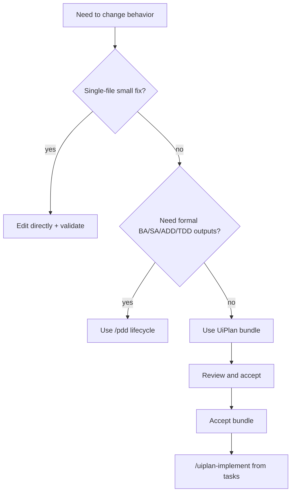
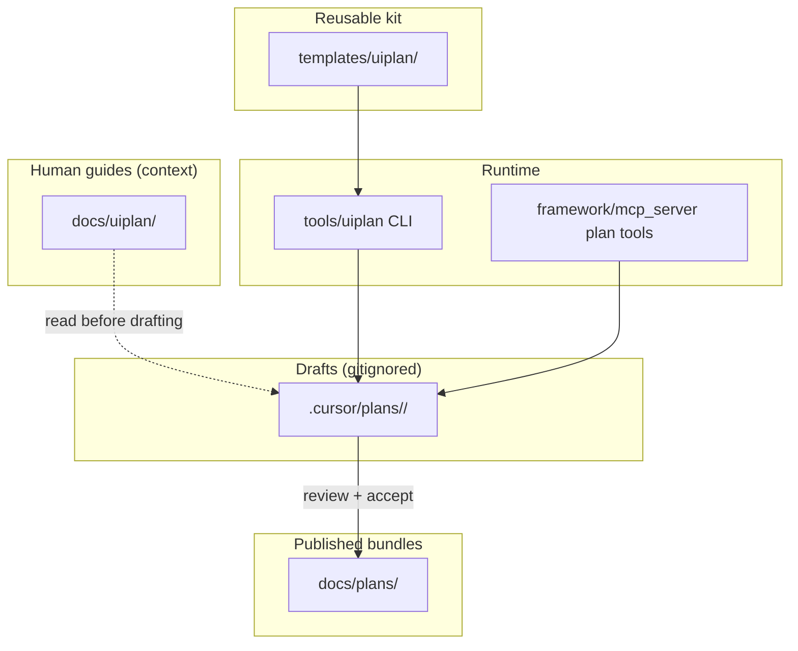
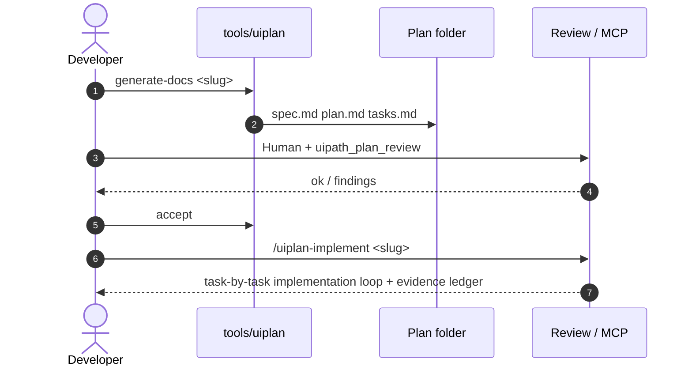

# UiPlan (spec + plan + tasks)

UiPlan is the **three-file planning-to-build bundle** used before implementation:
`spec.md` (what), `plan.md` (how), and `tasks.md` (executable build steps).
It pairs with MCP plan tools, Cursor skills, and the local **`tools/uiplan`**
CLI for generate -> review -> accept -> implement workflows.

## First 15 minutes

If you are new, do this in order:

1. Read [HOW_TO_USE.md](HOW_TO_USE.md) for the mode matrix (MCP vs CLI vs skill).
2. Generate a bundle: `uv run python -m tools.uiplan generate-docs <slug>`.
3. Review the three files (`spec.md`, `plan.md`, `tasks.md`) and tighten scope.
4. Run review (`uipath_plan_review` or Cursor `/uiplan-review <slug>`) and resolve findings.
5. Move to build only after acceptance; use `/uiplan-implement <slug>` with the
   Development Handoff in `spec.md`, the Development execution contract in
   `plan.md`, and the final Build/Verify/Handoff phase in `tasks.md`.

This flow is the fastest way to keep planning quality high and implementation predictable.

## Paradigm-aware bundles (2026 update)

UiPlan templates now separate human-readable intent from executor-grade detail:

- `spec.md` is a lightweight BA / Developer bridge: business intent, user
  stories, acceptance criteria, SME gaps, and PDD / SDD traceability without
  copying formal documentation prose.
- `plan.md` is the Solution Engineer blueprint: architecture, topology,
  capability routing, dependencies, and build gates.
- `tasks.md` is the LLM/executor build sheet: artifact paths, grounding
  citations, verification commands, and evidence requirements.

Use `--paradigm` to override detection when needed (for example, forcing
`coded-agent` or `solution` in mixed repositories).

## Decision tree (when to use UiPlan)

## Audience

- **Humans** authoring or reviewing build-ready specs in Cursor or on GitHub.
- **Agents** using `uipath_plan_*` tools and the [UiPlan Cursor skill](../../.cursor/skills/uiplan/SKILL.md).

## Where to start

| Doc | Purpose |
| --- | --- |
| [HOW_TO_USE.md](HOW_TO_USE.md) | MCP vs CLI vs skill; folder conventions; approval gate |
| [TASK_AUTHORING.md](TASK_AUTHORING.md) | Workflow design, capability routing, task examples, and implementation loop |
| [UiPlan framework historical plan](../plans/2026-04-21-uiplan-framework.md) | Historical design record; not the current operating guide |
| [Template kit](../../templates/uiplan/) | `_spec-template.md`, `_plan-template.md`, `_tasks-template.md`, `_diagram-patterns.md` |
| [Orchestrator deployment runbook](../ORCHESTRATOR_DEPLOYMENT.md) | Optional deploy gates and compatibility preflight for generated tasks |
| [Mermaid Pro Standard](../../.cursor/skills/mermaid-diagram-builder/SKILL.md) | Diagram style contract for this repo |
| [MERMAID_VALIDATION.md](MERMAID_VALIDATION.md) | Optional `mmdc` batch check for fenced diagrams |
| [SCAFFOLD_CODE.md](SCAFFOLD_CODE.md) | What `tools.uiplan scaffold-code` does today |
| [../CAPABILITY_CONTRACT.md](../CAPABILITY_CONTRACT.md) | Canonical CLI/Cursor/MCP surface and non-goals |

## Authority map

| Surface | Canonical location | Role |
| --- | --- | --- |
| UiPlan document templates | [`templates/uiplan/`](../../templates/uiplan/) | Source for generated `spec.md`, `plan.md`, `tasks.md`, and diagram snippets |
| Human documentation | [`docs/uiplan/`](./) | Current operating guide for humans and agents |
| Cursor skill behavior | [`../../.cursor/skills/uiplan*/`](../../.cursor/skills/) | Slash command behavior and planning/implement contracts |
| MCP tool implementation | [`../../framework/mcp_server/tools/plan_uiplan.py`](../../framework/mcp_server/tools/plan_uiplan.py), [`../../framework/mcp_server/tools/plan_uiplan_review.py`](../../framework/mcp_server/tools/plan_uiplan_review.py) | Generation, review, accept/publish surfaces |
| Local CLI/runtime | [`../../tools/uiplan/`](../../tools/uiplan/) | `generate-docs`, `scaffold-code`, validation helpers, and adapters |
| Draft bundles | `.cursor/plans/<YYYY-MM-DD-slug>/` | Per-user working drafts with `.meta.yaml` |
| Published bundles | [`../plans/`](../plans/) | Git-tracked accepted plans after publish |

`scaffold-code` is not the primary implementation command. Treat it as local
runtime/adaptor support; `/uiplan-implement` is the review-first build handoff.

## Repository layout (UiPlan-related)

## Generate → review → accept → implement (sequence)

## Best leverage patterns

| Pattern | Use UiPlan this way | Expected benefit |
| --- | --- | --- |
| Small feature | Keep spec short, focus plan on integration points, split 3-6 tasks | Fast implementation with low overhead |
| Medium refactor | Expand risks/rollback in plan, enforce task-level validation checks | Lower regression risk |
| Formal initiative | Use UiPlan for build contract, then handoff to `/pdd` for full lifecycle docs | Better cross-team coordination |
