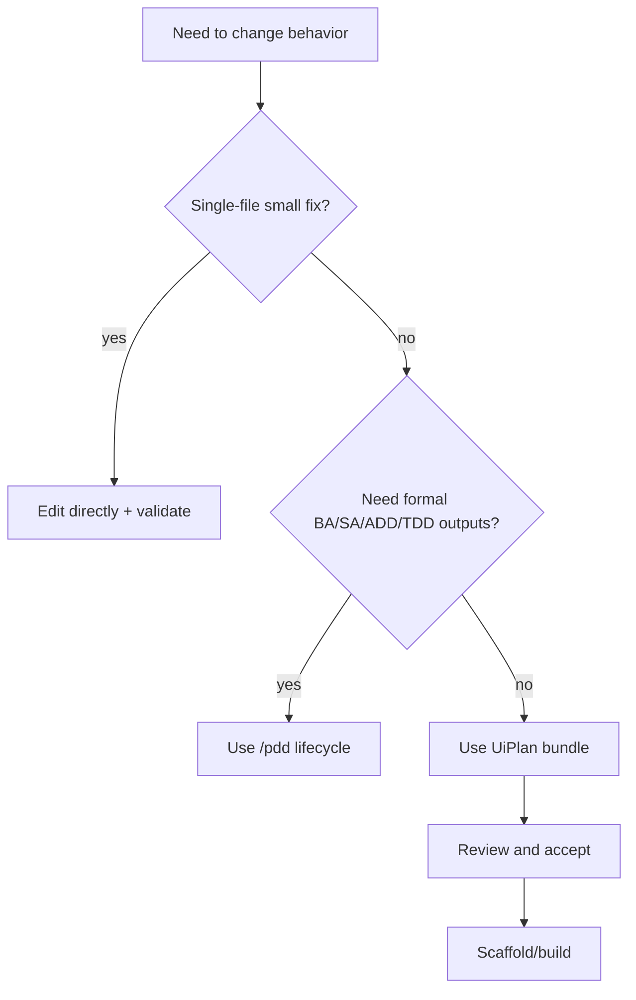

# UiPlan (spec + plan + tasks)

UiPlan is the **three-file planning bundle** used before implementation: `spec.md` (what), `plan.md` (how), and `tasks.md` (executable steps). It pairs with MCP plan tools and the local **`tools/uiplan`** CLI for generate → review → scaffold workflows.


## First 15 minutes

If you are new, do this in order:

1. Read [HOW_TO_USE.md](HOW_TO_USE.md) for the mode matrix (MCP vs CLI vs skill).
2. Generate a bundle: `uv run python -m tools.uiplan generate-docs <slug>`.
3. Review the three files (`spec.md`, `plan.md`, `tasks.md`) and tighten scope.
4. Run review (`uipath_plan_review` or `/uiplan review`) and resolve findings.
5. Move to scaffold/build only after acceptance.

This flow is the fastest way to keep planning quality high and implementation predictable.

## Decision tree (when to use UiPlan)



## Audience

- **Humans** authoring or reviewing build-ready specs in Cursor or on GitHub.
- **Agents** using `uipath_plan_*` tools and the [UiPlan Cursor skill](../../.cursor/skills/uiplan/SKILL.md).

## Where to start

| Doc | Purpose |
| --- | --- |
| [HOW_TO_USE.md](HOW_TO_USE.md) | MCP vs CLI vs skill; folder conventions; approval gate |
| [UiPlan framework (MCP matrix)](../plans/2026-04-21-uiplan-framework.md) | Tooling roles and storage model |
| [Template kit](kit/) | `_spec-template.md`, `_plan-template.md`, `_tasks-template.md`, `_diagram-patterns.md` |
| [Mermaid Pro Standard](../../.cursor/skills/mermaid-diagram-builder/SKILL.md) | Diagram style contract for this repo |
| [MERMAID_VALIDATION.md](MERMAID_VALIDATION.md) | Optional `mmdc` batch check for fenced diagrams |
| [SCAFFOLD_CODE.md](SCAFFOLD_CODE.md) | What `tools.uiplan scaffold-code` does today |
| [MANUAL_REVIEW_CURSOR_FULL_PROJECT.md](../MANUAL_REVIEW_CURSOR_FULL_PROJECT.md) | Cursor-first checklist (NL prompts, kit verification **UP** rows) |

## Repository layout (UiPlan-related)

```mermaid
%%{init: {'theme':'base','themeVariables':{'primaryColor':'#E2E8F0','primaryTextColor':'#0F172A','primaryBorderColor':'#94A3B8','lineColor':'#94A3B8','secondaryColor':'#F1F5F9','tertiaryColor':'#F8FAFC','background':'#FFFFFF','clusterBkg':'#F8FAFC','clusterBorder':'#CBD5E1','titleColor':'#0F172A','edgeLabelBackground':'#FFFFFF','fontFamily':'Inter, ui-sans-serif, system-ui'}}}%%
flowchart TB
  subgraph Docs["Docs"]
    U[docs/uiplan/kit templates]:::service
    P[docs/plans/ published bundles]:::process
  end
  subgraph Runtime["Runtime"]
    T[tools/uiplan CLI]:::service
    F[framework/mcp_server plan tools]:::service
  end
  subgraph Drafts["Drafts (gitignored)"]
    C[".cursor/plans/<slug>/"]:::human
  end
  U --> T
  T --> C
  C -->|review + accept| P
  F --> C

  classDef process  fill:#F1F5F9,stroke:#64748B,color:#0F172A,stroke-width:1.25px
  classDef service  fill:#EFF6FF,stroke:#3B82F6,color:#1E3A8A,stroke-width:1.25px
  classDef human    fill:#F5F3FF,stroke:#8B5CF6,color:#5B21B6,stroke-width:1.5px

  linkStyle default stroke:#94A3B8,stroke-width:1.5px
  linkStyle 0,1 stroke:#3B82F6,stroke-width:2px
  linkStyle 3,4 stroke:#10B981,stroke-width:2px
```

## Generate → review → scaffold (sequence)

```mermaid
%%{init: {'theme':'base','themeVariables':{'primaryColor':'#E2E8F0','primaryTextColor':'#0F172A','primaryBorderColor':'#94A3B8','lineColor':'#94A3B8','secondaryColor':'#F1F5F9','tertiaryColor':'#F8FAFC','background':'#FFFFFF','clusterBkg':'#F8FAFC','clusterBorder':'#CBD5E1','titleColor':'#0F172A','edgeLabelBackground':'#FFFFFF','fontFamily':'Inter, ui-sans-serif, system-ui'}}}%%
sequenceDiagram
  autonumber
  actor Dev as Developer
  participant CLI as tools/uiplan
  participant FS as Plan folder
  participant Rev as Review / MCP
  Dev->>CLI: generate-docs <slug>
  CLI->>FS: spec.md plan.md tasks.md
  Dev->>Rev: Human + uipath_plan_review
  Rev-->>Dev: ok / findings
  Dev->>CLI: scaffold-code <slug>
  CLI-->>Dev: implementation loop (capped)

  classDef human fill:#F5F3FF,stroke:#8B5CF6,color:#5B21B6,stroke-width:1.5px
  classDef service fill:#EFF6FF,stroke:#3B82F6,color:#1E3A8A,stroke-width:1.25px
  class Dev human
  class CLI,FS,Rev service
```

## Best leverage patterns

| Pattern | Use UiPlan this way | Expected benefit |
| --- | --- | --- |
| Small feature | Keep spec short, focus plan on integration points, split 3-6 tasks | Fast implementation with low overhead |
| Medium refactor | Expand risks/rollback in plan, enforce task-level validation checks | Lower regression risk |
| Formal initiative | Use UiPlan for build contract, then handoff to `/pdd` for full lifecycle docs | Better cross-team coordination |
