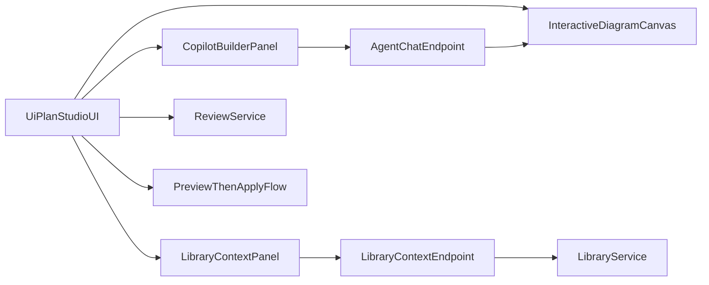

# UiPlan Studio

UiPlan Studio is a local-first visual builder for UiPlan bundles (`spec.md`, `plan.md`,
`tasks.md`). It combines document editing, persisted diagram state, grounded context sources,
review findings, Copilot-compatible builder actions, and preview-first generation package
workflows.

The UI loads bundle content from `/bundle/load`, loads and saves the bundle diagram through
`/diagram/load` and `/diagram/save`, generates Plan and Scaffold approval packages through
`/generation/packages`, and reads package details through
`/generation/packages/{package_id}?bundle_root=...`. Proposal previews and applies are isolated
to package APIs under `/generation/packages/{package_id}/proposals/...`.

The document endpoints (`/generate/section-preview`, `/generate/diagram-preview`, and
`/generate/apply`) remain available for legacy section preview flows, but Phase 0 package
generation does not write target project files directly. `/bundle/save` is retained only as a
guarded legacy/internal endpoint and is not exposed by the Studio UI.

## Builder Workflow

1. Open a draft bundle under `.cursor/plans/<slug>/`.
2. Edit `spec.md`, `plan.md`, and `tasks.md` in the document pane.
3. Shape the canvas by selecting, dragging, adding, editing, connecting, or deleting non-core
   nodes.
4. Add context from skills, library books, bundle documents, and review gates.
5. Use the agent panel or context panels to suggest diagram nodes and search library snippets.
6. Preview document edits or generated document changes from the current diagram and selected
   context.
7. Review the diff, then apply the preview explicitly.
8. Run review/readiness again before accepting or implementing the bundle.

For generation packages, the stage-first workflow is:

1. Generate a Plan package (`01-plan`) from the typed graph.
2. Review package proposal metadata, citations, findings, and stage status.
3. Approve and preview specific proposals before apply.
4. Generate Scaffold (`02-scaffold`) only after Plan readiness constraints are met.
5. Keep Code/Tests/Validation stage actions disabled (deferred by contract).

## Phase 0 Contract Scope

Phase 0 standardizes a contract-first package system under `.uiplan/generation/` with:

- Typed graph and package schema ids/versioned payloads.
- Durable `approval-state.json` with per-stage and per-proposal status.
- Path allowlist checks for proposal target safety.
- Preview/apply hash-guarded transitions for proposal application.
- Command registry records for readiness checks only.

Package generation scope is intentionally limited to:

- `01-plan` (Plan package)
- `02-scaffold` (Scaffold package)

Deferred stages:

- `03-code` (disabled)
- `04-tests` (disabled)
- `05-validation` (disabled)

## Package Storage And Safety

Generation artifacts are stored at:

`<bundle-root>/.uiplan/generation/packages/<package-id>/`

Phase 0 safety policy:

- `direct_writes: false`
- `external_mutation: false`

This means generation only creates approval package artifacts and proposal previews. Deploy,
publish, invoke, package upload, and other runtime mutation operations are out of scope.

## Diagram Persistence

The default canvas contains the core document, workflow, skill, library, and review nodes.
User changes are saved as bundle-local diagram JSON through `POST /diagram/save`, then loaded
with the bundle through `GET /diagram/load`. If no saved diagram exists, Studio falls back to
the default diagram and keeps the editor usable.

Core nodes (`spec`, `plan`, `tasks`, `skills`, `library`, and `review`) are protected from
deletion. Non-core nodes can be added from context sources, Copilot suggestions, or manual
inspector edits. Saved diagrams remain permissive for freeform nodes, but server-side
sanitization strips unavailable curated source IDs/paths before the diagram is persisted or used
as generation context.

## Context Sources

Studio exposes context through `/agent/context-sources` and `/context/sources`. Current source
categories include:

- UiPath skills and skill metadata.
- UiPath library books and sections.
- Bundle documents (`spec.md`, `plan.md`, `tasks.md`).
- Review/readiness context and findings.

Library search uses `POST /agent/library-context`. Returned snippets can be included in
generation requests and are annotated with source citations such as `book/chapter/section`.

## Copilot Runtime And Fallback

The frontend is wrapped in `@copilotkit/react-core` and points at the local API runtime at
`/copilotkit`. The backend exposes:

- `GET /copilotkit/info` for runtime metadata and action lists.
- `POST /copilotkit` for the GraphQL-style requests issued by the frontend runtime.
- `/copilotkit/runtime` when the Python `copilotkit` SDK is available in the service
  environment.
- `POST /agent/chat` as the deterministic local fallback chat surface.

Builder actions are intentionally safe: they can list context sources, load source metadata,
search library snippets, suggest diagram nodes, summarize the canvas, and draft package requests.
They do not apply proposal content. Proposal writes still require explicit preview/apply through
the generation package endpoints.

The local `/copilotkit` GraphQL-style endpoint is a compatibility shim for the current frontend
runtime protocol. It returns action metadata and static success envelopes with no generated
assistant messages; deterministic local chat remains on `/agent/chat`, and full hosted Copilot
runtime behavior is limited to environments where the Python CopilotKit SDK endpoint is
available at `/copilotkit/runtime`.

Use the service-local `uv` environment for backend commands. The repo-root Python environment
does not own the Studio API dependencies and may not have the `copilotkit` SDK installed.

## Diagram-To-Document Generation

`POST /generation/packages` produces Plan or Scaffold approval packages from the current typed
graph. `GET /generation/packages` and `GET /generation/packages/{package_id}` expose package
manifests, approval state, stage manifests, and file proposals for review.

Studio submits generation requests with both:

- `graph`: full typed graph snapshot from the current canvas workspace.
- `graph_ref`: request metadata (`graph_id`, `selected_node_id`) copied from that snapshot.

The API enforces `write_policy: approval_package_only` for `/generation/packages`. Any other
write policy is rejected so package generation always stays preview-first.

`POST /generation/packages/{package_id}/proposals/{proposal_id}/preview` creates a guarded preview
for a proposal. `POST /generation/packages/{package_id}/proposals/{proposal_id}/apply` applies
only after approval state and preview id checks pass.

No package route writes target source files during generation. File updates are allowed only from
explicit proposal apply paths after reviewer approval.

Generated diagram sections are delimited with `uiplan-diagram-generated` markers so a later
preview can replace only the generated block while preserving surrounding hand-authored
content.



## Local Run And Verification

From repo root, run the submodule guard before final handoff:

```bash
python -m uipath_claude.skills.submodule_guard
```

Run backend Phase 0 verification from the service directory so `uv` uses the Studio API
environment:

```bash
cd services/uiplan-studio-api
uv sync
uv run pytest tests/test_generation_contract_schemas.py tests/test_approval_state.py tests/test_path_allowlist_command_registry.py tests/test_approval_package_storage.py tests/test_stage_package_generation.py tests/test_main.py -q
```

Run frontend Phase 0 verification from repo root:

```bash
npm --prefix apps/uiplan-studio test -- src/__tests__/generationTypes.test.ts src/__tests__/ApprovalPackagePanel.test.tsx src/__tests__/App.test.tsx
npm --prefix apps/uiplan-studio run build
npx --prefix apps/uiplan-studio playwright test e2e/library-context.spec.ts
```

To run interactively during development:

```bash
cd services/uiplan-studio-api
uv run uvicorn app.main:app --reload --port 8000

# In another terminal, from repo root:
npm --prefix apps/uiplan-studio run dev
```

The UI expects the API on `http://localhost:8000` by default. Override it with
`VITE_UIPLAN_API_URL` when running against another local port.

## Limitations And Constraints

- Adapter-first UI boundary: `AgentPanel` exposes builder chat and safe actions only
  (`Draft Plan package request`, `Draft Scaffold package request`, and context requests).
- Document edits and generation are preview-first and explicit-apply: proposed content must be
  reviewed via diff and then applied through a dedicated apply action in the backend flow.
- Copilot package drafting is preview-only and returns request payloads for `/generation/packages`;
  it does not apply proposals or write target files.
- `/generation/packages` accepts only `write_policy: approval_package_only`; this preserves
  preview-first package creation and keeps target-file writes behind proposal preview/apply.
- The `/copilotkit` compatibility shim does not stream or synthesize chat messages; it only
  keeps the frontend protocol connected to local action metadata.
- Studio must not publish or deploy packages/processes. Publish/deploy remain external,
  user-approved operations outside this UI.
- Stage controls for `03-code`, `04-tests`, and `05-validation` are intentionally disabled in
  Phase 0.
- The local fallback chat is deterministic and intentionally narrow; it is not a full hosted
  Copilot agent.
- Pending previews are in memory. Restarting the API clears unapplied previews.
- Saved diagrams live with draft bundles under `.cursor/plans/<slug>/`, which are local
  draft artifacts unless explicitly published through the UiPlan lifecycle.
- Build artifacts such as `dist/`, `.venv/`, `.pytest_cache/`, and `node_modules/` should stay
  uncommitted local artifacts.
