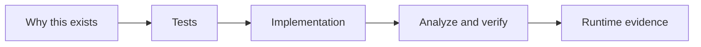

# UiPlan task authoring contract

Use this guide when writing or reviewing `tasks.md`. The goal is to make
`/uiplan-implement` follow instructions instead of inventing architecture during
coding.

## Capability inventory first

Before tasking non-trivial work, record which project capabilities are relevant:

| Capability family | Use when |
| --- | --- |
| Planning/design skills | Route scope and architecture through `uiplan-*`, `uipath-planner`, `uipath-solution-design`, `writing-uipath-plans`, and `mermaid-diagram-builder`. |
| Product/build skills | Use the owning product skill: `uipath-rpa`, `uipath-rpa-legacy`, `uipath-agents`, `uipath-platform`, `uipath-coded-apps`, `uipath-maestro-flow`, `uipath-case-management`, `uipath-data-fabric`, `uipath-human-in-the-loop`, `uipath-gov-aops-policy`, `uipath-test`, `uipath-diagnostics`, or `uipath-interact`. |
| BA / SA / Dev / QA lenses | BA owns process scope and SME gaps; SA owns solution topology and workflow shape; Dev owns concrete artifacts, activities, and build order; QA/Test owns fixtures, evidence, and failure-path validation. |
| Submodule/project agents | Run `skills/agents/uipath-project-discovery-agent.md` when project context is missing or stale. |
| Diagnostics agents | Use triage, scope-checker, hypothesis-generator, hypothesis-tester, and presenter when analyzer/test output fails. |
| MCP/library tools | Use `uipath_library_search`, `uipath_library_lookup`, `uipath_doc_get_activity`, and `uipath_doc_list_packages` before naming activities or platform constructs. |
| AskAI/docs fallback | Use `query_uipath_docs` or `[askai:...]` only when local/library coverage is insufficient. |
| CLI surfaces | Use `uipcli`, `uipath`, or `uip`; run live `--help` before uncertain flags. |
| Focused subagents | Split discovery, implementation, testing, browser/UI checks, docs, and code review when work can proceed safely in parallel. |

Tasks that skip available capability surfaces should fail review. Do not invent
activity names, package APIs, template shapes, or CLI flags when a project skill,
library lookup, activity doc, CLI help, or subagent can resolve them.

## Discovery boundary

Discovery is a precondition to task authoring, not a task output.

- Run project discovery and architecture routing in `/uiplan-ground` and `/uiplan-plan`.
- Capture project surfaces, template decisions, bindings/contracts, and activity lookup
  context in `plan.md` before generating `tasks.md`.
- If those inputs are missing, stop and return to plan/grounding stages.

`tasks.md` should begin when the team already knows what to build.

## Persona checkpoints

Before acceptance, review a non-trivial UiPlan bundle through these lenses:

- **BA checkpoint**: business process, actors, inputs/outputs, scope, SME
  questions, acceptance criteria, and open policy decisions.
- **SA checkpoint**: solution topology, project split, workflow type per project,
  queues/assets/connections, deployment gates, and handoff boundaries.
- **Dev checkpoint**: artifact paths, package dependencies, activity/SDK/CLI
  constructs, implementation order, local build loop, and generated-file rules.
- **QA/Test checkpoint**: fixture data, test commands, analyzer outputs, runtime
  evidence, failure-path validation, and smoke criteria.

Unresolved choices must be assigned to a persona, skill, or explicit blocker.
Use `[SME REVIEW: ...]` or `[NEEDS CLARIFICATION: ...]` for human decisions.

## Workflow design before tasking

Every non-trivial UiPath task set must name the build surface and workflow shape:

- RPA / Studio: Sequence, Flowchart, State Machine, Long Running Workflow,
  Dispatcher/scheduled intake, Performer/queue worker, HITL handler, or another
  named Studio template.
- Coded agent: LangGraph / LlamaIndex descriptor, graph entry point, nodes,
  request/response schema, and host invocation boundary.
- Maestro / Flow: `.flow` / BPMN artifact, trigger, data mappings, and solution
  packaging boundary.
- Coded app/action: `app.config.json`, `action-schema.json`, TypeScript entry
  points, and `uip codedapp` build path.
- Platform/config: queues, assets, folders, connections, bindings, policies, and
  deployment approvals.

For each workflow shape, state why it fits the process and what evidence proves
the scaffold/template is correct: Studio-generated files, `uip rpa create-project`
output, existing `project.json` / `project.uiproj`, default activity XAML,
package-local examples, or documented library/skill guidance.

## Task bullet contract

Each non-parallel implementation task must include:

- project or package name;
- workflow / sequence / node / CLI step;
- artifact path in backticks;
- UiPath construct: activity, SDK call, queue, asset, folder, binding, graph,
  process, app, flow, or policy;
- grounding path: skill, agent, library lookup, activity doc, AskAI fallback, CLI
  help, or subagent;
- exact verification command;
- runtime evidence path or artifact.

Each story block should also include:

- **Why this exists**: one sentence explaining business/workflow purpose.
- **Workflow/task diagram**: Mermaid visual showing tests, implementation,
  verification, and evidence outputs.
- **Dependencies note**: what must be done before this story starts.

Good task:

```text
- [ ] T014 [US1] In `ZipEmail.Dispatcher`, implement the `ReadMailboxMessages`
  sequence in `projects/ZipEmail.Dispatcher/Main.xaml` using Email connector mail
  activities resolved by `uipath_doc_get_activity` and queue guidance from
  `uipath_library_search`; verify with `uipcli package analyze
  projects/ZipEmail.Dispatcher/project.json --resultPath out/dispatcher.json`
  and record analyzer JSON plus a smoke log containing `CorrelationId`.
```

Bad task:

```text
- [ ] T014 Implement the dispatcher workflow.
```

The bad task omits the project, workflow shape, artifact path, activities/docs,
verification command, and runtime evidence.

## Implementation loop

For every task, `/uiplan-implement` should run this loop:

1. Read the task, `spec.md`, and `plan.md`; confirm scope and artifact path.
2. Ground missing details through skills, library/docs, AskAI, CLI help, or
   focused subagents.
3. Develop only the current task scope.
4. Run the task verification command and the relevant analyze/test gate.
5. Parse output files and structured errors, not just console summaries.
6. Compare results against the accepted `spec.md`, `plan.md`, and `tasks.md`.
7. Apply one safe local source/config/tooling fix when evidence supports it.
8. Rerun the same gate and record whether the original issue cleared, changed,
   or remains.
9. Mark complete only with runtime evidence; otherwise leave an explicit blocker
   or handoff.

## Visual task authoring

For every non-trivial story, include three visuals:

1. **Story workflow map**: how runtime steps move across surfaces.
2. **Task dependency map**: order/parallelization of tests, implementation, and gates.
3. **Build/verify loop**: restore -> analyze -> test -> pack with diagnosis retry.

Minimal pattern:



Pair each diagram with a short explanatory paragraph so readers understand why
the checklist exists, not only what to run.

## Failure review

Do not call a failed analyzer/test/Studio/CLI run "blocked" until the failure has
been diagnosed and rerun. A blocker report must include:

- command, working directory, exit code, and result path;
- parsed rule/error and affected artifact;
- docs, skills, MCP tools, CLI help, or subagents consulted;
- source/config/schema inspected;
- local fix attempted, or why no safe local fix exists;
- rerun result;
- blocker class: tenant-only, human UI-only, missing credentials, generated
  descriptor required, unsupported local tooling, or unsafe action.

## Handoff tags

Use `[HANDOFF:...]` narrowly:

- `[HANDOFF:Secrets]` for credentials or secret values.
- `[HANDOFF:OrchestratorDeploy]` for publish/deploy approval.
- `[HANDOFF:OAuth]` for first-time browser or OAuth consent.
- `[HANDOFF:RobotSmoke]` for physical robot or attended smoke validation.

Do not use a handoff tag to skip in-scope XAML, agent, Flow, app, or platform
implementation. If the artifact is in scope, task it directly or record an
explicit blocker with evidence.

## Reviewer clarifications

Group clarification output by topic and make every item actionable:

```text
### Human review
- `[NEEDS CLARIFICATION: review channel]` Should ambiguous invoices be reviewed
  in UiPath Flow HITL, Action Center, or another approved channel?
```

Write answers back into `spec.md`, `plan.md`, or `tasks.md` before acceptance.
