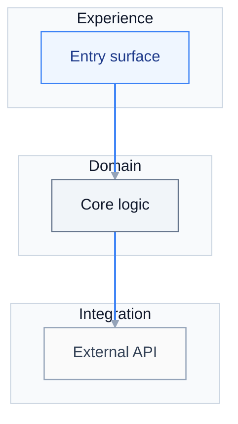
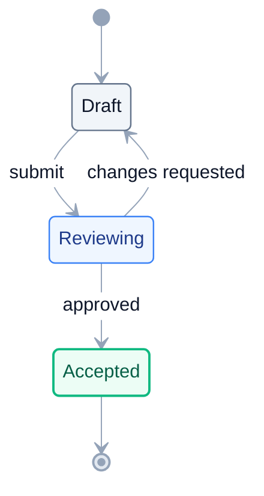

# UiPlan diagram patterns (Pro Standard)

Copy one of the blocks below into `spec.md`, `plan.md`, or `tasks.md`, then **replace labels only**. Full rules: [`.cursor/skills/mermaid-diagram-builder/SKILL.md`](../../../.cursor/skills/mermaid-diagram-builder/SKILL.md).

## When to use which

| Pattern | Use for |
| --- | --- |
| **Flowchart TB** | Layered architecture, scope boundaries, gate pipelines |
| **Sequence** | Actor vs system vs HITL message flow |
| **State** | Plan lifecycle (draft → review → accepted) |

---

## 1) Flowchart TB (layered scope)



---

## 2) Sequence (actors vs system)

```mermaid
%%{init: {'theme':'base','themeVariables':{'primaryColor':'#E2E8F0','primaryTextColor':'#0F172A','primaryBorderColor':'#94A3B8','lineColor':'#94A3B8','secondaryColor':'#F1F5F9','tertiaryColor':'#F8FAFC','background':'#FFFFFF','clusterBkg':'#F8FAFC','clusterBorder':'#CBD5E1','titleColor':'#0F172A','edgeLabelBackground':'#FFFFFF','fontFamily':'Inter, ui-sans-serif, system-ui'}}}%%
sequenceDiagram
  autonumber
  actor U as User
  participant S as System
  participant H as HITL
  U->>S: Request
  S->>H: Escalation
  H-->>S: Decision
  S-->>U: Outcome

  classDef human fill:#F5F3FF,stroke:#8B5CF6,color:#5B21B6,stroke-width:1.5px
  classDef service fill:#EFF6FF,stroke:#3B82F6,color:#1E3A8A,stroke-width:1.25px
  class U,H human
  class S service
```

---

## 3) State diagram (plan lifecycle)


