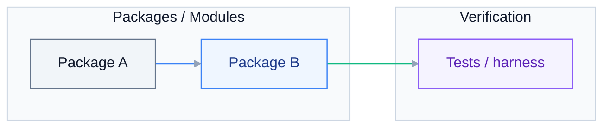
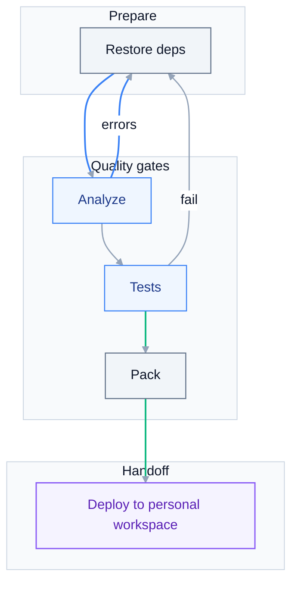

# Implementation Plan: {{TITLE}}

> **Grounding:** {{GROUNDING_CITATIONS}}
> **Spec:** `./spec.md`

**Date**: {{DATE}}
**Spec**: ./spec.md

## Summary

{{SUMMARY}}

## Technical Context

**Language/Version**: {{LANG_VERSION}}
**Primary Dependencies**: {{DEPS}}
**Storage**: {{STORAGE}}
**Testing**: {{TESTING}}
**Target Platform**: {{TARGET_PLATFORM}}
**Project Type**: {{PROJECT_TYPE}}
**Performance Goals**: {{PERF}}
**Constraints**: {{CONSTRAINTS}}
**Scale/Scope**: {{SCALE}}

## Constitution Check

Gates re-checked after Phase 1 design:

{{CONSTITUTION_CHECKLIST}}

## Project Structure

### Documentation (this feature)

```text
.cursor/plans/{{FOLDER_NAME}}/
  spec.md
  plan.md
  tasks.md
  .meta.yaml
```

### Source Code (repository root)

```text
{{SOURCE_TREE}}
```

**Structure Decision**: {{STRUCTURE_DECISION}}

## Architecture diagram

Implementation layering and dependencies (adapt nodes to this plan).



## Build and verify gates

Restore, analyze, test, and pack (adapt steps to your project type).



## Activity references (optional)

`uipath_plan_tasks_new` scans **plan.md** and **spec.md** for machine-readable activity tags (up to 8 unique pairs) and appends matching documentation to **tasks.md**.

Tag shape on **one line** (no line breaks inside the tag): an opening square bracket `[`, the literal prefix `activity:`, your NuGet-style **PackageId**, a colon, the **ActivityName** as in Studio, then `]`. Only add tags for activities you will actually use; omit demo or placeholder tags so **Resolved activity docs** stays short.

Human-readable shape (not a tag — note the space after `[` so tooling ignores it): `[ activity:YourPackage.YourActivities:YourActivityName ]`.

## Complexity Tracking

{{COMPLEXITY_TABLE}}
