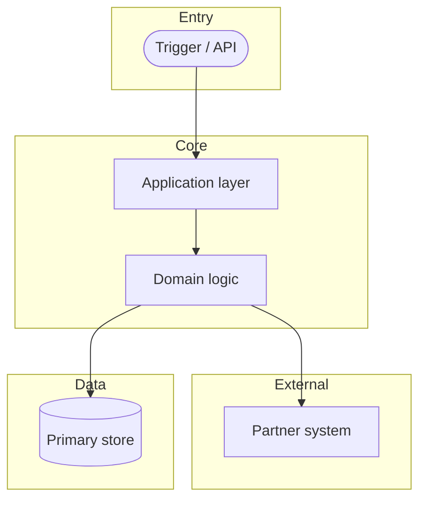
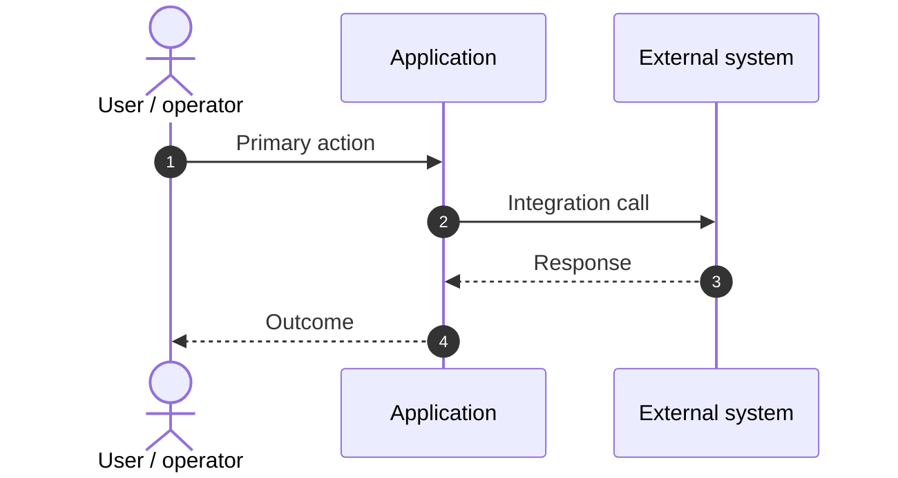

# Feature Specification: {{TITLE}}

> **Grounding:** {{GROUNDING_CITATIONS}}

**Created**: {{DATE}}
**Status**: Draft
**Input**: User description: "{{INTENT}}"

## User Scenarios & Testing

### User Story 1 - {{US1_TITLE}} (Priority: P1)

{{US1_BODY}}

**Why this priority**: {{US1_PRIORITY}}

**Independent Test**: {{US1_TEST}}

**Acceptance Scenarios**:

1. **Given** {{US1_GIVEN_1}}, **When** {{US1_WHEN_1}}, **Then** {{US1_THEN_1}}

### User Story 2 - {{US2_TITLE}} (Priority: P2)

{{US2_BODY}}

**Why this priority**: {{US2_PRIORITY}}

**Independent Test**: {{US2_TEST}}

**Acceptance Scenarios**:

1. **Given** {{US2_GIVEN_1}}, **When** {{US2_WHEN_1}}, **Then** {{US2_THEN_1}}

### Edge Cases

- {{EDGE_1}}

## Requirements

### Functional Requirements

- **FR-001**: System MUST {{FR_001}}
- **FR-002**: System MUST {{FR_002}}
- **FR-003**: Users MUST be able to {{FR_003}}

### Key Entities

- **{{ENTITY_1}}**: {{ENTITY_1_DESC}}

## Architecture diagram

High-level boundaries for this feature (replace labels with real components).

## Primary interaction (sequence)

Who talks to whom for the main scenario (replace actors and messages).

## Success Criteria

### Measurable Outcomes

- **SC-001**: {{SC_001}}

## Assumptions

- {{ASSUMPTION_1}}
