# InvoiceProcessor Fixture Plan

## Activity Preference

Use pre-built UiPath activities first. This fixture intentionally rejects `InvokeCode`.

## Activity Flow

```mermaid
flowchart LR
  Start[Log Message] --> Dirs[Create Directory]
  Dirs --> List[Assign invoice file list]
  List --> Loop[For Each invoice file]
  Loop --> Read[Read Text File]
  Read --> Extract[Assign extraction expressions]
  Extract --> Validate[Assign validation expressions]
  Validate --> Append[Assign CSV row]
  Append --> WriteReport[Write Text File report]
  WriteReport --> WriteSmoke[Write Text File smoke result]
```

## Evidence

- Scaffold evidence: `../../evidence/scaffold.json`
- Activity evidence: `../../evidence/default-*.json`
- Runtime evidence: `../../out/*.json`
