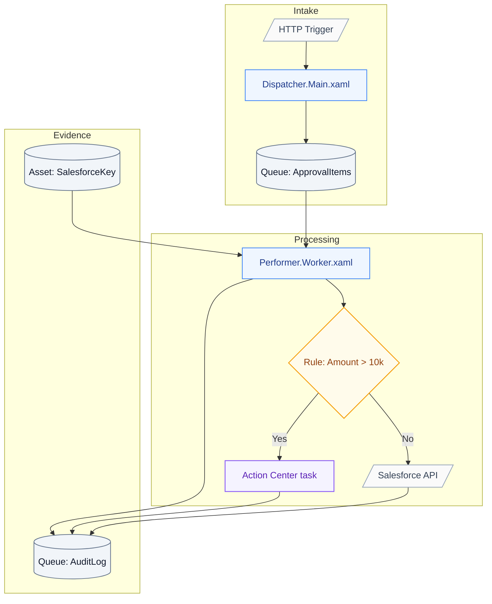
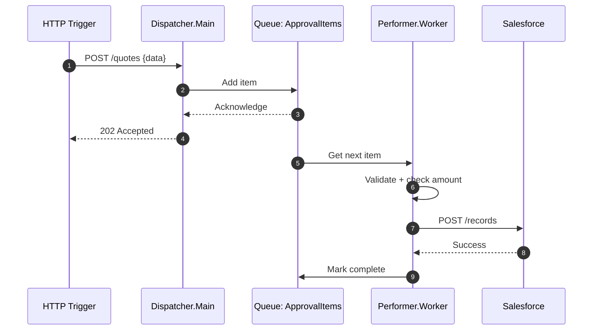

# Implementation Plan: Sales Approval Process

## Solution architecture

Concrete project names and bindings:

## Runtime sequence

Message handoff timing:

## Workflow catalog

All workflows with internal structure:

| Workflow | Type | Entry point | Internal steps | Dependencies |
| --- | --- | --- | --- | --- |
| `Dispatcher.Main.xaml` | Sequence | HTTP trigger | 1. Load config, 2. Validate, 3. Add to queue | Queue: ApprovalItems |
| `Performer.Worker.xaml` | Long Running | Queue trigger | 1. Get item, 2. Validate, 3. Check amount, 4. Route decision, 5. Log | Queue: ApprovalItems, Asset: SalesforceKey, Integration: Salesforce |
