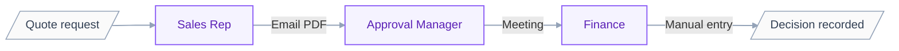
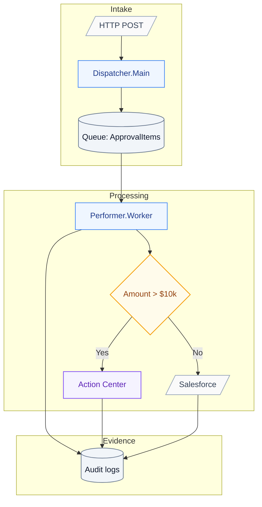

# Feature Specification: Sales Approval Process

## Business process flow

Manual process showing how approvals happen today:

Pain points:
- Email handoffs cause 2-day delays
- No audit trail for decisions
- Manual entry errors require rework

## Solution architecture

Automated solution replacing the manual process:

## Requirements

- FR-001: System MUST validate quote amount against $10k threshold
- FR-002: System MUST route high-value quotes to Action Center
- FR-003: System MUST log all decisions with timestamp
