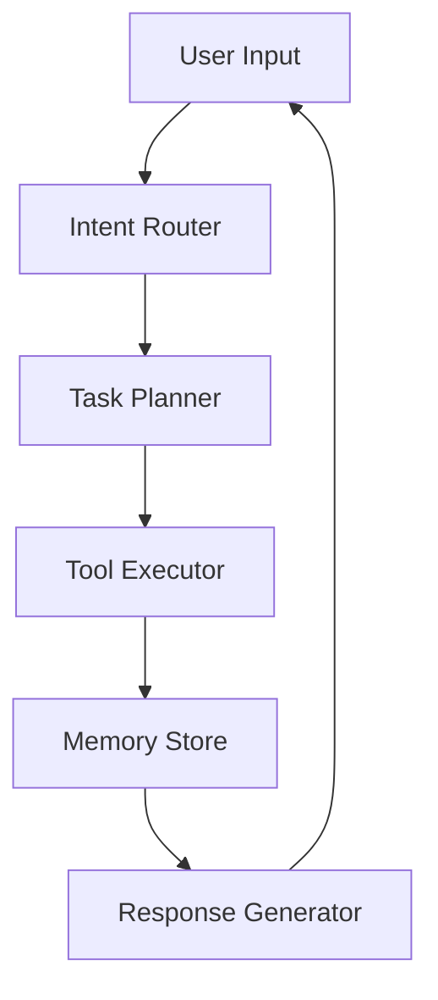
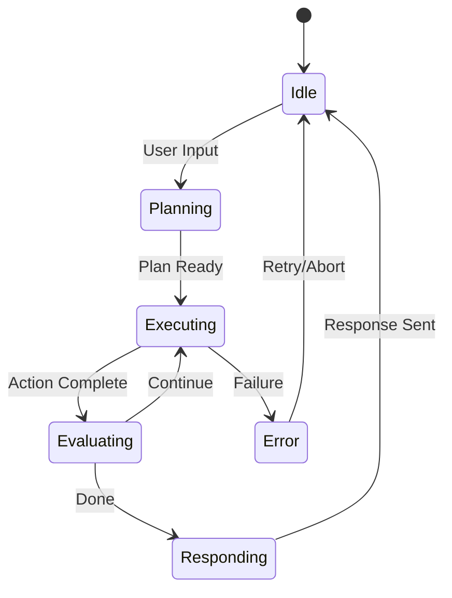
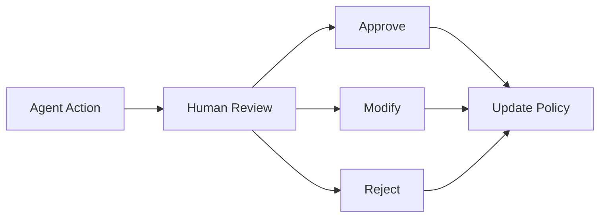

# Agent Design Document (ADD)

**Project Name**: {{project_name}}  
**Version**: {{version}}  
**Date**: {{date}}  
**Author**: {{author}}  
**Status**: {{status}}

---

## 1. Executive Summary

### 1.1 Purpose
<!-- Brief description of what this AI agent does and its business value -->

### 1.2 Agent Type

**Agent Category**: {{agent_type}} <!-- Conversational/Task Automation/Decision Support/Data Processing -->

**Orchestration Pattern**: {{orchestration_pattern}} <!-- ReAct/Plan-and-Execute/LATS/Custom -->

**Primary LLM**: {{primary_llm}} <!-- GPT-4/Claude/Gemini/Local Model -->

### 1.3 Key Capabilities

1. 
2. 
3. 

---

## 2. Agent Architecture

### 2.1 High-Level Architecture



### 2.2 Core Components

| Component | Responsibility | Implementation |
|-----------|---------------|----------------|
| Intent Router | Classify user intent | |
| Task Planner | Break down complex tasks | |
| Tool Executor | Execute tools/actions | |
| Memory Manager | Context and history | |
| Response Generator | Format final output | |

### 2.3 Agent State Machine



---

## 3. Tools and Capabilities

### 3.1 Available Tools

| Tool Name | Description | Input Schema | Output Schema | Rate Limits |
|-----------|-------------|--------------|---------------|-------------|
| | | | | |

### 3.2 Tool Definitions

```python
# Example tool definition
@tool
def tool_name(param: str) -> str:
    """Tool description for the LLM."""
    pass
```

### 3.3 External Integrations

| Integration | Purpose | Authentication | Endpoint |
|-------------|---------|----------------|----------|
| | | | |

### 3.4 UiPath Integration

**UiPath Connection Type**: {{uipath_connection}} <!-- Orchestrator API/MCP Server/Direct Robot -->

| UiPath Component | Usage | Configuration |
|------------------|-------|---------------|
| Orchestrator | Job triggering, Queue management | |
| Action Center | Human-in-the-loop tasks | |
| Data Service | Persistent data storage | |
| Document Understanding | Document processing | |

---

## 4. Memory and Context

### 4.1 Memory Architecture

**Memory Type**: {{memory_type}} <!-- Buffer/Summary/Vector/Hybrid -->

| Memory Layer | Purpose | Storage | TTL |
|--------------|---------|---------|-----|
| Short-term | Current conversation | In-memory | Session |
| Working | Task context | In-memory | Task duration |
| Long-term | Historical knowledge | Vector DB | Persistent |

### 4.2 Context Window Management

**Max Context Tokens**: {{max_tokens}}

**Truncation Strategy**: {{truncation_strategy}} <!-- FIFO/Importance-based/Summary -->

### 4.3 Knowledge Base

**Vector Store**: {{vector_store}} <!-- Pinecone/Weaviate/ChromaDB/FAISS -->

**Embedding Model**: {{embedding_model}}

| Knowledge Source | Update Frequency | Retrieval Strategy |
|------------------|------------------|-------------------|
| | | |

---

## 5. Prompt Engineering

### 5.1 System Prompt

```
You are an AI assistant specialized in {{domain}}.

Your capabilities include:
- {{capability_1}}
- {{capability_2}}

Guidelines:
- {{guideline_1}}
- {{guideline_2}}

Constraints:
- {{constraint_1}}
- {{constraint_2}}
```

### 5.2 Prompt Templates

| Template Name | Purpose | Variables |
|---------------|---------|-----------|
| | | |

### 5.3 Few-Shot Examples

```
Example 1:
User: {{example_input}}
Assistant: {{example_output}}
```

---

## 6. Guardrails and Safety

### 6.1 Input Validation

| Validation | Rule | Action on Failure |
|------------|------|-------------------|
| Content filtering | | |
| Length limits | | |
| Injection prevention | | |

### 6.2 Output Validation

| Validation | Rule | Fallback |
|------------|------|----------|
| Factuality check | | |
| Format compliance | | |
| Sensitive data filtering | | |

### 6.3 Rate Limiting

| Limit Type | Threshold | Window | Action |
|------------|-----------|--------|--------|
| Requests per user | | | |
| Tokens per minute | | | |
| Tool calls per session | | | |

### 6.4 Ethical Guidelines

- 
- 
- 

---

## 7. Human-in-the-Loop (HITL)

### 7.1 HITL Triggers

| Trigger Condition | Action | Escalation Path |
|-------------------|--------|-----------------|
| Low confidence | Request approval | |
| Sensitive action | Require confirmation | |
| Error threshold | Alert human | |

### 7.2 UiPath Action Center Integration

**Task Types**:
| Task Type | Description | SLA | Assignee |
|-----------|-------------|-----|----------|
| Form Task | | | |
| App Task | | | |
| External Task | | | |

### 7.3 Feedback Loop



---

## 8. Evaluation and Testing

### 8.1 Evaluation Metrics

| Metric | Target | Measurement Method |
|--------|--------|-------------------|
| Task Success Rate | | |
| Response Quality | | |
| Latency (p50/p99) | | |
| Hallucination Rate | | |
| User Satisfaction | | |

### 8.2 Test Scenarios

| Scenario | Input | Expected Output | Priority |
|----------|-------|-----------------|----------|
| | | | |

### 8.3 Evaluation Dataset

**Dataset Size**: {{dataset_size}}

**Dataset Source**: {{dataset_source}}

**Evaluation Frequency**: {{eval_frequency}}

### 8.4 A/B Testing

| Experiment | Hypothesis | Metrics | Duration |
|------------|------------|---------|----------|
| | | | |

---

## 9. Deployment and Operations

### 9.1 Deployment Architecture

**Hosting**: {{hosting}} <!-- Cloud/On-premise/Hybrid -->

**Scaling Strategy**: {{scaling}} <!-- Horizontal/Vertical/Auto -->

### 9.2 Environment Configuration

| Environment | LLM Endpoint | Vector DB | Features |
|-------------|--------------|-----------|----------|
| DEV | | | |
| STAGING | | | |
| PROD | | | |

### 9.3 Monitoring

| Metric | Alert Threshold | Dashboard |
|--------|-----------------|-----------|
| Error rate | | |
| Latency | | |
| Token usage | | |
| Cost per query | | |

### 9.4 Cost Management

| Cost Component | Estimate | Optimization |
|----------------|----------|--------------|
| LLM API calls | | |
| Vector DB | | |
| Compute | | |

---

## 10. Appendix

### A. LLM Configuration

```json
{
  "model": "{{model_name}}",
  "temperature": {{temperature}},
  "max_tokens": {{max_tokens}},
  "top_p": {{top_p}}
}
```

### B. Tool Schemas

```json
{
  "tools": []
}
```

### C. Change History

| Version | Date | Author | Changes |
|---------|------|--------|---------|
| 0.1 | | | Initial draft |

---

**Document End**
