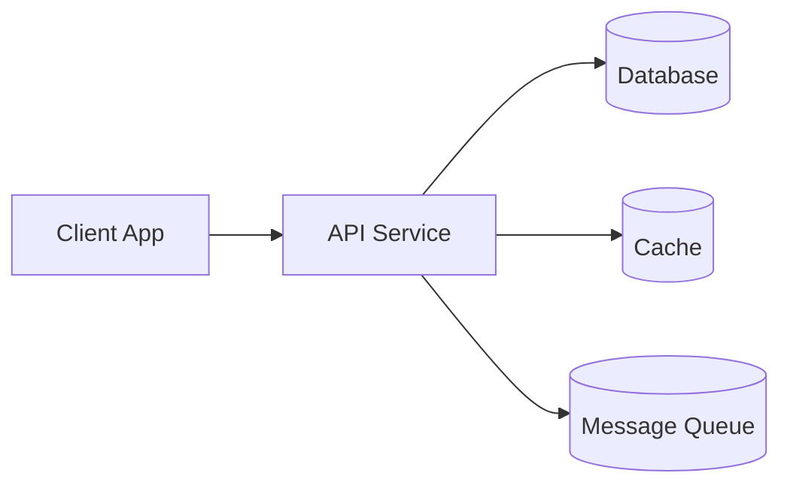
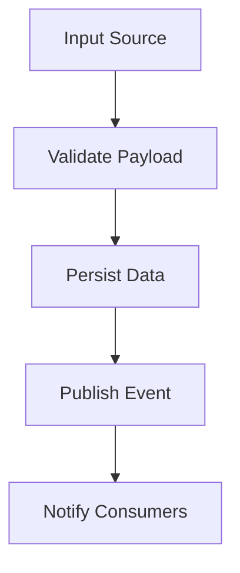

# Technical Design Document (TDD)

**Project Name**: {{project_name}}  
**Version**: {{version}}  
**Date**: {{date}}  
**Author**: {{author}}  
**Status**: {{status}}  

---

## 1. Executive Summary

### 1.1 Purpose
<!-- Brief description of what this system/feature does -->

### 1.2 Technology Stack

**Primary Language**: {{primary_language}} <!-- Python/JavaScript/TypeScript/Java/Go/Rust/C# -->

**Framework**: {{framework}}

**Runtime/Platform**: {{runtime}} <!-- Node.js/JVM/.NET/Browser/Cloud Function -->

| Layer | Technology | Version | Purpose |
|-------|------------|---------|---------|
| Language | | | |
| Framework | | | |
| Database | | | |
| Cache | | | |
| Message Queue | | | |
| Cloud Provider | | | |
| CI/CD | | | |

### 1.3 Key Design Decisions

1. 
2. 
3. 

---

## 2. Architecture Overview

### 2.1 High-Level Architecture

```
[Architecture diagram showing components and their interactions]
```



**Architecture Description**:

**Architecture Style**: {{architecture_style}} <!-- Monolith/Microservices/Serverless/Event-Driven/Layered -->

### 2.2 Component Breakdown

| Component | Responsibility | Technology | Owner |
|-----------|---------------|------------|-------|
| | | | |

### 2.3 Design Patterns Used

| Pattern | Where Applied | Justification |
|---------|---------------|---------------|
| | | |

### 2.4 Directory Structure

```
project/
├── src/
│   ├── ...
├── tests/
│   ├── ...
├── config/
│   ├── ...
└── ...
```

---

## 3. Data Model

### 3.1 Database Design

**Database Type**: {{db_type}} <!-- PostgreSQL/MySQL/MongoDB/DynamoDB/Redis/etc. -->

**ORM/ODM**: {{orm}} <!-- Prisma/TypeORM/Sequelize/Mongoose/SQLAlchemy/etc. -->

#### Entity Relationship Diagram

```
[ERD diagram]
```

#### Table Definitions

```sql
-- Example table
CREATE TABLE {{table_name}} (
    id UUID PRIMARY KEY DEFAULT gen_random_uuid(),
    created_at TIMESTAMP DEFAULT NOW(),
    updated_at TIMESTAMP DEFAULT NOW()
);
```

### 3.2 Data Models

<!-- Language-specific model definitions -->

**TypeScript/JavaScript**:
```typescript
interface Entity {
  id: string;
  createdAt: Date;
  updatedAt: Date;
}
```

**Python**:
```python
from dataclasses import dataclass
from datetime import datetime

@dataclass
class Entity:
    id: str
    created_at: datetime
    updated_at: datetime
```

**Java**:
```java
public class Entity {
    private String id;
    private LocalDateTime createdAt;
    private LocalDateTime updatedAt;
}
```

### 3.3 Data Flow

```
[Data flow diagram showing how data moves through the system]
```



---

## 4. API Design

### 4.1 API Style

**API Type**: {{api_type}} <!-- REST/GraphQL/gRPC/WebSocket/Message Queue -->

**API Version**: {{api_version}}

**Base URL**: {{api_base_url}}

### 4.2 Endpoints

| Endpoint | Method | Description | Auth Required |
|----------|--------|-------------|---------------|
| | | | |

### 4.3 Request/Response Schemas

#### Endpoint: {{endpoint_name}}

**Request**:
```json
{
  "field": "value"
}
```

**Response**:
```json
{
  "data": {},
  "meta": {}
}
```

### 4.4 Error Response Format

```json
{
  "error": {
    "code": "ERROR_CODE",
    "message": "Human readable message",
    "details": {}
  }
}
```

### 4.5 API Documentation

**Documentation Tool**: {{api_docs}} <!-- OpenAPI/Swagger/GraphQL Playground/Postman -->

**Documentation URL**: {{api_docs_url}}

---

## 5. Integration Points

### 5.1 External Services

| Service | Purpose | Protocol | Authentication | Rate Limits |
|---------|---------|----------|----------------|-------------|
| | | | | |

### 5.2 Internal Dependencies

| Package/Library | Version | Purpose | License |
|-----------------|---------|---------|---------|
| | | | |

### 5.3 Event/Message Contracts

**Message Broker**: {{message_broker}} <!-- Kafka/RabbitMQ/SQS/Redis Pub/Sub/etc. -->

| Event/Topic | Producer | Consumer(s) | Schema |
|-------------|----------|-------------|--------|
| | | | |

---

## 6. Security Design

### 6.1 Authentication

**Auth Method**: {{auth_method}} <!-- JWT/OAuth2/API Key/Session/mTLS -->

**Identity Provider**: {{idp}} <!-- Auth0/Cognito/Okta/Firebase/Custom -->

### 6.2 Authorization

**Authorization Model**: {{authz_model}} <!-- RBAC/ABAC/ACL/Policy-based -->

| Role | Permissions |
|------|-------------|
| | |

### 6.3 Data Protection

| Data Type | At Rest | In Transit | Retention |
|-----------|---------|------------|-----------|
| PII | | | |
| Credentials | | | |
| Logs | | | |

### 6.4 Security Considerations

| Threat | Risk Level | Mitigation |
|--------|------------|------------|
| SQL Injection | | Parameterized queries |
| XSS | | Input sanitization, CSP |
| CSRF | | CSRF tokens |
| | | |

### 6.5 Secrets Management

**Secrets Store**: {{secrets_store}} <!-- AWS Secrets Manager/HashiCorp Vault/Azure Key Vault/env vars -->

| Secret | Location | Rotation Policy |
|--------|----------|-----------------|
| | | |

---

## 7. Performance & Scalability

### 7.1 Performance Requirements

| Metric | Target | Measurement Method |
|--------|--------|-------------------|
| Response Time (p50) | | |
| Response Time (p99) | | |
| Throughput | | |
| Concurrent Users | | |
| Availability | | |

### 7.2 Scalability Strategy

**Scaling Type**: {{scaling_type}} <!-- Horizontal/Vertical/Auto-scaling -->

| Component | Scaling Strategy | Min | Max |
|-----------|------------------|-----|-----|
| | | | |

### 7.3 Caching Strategy

**Cache Provider**: {{cache_provider}} <!-- Redis/Memcached/CDN/In-memory -->

| Cache | TTL | Invalidation Strategy |
|-------|-----|----------------------|
| | | |

### 7.4 Performance Bottlenecks

| Bottleneck | Impact | Mitigation |
|------------|--------|------------|
| | | |

---

## 8. Error Handling & Observability

### 8.1 Error Handling Strategy

**Error Categories**:
- **Validation Errors**: Input validation failures
- **Business Errors**: Business rule violations
- **System Errors**: Infrastructure/technical failures
- **External Errors**: Third-party service failures

**Retry Strategy**:
| Error Type | Retry | Max Attempts | Backoff |
|------------|-------|--------------|---------|
| | | | |

### 8.2 Logging Strategy

**Logging Framework**: {{logging_framework}} <!-- Winston/Pino/Log4j/Serilog/Python logging -->

**Log Format**: {{log_format}} <!-- JSON/Structured/Plain text -->

| Level | What to Log | Example |
|-------|-------------|---------|
| ERROR | Unrecoverable failures | Exception stack traces |
| WARN | Recoverable issues | Retry attempts, degraded service |
| INFO | Business events | Request completed, user action |
| DEBUG | Technical details | Variable values, flow tracking |

**Log Aggregation**: {{log_aggregation}} <!-- ELK/CloudWatch/Datadog/Splunk -->

### 8.3 Monitoring & Alerting

**Monitoring Tool**: {{monitoring_tool}} <!-- Prometheus/Datadog/CloudWatch/New Relic -->

**Key Metrics**:
| Metric | Threshold | Alert |
|--------|-----------|-------|
| Error Rate | | |
| Latency p99 | | |
| CPU Usage | | |
| Memory Usage | | |

### 8.4 Tracing

**Tracing Tool**: {{tracing_tool}} <!-- Jaeger/Zipkin/X-Ray/OpenTelemetry -->

**Trace Propagation**: {{trace_propagation}} <!-- W3C Trace Context/B3/Custom -->

---

## 9. Testing Strategy

### 9.1 Test Pyramid

| Test Type | Coverage Target | Framework | Location |
|-----------|-----------------|-----------|----------|
| Unit | | | `tests/unit/` |
| Integration | | | `tests/integration/` |
| E2E | | | `tests/e2e/` |
| Performance | | | `tests/perf/` |

### 9.2 Test Data Strategy

**Test Data Source**: {{test_data_source}} <!-- Fixtures/Factories/Seeded DB/Mocks -->

**Data Isolation**: {{test_isolation}} <!-- Transactions/Containers/Separate DB -->

### 9.3 CI Testing

```yaml
# Example CI test stage
test:
  script:
    - npm run test:unit
    - npm run test:integration
  coverage:
    report: coverage/lcov.info
```

---

## 10. Deployment

### 10.1 Environments

| Environment | Purpose | URL | Config Source |
|-------------|---------|-----|---------------|
| DEV | Development | | |
| STAGING | Pre-production | | |
| PROD | Production | | |

### 10.2 Infrastructure

**Infrastructure as Code**: {{iac_tool}} <!-- Terraform/CloudFormation/Pulumi/CDK -->

**Container Orchestration**: {{container_orch}} <!-- Kubernetes/ECS/Docker Compose/None -->

**Deployment Target**: {{deployment_target}} <!-- EC2/Lambda/EKS/App Service/Vercel/etc. -->

### 10.3 CI/CD Pipeline

**CI/CD Tool**: {{cicd_tool}} <!-- GitHub Actions/GitLab CI/Jenkins/CircleCI -->

```
[Pipeline diagram]
┌─────────┐   ┌─────────┐   ┌─────────┐   ┌─────────┐   ┌─────────┐
│  Build  │ → │  Test   │ → │  Scan   │ → │ Deploy  │ → │ Verify  │
└─────────┘   └─────────┘   └─────────┘   └─────────┘   └─────────┘
```

### 10.4 Rollback Plan

**Rollback Strategy**: {{rollback_strategy}} <!-- Blue-Green/Canary/Rolling/Instant -->

**Rollback Triggers**:
- 
- 

**Rollback Steps**:
1. 
2. 

---

## 11. Maintenance & Operations

### 11.1 Runbook

| Scenario | Symptoms | Resolution |
|----------|----------|------------|
| | | |

### 11.2 Backup & Recovery

| Data | Backup Frequency | Retention | RTO | RPO |
|------|------------------|-----------|-----|-----|
| | | | | |

### 11.3 On-Call

**Escalation Path**:
1. L1: 
2. L2: 
3. L3: 

---

## 12. Appendix

### A. Glossary

| Term | Definition |
|------|------------|
| | |

### B. References

- 

### C. ADRs (Architecture Decision Records)

| ADR | Decision | Status | Date |
|-----|----------|--------|------|
| | | | |

### D. Change History

| Version | Date | Author | Changes |
|---------|------|--------|---------|
| 0.1 | | | Initial draft |

