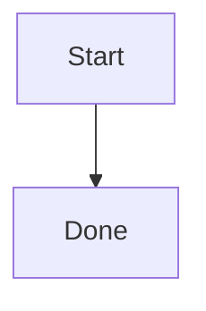

# UiPlan template kit (`templates/uiplan`)

**Canonical only:** this directory is the single template source for UiPlan.
MCP (`uipath_plan_spec_new`, etc.) and
`uv run python -m tools.uiplan generate-docs` both read from here.

Normalized copies of the UiPlan document templates used with the
**generate-docs -> review -> accept -> implement** flow.

## How To Use

1. Run **`uv run python -m tools.uiplan generate-docs <slug>`** (or your
   project's equivalent) to materialize `spec.md`, `plan.md`, and `tasks.md`
   from these templates.
   - Optional override: `--paradigm <value>` to force scaffold type when
     auto-detection is ambiguous.
2. **Human approval**: review the generated docs for accuracy, scope,
   development handoff, and constitution checks before any implementation work.
3. Accept the bundle, then use **`/uiplan-implement <slug>`** to implement from
   the approved `tasks.md`.
   - `uv run python -m tools.uiplan scaffold-code <slug> --max-loops N` is
     optional runtime/adaptor support. It is not the canonical implementation
     command and may only validate markers or return follow-up suggestions.

## Framework Reference

- Human overview: [docs/uiplan/README.md](../../docs/uiplan/README.md)
- Step-by-step: [docs/uiplan/HOW_TO_USE.md](../../docs/uiplan/HOW_TO_USE.md)
- Task authoring contract: [docs/uiplan/TASK_AUTHORING.md](../../docs/uiplan/TASK_AUTHORING.md)
- Historical design record: [UiPlan framework](../../docs/plans/2026-04-21-uiplan-framework.md)

## Files

| File | Role |
| --- | --- |
| `_spec-template.md` | Feature specification skeleton |
| `_plan-template.md` | Implementation plan skeleton |
| `_tasks-template.md` | Executable task list skeleton |
| `_diagram-patterns.md` | Ready-to-copy Pro Standard Mermaid blocks |

The templates now encode feasibility contracts:

- `spec.md`: paradigm + stack + CLI family + deploy gate in Development Handoff.
- `plan.md`: paradigm-specific code structure and build loop sections.
- `tasks.md`: artifact-level implementation tasks with grounding + verification.

Templates include **Pro Standard** Mermaid (`classDef`; `linkStyle` on
flowcharts) per [`.cursor/skills/mermaid-diagram-builder/SKILL.md`](../../.cursor/skills/mermaid-diagram-builder/SKILL.md).

## Mermaid Preview

This workspace recommends `bierner.markdown-mermaid` via
[`.vscode/extensions.json`](../../.vscode/extensions.json). Install the
recommendation and reload Cursor so ` ```mermaid ` fences render directly in
Markdown Preview.

Use plain fenced Mermaid blocks:

````markdown

````

Avoid `%%{init}%%` theme blocks in templates. Some markdown preview renderers
either ignore them or fall back to showing the Mermaid source as a code block.
Keep visual styling in `classDef` and `linkStyle` directives inside the diagram.
