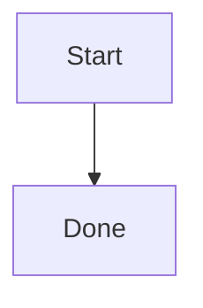

# UiPlan template kit (`templates/uiplan`)

**Canonical only:** this directory is the single template source for UiPlan.
MCP (`uipath_plan_spec_new`, etc.) and
`uv run python -m tools.uiplan generate-docs` both read from here.

Normalized copies of the UiPlan document templates used with the
**generate-docs -> review -> accept -> implement** flow.

## How To Use

1. Run **`uv run python -m tools.uiplan generate-docs <slug>`** (or your
   project's equivalent) to materialize `spec.md`, `plan.md`, and `tasks.md`
   from these templates.
   - Optional override: `--paradigm <value>` to force scaffold type when
     auto-detection is ambiguous.
2. **Human approval**: review the generated docs for accuracy, scope,
   development handoff, and constitution checks before any implementation work.
3. Accept the bundle, then use **`/uiplan-implement <slug>`** to implement from
   the approved `tasks.md`.
   - `uv run python -m tools.uiplan scaffold-code <slug> --max-loops N` is
     optional runtime/adaptor support. It is not the canonical implementation
     command and may only validate markers or return follow-up suggestions.

## Framework Reference

- Human overview: [docs/uiplan/README.md](../../docs/uiplan/README.md)
- Step-by-step: [docs/uiplan/HOW_TO_USE.md](../../docs/uiplan/HOW_TO_USE.md)
- Task authoring contract: [docs/uiplan/TASK_AUTHORING.md](../../docs/uiplan/TASK_AUTHORING.md)
- Historical design record: [UiPlan framework](../../docs/plans/2026-04-21-uiplan-framework.md)

## Files

| File | Role |
| --- | --- |
| `_spec-template.md` | Feature specification skeleton |
| `_plan-template.md` | Implementation plan skeleton |
| `_tasks-template.md` | Executable task list skeleton |
| `_diagram-patterns.md` | Ready-to-copy Pro Standard Mermaid blocks |
| `_workflow-catalog.md` | Curated UiPath workflow templates (Dispatcher, Performer, LRW, Custom HITL, BPMN, etc.) with diagrams, when-to-use, activities, CLI verbs, and skill routing |

## Document personas (BA / Dev / Solution Engineer)

Each template targets a different audience and carries an explicit
**Audience and Scope** banner. Keep content in the right document; the review
tool flags persona leakage.

| Document | Audience | Owns | Avoids |
| --- | --- | --- | --- |
| `spec.md` | BA <-> Developer | Business intent, user stories, acceptance criteria, NFRs, SME / NEEDS CLARIFICATION items | `.xaml` / `.cs` / `.py` filenames, CLI verbs, `[skill:...]`, package versions, activity-level wiring |
| `plan.md` | Developer <-> Solution Engineer | Architecture, paradigm, project topology, workflow catalog, activity inventory, bindings, dependencies, capability routing, stack policy, coded-surface justification | Per-activity micro-instructions, per-line CLI recipes |
| `tasks.md` | Solution Engineer -> Developer / Executor | Per-task artifact paths, exact CLI commands, evidence paths, `[skill:]`/`[agent:]`/`[subagent:]`/`[library:]`/`[askai:]` tags, acceptance gates, build/verify/diagnose/fix loop | Re-opening architectural decisions; anything not already settled in `spec.md` / `plan.md` |

When uncertain, every persona must run the **AskAI / Library escalation
ladder** before asking the user: `uipath_library_search` /
`uipath_library_lookup` -> `uipath_doc_get_activity` /
`uipath_doc_list_packages` -> `query_uipath_docs` -> specialist skill or
`[agent:uipath-project-discovery-agent]` -> user (recording attempts).

## Stack policy (Modern Studio + activity-first)

- Latest UiPath Studio (Desktop + Web), C# expressions, Windows target, .NET 8.
- **No** `Windows-Legacy` / VB.Net / Classic. `uipath-rpa-legacy` is excluded
  from default routing.
- Prefer UiPath activities (resolved via `uipath_doc_get_activity`); coded
  automation (`.cs` workflow) is allowed only when justified in
  `plan.md` -> `## Coded Surface Justification`.
- Custom HITL surface: org `HITL_Application` (Adaptive Cards + Slack) +
  Action Center External Tasks via `[skill:uipath-custom-hitl]`. Do **not**
  use UiPath Flow as the HITL canvas.

The templates now encode feasibility contracts:

- `spec.md`: paradigm + stack + CLI family + deploy gate in Development Handoff.
- `plan.md`: paradigm-specific code structure and build loop sections.
- `tasks.md`: artifact-level implementation tasks with grounding + verification.

Templates are also **visual-first**:

- `spec.md` includes architecture, sequence, story journey, data-contract, and ownership maps.
- `plan.md` includes story visuals, capability ownership, data-contract, architecture, and build-loop visuals.
- `tasks.md` includes task execution maps plus per-story workflow diagrams and build/diagnostics loops.
- `templates/uiplan/_diagram-patterns.md` contains reusable copy-ready diagrams for these sections.

Templates include **Pro Standard** Mermaid (`classDef`; `linkStyle` on
flowcharts) per [`.cursor/skills/mermaid-diagram-builder/SKILL.md`](../../.cursor/skills/mermaid-diagram-builder/SKILL.md).

## Mermaid Preview

This workspace recommends `bierner.markdown-mermaid` via
[`.vscode/extensions.json`](../../.vscode/extensions.json). Install the
recommendation and reload Cursor so ` ```mermaid ` fences render directly in
Markdown Preview.

Use plain fenced Mermaid blocks:

````markdown

````

Avoid `%%{init}%%` theme blocks in templates. Some markdown preview renderers
either ignore them or fall back to showing the Mermaid source as a code block.
Keep visual styling in `classDef` and `linkStyle` directives inside the diagram.

## Task Readiness Boundary

`tasks.md` is the implementation contract, not discovery work. Discovery, project
surface mapping, template decisions, and capability routing must be complete in
`spec.md` + `plan.md` before `/uiplan-tasks` runs. If those inputs are missing,
rerun `/uiplan-ground` and `/uiplan-plan` first.
