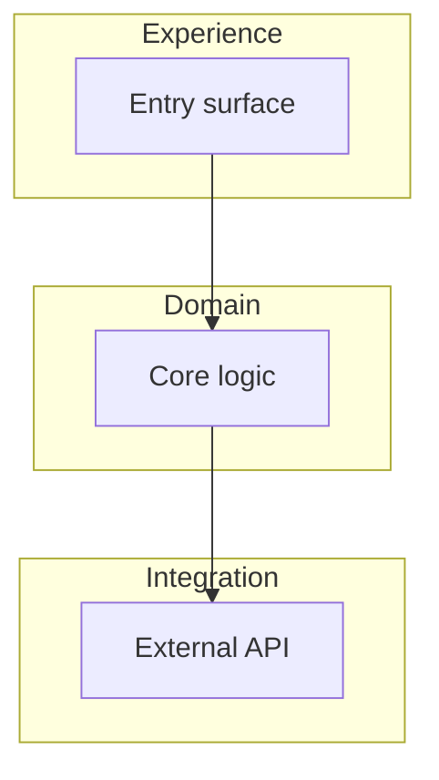
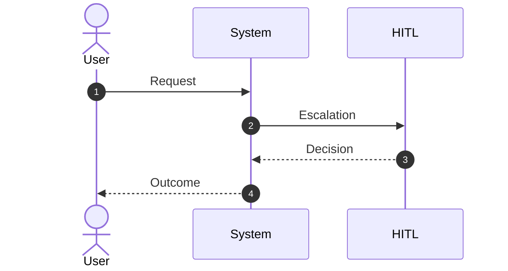
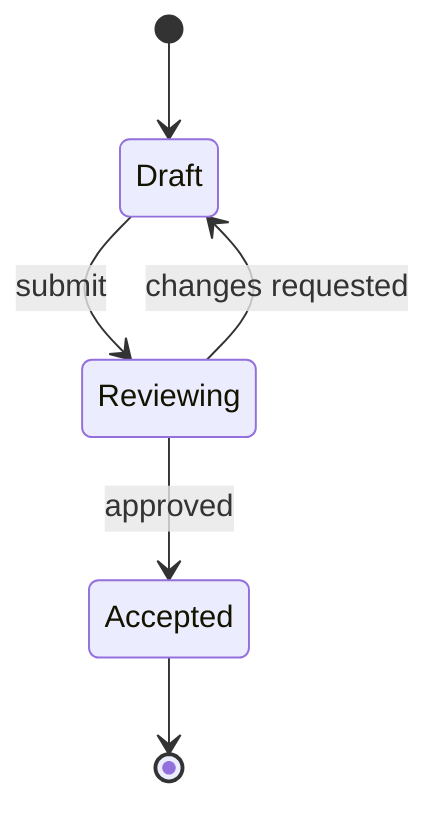

# UiPlan diagram patterns (Pro Standard)

Copy one of the blocks below into `spec.md`, `plan.md`, or `tasks.md`, then **replace labels only**. Full rules: [`.cursor/skills/mermaid-diagram-builder/SKILL.md`](../../.cursor/skills/mermaid-diagram-builder/SKILL.md).

## When to use which

| Pattern | Use for |
| --- | --- |
| **Flowchart TB** | Layered architecture, scope boundaries, gate pipelines |
| **Sequence** | Actor vs system vs HITL message flow |
| **State** | Plan lifecycle (draft -> review -> accepted) |

---

## 1) Flowchart TB (layered scope)

---

## 2) Sequence (actors vs system)

---

## 3) State diagram (plan lifecycle)

