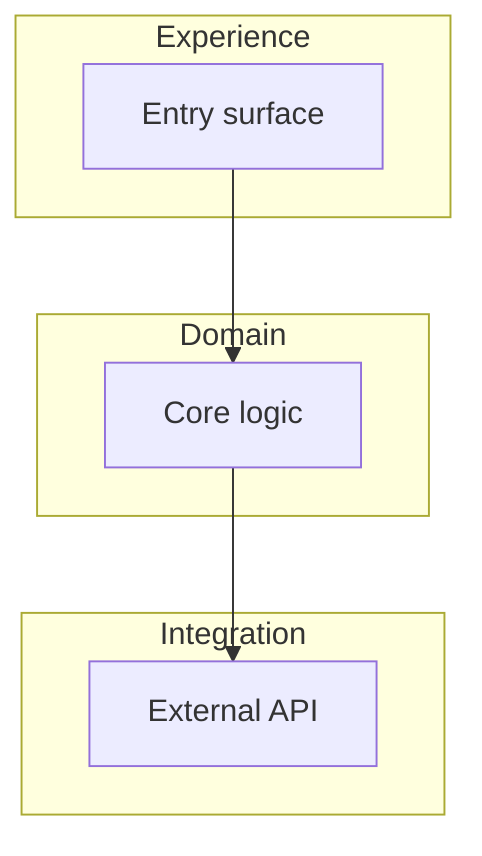
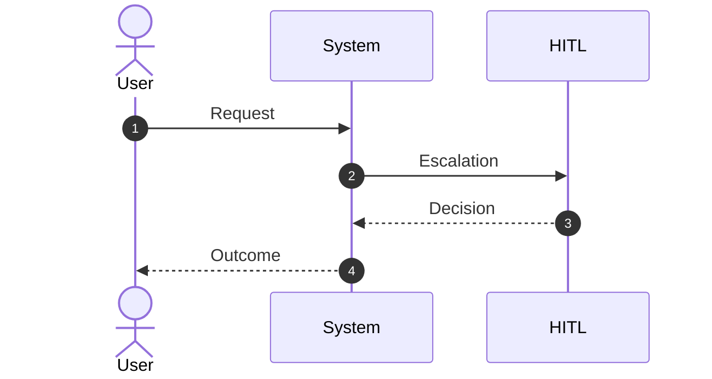
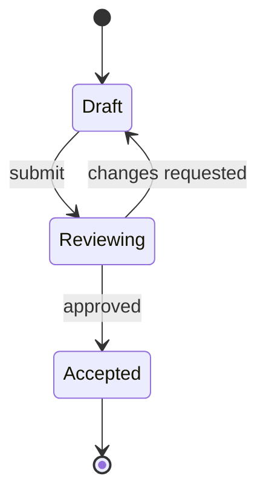
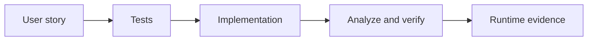
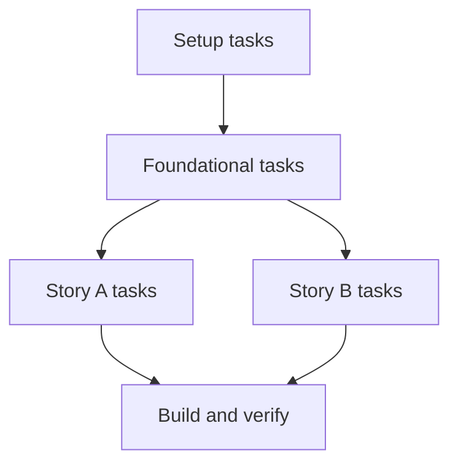
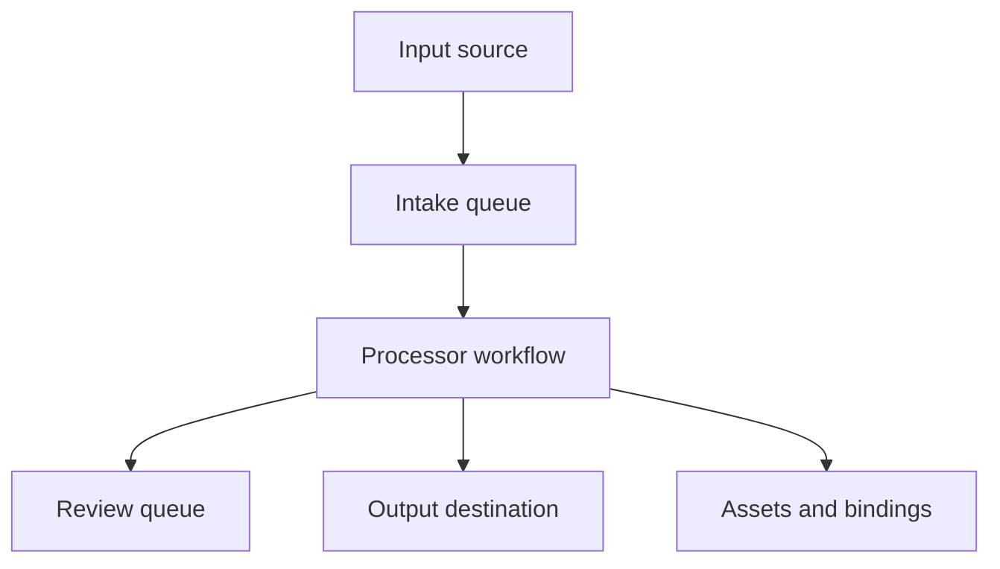
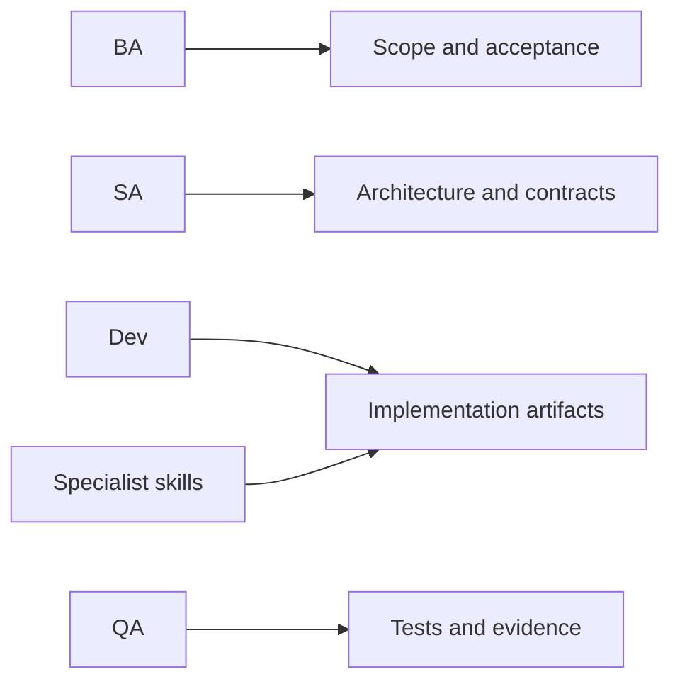
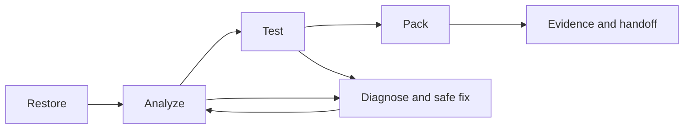
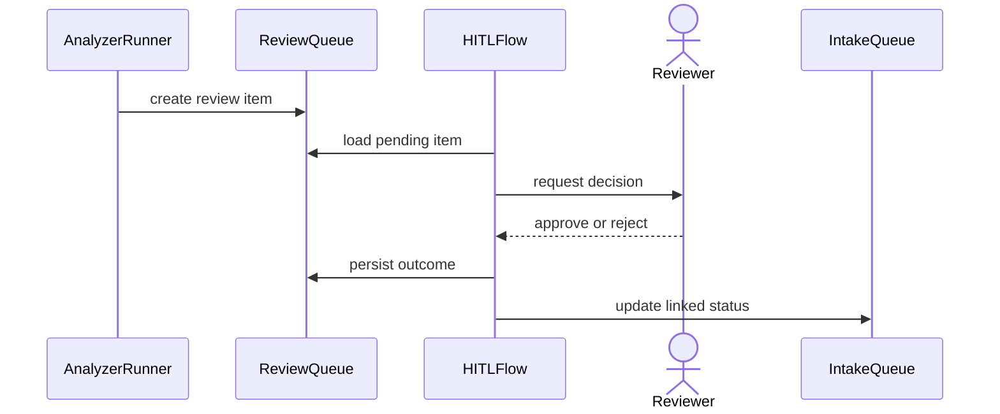

# UiPlan diagram patterns (Pro Standard)

Copy one of the blocks below into `spec.md`, `plan.md`, or `tasks.md`, then **replace labels only**. Full rules: [`.cursor/skills/mermaid-diagram-builder/SKILL.md`](../../.cursor/skills/mermaid-diagram-builder/SKILL.md).

## When to use which

| Pattern | Use for |
| --- | --- |
| **Flowchart TB** | Layered architecture, scope boundaries, gate pipelines |
| **Sequence** | Actor vs system vs HITL message flow |
| **State** | Plan lifecycle (draft -> review -> accepted) |
| **Story workflow map** | Per-story execution narrative for spec/plan/tasks |
| **Task dependency map** | Task ordering and parallel tracks in tasks |
| **Queue/data contract map** | Queue, asset, and output boundaries |
| **Capability ownership map** | BA/SA/Dev/QA + skill responsibility split |
| **Build loop** | Restore -> analyze -> test -> pack loop with retry |
| **HITL review sequence** | Review creation, human decision, closure updates |

---

## 1) Flowchart TB (layered scope)

---

## 2) Sequence (actors vs system)

---

## 3) State diagram (plan lifecycle)

---

## 4) Story workflow map

Use in `spec.md`, `plan.md`, and `tasks.md` when you need one diagram per story.

---

## 5) Task dependency map

Use in `tasks.md` to show execution order and parallel lanes.

---

## 6) Queue/data contract map

Use in `spec.md` and `plan.md` to explain queue, asset, and output contracts.

---

## 7) Capability ownership map

Use in `plan.md` and `tasks.md` to show who owns each part of implementation.

---

## 8) Build/analyze/test/pack loop

Use in `plan.md` and `tasks.md` build/handoff sections.

---

## 9) HITL review sequence

Use in `spec.md` and `tasks.md` where human-review logic is required.

