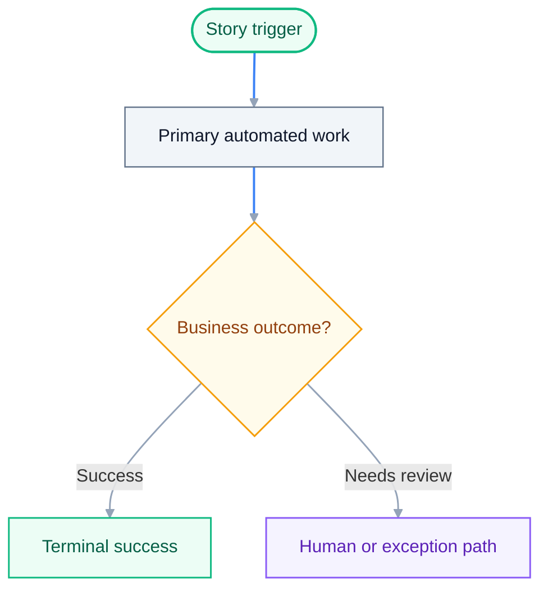
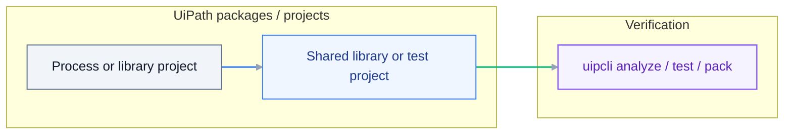
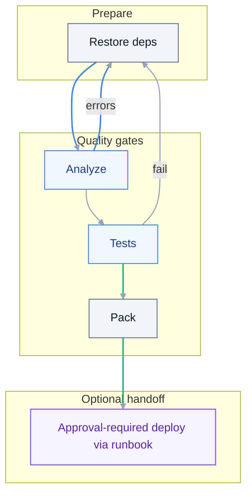

# Implementation Plan: {{TITLE}}

> **Grounding:** {{GROUNDING_CITATIONS}}
> **Spec:** `./spec.md`

**Date**: {{DATE}}
**Spec**: ./spec.md

## Summary

{{SUMMARY}}

## Per-project workflow and platform inventory

Fill after solution/RPA decomposition (names come from SDD/plan — not invented):

| Project / package | Entry workflows (`.xaml` / `.cs` / graph) | Queues / assets / bindings |
| --- | --- | --- |
| _e.g. `projects/ZipEmail.Dispatcher/Main.xaml`_ | Sequence / Flowchart / Long Running + named sequences | _Queue names, asset keys, `bindings/dev.json` keys_ |

List open **AskAI / library** topics (`uipath_library_search` query text) and mandatory `uipath_doc_get_activity` calls before implementation.

## Grounding Inputs

{{GROUNDING_CONTEXT}}

## Source routing (MCP)

{{SOURCE_ROUTING_SNIPPET}}

## Planner Route & Specialist Handoff

{{PLANNER_HANDOFF}}

## Technical Context

**Language/Version**: {{LANG_VERSION}}
**Implementation Paradigm**: {{PARADIGM}}
**CLI Family**: {{CLI_FAMILY}}
**Primary Dependencies**: {{DEPS}}
**Storage**: {{STORAGE}}
**Testing**: {{TESTING}}
**Target Platform**: {{TARGET_PLATFORM}}
**Project Type**: {{PROJECT_TYPE}}
**Performance Goals**: {{PERF}}
**Constraints**: {{CONSTRAINTS}}
**Scale/Scope**: {{SCALE}}

## XAML workflow shape (RPA / Solution)

{{WORKFLOW_SHAPE_BLOCK}}

## Story visual map

Divide visuals by user story when the spec has multiple stories. Use one
diagram per story slice so `tasks.md` can map build tasks, tests, and evidence
to the same boundaries.



## Logging and verification contract

{{LOGGING_VERIFICATION_BLOCK}}

## Constitution Check

Gates re-checked after Phase 1 design:

{{CONSTITUTION_CHECKLIST}}

## Project Structure

### Documentation (this feature)

```text
.cursor/plans/{{FOLDER_NAME}}/
  spec.md
  plan.md
  tasks.md
  .meta.yaml
```

### Source Code (repository root)

{{CODE_STRUCTURE_BLOCK}}

### Paradigm build loop

{{BUILD_LOOP_BLOCK}}

**Structure Decision**: {{STRUCTURE_DECISION}}

## Architecture diagram

Implementation layering and dependencies (adapt nodes to this plan).



## Development execution contract

The accepted bundle is the build contract. After review and human acceptance:

1. Execute `tasks.md` in order, keeping tests before implementation within each
   user-story slice.
2. Use the matched specialist skill(s) from **Grounding Inputs** for source
   changes; do not invent UiPath APIs, activities, or CLI verbs.
3. Run the local build loop for the detected project type:
   restore -> analyze -> test -> pack.
4. If analyze/test/tooling fails, parse the structured output, consult the
   relevant skills/docs/tools, apply one safe local fix when evidence supports
   it, rerun the same gate, and record the result before calling the issue
   blocked.
5. Deployment remains approval-required and follows the deployment policy below.

Preferred build handoff after review and human acceptance:

```text
/uiplan-implement {{FOLDER_NAME}}
```

`scaffold-code` is optional local runtime/adaptor support. It is not a
replacement for the implementation contract in `tasks.md`.

## Build and verify gates

Restore, analyze, test, and pack (adapt steps to your project type).



## Deployment policy

Deployment tasks are optional and approval-required. If this plan includes
publish/deploy work, reference [docs/ORCHESTRATOR_DEPLOYMENT.md](../../docs/ORCHESTRATOR_DEPLOYMENT.md)
instead of embedding long deploy recipes. The first task must be the
compatibility preflight: Studio, CLI, package versions, target framework,
Orchestrator target, and Solution/Maestro support.

## Activity references (optional)

`uipath_plan_tasks_new` scans **plan.md** and **spec.md** for machine-readable activity tags (up to 8 unique pairs) and appends matching documentation to **tasks.md**.

Tag shape on **one line** (no line breaks inside the tag): an opening square bracket `[`, the literal prefix `activity:`, your NuGet-style **PackageId**, a colon, the **ActivityName** as in Studio, then `]`. Only add tags for activities you will actually use; omit demo or placeholder tags so **Resolved activity docs** stays short.

Human-readable shape (not a tag - note the space after `[` so tooling ignores it): `[ activity:YourPackage.YourActivities:YourActivityName ]`.

## Complexity Tracking

{{COMPLEXITY_TABLE}}
