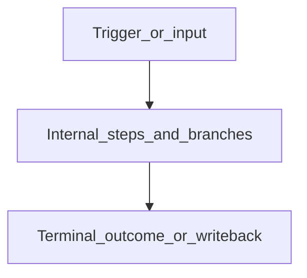
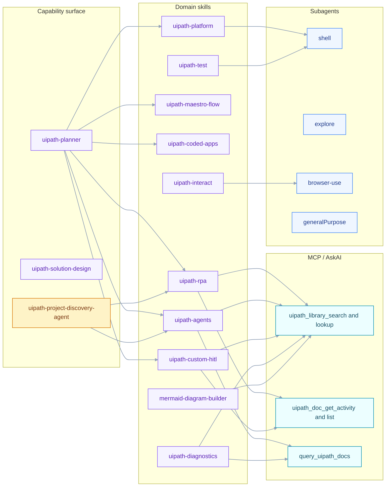
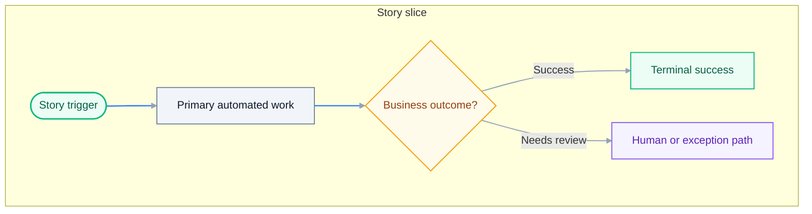
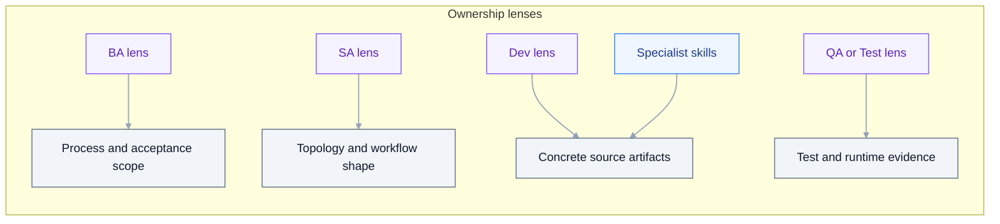
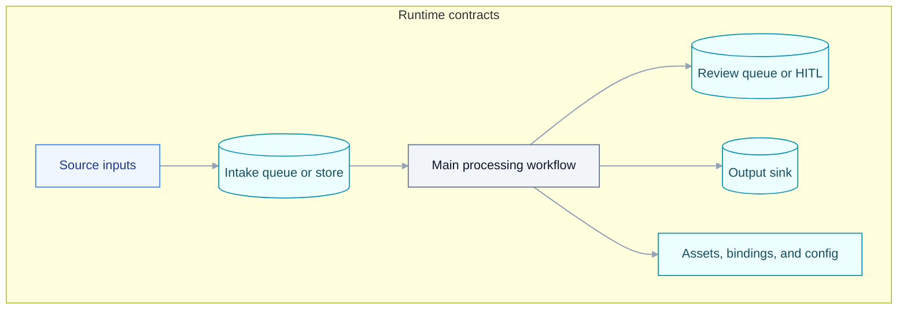
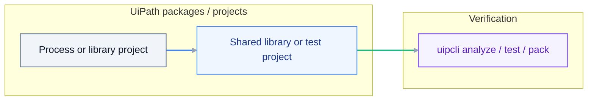
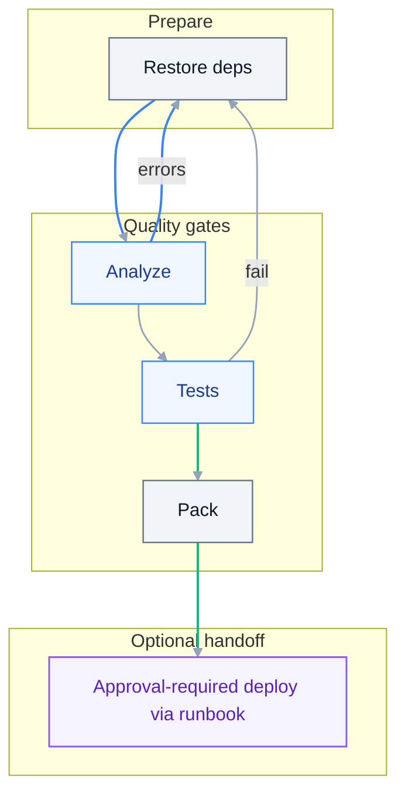

# Implementation Plan: {{TITLE}}

> **Grounding:** {{GROUNDING_CITATIONS}}
> **Spec:** `./spec.md`

**Date**: {{DATE}}
**Spec**: ./spec.md

## Audience and Scope

This document is the **Developer <-> Solution Engineer** contract. It captures
architecture, paradigm decisions, project topology, integration boundaries,
bindings, dependencies, capability routing, and build/verify gates.

- **Do** name projects, workflow files, workflow types, queues, assets, code
  modules, dependencies, CLI families, skills, subagents, and agents.
- **Do** declare the stack policy and any coded-surface justification.
- **Do not** expand into per-activity micro-instructions or per-line CLI
  recipes — that elaboration belongs in `tasks.md`.

If a role hits a knowledge gap, run the AskAI / Library ladder before asking
the user: `uipath_library_search` / `uipath_library_lookup` ->
`uipath_doc_get_activity` / `uipath_doc_list_packages` -> `query_uipath_docs` ->
specialist skill or `[agent:uipath-project-discovery-agent]`, then user.

## Stack Policy (Modern Studio + Activity-First)

- **Studio**: latest UiPath Studio + Studio Web. **No Legacy / Windows-Legacy /
  VB.Net / Classic.** `uipath-rpa-legacy` is excluded from default routing.
- **Expressions / runtime**: C# expressions, Windows target, .NET 8.
- **Activity-first**: prefer `.xaml` workflows built from UiPath activities
  (resolved via `uipath_doc_get_activity`). Coded automation (`.cs`) is allowed
  only when explicitly justified in `## Coded Surface Justification` below.
- **Coded agents** (Python / LangGraph default) remain unaffected; this policy
  is RPA-side only.

### Coded Surface Justification

| Coded surface (`.cs` workflow) | Why activities are insufficient | Coverage check (library / activity-doc lookup) |
| --- | --- | --- |
| _empty by default — fill only when justified_ | | |

## Summary

{{SUMMARY}}

## Per-project workflow and platform inventory

Fill after solution/RPA decomposition (names come from SDD/plan — not invented):

| Project / package | Entry workflows (`.xaml` / `.cs` / graph) | Queues / assets / bindings |
| --- | --- | --- |
| _e.g. `projects/ZipEmail.Dispatcher/Main.xaml`_ | Sequence / Flowchart / Long Running + named sequences | _Queue names, asset keys, `bindings/dev.json` keys_ |

List open **AskAI / library** topics (`uipath_library_search` query text) and mandatory `uipath_doc_get_activity` calls before implementation.

## 360 visibility traceability (spec -> plan)

Each row must map to one or more rows in `spec.md` `## 360 Build Visibility Contract`.
Do not leave rows out for in-scope surfaces.

| Spec visibility area | Plan section(s) carrying it | Required plan evidence |
| --- | --- | --- |
| Workflow/artifact inventory | `## Workflow Catalog`, `## Project Inventory` | every artifact has path/type/owner |
| Activity/connector/dependency visibility | `## Activity Inventory`, `## Dependency Matrix` | package/activity/connector rows resolved from docs |
| Agent/DMN/Flow/HITL/platform resources | `## Code Module Inventory`, `## Bindings and Environment` | invocation boundaries + IO + ownership |
| Logging/observability contract | `## Logging and verification contract` | phase markers + correlation id + assertions |
| Scaffold provenance and anti-stub rules | `## Project Inventory`, `## Workflow Catalog` | scaffold source + preserved structure + anti-stub notes |
| Verification/evidence contract | `## CLI Command Matrix` | per-surface verify commands + evidence outputs |

## Spec artifact chain map

Each in-scope artifact from `spec.md` must be traceable through plan design and
task execution.

| Spec artifact path | Plan section owning design | Planned task area | Verify/evidence owner |
| --- | --- | --- | --- |
| `<artifact path>` | `## Workflow Catalog` / `## Activity Inventory` | `tasks.md` story + task IDs | `## CLI Command Matrix` |

## Grounding Inputs

{{GROUNDING_CONTEXT}}

## Source routing (MCP)

{{SOURCE_ROUTING_SNIPPET}}

## Planner Route & Specialist Handoff

{{PLANNER_HANDOFF}}

## Project Inventory

Every project in scope, its kind, descriptor, starter template, and scaffold command.

| Project | Kind | Repo path | Descriptor | Starter template | Scaffold command |
| --- | --- | --- | --- | --- | --- |
| _e.g. `Process.Dispatcher`_ | modern-rpa | `projects/Process.Dispatcher/` | `project.json` | Dispatcher | `uip rpa create-project --studio-dir ...` |

## Workflow Catalog

Per project, list every workflow file the build needs. Reference reusable patterns in
[`_workflow-catalog.md`](../../templates/uiplan/_workflow-catalog.md).

| Project | Workflow file | Type | Owns story | Invoked by | Invokes | Correlation id |
| --- | --- | --- | --- | --- | --- | --- |
| _Process.Dispatcher_ | `Main.xaml` | Sequence | US1 | Trigger | Queue.Add | `correlationId` |

Add one row for every in-scope artifact from `spec.md` (including `.flow`, `.dmn`,
`langgraph.json` entrypoints, bindings, and queue/asset sidecars when they are
part of completion criteria).

## Workflow diagram + activity conformance matrix (required)

For every workflow row in `## Workflow Catalog`, record where its diagram lives
and which activities/nodes must exist before implementation is considered done.

| Workflow artifact | Diagram section | Mandatory activities/nodes | Verify activity docs/package | Primary skill/tool route | Build/verify command |
| --- | --- | --- | --- | --- | --- |
| `projects/<Name>/Main.xaml` | `## Surface execution visuals` | Sequence, Switch, If, Assign, Log Message, Try Catch | `uipath_doc_get_activity` + package source | `[skill:uipath-rpa]` | `uipcli package analyze ... --resultPath out/analyze-<name>.json` |

## Surface execution visuals (required)

For each workflow artifact listed in `## Workflow Catalog`, add one dedicated
subsection and Mermaid diagram.

#### `projects/<Name>/Main.xaml`



Repeat this pattern for every `.xaml`, `.flow`, workflow `.py`, and `.dmn`
artifact referenced by this plan.

If workflow intake is mailbox-driven, add explicit rows for dispatcher intake
surfaces and include:

- scaffold/template provenance (dispatcher template root or existing dispatcher
  project source),
- real connector read activity boundary (safe sample allowed),
- idempotency/cursor behavior,
- non-stub queue payload evidence.

## Activity Inventory

Only entries resolved via `uipath_doc_get_activity` / `uipath_library_search` /
`uipath_library_lookup`. Unresolved entries belong in `## Open Grounding Questions`.

| Workflow | Package | Activity | Inputs | Outputs | Connection / asset |
| --- | --- | --- | --- | --- | --- |
| _Main.xaml_ | _UiPath.Mail.Activities_ | _GetIMAPMailMessages_ | _server, port, filter_ | _List<MailMessage>_ | _MailConnection_ |

## Code Module Inventory (agents / apps)

| Module | File | Symbol | Schema (request -> response) | Tools / nodes | Model / gateway |
| --- | --- | --- | --- | --- | --- |
| _AnalyzerAgent_ | `projects/AnalyzerAgent/src/graph.py` | `graph` | `{ subject, body } -> { route, reasons }` | classify, lookup_vendor | UiPath LLM Gateway / gpt-4o-mini |

## Bindings and Environment

| Resource | Name | Folder | Tenant-only? | Notes |
| --- | --- | --- | --- | --- |
| Queue | _IntakeQueue_ | _Dev_ | no | _stores intake items_ |
| Asset | _MailConnection_ | _Dev_ | yes | _credential, set per env_ |

Include connectors and external connection IDs when applicable:

| Resource type | Name/id | Environment file | Owner surface | Verification evidence |
| --- | --- | --- | --- | --- |
| _Connector connection_ | _connection-id_ | `bindings/dev.json` | _Flow or XAML host_ | _connectivity check + run log_ |

## Dependency Matrix

| Project | Manager | Package | Version | Source |
| --- | --- | --- | --- | --- |
| _Process.Dispatcher_ | NuGet | _UiPath.Mail.Activities_ | _>=1.20_ | library hit |
| _AnalyzerAgent_ | uv | _uipath-langchain_ | _>=0.8,<0.9_ | pyproject |

## CLI Command Matrix

Per project, the exact commands the Solution Engineer runs in the build loop.

| Project | Restore | Analyze | Test | Pack | Smoke |
| --- | --- | --- | --- | --- | --- |
| _Process.Dispatcher_ | `uipcli package restore` | `uipcli package analyze --resultPath out/dispatcher-analyze.json` | `uipcli test run -a <key> .` | `uipcli package pack` | `uipcli job run` (personal workspace) |

## Skill and Subagent Routing

Map every project x phase to the owning capability. Each row also informs
`tasks.md` task tags.

| Project | Phase | Skill(s) | Agent / discovery | Subagent | MCP / AskAI tools |
| --- | --- | --- | --- | --- | --- |
| _Process.Dispatcher_ | Build | `[skill:uipath-rpa]` | `[agent:uipath-project-discovery-agent]` | `[subagent:explore]` | `uipath_library_search`, `uipath_doc_get_activity` |
| _AnalyzerAgent_ | Build | `[skill:uipath-agents]` |  | `[subagent:generalPurpose]` | `uipath_library_search`, `query_uipath_docs` |
| _all_ | Verify | `[skill:uipath-diagnostics]`, `[skill:uipath-platform]`, `[skill:uipath-test]` |  | `[subagent:shell]`, `[subagent:browser-use]` (UI smoke) |  |
| _all_ | Diagrams | `[skill:mermaid-diagram-builder]` |  |  |  |

## LLM execution navigation (skills/tools/subagents)

This table is a deterministic navigation contract for LLMs and implementers.

| Execution question | Section to navigate | Primary surface | Escalation path |
| --- | --- | --- | --- |
| Which artifact to build? | `## Workflow Catalog`, `## Project Inventory` | project + workflow path | `## Open Grounding Questions` |
| Which skill/tool to use? | `## Skill and Subagent Routing` | `[skill:...]`, `[subagent:...]` | `## AskAI / Library Escalation Ladder` |
| Which command verifies completion? | `## CLI Command Matrix` | restore/analyze/test/pack/smoke | `## Logging and verification contract` |
| Which evidence proves done? | `## Logging and verification contract` | expected logs/assertions | task evidence paths in `tasks.md` |

HITL routing defaults to `[skill:uipath-custom-hitl]`. If accepted `spec.md`
explicitly requires Flow as HITL canvas, mark the override in this section and
route through `[skill:uipath-maestro-flow]` instead.

## Capability Routing Map



## AskAI / Library Escalation Ladder

When uncertain about activities, packages, CLI flags, integration patterns, or
project context, traverse this ladder before asking the user:

1. `uipath_library_search` (ranked) and `uipath_library_lookup` (book/section).
2. `uipath_doc_get_activity` / `uipath_doc_list_packages` for activity semantics.
3. `query_uipath_docs` for AskAI fallback.
4. Specialist skill (route from the table above) or
   `[agent:uipath-project-discovery-agent]` for project-local context.
5. Only then ask the user, naming what was already attempted.

## Open Grounding Questions

Items the Solution Engineer could not auto-resolve via the ladder above. These
will surface as targeted questions when `/uiplan-plan` runs.

- _none — add `NEEDS-CLARIFICATION` items here when applicable_

## Technical Context

**Language/Version**: {{LANG_VERSION}}
**Implementation Paradigm**: {{PARADIGM}}
**CLI Family**: {{CLI_FAMILY}}
**Primary Dependencies**: {{DEPS}}
**Storage**: {{STORAGE}}
**Testing**: {{TESTING}}
**Target Platform**: {{TARGET_PLATFORM}}
**Project Type**: {{PROJECT_TYPE}}
**Performance Goals**: {{PERF}}
**Constraints**: {{CONSTRAINTS}}
**Scale/Scope**: {{SCALE}}

## XAML workflow shape (RPA / Solution)

{{WORKFLOW_SHAPE_BLOCK}}

## Story visual map

Divide visuals by user story when the spec has multiple stories. Use one
diagram per story slice so `tasks.md` can map build tasks, tests, and evidence
to the same boundaries.



## Capability and ownership map

Map each build surface to personas and specialist capabilities before tasking.



## Data and queue contract map

Show the major runtime contracts consumed by implementation tasks.



## Logging and verification contract

{{LOGGING_VERIFICATION_BLOCK}}

## Constitution Check

Gates re-checked after Phase 1 design:

{{CONSTITUTION_CHECKLIST}}

## Project Structure

### Documentation (this feature)

```text
.cursor/plans/{{FOLDER_NAME}}/
  spec.md
  plan.md
  tasks.md
  .meta.yaml
```

### Source Code (repository root)

{{CODE_STRUCTURE_BLOCK}}

### Paradigm build loop

{{BUILD_LOOP_BLOCK}}

**Structure Decision**: {{STRUCTURE_DECISION}}

## Architecture diagram

Implementation layering and dependencies for this specific plan.



## Development execution contract

The accepted bundle is the build contract. After review and human acceptance:

1. Execute `tasks.md` in order, keeping tests before implementation within each
   user-story slice.
2. Use the matched specialist skill(s) from **Grounding Inputs** for source
   changes; do not invent UiPath APIs, activities, or CLI verbs.
3. Run the local build loop for the detected project type:
   restore -> analyze -> test -> pack.
4. If analyze/test/tooling fails, parse the structured output, consult the
   relevant skills/docs/tools, apply one safe local fix when evidence supports
   it, rerun the same gate, and record the result before calling the issue
   blocked.
5. Deployment remains approval-required and follows the deployment policy below.

Preferred build handoff after review and human acceptance:

```text
/uiplan-implement {{FOLDER_NAME}}
```

`scaffold-code` is optional local runtime/adaptor support. It is not a
replacement for the implementation contract in `tasks.md`.

## Build and verify gates

Restore, analyze, test, and pack (adapt steps to your project type).



## Deployment policy

Deployment tasks are optional and approval-required. If this plan includes
publish/deploy work, reference [docs/ORCHESTRATOR_DEPLOYMENT.md](../../docs/ORCHESTRATOR_DEPLOYMENT.md)
instead of embedding long deploy recipes. The first task must be the
compatibility preflight: Studio, CLI, package versions, target framework,
Orchestrator target, and Solution/Maestro support.

## Activity references (optional)

`uipath_plan_tasks_new` scans **plan.md** and **spec.md** for machine-readable activity tags (up to 8 unique pairs) and appends matching documentation to **tasks.md**.

Tag shape on **one line** (no line breaks inside the tag): an opening square bracket `[`, the literal prefix `activity:`, your NuGet-style **PackageId**, a colon, the **ActivityName** as in Studio, then `]`. Only add tags for activities you will actually use; omit demo or placeholder tags so **Resolved activity docs** stays short.

Human-readable shape (not a tag - note the space after `[` so tooling ignores it): `[ activity:YourPackage.YourActivities:YourActivityName ]`.

## Complexity Tracking

{{COMPLEXITY_TABLE}}
