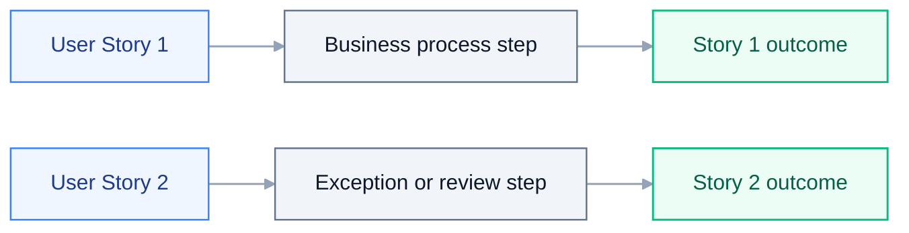

# Feature Specification: {{TITLE}}

> **Grounding:** {{GROUNDING_CITATIONS}}

**Created**: {{DATE}}
**Status**: Draft
**Input**: User description: "{{INTENT}}"

## Audience and Scope

This document is the lightweight **BA <-> Developer** bridge. The formal PDD and
SDD remain the readable human documentation. This spec summarizes only the
business outcome, scope, user stories, acceptance criteria, and open SME facts
needed to prepare `plan.md` and `tasks.md`.

- **Do** describe outcomes, actors, business rules, and what success means in
  plain language.
- **Do** point to PDD / SDD source documents instead of copying their prose.
- **Do** record SME / NEEDS CLARIFICATION items when business facts are unknown.
- **Do not** name `.xaml` / `.cs` / `.py` files, CLI verbs, `[skill:...]`, package
  versions, or activity-level wiring — those belong in `plan.md` and `tasks.md`.

If a role hits a knowledge gap while drafting this spec, follow the AskAI / Library
escalation ladder before asking the user: `uipath_library_search` /
`uipath_library_lookup` -> `uipath_doc_get_activity` / `uipath_doc_list_packages` ->
`query_uipath_docs` -> specialist skill or `[agent:uipath-project-discovery-agent]`,
then user.

_If a PDD/SDD path was supplied, it appears as a source path only. The generator
uses it as context, but does not copy PDD/SDD prose into this spec._

## Design source priority

1. **SDD** (`sdd.md` or equivalent) is the primary source when it exists — align scope, integrations, and NFRs to it.
2. **PDD** or product brief when no SDD exists.
3. **User description** in this file when neither document exists.

Record production gaps as explicit clarification items until an SME confirms;
never invent tenant mailboxes, credentials, Zip handling mode, or other
tenant-specific values.

## User Scenarios & Testing

### User Story 1 - {{US1_TITLE}} (Priority: P1)

{{US1_BODY}}

**Why this priority**: {{US1_PRIORITY}}

**Independent Test**: {{US1_TEST}}

**Acceptance Scenarios**:

1. **Given** {{US1_GIVEN_1}}, **When** {{US1_WHEN_1}}, **Then** {{US1_THEN_1}}

### User Story 2 - {{US2_TITLE}} (Priority: P2)

{{US2_BODY}}

**Why this priority**: {{US2_PRIORITY}}

**Independent Test**: {{US2_TEST}}

**Acceptance Scenarios**:

1. **Given** {{US2_GIVEN_1}}, **When** {{US2_WHEN_1}}, **Then** {{US2_THEN_1}}

### Edge Cases

- {{EDGE_1}}

## Requirements

### Functional Requirements

- **FR-001**: System MUST {{FR_001}}
- **FR-002**: System MUST {{FR_002}}
- **FR-003**: Users MUST be able to {{FR_003}}

### Key Entities

- **{{ENTITY_1}}**: {{ENTITY_1_DESC}}

## Business Scope Map

Plain-language scope boundary for the business process. Keep this human-readable;
technical topology belongs in `plan.md`.

## Story Journey Map

Map each user story to its business outcome. Keep implementation details for
`plan.md` and `tasks.md`.

## Success Criteria

### Measurable Outcomes

- **SC-001**: {{SC_001}}

## Assumptions

- {{ASSUMPTION_1}}

## SME inputs (do not invent)

Until the human confirms facts, record gaps as explicit SME review or
clarification prose. Examples: mailbox allow-lists, credential scope, Zip
handling mode, audit log sink, trigger cadence, and human review channel. Do not
silently invent production values.

## Source routing & MCP contracts

{{SOURCE_ROUTING_SNIPPET}}

## Development Handoff

This section does not design the implementation. It only points the next stages
in the right direction. `plan.md` owns architecture and capability routing;
`tasks.md` owns executor-grade build details.

- **Planning entry point**: create or refresh `plan.md` from this spec and the
  referenced PDD / SDD.
- **Implementation scope**: {{IMPLEMENTATION_SCOPE}}
- **Implementation paradigm**: {{PARADIGM}}
- **CLI family**: {{CLI_FAMILY}}
- **Handoff note**: values above are planning hints only; `plan.md` owns the final
  architecture decision and exact commands belong in `plan.md` / `tasks.md`.
- **Review gate**: `uipath_plan_review` must pass before acceptance.
- **Build handoff**: after review and human acceptance, execute `tasks.md`.
- **Open facts**: any production-critical fact not confirmed by PDD / SDD / SME
  stays in **SME inputs**; do not invent it in `plan.md` or `tasks.md`.
