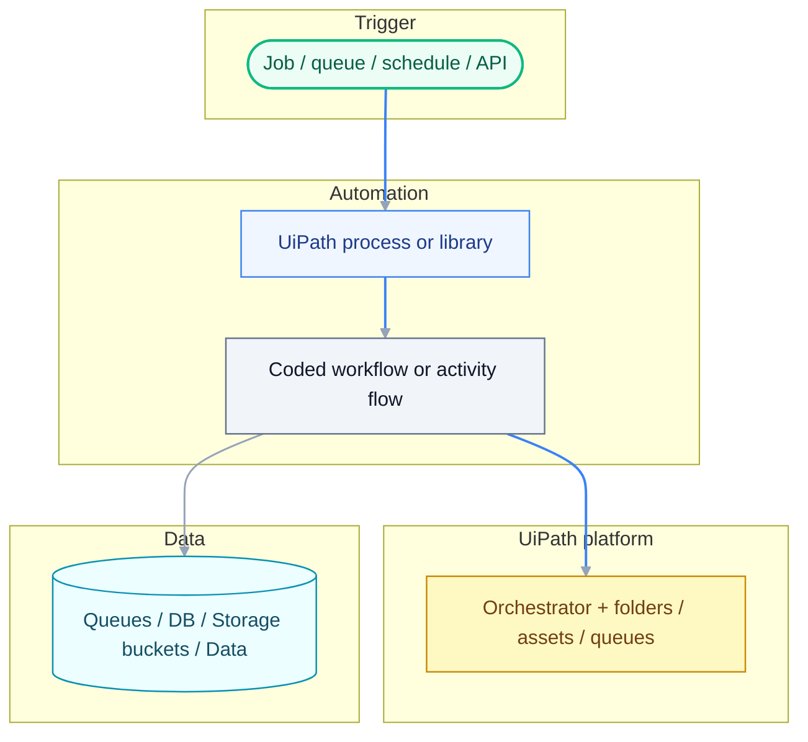
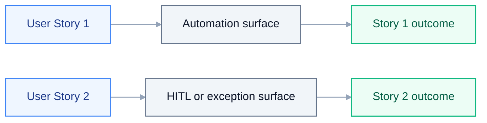
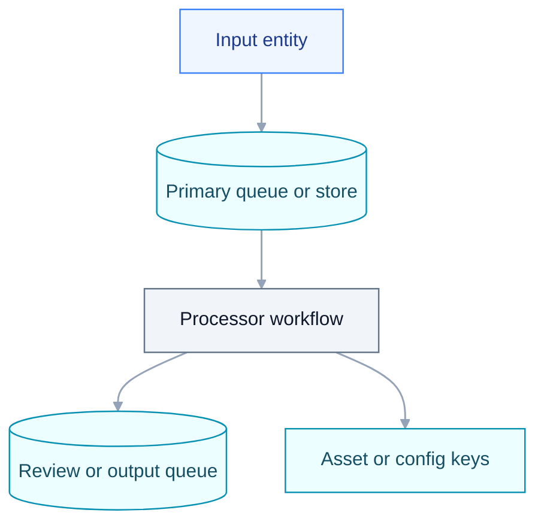
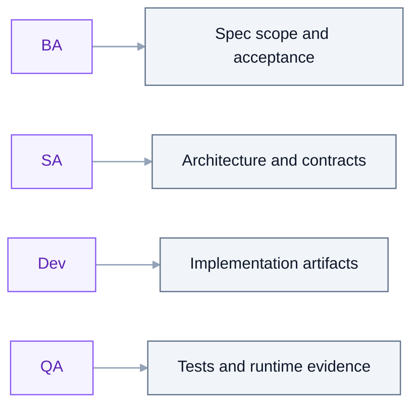

# Feature Specification: {{TITLE}}

> **Grounding:** {{GROUNDING_CITATIONS}}

**Created**: {{DATE}}
**Status**: Draft
**Input**: User description: "{{INTENT}}"

## Audience and Scope

This document is the **BA <-> Developer** contract. It captures business intent, user
stories, acceptance criteria, scope boundaries, and non-functional requirements.

- **Do** describe outcomes, actors, business rules, and what success means.
- **Do** record SME / NEEDS CLARIFICATION items when business facts are unknown.
- **Do not** name `.xaml` / `.cs` / `.py` files, CLI verbs, `[skill:...]`, package
  versions, or activity-level wiring — those belong in `plan.md` and `tasks.md`.

If a role hits a knowledge gap while drafting this spec, follow the AskAI / Library
escalation ladder before asking the user: `uipath_library_search` /
`uipath_library_lookup` -> `uipath_doc_get_activity` / `uipath_doc_list_packages` ->
`query_uipath_docs` -> specialist skill or `[agent:uipath-project-discovery-agent]`,
then user.

_If a PDD/SDD path was supplied, a short excerpt may appear in **Source traceability** at the end of the file. The **User Scenarios** and **Requirements** sections below are the build-ready specification (not a paste of the PDD)._

## Design source priority

1. **SDD** (`sdd.md` or equivalent) is the primary source when it exists — align scope, integrations, and NFRs to it.
2. **PDD** or product brief when no SDD exists.
3. **User description** in this file when neither document exists.

Record production gaps as explicit clarification items until an SME confirms;
never invent tenant mailboxes, credentials, Zip handling mode, or other
tenant-specific values.

## User Scenarios & Testing

### User Story 1 - {{US1_TITLE}} (Priority: P1)

{{US1_BODY}}

**Why this priority**: {{US1_PRIORITY}}

**Independent Test**: {{US1_TEST}}

**Acceptance Scenarios**:

1. **Given** {{US1_GIVEN_1}}, **When** {{US1_WHEN_1}}, **Then** {{US1_THEN_1}}

### User Story 2 - {{US2_TITLE}} (Priority: P2)

{{US2_BODY}}

**Why this priority**: {{US2_PRIORITY}}

**Independent Test**: {{US2_TEST}}

**Acceptance Scenarios**:

1. **Given** {{US2_GIVEN_1}}, **When** {{US2_WHEN_1}}, **Then** {{US2_THEN_1}}

### Edge Cases

- {{EDGE_1}}

## Requirements

### Functional Requirements

- **FR-001**: System MUST {{FR_001}}
- **FR-002**: System MUST {{FR_002}}
- **FR-003**: Users MUST be able to {{FR_003}}

### Key Entities

- **{{ENTITY_1}}**: {{ENTITY_1_DESC}}

## Architecture diagram

High-level boundaries for this feature (replace labels with real components: Studio project, Orchestrator folder, queues, Integration Service connectors).



## Primary interaction (sequence)

Who talks to whom for the main scenario (replace actors and messages).

```mermaid
sequenceDiagram
  autonumber
  actor Op as Operator / Robot
  participant WF as UiPath workflow
  participant Orch as Orchestrator
  participant Ext as External system
  Op->>WF: Start run / queue item
  WF->>Orch: Read asset / queue / folder
  WF->>Ext: Integration call
  Ext-->>WF: Response
  WF-->>Op: Final status / logs

  classDef persona fill:#F1F5F9,stroke:#64748B,color:#0F172A,stroke-width:1.25px
  class Op,WF,Orch,Ext persona
```

## Story journey map

Map how each user story moves through the workflow boundaries.



## Data and queue contract map

Show key entities, queues, assets, and ownership boundaries.



## Capability ownership map

Capture which skill/persona owns each major surface.



## Success Criteria

### Measurable Outcomes

- **SC-001**: {{SC_001}}

## Assumptions

- {{ASSUMPTION_1}}

## SME inputs (do not invent)

Until the human confirms facts, record gaps as explicit SME review or
clarification prose. Examples: mailbox allow-lists, credential scope, Zip
handling mode, audit log sink, trigger cadence, and human review channel. Do not
silently invent production values.

## Source routing & MCP contracts

{{SOURCE_ROUTING_SNIPPET}}

## Development Handoff

This section turns the accepted design into build-ready work.

- **Build entry point**: {{BUILD_ENTRYPOINT}}
- **Implementation scope**: {{IMPLEMENTATION_SCOPE}}
- **Implementation paradigm**: {{PARADIGM}}
- **Target stack**: {{TARGET_STACK}}
- **CLI family**: {{CLI_FAMILY}}
- **Deploy gate**: {{DEPLOY_GATE}}
- **Execution command**: {{BUILD_COMMAND}}
- **Quality gates**: {{QUALITY_GATES}}
- **Feasibility evidence**: Use `uipath_library_search` and/or `uipath_library_lookup` first, then
  `query_uipath_docs` / `[askai:...]` for uncertain UiPath APIs or CLI flags; use
  `uipath_doc_get_activity` / `uipath_doc_list_packages` before naming activities; do
  not invent activity names or SDK methods.
- **Handoff rule**: Do not start source changes until `uipath_plan_review` passes
  and the human accepts the bundle. After acceptance, execute `tasks.md` in
  order and keep implementation aligned to `plan.md`.
