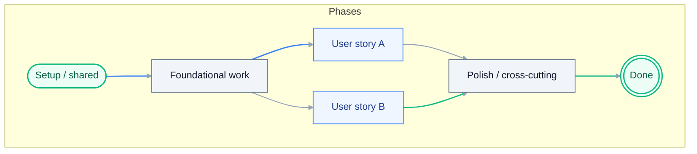

# Tasks: {{TITLE}}

> **Grounding:** {{GROUNDING_CITATIONS}}
> **Input**: `./spec.md`, `./plan.md`

**Format**: `[ID] [P?] [Story] Description` - include exact file paths in descriptions (backticks).

See [`docs/uiplan/TASK_AUTHORING.md`](../../docs/uiplan/TASK_AUTHORING.md) for
the canonical workflow-design, capability-routing, handoff, and implementation
loop contract.

## Task detail contract

Every **non-[P]** checklist task MUST embed the following (inline on the same bullet or as indented sub-bullets):

- **Feature build surface**: RPA/Studio, Maestro/Flow, coded app/action, coded agent (`LangGraph` / `LlamaIndex`), platform/config, docs-only, or a named combination.
- **Project** (Studio project / agent package / app name) or owning repo path
- **Starter template / scaffold source** for Studio projects: named template, `uip rpa create-project`
  evidence, existing `project.json` / `project.uiproj` provenance, or an explicit discovery/question
  task when the right template is not yet known.
- **Workflow / sequence / node** (`.xaml` / `.cs` workflow / LangGraph node / CLI step)
- **Artifact path** in backticks (source, test, binding, or policy file)
- **UiPath construct** (queue, asset, folder, binding key, graph, process)
- **Activities / SDK calls** only after `uipath_doc_get_activity` documents the concrete package and activity (cite names in prose once resolved; avoid unresolved activity-colon placeholders in committed tasks — they fail `uipath_plan_review` activity-doc checks).
- **AskAI / library lookup**: `uipath_library_search` / `uipath_library_lookup`; `query_uipath_docs` only when library coverage is insufficient; cite durable findings as `[library:...]` or `[askai:...]`
- **Verification**: exact command (`uv run pytest ...`, `uipcli test run ...`, `uipcli package analyze ...`, `uipath run ...`) plus expected pass/fail
- **Runtime evidence**: path or artifact for proof (JUnit/pytest report, analyzer `--resultPath` JSON, `.nupkg` path, robot/job log excerpts)

**Tests before implementation** within each user story: `### Tests` precedes `### Implementation`.

### Project-specific contract

Every generated task list MUST include project facts from `spec.md` / `plan.md`, not generic placeholders:

- **Repo / solution root** and exact project directories (`projects/<Name>/`, `bindings/*.json`, `tests/`, app/agent folders).
- **Existing descriptors** (`solution.uipx`, `project.json`, `langgraph.json`, `app.config.json`, `.flow` / BPMN, `caseplan.json`) and whether they are existing, generated, or to be created.
- **Environment bindings**: queue names, asset names, connection names, schedules/triggers, folder/workspace defaults, and which values are tenant-only.
- **Studio/tooling facts** for RPA: Studio path or `uip rpa` discovery evidence, `uip rpa create-project` / default activity XAML evidence when creating or wiring Studio activities, `uipcli` restore/analyze/pack commands, and analyzer policy exceptions.
- **Studio template decisions** for each RPA project: Dispatcher/scheduled intake, Performer/queue
  worker, Long Running Workflow/HITL, Sequence/Flowchart/State Machine, or project-specific custom
  template. Each row must include why that template fits the use case and what generated structure
  must be preserved.
- **Agent facts** for agent-backed features: `langgraph.json` / `llama_index.json`, graph entry point, node list, model/gateway assumptions, local `uipath run` or pytest command, and host invocation schema.
- **Feature ownership**: for mixed Solutions, split work by feature + artifact. Do not let a single “solution” task hide RPA, Flow/Maestro, coded app, agent, and platform work.

### Executable task split (default — no “half” tasks)

Every checklist line must be **fully completable** under a single, explicit **Done when** (verification + evidence). **Do not** merge unrelated concerns into one bullet unless scope is explicit.

**Match the use case (paradigm + spec):**

- **When the use case includes Studio / RPA / `.xaml`** (e.g. `modern-rpa`, `solution` with process projects, coded-automation with workflows): tasks **must** drive **building those workflow artifacts** — not only bindings, Python, or tests. Use the tools you have: **`uipath_doc_get_activity`**, **`uipath_library_search` / `uipath_library_lookup`**, **`[skill:uipath-rpa]`**, **`uipcli package restore|analyze|pack`**, and edit **`*.xaml` / `project.json` in the repo** (Studio Desktop **or** the same files in the editor + Studio/CLI validation). Skipping production activities when they are in scope is wrong.
- **When the use case includes Maestro / Flow**, tasks must name `.flow` / BPMN artifacts, Studio Web / `uip` validation path, triggers, data mappings, and solution packaging boundary.
- **When the use case includes coded app / action app**, tasks must name `app.config.json`, `action-schema.json`, TypeScript entry points, `uip codedapp` build/test commands, and Solution packaging boundary.
- **When the use case is coded-agent / Python-only** (no XAML in the plan): the workflow surface is **graph / code** — do not invent RPA-only tasks.
- **When RPA / Flow / app invokes an agent**, tasks must include both sides: the host artifact (`Main.xaml`, `.flow`, app action) and the agent artifact (`langgraph.json` / `llama_index.json`) plus request/response schema and local execution evidence.

### Studio and agent execution contracts

For **RPA / Studio** tasks:

- New Studio projects must be scaffolded with `uip rpa create-project --studio-dir <path>` when Studio is available; if an existing project is used, record the existing `project.json` / `project.uiproj` as the scaffold source.
- Before any activity wiring, tasks must choose and record the **starter template** per Studio
  project. Examples: Dispatcher/scheduled intake template for mailbox polling and enqueue,
  Performer/queue-worker template for transaction processing, Long Running Workflow/HITL template
  for human waits, Sequence for deterministic linear work, Flowchart for branching, State Machine
  for stateful transitions. If the correct template is uncertain, generated tasks must include a
  discovery/question task that uses `uip rpa create-project --help`, available Studio templates,
  repo template folders, `uipath_library_search`, and `[skill:uipath-rpa]` before implementation.
- Template evidence is part of the done gate: generated files, command output, `project.json` /
  `project.uiproj`, workflow type, and preserved generated control-flow structure. A generic
  hand-written `Main.xaml` with `LogMessage` markers is scaffold-only and cannot satisfy a Studio
  project implementation task unless a follow-up template remediation task remains open.
- Non-trivial activities must come from `uipath_doc_get_activity` plus Studio/default-activity evidence (`uip rpa get-default-activity-xaml`, Studio-generated XAML, or documented package-local activity XAML). Do not hand-invent activity XML when a tool can generate it.
- Each activity-level task must name the package/activity, inputs, outputs, variables/arguments, connection/asset names, and analyze command.
- Studio validation evidence can be from Studio Desktop or CLI (`uipcli package analyze`), but source artifacts still need to be built in-repo.

For **agent-backed** tasks:

- Build the agent package when the feature needs agentic reasoning. Default to **LangGraph**; use **LlamaIndex** only when the plan explicitly calls for retrieval/document-heavy indexing.
- Tasks must name `langgraph.json` / `llama_index.json`, graph entry point, graph nodes/tools, request schema, response schema, local run command (`uipath run` or pytest), and the host invocation artifact.
- Host workflows/flows/apps must explicitly include the Invoke Agent boundary (activity, command, or API wrapper) and how the response updates queues, forms, or downstream systems.

### Failure diagnosis contract

Generated tasks must not allow analyzer, solution, Studio, CLI, or agent test failures to be
summarized as blockers until the implementer has diagnosed and rerun them. Every Phase 5
verification path must require:

- evidence capture: exact command, working directory, exit code, result file path, and relevant output excerpt;
- structured parsing: analyzer rule IDs/severity/file/activity/message, or solution command failure class;
- grounding lookup: `uipath_library_search` / `uipath_library_lookup`, `query_uipath_docs` only when needed, relevant `uipath_doc_get_activity`, live CLI `--help`, or Studio IPC commands;
- source/schema inspection: affected `project.json`, `.xaml`, `solution.uipx`, bindings, generated metadata, or tool-generated examples;
- one safe local source/config/tooling fix attempt when evidence supports one, followed by the same verification rerun;
- blocker report only after rerun, with blocker class: tenant-only, human UI-only, missing credentials, generated descriptor required, unsupported local tooling, or unsafe action.

If `solution.uipx` is present, tasks must distinguish project-level restore/analyze from
`solution.uipx` descriptor validity and provenance (generated by Studio/Automation Cloud vs
placeholder/manual descriptor). If analyzer rules such as `ST-USG-034` appear, tasks must
require analyzer JSON parsing, docs/tooling lookup, Studio/project-setting inspection, a local
metadata fix attempt when safe, and rerun evidence.

**What `[HANDOFF:…]` is for (narrow):** secrets (`[HANDOFF:Secrets]`), tenant **deploy/publish** approval (`[HANDOFF:OrchestratorDeploy]`), first-time OAuth/browser consent, **physical robot / attended smoke** (`[HANDOFF:RobotSmoke]`). **Do not** use a handoff tag to mean “we will not implement `Main.xaml`” when XAML is in scope.

- Split tasks (e.g. `T011A`, `T011B`, …) when **scope** differs (scaffold vs production activities vs agent code), not to drop XAML from the plan.
- **Scaffold-only** XAML (`LogMessage` phase markers) is allowed **only** in bullets that explicitly say **scaffold-only** and must be **replaced** by production-activity tasks **before the story is done** when RPA is in scope.

## Architecture diagram

Execution order vs. parallel tracks (replace with story IDs and real tasks).

## Phase 1: Setup (Shared Infrastructure)

- [ ] T001 [P] [US1] {{T001}}
- [ ] T001A [US1] Run the compatibility preflight from [docs/ORCHESTRATOR_DEPLOYMENT.md](../../docs/ORCHESTRATOR_DEPLOYMENT.md) before scaffolding, package selection, pack, publish, or deploy; record Studio/CLI/package/target-folder evidence.
- [ ] T001B [US1] Confirm paradigm `{{PARADIGM}}` and CLI family `{{CLI_FAMILY}}`; if unknown, stop and resolve project type before implementation.
- [ ] T001C [US1] For every Studio/RPA project in `plan.md`, create a template decision matrix:
  project path, use case, selected starter template/scaffold source, workflow type, generated
  control-flow structure to preserve, exact `uip rpa create-project` / Studio evidence, and fallback
  question/discovery item if the template is not knowable from `spec.md` / `plan.md`.

---

## Phase 2: Foundational (Blocking Prerequisites)

**Purpose**: Core infrastructure that MUST be complete before user stories.

- [ ] T002 [US1] {{T002}}
- [ ] T002A [US1] Record feasibility grounding links for this story using `uipath_library_search`, `uipath_library_lookup`, `uipath_skill_match`, `query_uipath_docs`, and `uipath_doc_get_activity` when activities or packages are in scope.

**Checkpoint**: Foundation ready.

---

## Phase 3: User Story 1 - {{US1_TITLE}} (Priority: P1)

**Goal**: {{US1_GOAL}}

**Independent Test**: {{US1_IND_TEST}}

### Tests for User Story 1

- [ ] T010 [P] [US1] {{T010_TEST}}

### Implementation for User Story 1

- [ ] T011 [US1] {{T011_IMPL}} Concrete `.xaml` paths are on the **T011A–…** lines under `### Paradigm-specific tasks` (e.g. `projects/<Process>/Main.xaml` from `plan.md`). *(If that section lists `T011A`/`T011B`/…, complete those in order; each is its own done gate.)*

### Paradigm-specific tasks

{{PARADIGM_TASK_BLOCKS}}

**Checkpoint**: User Story 1 independently functional.

---

## Phase 4: Polish & Cross-Cutting

- [ ] T020 [P] {{T020}}
- [ ] T021 [P] Optional deploy handoff: if deployment is in scope, request explicit approval and follow [docs/ORCHESTRATOR_DEPLOYMENT.md](../../docs/ORCHESTRATOR_DEPLOYMENT.md); do not embed unsafe deploy commands in this task list.

---

## Phase 5: Build, Verify, and Handoff

**Purpose**: Convert the accepted plan into a verified build artifact.

- [ ] T030 Run the accepted-plan handoff: confirm `spec.md`, `plan.md`, and
  `tasks.md` are reviewed and accepted before source edits.
- [ ] T030A {{PLANNER_TASKS}}
- [ ] T031 Execute implementation tasks in order, using the specialist skill(s)
  cited in `plan.md` for project-specific source changes.
- [ ] T032 Run the build loop for the detected project type: restore -> analyze
  -> test -> pack. If restore/analyze/test/pack fails, run T032B before declaring the task
  blocked or complete. Capture **runtime evidence** paths:
  analyzer `--resultPath` JSON (e.g. `out/analyze.json`), `TestResults/*.trx` or pytest/JUnit XML,
  and the produced `.nupkg` path.
- [ ] T032A [P] [US1] Smoke run and log validation: run a documented local smoke (`uipcli job run`,
  `uip rpa run-file`, or tenant-safe fixture per plan) after pack; capture robot/job logs and assert
  expected substrings (correlation id, phase markers, terminal status) for the happy path and at
  least one failure path. Use `LogMessage` with correlation id in workflows per plan.
- [ ] T032B Diagnose and fix verification failures before any blocker report: parse analyzer
  `--resultPath` JSON or CLI output into rule IDs/error class, affected file/activity/descriptor,
  severity, and message; consult `uipath_library_search` / `uipath_library_lookup`,
  `query_uipath_docs` only when needed, live CLI `--help`, and Studio IPC/tool-generated examples;
  inspect the affected `project.json`, `.xaml`, `solution.uipx`, binding, or generated metadata;
  apply one safe local source/config/tooling fix when available; rerun the same command and record
  whether the original error cleared, changed, or remains. For `solution.uipx`, separate
  project-level restore/analyze failures from descriptor/schema/provenance failures. For
  analyzer rules such as `ST-USG-034`, include project metadata/Automation Hub setting inspection
  and rerun evidence before using tenant-only blocker wording.
- [ ] T033 Summarize exact verification evidence, changed files, package path
  if produced, and any approval-required deploy follow-up.
- [ ] T034 Verify deploy gate: `{{DEPLOY_GATE}}`

---

## Dependencies & Execution Order

{{DEPENDENCIES_TEXT}}
